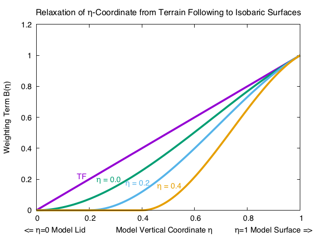
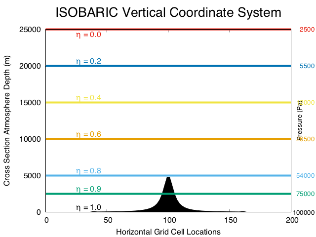
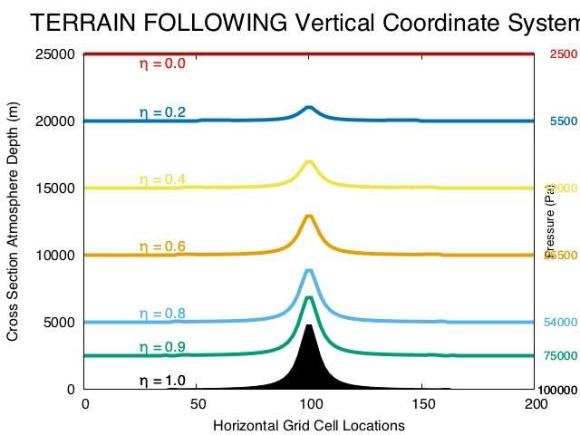
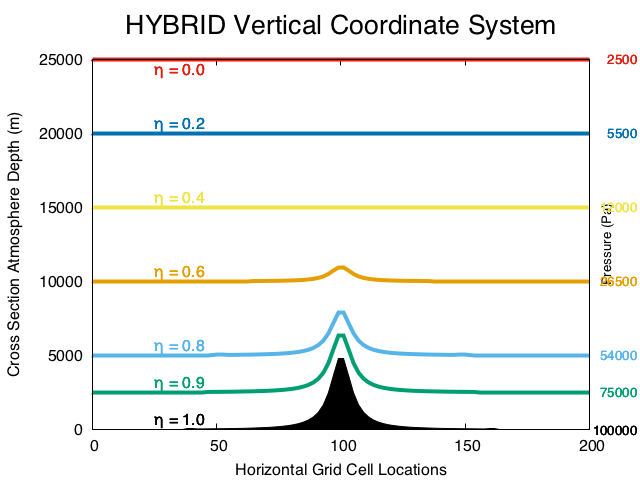

.. role:: underline
    :class: underline

WRF Dynamics
============

|

The Advanced Research WRF (WRF-ARW) model uses a dynamical solver to perform time and space integration of the equations of motion. The equations are integrated forward in time to produce a forecast. Since the equations cannot be solved analytically, they are discretized on a grid and computed for approximate solutions. The accuracy of solutions depends on the numerical method and mesh spacing (i.e., the grid). The WRF model uses a hybrid terrain-following mass coordinate system. It employs a 5th order horizontal advection option, 3rd-order vertical advection, and a 3rd-order Runge-Kutta time integration scheme. Grid-staggering is done on a C-grid, where U and V are calculated on the west/east (U) and south/north (V) interfaces of each grid cell. Vertical motion is calculated at the bottom and top interfaces of grid cells. All other variables are processed in the center (mass) point of each grid. Several dynamical filters are available as run-time options. 

For additional details regarding the equations that drive the model, see the latest version of the `WRF-ARW Technical Note`_ and/or the WRF Tutorial `WRF Tutorial Dynamics presentation`_. 

|

|

Hybrid Vertical Coordinate
--------------------------

The Hybrid Vertical Coordinate (HVC) is the default coordinate for the WRF model. The HVC is terrain-following near the surface, and becomes isobaric at a pre-defined user level. Dry pressure is defined as

        |PDRY(i,j,k)| = |B(k)(PDRY SFC(i,j)-PTOP)| +(h(k)-B(k)) |(P0-PTOP)| + |PTOP|

.. |PDRY(i,j,k)| replace:: P\ :sub:`DRY`\ (i,j,k)
.. |B(k)(PDRY SFC(i,j)-PTOP)| replace:: B(k)(P\ :sub:`DRY SFC`\ (i,j)-P\ :sub:`TOP`\ )
.. |(P0-PTOP)| replace:: (P\ :sub:`0`\ -P\ :sub:`TOP`\ )
.. |PTOP| replace:: P\ :sub:`TOP`

where B(k) is a 1-D weighting array, computed internally.

    * When B(k)=h(k), this definition simplifies to a terrain-following coordinate.
    * When B(k)=0, this definition simplifies to an isobaric coordinate system.

The vertical value where the B(k) arrays transition to isobaric, |hC|, determines how many of the h layers (downward from the model lid) are isobaric. The default value for ETAC is set in the "Registry/registry.hyb_coord" file, and is safe for usage across the globe. The figure below shows the transition of coordinate surfaces from terrain-following to HVC under several values of ETAC.

The transition of the h coordinate surfaces from terrain-following (TF) to isobaric is a function of the critical value of h at which the user requests that an isobaric surface be achieved. The fundamental property of the TF vs. HVC system is seen when tracing a horizontal line from any value on the “Weighting Term B(h)” axis. The degree of model coordinate “flatness,” for example, is the same in the TF system at h = 0.2 as in the HVC system for |hC| = 0.4 when the approximate value of h = 0.6.

.. |hC| replace:: h\ :sub:`C` 

|

The following depicts the vertical location of an h surface for an isobaric coordinate (top), a terrain following coordinate (middle), and a hybrid coordinate (bottom), given with a 2-D cross section for a given model lid (25 km is approximately 25 hPa), and for a given |hC| = 0.2. The depth of the atmosphere (m) and pressure are shown.

|

Prior to WRFV4.0, the vertical coordinate defaulted to terrain-following. To convert back to that option, set "hybrid_opt=0" in the &dynamics section of the namelist. real.exe and wrf.exe must both be run with the same "hybrid_opt" value. 

When using HVC output with post-processors, use either hydrostatic pressure (P_HYD) or total pressure (PB + P) for diagnostics and vertical interpolation.

|

|

|

Diffusion Options (diff_opt)
----------------------------

WRF diffusion is categorized under two parameters: the "diffusion option," which determines how diffusion derivatives are calculated, and the "K option," which determines how K coefficients are calculated. All diffusion options are set in the &dynamics section of namelist.input. 

    .. note::
       When a PBL option is used, that PBL scheme processes vertical diffusion, instead of the diffusion scheme. Vertical diffusion is also linked to the surface fluxes.

|

Simple diffusion and full diffusion are two different ways to use diffusion on terrain-following coordinates. 

    * **Simple diffusion** : Gradients are simply taken along coordinate surfaces (diff_opt=1)
    * **Full diffusion** : Gradients use full metric terms to more accurately compute horizontal gradients in sloped coordinates. This option can be used with real-data cases (diff_opt=2). 

|
 
K Options (km_opt)
++++++++++++++++++
When using a PBL scheme, only the "constant" and "2d deformation" options should be used. The 3d options are designed for 3d diffusion. 

    * **Constant** : K is specified by namelist values for horizontal and vertical diffusion (km_opt=1)
    * **3d TKE** : A prognostic equation for turbulent kinetic energy is used, and K is based on TKE (km_opt=2)
    * **3d Deformation** : K is diagnosed from 3d deformation and stability following a Smagorinsky approach (km_opt=3)
    * **2d Deformation** : K for horizontal diffusion is only diagnosed from horizontal deformation. The vertical diffusion is produced by the PBL scheme (km_opt=4)

|

6th Order Horizontal Diffusion (diff_6th_opt)
+++++++++++++++++++++++++++++++++++++++++++++
These options use a 6th-order horizontal hyper diffusion (del\ :sup:`6`) on all variables to act as a selective short-wave numerical noise filter. These options can be used in conjunction with "diff_opt." See `Knieval et al`_ to read more about this option. 

    * **diff_6th_opt=0** : Turned off - default
    * **diff_6th_opt=1** : Simple method. Avoid using this method. 
    * **diff_6th_opt=2** : Positive definite. If turning on 6th order horizontal diffusion, this option is recommended
    * **diff_6th_slopeopt=1** : turns off diff_6th_opt over steep terrain
    * **diff_6th_thresh** : sets the threshold value for terrain slopes above which 6th order diffusion is turned off (m/m)

|

Nonlinear Backscatter Anisotropic (NBA) (sfs_opt)
+++++++++++++++++++++++++++++++++++++++++++++++++
This is a sub-grid turbulent stress option for momentum in LES applications. 

    * **sfs_opt=0** : NBA turned off (default)
    * **sfs_opt=1** : NBA1 using diagnostic sub-grid stress terms; should be used with diff_opt=2 and km_opt=2 or 3
    * **sfs_opt=2** : NBA2 using TKE-based sub-grid stress terms; should be used with diff_opt=2 and km_opt=2

|

|

Damping
-------

There are several damping options available for WRF simulations. Each of these options can be set in the &dynamics section of namelist.input and are all independent of each other.

|

Upper Damping (damp_opt)
++++++++++++++++++++++++
Upper damping options are added near the model top to control reflection from the upper boundary. 

    * **damp_opt=1** : a layer of increased diffusion 
    * **damp_opt=2** : a Rayleigh relaxation layer
    * **damp_opt=3** : an implicit gravity-wave damping layer

|

Vertical Velocity Damping (w_damping)
+++++++++++++++++++++++++++++++++++++
For operational robustness, vertical motion can be damped to prevent the model from becoming unstable with locally large vertical velocities. This only affects strong updraft cores, and has very little impact on results otherwise. Set **w_damping=1** to turn it on. The default is =0 (off).

|

Divergence Damping (smdiv)
++++++++++++++++++++++++++
Setting smdiv controls horizontally-propagating sound waves. The default, and typical value is **smdiv=0.1** (for each domain). 

|

External Mode Damping (emdiv)
+++++++++++++++++++++++++++++
The emdiv option is an external mode filter coefficient for the mass coordinate model that controls upper-surface (external) waves. The default and typical value is **emdiv=0.01** (for each domain) for real-data cases.

|

Time Off-centering (epssm)
++++++++++++++++++++++++++
This option controls vertically-propagating sound waves. Slightly forward-centering the vertical pressure gradient damps 3d divergence. This can be a useful option if the simulation is resulting in CFL errors near complex terrain at the beginning of a run. The default value is **epssm=0.1** (for each domain), but can be set up to 0.5. Values higher than 0.5 can begin to provide inaccuracy.  

|

|

Advection
---------

Several advection options are available for use during WRF model simulations. These options are set in the &dynamics section of namelist.input. 
See section 6 of this `WRF Tutorial presentation on dynamics`_ for additional information. 

|

Horizontal Advection Order
++++++++++++++++++++++++++
These can be set to 2nd - 6th order, but 5th order is the default and recommended value.

    * **h_mom_adv_order** : horizontal advection order for momentum
    * **h_sca_adv_order** : horizontal advection order for scalar

|

Vertical Advection Order
++++++++++++++++++++++++
These can be set to 2nd - 6th order, but 3rd order is the default and recommended value.

    * **v_mom_adv_order** : vertical advection order for momentum
    * **v_sca_adv_order** : vertical advection order for scalar

|

Monotonic Transport and Positive-definite Advection
+++++++++++++++++++++++++++++++++++++++++++++++++++
Positive-definite and monotonic options are available for moisture, scalars, chemical scalars, and TKE in the ARW solver. Both the monotonic and positive-definite transport options conserve scalar mass locally and globally and are consistent with the ARW mass conservation equation. It is recommended to use the positive-definite option for moisture variables on all real-data simulations. The monotonic option may be beneficial in chemistry applications and for moisture and scalars in some instances.

When using these options there are certain aspects of the ARW integration scheme that should be considered in the simulation configuration:

    #. The integration sequence changes when the positive-definite or monotonic options are used. 
        * When the options are not activated, timestep tendencies from the physics (excluding microphysics) are used to update the scalar mixing ratio at the same time as the transport (advection). Microphysics is computed, and moisture is updated, based on the transport+physics update. 
        * When monotonic or positive definite options are activated, the scalar mixing ratio is first updated with the physics tendency, and the new updated values are used as starting values for the transport scheme. Then the microphysics update occurs, using these latest values as its starting point. For any scalars, the local and global conservation properties, positive definiteness and monotonicity depend upon each update possessing these properties.
    #. Some model filters may not be positive definite.
        * "diff_6th_opt=1" is not positive definite, nor monotonic. Use diff_6th_opt=2, which is both monotonic and positive-definite, should be used if you need this diffusion option. Cases have been encountered where departures from monotonicity and positive-definiteness are very noticeable.
        * "diff_opt=1" and "km_opt=4" (a commonly-used real-data case mixing option) is not guaranteed to be positive-definite nor monotonic due to the variable eddy diffusivity, K. Significant departures from positive-definiteness or monotonicity have not been observed when this filter is used with these transport options.
        * The diffusion option that uses a user-specified constant eddy viscosity is positive definite and monotonic.
        * Other filter options that use variable eddy viscosity are not positive definite or monotonic.
    #. Most model physics are not monotonic, nor should they be - they represent sources and sinks in the system. All should be positive definite, although we have not examined and tested all options for this property.
    #. The monotonic option adds significant smoothing to transport in regions where it is active. You may consider turning off other model filters for variables using monotonic transport (filters such as the second and sixth order horizontal filters). It is not possible to turn off filters for the scalars but not for the dynamics using the namelist - one must manually comment out the calls in the solver in the code, and then recompile the model.

The following namelist.input options are set in the &dynamics section. By default these are all set to **=1 for positive-definite**, but can be changed to **=2 for monotonic transport**, for each domain.

    * **moist_adv_opt** : for moisture
    * **scalar_adv_opt** : for scalars
    * **chem_adv_opt** : for chemistry variables
    * **tracer_adv_opt** : for tracer variables (must have WRF-Chem activated)
    * **tke_adv_opt** : for TKE

|

Weighted Essentially Non-oscillatory Options (WENO)
+++++++++++++++++++++++++++++++++++++++++++++++++++
The following are set in the &dynamics section of namelist.input. By default, they are all set to '=1' but can be changed to **=3 for 5th-order WENO** or **=4 for 5th-order WENO with a positive-definite limiter**, for each domain.
 
    * **moist_adv_opt** : for moisture
    * **scalar_adv_opt** : for scalars
    * **chem_adv_opt** : for chemistry variables
    * **tracer_adv_opt** : for tracer variables (must have WRF-Chem activated)
    * **tke_adv_opt** : for TKE
    * **momentum_adv_opt** : for momentum

|

Implicit Explicit Vertical Advection (IEVA)
+++++++++++++++++++++++++++++++++++++++++++
For grids with large aspect ratios (dx/dz >> 1) that permit explicit convection, the large time step is limited by the strongest updraft that occurs during integration. This often results in time steps 20-30% smaller, or requires the use of w-filtering, such as latent-heat tendency limiting. Regions of large vertical velocities are often very small relative to the domain. The IEVA scheme permits a larger time step by partitioning the vertical transport into an explicit piece, which uses the normal vertical schemes present in WRF, and an implicit piece which uses implicit transport (and is unconditionally stable). The combined scheme permits a larger time step than previously used, as well as reduced w-filtering. (`Wicker and Skamarock, 2020, MWR`_)

    * **zadvect_implicit** : set to 1 to turn this option on (default is 0=off)
    * **w_crit_cfl** : the default vertical courant number (1.2) where vertical velocity damping begins; however, when "zadvect_implicit" is turned on, this value can be increased to ~2.0

|

|

Other Dynamics Options
----------------------
There are various other dynamics options that can be set in the &dynamics section of namelist.input. The below list is not fully-inclusive and users should see the Namelist_ section for all options.

    * **non-hydrostatic=.false.** : allows WRF to run hydrostatically
    * **pert_coriolis=.true.** : an option for ideal simulations only that applies the Coriolis term to wind perturbation only. 
    * **mix_full_fields=.true.** : only when setting "diff_opt=2" and only for ideal simulations, allows vertical diffusion to act on full fields (not just on perturbation from the 1D base profile
    * To obtain a more accurate moisture solution, use
        * **use_q_diabatic=1** : includes the QV and QC moisture tendencies from microphysics in small steps. For real-data cases, the time step should be reduced to maintain a stable solution. See `Bryan, 2014`_
        * **use_theta_m=1**: considers the moisture effect on pressure in small steps (theta_m=theta(1+1.61Qv). The current implementation may cost a bit more to run.

|

|

Lateral Boundary Conditions for Idealized Cases
-----------------------------------------------

For each idealized case (found in test/em_<case>), a default namelist.input file is provided and there are varying lateral boundary conditions default settings for the different cases. These settings are found in the "&bdy_control" section, and should be set for each domain. *The following options are only available for idealized cases*.

    * **periodic_x** and **periodic_y** : set to ".true." for periodic boundary conditions in the x and y directions. This means that (for e.g., the conditions/values that leave out of x_end of the domain are returned to the x_start position, as if the two sides are connected.

    * **open_xs, open_xe, open_ys,** and **open_ye** : set to ".true." for open boundary conditions along the x-start, x-end, y-start, and/or y-end boundaries. This means conditions/values come in from one direction and leave without being cycled back in.

    * **symmetric_xs, symmetric_xe, symmetric_ys,** and **symmetric_ye** : set to ".true." for symmetric boundary conditions along the x-start, x-end, y-start, and/or y-end boundaries. This means all variables have the same value and gradients at the same distance from the boundary.

|

Lateral Boundary Conditions for Real-data Cases
-----------------------------------------------

The real-data case (found in test/em_real) a namelist.input file is provided with default lateral boundary condition settings. These are found in the "&bdy_control" section, and should be set for each domain. *The following options are only available for real-data cases*.

    * **specified** : The first row and column are specified with external model values (spec_zone=1, which should not be modified). The rows and columns in "relax_zone" have values blended from an external model and WRF. This can be used with periodic_x in tropical channel simulations. The "specified=.true." option can only be used for domain 1.

    * **spec_exp** \: Exponential multiplier for the relaxation zone ramp, used with a specified boundary condition. 
        * spec_exp=0. : linear ramp (default)
        * spec_exp=0.33 : ~3*dx exp decay factor (this may be useful for long simulations)

    * **spec_bdy_width** : total number of rows for specified value nudging. The default value is 5. 

    * **spec_zone** : number of points in the specified zone when "specified=.true." The default value is 1 and should not be changed!

    * **relax_zone** : number of points in the relaxed zone when specified=.true. The default value is set to 4. This value may be changed, as long as spec_bdy_width=spec_zone + relax_zone. 

|

|

|

|

.. _`WRF-ARW Technical Note`: https://www2.mmm.ucar.edu/wrf/users/docs/technote/contents.html
.. _`WRF Tutorial Dynamics presentation`: https://www2.mmm.ucar.edu/wrf/users/tutorial/presentation_pdfs/202101/skamarock_dynamics.pdf
.. _`Knieval et al`: https://www.researchgate.net/publication/241648605_The_utility_of_6th-order_monotonic_numerical_diffusion_in_the_Advanced_Research_WRF_Model
.. _`WRF Tutorial presentation on dynamics`: https://www2.mmm.ucar.edu/wrf/users/tutorial/presentation_pdfs/202101/skamarock_dynamics.pdf
.. _`Wicker and Skamarock, 2020, MWR` : https://journals.ametsoc.org/view/journals/mwre/148/9/mwrD200055.xml
.. _Namelist: ../namelist/namelist_variables.html
.. _`Bryan, 2014`: https://journals.ametsoc.org/view/journals/mwre/142/11/mwr-d-13-00349.1.xml
