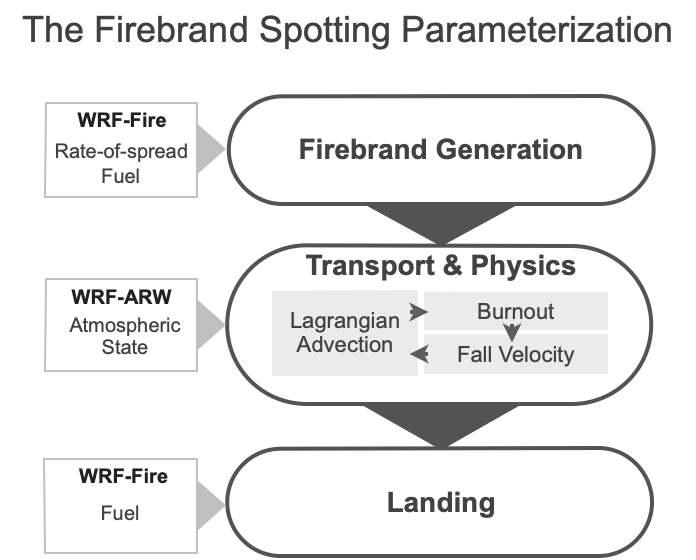
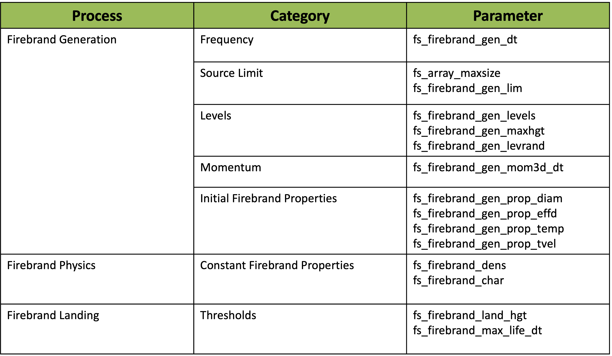

WRF-Fire
========

.. role:: underline
    :class: underline

.. role:: nlnote
    :class: nlnote

.. role:: nlheader
    :class: nlheader

.. role:: admonition
    :class: admonition

.. include:: <isogrk1.txt>

|

A wildland fire module named WRF-Fire is available in WRF-ARW for modeling the growth of a wildland fire and the dynamic feedbacks with the atmosphere. It is implemented as a physics package with two-way coupling between the fire behavior and the atmospheric environment, allowing the fire to alter the surrounding atmosphere (i.e. 'create its own weather'). The mechanics, options, parameters, and data sets for using this module are described in this chapter.

The wildland fire module is a simple two-dimensional model of a surface fire - a fire that spreads through fuels on the ground, such as grass, shrubs, and the litter from trees that has fallen to the surface. It does not contain algorithms needed to represent crown fires, which consume and spread through tree canopies. The user specifies time, location, and the shape of a fire ignition. The evolution of the fireline, the interface enclosing the burning region, is implemented by the level set method. The level set function in WRF releases prior to WRF v4.0 was advanced in time by a Runge-Kutta (RK) method of second order, with spatial discretization by the first-order Godunov scheme. A more accurate level set algorithm is available starting with WRF v4.0. This new level set implementation uses a third-order RK scheme for temporal discretization, consistent with the dynamical core of WRF. Spatial discretization of the level set equation is performed using a fifth-order weighted essentially non-oscillatory (WENO) scheme. A hybrid discretization method is used, which applies high-order discretization in the vicinity of the fire front and switches to a first-order ENO scheme elsewhere for computational efficiency. In addition, a new capability is implemented to solve a reinitialization equation for the level set. All these level set developments result in a fire perimeter propagation that is nearly grid-independent and considerably reduces the error in solving the level set equations.

The rate at which this interface expands is calculated at all points along it, using a point-based semi-empirical formula for estimating the rate of spread of the surface fire, based upon the `Rothermel, 1972`_ formula, which calculates the fire rate of spread as a function of local fuel conditions, wind, and terrain slope. A semi-empirical formula is used as parameterization since turbulent combustion cannot be resolved at the spatial scales of atmospheric models; thus, all physical processes involved in propagating the fire are assumed to be represented in this relationship. Importantly, the winds used to drive the fire are interpolated from nearby low-level wind velocities, which are, themselves, perturbed by the fire. Once the fireline has passed by, the ignited fuel continues to burn - the mass of fuel is assumed to decay exponentially with time after ignition, the rate depending on the size of fuel particles making up the fuel complex: fine fuels, such as grass, are consumed rapidly, while fuels with larger diameters, such as twigs and downed logs, are consumed slowly. The fuel burned in each time step is converted to sensible and latent heat source terms for the lowest levels of the WRF atmospheric model state, where the water vapor source arises from the release of the intrinsic moisture in cellulosic fuels and the additional moisture absorbed by fuels from their environment, the fuel moisture content. The e-folding depth over which the heat and vapor distributed is set by the user, based on results from wildland fire measurements.   The fire may not progress to locations where the local fuel moisture content is greater than the moisture content of extinction.

Additional parameters and data sets beyond a standard WRF atmospheric simulation are required and are described here. The surface fuel available to be burned at each point is categorized using the Anderson classification system for *fuel models* (3 grass-dominated types, 4 shrub-dominated types, 3 types of forest litter, and 3 levels of logging slash) which we will henceforth refer to as *fuel categories* to limit confusion. Each of these fuel categories is assigned a set of typical properties consisting of the fuel load (the mass per unit area) and numerous physical properties having to do with fuel geometry, arrangement, and physical makeup.  The user may make the fuels spatially homogeneous by using one fuel category for the whole domain, alter fuel properties, add custom fuel categories, or (for real data experiments) project a spatially heterogeneous map of fuel categories onto the domain from fuel mapping data sets. The user also sets the number of ignitions, their time, location, and shape, and the fuel moisture content, an important factor in fire behavior.

One time step of the fire model is performed for every WRF time step. The fire model runs on a refined grid that covers the same region as the innermost WRF domain. The fire module supports both distributed and shared memory parallel execution.

|

:underline:`Additional References`

        * Users may wish to review the Anderson fuel classification system - `Anderson, 1982`_ (verified 1/4/10)
        * The original report introducing Rothermel's semi-empirical formulas - `Rothermel, 1972`_ (verified 1/4/10)
        * `Cohen et al., 2013`_ describes the WRF-Fire module and applies WRF with WRF-Fire in simulations to test the sensitivity of fire growth to environmental factors such as wind speed, fuel load and moisture, and fuel model in the daytime convective boundary layer.
        * `Munoz-Esparza et al., 2018`_ describes all the new developments included in the level set algorithm implemented in WRF-Fire.

|

|

WRF-Fire in Idealized Cases
---------------------------

To perform a simulation including a fire, follow the installation instructions in Chapter 5 to configure WRF and set up the environment. For an idealized case, use

.. code-block::

        > ./compile em_fire

to build WRF for one of the several supplied ideal examples. This creates the links *wrf.exe* and *ideal.exe* in the directory *test/em_fire*.

The directory *test/em_fire* contains two fire test cases - *hill_simple* and *two_fires*. The files necessary for running these are in the top-level em_fire directory. To run a fire case, it is necessary to have files named *namelist.input* and *input_sounding* in the *em_fire/* directory. If you wish to use one of the provided test cases, you need to link them to their generic names (for example, for the two_fires case):

.. code-block::

        > ln -sf namelist.input_two_fires namelist.input
        > ln -sf input_sounding_two_fires input_sounding

Currently the default namelist.input file is linked to the hill_simple case.  If you wish to make your own test case, you simply need to create the files namelist.input and input_sounding that correspond to your case (it is advised to start by modifying an existing copy from another case).

Once you have the namelist.input and input_sounding linked to the correct case files, you can run by typing:

.. code-block::

        > ./ideal.exe
        > ./wrf.exe

The file namelist.input contains an additional section &fire with parameters of the fire model and ignition coordinates. The file namelist.fire contains an additional namelist used to enter custom fuel properties.

|

|

Fire Variables in namelist.input
--------------------------------

|

&domains
++++++++

Domain Definitions

.. csv-table::
   :widths: 20, 10, 50
   :width: 100%
   :class: nlheader

   "Variable Name", "Value", "Description"

.. csv-table::
   :widths: 20, 10, 50
   :width: 100%
   :escape: \

   sr_x, 10, The fire mesh is 10 times finer than the innermost atmospheric mesh in the x direction. This number must be even.
   sr_y, 10, The fire mesh is 10 times finer than the innermost atmospheric mesh in the y direction. This number must be even.

|

&fire
+++++

Fire Ignition and Fuel Parameters

.. csv-table::
   :widths: 20, 10, 50
   :width: 100%
   :class: nlheader

   "Variable Name", "Reasonable Value", "Description"

.. csv-table::
   :widths: 20, 10, 50
   :width: 100%
   :escape: \

   ifire, " ", 0: No fires are simulated |br| 1: Fires are simulated using the tracer scheme to represent the flaming front interface (not active) |br| 2: Fires are simulated using the level set method to represent the movement of the interface.
   fire_fuel_read, " ", How to set the fuel data |br| |br| -1: real data from WPS |br| 0: set to a homogeneous  distribution of fire_fuel_cat everywhere |br| 1: The spatial distribution of fuel categories is to be specified as a function of  terrain altitude. (The user specifies a custom function.)
   fire_num_ignitions, 3, Number of ignition lines\, max. 5 allowed
   fire_ignition_start_x1, 1000, x coordinate of the start point of the ignition line 1. All ignition coordinates are given in m from the lower left corner of the innermost domain
   fire_ignition_start_y1, 500, x coordinate of the start point of the ignition line 1
   fire_ignition_end_x1, 1000, y coordinate of the end point of the ignition line 1. Point ignition (actually a small circle) is obtained by specifying the end point the same as the start point.
   fire_ignition_end_y1, 1900, y coordinate of the end point of the ignition line 1
   fire_ignition_radius1, 18, Everything within fire_ignition_radius1 meters from the ignition location is ignited.
   fire_ignition_time1, 2, Time of ignition in s since the start of the run
   fire_ignition_start_x2, " ", Up to 5 ignition lines may be given. Ignition parameters with the number higher than fire_num_ignitions are ignored.
   fire_ignition_time5, " ", " "
   fire_print_msg, 1, 0: no messages from the fire scheme |br| 1: progress messages from the fire scheme
   fire_print_file, 0, 0: no files written (leave as is) |br| 1: fire model state written every 10 s into files that can be read in Matlab.
   fire_tracer_smoke, 0.02, parts per unit of burned fuel becoming smoke (tracer_opt = 3)\, in |br| g\ :sub:`smoke`/kg\ :sub:`air`

|br|

There are several more variables in the namelist for developer use only to further develop and tune the numerical methods. Do not alter unless directed to do so.

|   

|

namelist.fire
-------------

This file serves to redefine the fuel categories if the user wishes to alter the default fuel properties.

|br|

&fuel_scalars (Scalar Fuel Constants)
+++++++++++++++++++++++++++++++++++++

.. csv-table::
   :widths: 20, 50
   :width: 75%
   :class: nlheader

   "Variable Name", "Description"

.. csv-table::
   :widths: 20, 50
   :width: 75%
   :escape: \

   cmbcnst, The energy released per unit fuel burned for cellulosic fuels (constant; 1.7433e7 J kg-1).
   hfgl, The threshold heat flux from a surface fire at which point a canopy fire is ignited above (in W m-2).
   fuelmc_g, Surface fuel; fuel moisture content (in percent expressed in decimal form from 0.00 - 1.00).
   nfuelcats, Number of fuel categories defined (default: 13)
   no_fuel_cat, The number of the dummy fuel category specified to be used where there is no fuel

|

&fuel_categories (Domain Specifications)
++++++++++++++++++++++++++++++++++++++++

.. csv-table::
   :widths: 20, 50
   :width: 75%
   :class: nlheader

   "Variable Name", "Description"

.. csv-table::
   :widths: 20, 50
   :width: 75%
   :escape: \

   fgi, The initial mass loading of surface fuel (in kg m-2) in each fuel category
   fueldepthm, Fuel depth (m)
   savr, Fuel surface-area-to-volume-ratio (m-1)
   fuelmce, Fuel moisture content of extinction (in percent expressed in decimal form\, from 0.00 - 1.00).
   fueldens, Fuel particle density lb ft-3 (32 if solid\, 19 if rotten)
   st, Fuel particle total mineral content. (kg minerals/kg wood)
   se, Fuel particle effective mineral content. (kg minerals - kg silica)/kg wood
   weight, Weighting parameter that determines the slope of the mass loss curve. This can range from about 5 (fast burn up) to 1000 (i.e. a 40% decrease in mass over 10 minutes).
   ichap, Is this a chaparral category to be treated differently using an empirical rate of spread relationship that depends only on wind speed? |br| |br| 1: yes\, this is a chaparral category and should be treated differently |br| 0: no\, this is not a chaparral category or should not be treated differently). Primarily used for Fuel Category 4.

|

|

Running WRF-Fire on Real Data
-----------------------------

|br|

Building the code
+++++++++++++++++

Running WRF with real data is a complicated process of converting data formats and interpolating to the model grid.  This process is simplified by the WRF Preprocessing System (WPS).  The purpose of this section is to summarize the use of this system and to highlight the differences in its use between fire and ordinary atmospheric simulations.  For more complete documentation of WPS, see the `WPS Chapter`_ of this Users' Guide.

WPS consists of three utility programs: geogrid.exe, ungrib.exe, and metgrid.exe.  Each program is designed to take existing data sets and convert/interpolate them into an intermediate format.   The build system for WPS is similar to that of WRF.  NetCDF must be installed and the environment variable NETCDF should be set to the installation prefix.  Run the configure script in the main WPS directory, pick a configuration option from the list, and then run compile.  Note that WRF itself must be built prior to compiling WPS.  In addition, the build process assumes that WRF exists in ../WRFV3/.  WRF should be configured as described in Section 3 and compiled with the command

.. code-block::

        > ./compile em_real >& compile.log

The WPS can be configured from inside the top level directory wrf-fire/WPS with the command

.. code-block::

        > ./configure

and compiled in the same directory with the command

.. code-block::

        > ./compile >& compile.log

|br|

Upon successful completion the three binaries listed above should exist in the current directory.

Because the WPS programs are, for the most part, not processor intensive, it is not generally necessary to compile these programs for parallel execution, even if they do support it.  Typical usage of WRF with real data involves doing all of the preprocessing work either locally on a workstation or on the head node of a supercomputer.  The intermediate files are all architecture independent, so they can be transferred between computers safely.  If you intend to use a supercomputer for the main simulation, it is advisable to generate the WPS output locally and transfer the met_em files to the computer you are using for WRF-Fire.  The met_em files are much smaller than the wrfinput and wrfbdy files and can be transported easily.  This also eases the process of dealing with the dependencies of the python scripts described below because it may not be easy or even possible to meet these requirements on a shared parallel computer.

|

Fire Variables in namelist.wps
++++++++++++++++++++++++++++++

The simulation domain is described in the file namelist.wps. This namelist contains four sections, one for each of the main binaries created in WPS and one shared among them all. This file, as distributed with WRF-Fire, is set up for a test case useful for testing, but in general one needs to modify it for each simulation domain. The following table lists namelist options that can be modified. Other options in this file are generally not necessary to change for WRF-Fire simulations.

|br|

:underline:`&share`

.. csv-table::
   :widths: 20, 50
   :width: 75%
   :class: nlheader

   "Variable Name", "Description"

.. csv-table::
   :widths: 20, 50
   :width: 75%
   :escape: \

   max_dom, Number of nested domains to use
   start_date/end_date, Starting/ending date and time to process atmospheric data in the format YYYY-MM-DD_hh:mm:ss. These times should coincide with reanalysis cycles for your atmospheric data (hours 00\,03\,06\,09\,12\, etc. for 3 hour NARR data). The simulation window in which you are interested in running must be inside this interval.
   Subgrid_ratio_[xy], The refinement ratio from the atmospheric grid to the fire grid.
   interval_seconds, Number of seconds between each atmospheric data set (10800 for 3 hour NARR data)

|br|

:underline:`&geogrid`

.. csv-table::
   :widths: 20, 50
   :width: 75%
   :class: nlheader

   "Variable Name", "Description"

.. csv-table::
   :widths: 20, 50
   :width: 75%
   :escape: \

   parent_id, When using nested grids\, the parent of the current grid\, or 0 if it is the highest level.
   parent_grid_ratio, The refinement ratio from the parent grid (ignored for top level grid) (only 3 or 5 is supported by WRF)
   [ij]_parent_start, The indices on the parent grid of the lower left corner of the current grid (ignored for top-level grid)
   e_we/e_sn, The size of the grid in the x/y axis
   dx/dy, Resolution of the grid in the x/y axis
   map_proj |br| true_lat[12] |br| stand_lon, Projection specifications. Lambert is typically used for central latitudes such as the continental US. For small domains\, the projection used does not matter much.
   ref_x/ref_y, Grid index of a reference point with known geographic location. Defaults to the center of the domain.
   ref_lon/ref_lat, The location (longitude/latitude) of the reference point.
   geog_data_path, Absolute or relative path to `static geogrid data`_

|

Geogrid
+++++++

The geogrid executable acts exclusively on static data sets (those that do not change from day to day) such as surface elevation and land use. Because these data sets are static, they can be obtained as a single set of files from the main WPS distribution website in resolutions of 10 minutes, 2 minutes, and 30 seconds. The geogrid executable extracts from these global data sets what it needs for the current domain. While resolutions of this magnitude are acceptable for ordinary atmospheric simulations, these data sets are too coarse for a high-resolution fire simulation. In particular, a WRF-Fire simulation requires two additional data sets not present in the standard data.

:underline:`NFUEL_CAT` |br|
The variable NFUEL_CAT contains Anderson 13 fuel category data.  This data can be obtained for the US from the seamless data access server for `USGS LANDFIRE_`. Using the zooming and panning controls, the user can select the desired region with LANDFIRE 13 Anderson Fire Behavior Fuel Models box selected. This opens a new window where the user can request the data in specific projections and data formats.

:underline:`ZSF` |br|
The variable ZSF contains high resolution terrain height information similar to that in the HGT variable present in atmospheric simulations; however, the standard topographical data set is only available at a maximum resolution of 30 arc seconds (about 900 meters). For a simulation using the WRF-Fire routines, data resolution of at least 1/3 of an arc second is desirable to include the effect of local terrain slope on the rate of spread. Such a data set is available for the US at from `USGS' National Map`_ seamless data access server. The desired data set on this server is listed under elevation and is called 1/3 arc-second DEM. 1 arc second data is also available at the same data server.   

|

Conversion to Geogrid Format
++++++++++++++++++++++++++++

Once one has collected the necessary data from USGS servers or elsewhere, it is necessary to convert it from the given format (such as geotiff, Arcgrid, etc.) into geogrid format.  The format specification of the geogrid format is given in the WPS section of the WRF users guide.  The process of this conversion is somewhat technical; however, work is in progress to automate it.

|

Editing GEOGRID.TBL
+++++++++++++++++++

In order to include your custom data into the WPS output, you must add a description of it in the GEOGRID.TBL file, which is located, by default, in the geogrid subdirectory of the main WPS distribution.  In addition to the standard options described in the WPS users guide, there is one additional option that is necessary for defining data for fire grid variables.  For them, there is a subgrid option, which is off by default.  For fire grid data, one should add the option subgrid=yes to indicate that the variable should be defined on a refined subgrid with a refinement ratio defined by the subgrid_ratio_[xy] option in the WPS namelist.  For example, typical table entries would appear as follows:

.. code-block::

        ================================
        name=NFUEL_CAT
                priority=1
                dest_type=categorical
                dominant_only=NFUEL_CAT
                z_dim_name=fuel_cat
                halt_on_missing=yes
                interp_option=default:nearest_neighbor+average_16pt+search
                rel_path=default:landfire/
                subgrid=yes
        ================================
        name=ZSF
                priority=1
                dest_type=continuous
                halt_on_missing=yes
                interp_option=default:four_pt
                rel_path=default:highres_elev/
                subgrid=yes

|br|

This table assumes that the converted data resides as a subdirectory of the standard data directory given in the namelist under the option geog_data_path.  The NFUEL_CAT data should reside in landfire/ and ZSF in highres_elev/.  In general, the only options that should be modified by the user are the rel_path or abs_path options.

Once the data has been obtained and converted and the geogrid table has been properly set up, the user can run:

.. code-block::

        > ./geogrid.exe

which creates files such as geo_em.d01.nc that contain the interpolated static data fields.

|

Ungrib and Metgrid
++++++++++++++++++

The ungrib executable performs initial processing on atmospheric data. There are many different data sets that can be used as input to ungrib. One must obtain this data manually for a given simulation. Because fire simulations are at a much higher resolution than most atmospheric simulations, it is advisable to get as high resolution data as possible. The `32 km resolution data from the North American Regional Reanalysis (NARR)`_ is likely a good choice. For real data WRF runs, three individual data sets from this website are required: 3d, flx, and sfc.  To use them, download the files for the appropriate date/time and extract them somewhere on your file system.  The files have the naming convention, NARR3D_200903_0103.tar. NARR indicates it comes from the NARR model, 3D indicates that it is the atmospheric data fields, and 200903_0103 indicates that it contains data from March 1st through 3rd of 2009. Once these files are extracted, they must be linked into the main WPS directory with the command link_grib.csh. It takes as arguments all of the files extracted from the data set. For example, if you extracted these files to /home/joe/mydata, then you would issue the command:

.. code-block::

        > ./link_grib.csh /home/joe/mydata/*

into the top level WPS directory. Each atmospheric data set requires a descriptor table known as a variable table to be present. WPS comes with several variable tables that work with most major data sources. These files reside in WPS/ungrib/Variable_Tables/. The appropriate file must be linked into the top level WPS directory as the file Vtable. For NARR data, type:

.. code-block::

        > ln -sf ungrib/Variable_Tables/Vtable.NARR Vtable

Once this has been done, everything should be set up properly to run the ungrib command:

.. code-block::

        > ./ungrib.exe

Finally, the program metgrid combines the output of ungrib and geogrid to create a series of files, which can be read by WRF's real.exe. This is accomplished by

.. code-block::

        > ./metgrid.exe

|br|

Assuming everything completed successfully, you should now have a number of files named something like met_em.d01.2009-03-01_12:00:00.nc. These should be copied or linked to your WRFV3/test/em_real directory. If any errors occur during execution of ungrib or metgrid, then make sure you have downloaded all of the necessary atmospheric data and that the variable table and namelist are configured properly. 

|

Running Real Case and WRF-Fire
++++++++++++++++++++++++++++++

First copy or link the met_em files generated by metgrid into test/em_real.  If the simulation is being done locally, this can be accomplished by running in wrf-fire/WRFV3/test/em_real

.. code-block::

        > ln -sf ../../../WPS/met_em* .

The namelist for WRF in the file namelist.input must now be edited to reflect the domain configured in WPS. In addition to the fire-specific settings listed in Section 4.3 regarding the ideal simulation, a number of other settings must be considered as listed below. See Chapter 5 for more details on these settings.

|br|

:underline:`&time_control`

.. csv-table::
   :widths: 20, 50
   :width: 75%
   :class: nlheader

   "Variable Name", "Description"

.. csv-table::
   :widths: 20, 50
   :width: 75%
   :escape: \

   start_xxx/end_xxx, These describe the starting and ending date and time of the simulation. They must coincide with the start_date/end_date given in namelist.wps.
   run_xxx, The amount of time to run the simulation.
   interval_seconds, Must coincide with interval seconds from namelist.wps.
   restart_interval, A restart file is generated every x minutes. The simulation can begin from a restart file rather than wrfinput. This is controlled by the namelist variable *restart*.

|br|

:underline:`&domains`

**Note: All grid settings must match those given in the geogrid section of namelist.wps**

.. csv-table::
   :widths: 20, 50
   :width: 75%
   :class: nlheader

   "Variable Name", "Description"

.. csv-table::
   :widths: 20, 50
   :width: 75%
   :escape: \

   num_metgrid_levels, The number of vertical levels of the atmospheric data being used. This can be determined from the met_em files: |br| ``ncdump -h met_em* | grep 'num_metgrid_levels ='``
   sr_x/sr_y, Fire grid refinement. This must match that given in namelist.wps as subgrid_ratio_x/subgrid_ratio_y.
   p_top_requested, The default is 5000\, but may need to be edited if there is an error executing real. If soi\, just set this to whatever it tells you in the error message.

|

Fire State Variables
--------------------

A number of array variables were added to the registry to the WRF state in order to support the fire model. They are available in the wrfout* files created when running WRF. All fire array variables are based at the centers of the fire grid cells. Their values in the strips at the upper end of width sr_x in the x direction and sr_y in the y direction are unused and are set to zero by WRF.

The following variables can be used to interpret the fire model output.

.. csv-table::
   :widths: 20, 40
   :width: 75%
   :escape: \
   :header: "Variable", "Description"

   LFN, level set function. Node (i\,j) is on fire if LFN(i\,j)<=0
   FXLONG\, FXLAT, longitude and latitude of the nodes
   FGRNHFX, ground heat flux from the fire (W/m2)\, averaged over the cell
   FGRNQFX, ground heat flux from the fire (W/m2)\, averaged over the cell
   ZSF, terrain elevation above sea level (m)
   UF\,VF, surface wind
   FIRE_AREA, approximate part of the area of the cell that is on firei\, between 0 and 1

|

WRF-Fire Software
-----------------

This section is intended for programmers who wish to modify or extend the fire module.

|

WRF-Fire Coding Conventions
+++++++++++++++++++++++++++

The fire module resides in WRF physics layer and conforms to WRF Coding Conventions. The wildland fire-related subroutines maintain the conventions as they apply to on atmospheric grids, adapts them to 2D surface-based computations, and follows analogous conventions on the fire grid. In particular, these routines may not maintain any variables or arrays that persist between calls, and may not use common blocks, allocatable variables, or pointer variables. Work arrays with variable bounds may be declared only as automatic; thus, they are freed between on exit from the subroutine where they are declared. All grid-sized arrays that should persist between calls to the wildland fire-related subroutines must be created in WRF through the registry mechanism, and passed to these as arguments.

In addition, the wildland fire-related subroutines may not call any WRF routines directly but only through a utility layer. All variables in the wildland fire-related subroutines are based at grid centers. Grid dimensions are passed in argument lists as

.. code-block::

        ifds,ifde,jfds,jfde, & ! fire domain dims
        ifms,ifme,jfms,jfme, & ! fire memory dims
        ifps,ifpe,jfps,jfpe, & ! fire patch dims (may be omitted)
        ifts,ifte,jfts,jfte, & ! fire tile dims

Atmosphere grid 2D variables are declared with dimension(ims:ime, jms:jme).
Fire grid variables are declared with dimension(ifms:ifme, jfms:jfme).
Loops on the fire grid are always over a tile. The index variable names, the order of the loops, and the bounds are required exactly as in the code fragment below.

.. code-block::

        do j=jfts,jfte
                do i=ifts,ifte
                        fire_variable(i,j)=...

In loops that need to index more than one grid at the same time (such as computations on a submesh, or interpolation between atmosphere and fire) the index variable names must always begin with i j.

|

Parallel Execution
++++++++++++++++++

In these routines, all computational subroutines are called from a thread that services a single tile. There is no code running on a patch. Loops may update only array entries within in the tile but they may read other array entries in adjacent tiles, for example for interpolation or finite differences. The values of arrays that may be read between adjacent tiles are synchronized outside of the computational routines. Consequently, the values of a variable that was just updated may be used from an adjacent tile only in the next call to the computational subroutines, after the required synchronization was done outside.

Synchronization within a patch is by exiting the OpenMP loop. Synchronization of the values between patches is by explicit HALO calls on the required variables and with the required width. HALOs are provided by the WRF infrastructure and specified in the registry.

The overall structure of the parallelism is spread over multiple software layers, subroutines and source files. The computation is organized in stages, controlled by the value of ifun.

.. code-block::

        ! the code executes on a single patch
        ! if distributed memory, we are one of the MPI processes

        do ifun=ifun_start,ifun_end ! what to do
         
          if(ifun.eq.1)then  ! this HALO needed before stage ifun=1
        #include "SOME_HALO.inc" ! communicate between patches
          endif
        ...

        !$OMP PARALLEL DO
          do ij=1,num_tiles ! parallel loop over tiles

             if(ifun.eq.1)then   ! one of the initialization stages
                  call some_atmosphere_to_fire_interpolation(...)
             endif
             ...
             call fire_model(...,ifun,...) ! call the actual model
             ! for some values of ifun, fire_model may do nothing

             if(ifun.eq.6)then   ! fire step done
                  call some_fire_to_atmosphere_computation(...)
             endif

          enddo ! end parallel loop over tiles
          ! array variables are synchronized between tiles now

        enddo ! end ifun loop

|

Software Layers
+++++++++++++++

        * The wildland fire-related subroutines are called from WRF file dyn_em/module_first_rk_step_part1. The output of these routines (the heat and moisture tendencies) are stored on exit from these routines and added to the tendencies in WRF later in a call to update_phy_ten from dyn_em/module_first_rk_step_part2.
        * The wildland fire-related subroutines themselves consist of  the following files in the phys directory, each constituting a distinct software layer:
                
                * module_fr_fire_driver.F Fire driver layer. These subroutines are called directly from WRF. All parallelism is contained here. The rest of the routines are  called on a single tile.
                * module_fr_fire_atm.F Atmosphere-fire interaction layer. These routines are the interface between the fire and the atmosphere and interpolate between them.
                * module_fr_fire_model.F Fire front representation and advancement layer. This routine calls the core and the physics layers.  Formulated in terms of the fire grid only, it is intended to be independent of particular mathematical methods used in the core layer.
                * module_fr_fire_core.F Core layer: This contains numerical algorithms for fire front advancement and the rate of fuel consumption calculation. It calls the physics layer for the fire spread rate.
                * module_fr_fire_phys.F Fire physics layer. This contains algorithms for calculating the rate of spread of the fire front in terms of the fire environment and associated initialization.
                * module_fr_fire_util.F Utilities layer.  This layer is used by all other layers. It declares scalar switches and parameters and contains all interpolation and other service routines that may be general in nature  and the interface to WRF routines such as messages and error exits. To maintain independence in WRF, this is the only layer that may call any WRF routines.

        * fr_fire_params_args.h This include file contains subroutine argument lists to pass through all arguments that are needed in the fire rate of spread algorithm in the physics layer. It is only necessary to write this long argument list once given the WRF requirement that arrays may be passed as arguments only, and not shared globally, say, as pointers. Also, it maintains the independence of the core layer from the physics layer and the modularity of the wildland fire-related subroutines in WRF.
        * fr_fire_params_decl.h Include file with the matching declarations.

|

Initialization in Idealized Case
++++++++++++++++++++++++++++++++

The initialization of model arrays in the idealized case is done in the file dyn_em/module_initialize_fire.F. This file was adapted from other initialization files in the same directory and extended to deal with wildland fire-related variables.

:underline:`a. Vertically stretched grid` |br|
Because of the fine meshes used in fire modeling, the user may wish to search for the text grid%znw(k) and modify the following loop to assure a desired refinement of the vertical atmospheric grid near the Earth surface:

.. code-block::

        DO k=1, kde
             grid%znw(k) = (exp(-(k-1)/float(kde-1)/z_scale) &  - exp(-1./z_scale))/(1.-exp(-1./z_scale)
        ENDDO

|br|

:underline:`b. Topography` |br|
The relevant code is found by searching for the text

.. code-block::

        !******* set terrain height

The terrain height needs to be set consistently in the atmosphere model in the array grid%ht and in the fire model array grid%zsf at the finer resolution.  In the supplied examples, controlled by namelist.input variables fire_mountain_type, fire_mountain_start_x, fire_mountain_start_y, fire_mountain_end_x, fire_mountain_end_y, and fire_mountain_height, both arrays are set consistently from an algebraic formula (a cosine hill or a cosine ridge).

It is possible, though not recommended, to set only grid%ht and have the fire module interpolate the terrain height from the atmosphere mesh by specifying fire_topo_from_atm=1 in namelist.input. This results in blocky terrain with discontinuous terrain gradients, which affects fire spread patterns.

Note that in a real run, the user should leave fire_topo_from_atm=0 and both terrain height arrays are set consistently at the best available resolution from the WPS.

The user should not modify the code immediately after the setting of the terrain height arrays, which initializes a number of atmosphere variables consistently with the terrain height.

|

Firebrand Spotting Parameterization
-----------------------------------

The Firebrand Spotting parameterization was developed for WRF-Fire in WRF-ARW starting in version 4.4. The parameterization couples to WRF-Fire and uses a Lagrangian particle transport framework to advect firebrands in the innermost nest of the domain.

The parameterization identifies areas at risk of fire spotting by modeling transport and physical processes of individual firebrands, once fires have been ignited in the WRF-Fire model. The firebrand processes contained in the parameterization are Generation, Transport, Physics, and Landing

Firebrands are cyclically generated from sources along the fire front where fuel mass consumption is high. Distributed over multiple vertical levels, firebrands are transported with the resolved atmospheric flow and burnout as they are advected. Firebrands may burnout while in the air or land once trajectories descend below a given height threshold.

Particles that land before complete burnout are accumulated in a 2-D field. The field obtained from the spatial accumulation is used to calculate the likelihood of new fire ignitions due to spotting. The spotting likelihood is computed using the ratio of landed firebrands per gridpoint to the total number of landed particles within the corresponding time interval between consecutive model outputs. The ratios are then scaled by a function of dry over wet fuel mass at the corresponding gridpoints.

|br|

|br|

:underline:`General Code Structure`

The code comprises two independent modules, one with the physical processes (module_firebrand_spotting.F) and another with the necessary MPI wrapping routines (module_firebrand_spotting_mpi.F) to meet the required infrastructure layers of the code.

The Firebrand Spotting variables are part of registry.fire and the parameterization is called from start_em.F and solve_em.F, after all of the physics parameterizations and relevant halos are completed. Calculations made by the parameterization do not update external model variables and the parameterization only runs in the model inner nested domain, as defined by the condition grid_id == max_dom in start_em.F and solve_em.F.

|

:underline:`Code Description`

Firebrands are cyclically generated from sources along the fire front where fuel mass consumption is high. The frequency of generation cycles is defined by the generation frequency parameter and generation sources comprise the 2-D gridpoints actively burning in the given timestep, with the highest fuel mass consumed by fire between the given and previous generation cycles. The number of generation sources is defined by the Source Limit parameters, while the vertical levels per source are set by the Levels parameters (parameters are listed on the namelist table). Once the 3-D release position and initial properties of individual particles are established, firebrands are allowed to acquire momentum before particles begin to burnout.

During transport, firebrands follow the atmospheric flow, burnout, and descend. Particle density and char density are the only user-defined parameters used for firebrand physics. Firebrands may burnout entirely during transport, reach a maximum allowed lifetime, or land, as specified by the firebrand Landing parameters.

Particles that land are accumulated in a 2-D field (fs_count_landed_all). The spotting likelihood (fs_spotting_lkhd) is calculated for accumulation periods defined by the interval between outputs. The likelihood is computed at the end of the accumulation period, using all particles that land on an entirely unburnt gridpoint at the time when it reached the landing height threshold, according to the gridpoint boundaries of the atmospheric grid mesh (fs_count_landed_hist). A fractional value (fs_frac_landed) is computed as the number of particles per gridpoint to the total number of landed particles over the corresponding period and domain. The fractions are then scaled by a function of dry-over-wet fuel mass at each gridpoint (fuel_spotting_risk).

|

:underline:`Output Variables`

Outputs produced by the Firebrand Spotting Parameterization are 2-D and on the atmospheric grid mesh, unless otherwise specified.

*Products (outputs)*

        * fs_count_landed_all: accumulated firebrand landings during the simulation period
        * fs_count_landed_hist: firebrand landings on unburnt gridpoints in the interval between history outputs (history_interval in time_control namelist, not available for auxiliary output streams)
        * fs_frac_landed: fraction of fs_count_landed_hist with respect to the total in the corresponding period and domain
        * fs_spotting_lkhd: fs_frac_landed scaled by fuel_spotting_risk

*Additional outputs relevant for debugging and code development*

        * fs_gen_inst: firebrands generated during the latest generation cycle
        * fs_landing_mask: logical mask of landings on unburnt gridpoints (latest timestep)
        * fuel_spotting_risk: 1.0 - MIN(1.0, FuelMoistureContent / FuelMassAtSurface)
        * fs_fire_area: fire area on the atmospheric grid mesh

|

:underline:`Input Parameters: Processes and Categories`

|br|

|

:underline:`Namelist Parameters`

.. csv-table::
   :widths: 20, 10, 50
   :width: 100%
   :class: nlheader

   "Variable Name", "Input Option", "Description"

.. csv-table::
   :widths: 20, 10, 50
   :width: 100%
   :escape: \

   fs_firebrand_gen_dt, 5, Sets the frequency to generate new firebrands as a multiple of the inner nest timestep. For example\, fs_firebrand_gen_dt = 2 generates a new array of firebrands every other timestep. This parameter does not modify the integration period of other processes\, such as transport and firebrand physics.
   fs_array_maxsize, 100\,000, Sets the maximum size of the array storing properties of active firebrands. If compiled with MPI support\, it corresponds to the array size for each tile. At each generation cycle\, elements storing firebrand properties are introduced in this array\, while at each timestep\, elements corresponding to firebrands that landed\, burned out\, or exited the domain are removed from the array. If the number of elements available in a tile is lower than the number of firebrand sources for the same tile\, new firebrands are not appended to the array for that given tile until enough elements become available in the array. Firebrand sources are the coordinates from where firebrands are released in each generation cycle. Firebrand sources are unique sets associated with the grid center point on the fire refined grid mesh.
   fs_firebrand_gen_lim, 0, When set to 0\, the scheme is off. Sets an approximate limit to the number of firebrand sources that generate firebrands per cycle. Only gridpoints where fire Rate-Of-Spread (ROS\, [fractional gridpoint area]) is greater than zero during the interval between generation cycles (grid%burnt_area_dt/dt > 0) are considered. If the number of valid points from all tiles is lower than fs_firebrand_gen_lim\, all sources generate firebrands. If not\, a rank is created using the fuel mass consumed by the fire between two generation cycles as a measure for firebrand generation potential at each source (grid%fgip [kg/m2] x ROS). See note below about the approximation used for MPI communications.
   fs_firebrand_gen_levels, 5, Sets the number of vertical levels to generate firebrands. 
   fs_firebrand_gen_maxhgt, 50, Maximum height to distribute firebrands. Firebrands are distributed between 1 meter Above Ground Level (AGL) and the specified height [m].
   fs_firebrand_gen_levrand, false, If set to true\, firebrands are randomly placed\, if false\, firebrands are equally distributed.
   fs_firebrand_gen_mom3d_dt, 4, Number of advection cycles to allow firebrands to generate 3-D momentum before the burnout process begins.
   fs_firebrand_gen_prop_diam, 10, Firebrand initial diameter [mm].
   fs_firebrand_gen_prop_effd, 10, Firebrand initial effective diameter [mm].
   fs_firebrand_gen_prop_temp, 900, Firebrand initial temperature [K].
   fs_firebrand_gen_prop_tvel, 0, Firebrand terminal velocity at generation height [m/s].
   fs_firebrand_dens, 513000, Density of firebrands throughout transport [g/m3].
   fs_firebrand_dens_char, 299000, Density of char throughout transport [g/m3].
   fs_firebrand_land_hgt, 0.15, Height threshold for firebrand landing in meters above ground level [m].
   fs_firebrand_max_life_dt, 600, Maximum lifetime of firebrands [seconds].

|br|

        .. note::
           The MPI communications of all valid grid points from the tiles to the main processor can be time-consuming for large fires. Hence the fs_firebrand_gen_lim threshold for the firebrand generation potential is estimated by communicating only two integers from each tile: the median rank of generation potential and the number of valid sources. The main processor uses a linear regression to estimate a cutoff threshold based on fs_firebrand_gen_lim and the total number of valid sources.  Because the distributions of fuel mass consumed are non-Gaussian and can vary substantially among tiles, the limit established by fs_firebrand_gen_lim is a rough approximation and may not yield the expected results depending on the case. Setting fs_firebrand_gen_lim = fs_array_maxsize may prevent firebrand generation in large fire cases because firebrands are not generated when the number of sources exceeds the elements available in the array. Even though the threshold estimation is not accurate, having no threshold would potentially produce biased results, once tiles with lower ROS and lower fuel mass become the only tiles with enough array space to store firebrands.

|

|

|

.. _`Anderson, 1982`: http://www.fs.fed.us/rm/pubs_int/int_gtr122.pdf
.. _`Rothermel, 1972`: http://www.treesearch.fs.fed.us/pubs/32533  
.. _`Cohen et al., 2013`: http://journals.ametsoc.org/doi/abs/10.1175/JAMC-D-12-023.1
.. _`Munoz-Esparza et al., 2018` : https://doi.org/10.1002/2017MS001108
.. _`WPS Chapter`: ./wps.rst
.. _`static geogrid data`: https://www2.mmm.ucar.edu/wrf/users/download/get_sources_wps_geog.html
.. _`USGS seamless data access server`: http://landfire.cr.usgs.gov/viewer/
.. _`USGS' National Map`: https://viewer.nationalmap.gov/basic/
.. _`32 km resolution data from the North American Regional Reanalysis (NARR)`: https://dss.ucar.edu/datazone/dsszone/ds608.0/NARR/3HRLY_TAR/

