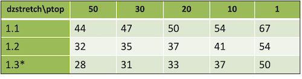
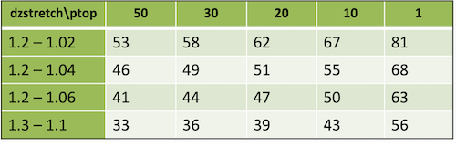

.. role:: underline
    :class: underline

WRF Initialization
==================

|

The WRF model offers two classes of simulations: those with an ideal initialization and those utilizing real data. Idealized simulations typically manufacture an initial condition file to be used to run the WRF model from an existing 1-D or 2-D sounding and assume a simplified analytic orography. Real-data cases typically require pre-processing through the WPS programs, which provides each atmospheric and static field with fidelity appropriate to the chosen grid resolution for the model. Althought the WRF model executable (wrf.exe) is not dependent on the initialization option chosen (idealized vs. real), the WRF model pre-processors (real.exe and ideal.exe) are specifically built based upon the user's selection. 

|br|
Either real.exe or ideal.exe must be run prior to running wrf.exe. Real data cases use the initialization program "real.exe," and are run inside WRF/test/em_real, where there are example cases (namelists) available from 4 to 30 km, including full physics. 

|br|
There are a variety of 3-D, 2-D, and a 1-D idealized cases available, and each of these uses the executable "ideal.exe" that is built specifically for each case.

|

Building Initialization Programs
--------------------------------

Initialization programs are compiled as part of the WRF code installation, and are built using target modules from one of the "/WRF/dyn_em/module_initialize_*.F" files. Below is a list of all available WRF cases, along with the initialization target module that builds each one. 

|

.. csv-table:: 
   :header: "Case", "Initialization Type", "Target Module File"
   :widths: 30, 30, 30
   
   "em_b_wave", "Ideal", "module_initialize_ideal.F"
   "em_convrad", "Ideal", "module_initialize_ideal.F"
   "em_fire", "Ideal", "module_initialize_fire.F"
   "em_heldsuarez", "Ideal", "module_initialize_heldsuarez.F"
   "em_les", "Ideal", "module_initialize_ideal.F"
   "em_quarter_ss", "Ideal", "module_initialize_ideal.F"
   "em_tropical_cyclone", "Ideal", "module_initialize_tropical_cyclone.F"
   "em_grav2d_x", "Ideal", "module_initialize_ideal.F"
   "em_hill2d_x", "Ideal", "module_initialize_ideal.F"
   "em_seabreeze2d_x", "Ideal", "module_initialize_ideal.F"
   "em_squall2d_x", "Ideal", "module_initialize_ideal.F"
   "em_squall2d_y", "Ideal", "module_initialize_ideal.F"
   "em_scm_xy", "Ideal", "module_initialize_scm_xy.F"
   "em_real", "Real", "module_initialize_real.F"

|

The command used at compile time determines the initialization program built. For e.g., |br| 
    ``./compile em_real`` ----> This builds real.exe |br|
    ``./compile em_seabreeze2d_x`` ----> This builds ideal.exe |br|
    
    .. note::
       "ideal.exe" is the program name for every idealized case, but the processes are different within each initialization. 

If a user wishes to build two different case types (e.g., em_real and em_les), the model must be built separately for each case to ensure the correct initialization is created. Depending on which case is built, and which is now desired determines the necessary method for doing this. When a case is built, the executables exist in the WRF/main directory, and are linked to the test/em_<case> directory. These must always be moved to prevent overwriting (unless you do not need the initial case anymore). Here are some examples:

|

**A new test case, but maintaining the same compiling, processing, and nesting options** |br|
*E.g., You have a 3-D ideal test case built (e.g., em_les) using ifort/icc, a distributed memory build, and basic nesting. You now wish to build a real-data test case (em_real) using ifort/icc with distributed memory and basic nesting*
|br|
|br|
There is no need to clean the code or to reconfigure. Just simply recompile a different case, after moving the executables for the em_les case.
|br|

#. Move to the top-level WRF directory
        ``> cd WRF``
#. Save the current executables to the em_les test case directory.
        ``> mv main/\*.exe test/em_les``
#. Recompile
        ``> ./compile em_real >& log.compile``

**A new test case that requires a different compiler and/or computing option** |br|
*E.g., You have a 3-D ideal test case built (e.g., em_les) using ifort/icc, a distributed memory build, and basic nesting. You now wish to build a 2-D ideal test case (e.g., em_squall2d_x). Note: All 2-D and 1-D ideal cases MUST be compiled with serial computing and a "no nest" option.*
|br|

#. Move to a directory outside of the top-level WRF directory (e.g., the directory that contains your em_les build) and either make a copy of the built WRF directory to a new name, or download/clone/install a clean version of the code.
        either: ``> cp -r WRF WRF_new`` |br|
        or    : ``> git clone https://github.com/wrf-model/WRF.git WRF_new`` (or another method of obtaining clean code)

#. Move into the new directory and build the code
        *(If you copied the code in the previous step)* |br|
        ``> ./clean -a`` |br|

        Otherwise, |br|
        ``> ./configure`` (choose a serial option, and then "no nesting") |br|
        ``> ./compile em_squall2d_x``

|

Initialization for Idealized Cases
----------------------------------

The initialization programs for idealized cases are responsible for the following:
|br|

* Computing a base state/reference profile for geopotential and column pressure
* Computing the perturbations from the base state for geopotential and column pressure
* Initializing meteorological variables: u, v, potential temperature, and vapor mixing ratio
* Defining a vertical coordinate
* Interpolating data to the model's vertical coordinate
* Initializing static fields for the map projection and the physical surface; for many of the idealized cases, these are simplified initializations, such as map factors set to one, and topography elevation set to zero
* If users request that the thermal field use moist potential temperature, that diagnostic variable is computed
* Reading data from the namelist
* Allocating space for the requested domain, with model variables specified at run-time
* Generating the initial condition file to be used to run wrf.exe

|

The "ideal.exe" program allows users to run a controlled scenario. Typically the only required input for ideal cases is the namelist.input and the input_sounding files (which are provided with the code), though there are exceptions. For example, the baroclinic wave case uses a 2-D binary sounding file. The program outputs the wrfinput_d01 file that is read by the WRF model executable ("wrf.exe"). Since no external data is required to run idealized cases, idealized simulations are an easy way to ensure the model is working correctly on a particular architecture and compiler.

Idealized runs can use any boundary condition except "specified" and are not, in general, set up to run with sophisticated physics. Most have no radiation, surface fluxes or frictional effects (other than the sea breeze case, LES, and the global Held-Suarez). Idealized cases are mostly useful for dynamical studies, reproducing converged or otherwise known solutions, and idealized cloud modeling. Again, there are exceptions. The tropical cyclone case lacks only radiation schemes, and the sea breeze case includes a full complement of parameterization options.

1-D, 2-D and 3-D examples of idealized cases are available, with and without topography, and with and without an initial thermal perturbation. The namelist controls the size of the domain, number of vertical levels, model top height, grid size, time step, diffusion and damping properties, boundary conditions, and physics options. A large number of settings already exist in the default namelists found in each case directory.

Input_sounding files (found in the case directories) can be any set of reasonable levels that goes at least up to the model top height (ztop) in the namelist. The first line includes surface pressure (hPa), potential temperature (K), and moisture mixing ratio (g/kg). Each subsequent line has five input values: height (meters above sea-level), dry potential temperature (K), vapor mixing ratio (g/kg), x-direction wind component (m/s), and y-direction wind component (m/s). *ideal.exe* interpolates data from the input_sounding and extrapolates if enough data is not provided.

The base state sounding for idealized cases is the initial sounding, minus moisture, and therefore does not need to be defined separately. Note for the baroclinic wave case, a 1-D input sounding is not used because initial 3-D arrays are read-in from the file "input_jet." This means the namelist.input file cannot be used to change the horizontal or vertical dimensions since they are specified in the input_jet file.

Making modifications, apart from namelist-controlled options or soundings, must be done by editing the Fortran code. Such modifications can include changing the topography, distribution of vertical levels, properties of an initialization thermal bubble, or preparing a case to use additional physics options (e.g., a land-surface model). 
    * Make modifications in  "/WRF/dyn_em/module_initialize_<case>.F," where <case> is either the case name, or simply "ideal." See `Building Initialization Programs`_ for the specific file name per case. 
    * Once inside the file, modify the subroutine "init_domain_rk." 
    * If changing the vertical levels, only the 1-D array "znw" must be defined, containing the full levels, starting from 1 at k=1, and ending with 0 at k=kde. 
    * To change the topography, only the 2-D array "ht" must be defined, making sure it is periodic if those boundary conditions are used. 
    * To change the thermal perturbation bubble, search for the string "bubble" to locate the code to modify.

Each ideal case provides an excellent set of default examples for users. The method to specify a thermal bubble is given in the super cell case. In the hill2d case, the topography is accounted for properly in setting up the initial 3-D arrays, so that example should be followed for any topography cases. A symmetry example in the squall line cases tests that indexing modifications are correct. Full physics options are demonstrated in the seabreeze2d_x case.

|

**Available Ideal Test Cases**

|

2-D squall2d_x (test/em_squall2d_x)
       * 2D squall line (x,z) using Kessler microphysics and a fixed 300 m\ :sup:`2`/s viscosity
       * periodicity condition used in y so that 3D model produces 2D simulation
       * v velocity should be zero and there should be no variation in y in the results

2-D squall2d_y (test/em_squall2d_y)
       * Same as squall2d_x, except with (x) rotated to (y)
       * u velocity should be zero and there should be no variation in x in the results

3-D quarter-circle shear supercell simulation (test/em_quarter_ss)
       * Left and right moving supercells are produced
       * See the README.quarter_ss file in the test directory for more information

2-D flow over a bell-shaped hill (x,z) (test/em_hill2d_x)
       * 10 km half-width, 2 km grid-length, 100 m high hill, 10 m/s flow, N=0.01/s, 30 km high domain, 80 levels, open radiative boundaries, absorbing upper boundary
       * Case is in linear hydrostatic regime, so vertical tilted waves with ~6-km vertical wavelength

3-D baroclinic waves (test/em_b_wave)
       * Baroclinically unstable jet u(y,z) on an f-plane
       * Symmetric north and south, periodic east and west boundaries
       * 100-km grid size, 16-km top, with 4-km damping layer
       * 41x81 points in (x,y), 64 layers

2-D gravity current (test/em_grav2d_x)
       * Test case is described in Straka et al, INT J NUMER METH FL 17 (1): 1-22 July 15 1993
       * See the README.grav2d_x file in the test directory

2-D sea breeze (test/em_seabreeze_x)
       * 2-km grid size, 20-km top, land/water
       * Can be run with full physics, radiation, surface, boundary layer, and land options

3-D large eddy simulation (test/em_les)
       * 100-m grid size, 2-km top
       * Surface layer physics with fluxes
       * Doubly periodic

3-D Held-Suarez (test/em_heldsuarez)
       * global domain, 625 km in x-direction, 556 km in y-direction, 120-km top
       * Radiation, polar filter above 45 degrees
       * Period in x-direction, polar boundary conditions in y-direction

1-D single column model (test/em_scm_xy)
       * 4-km grid size, 12-km top
       * Full physics
       * Doubly periodic

3-D surface fire (test/em_fire)
       * `Geoscientific Model Development Discussions`_
       * 50-m, 4.5-km top
       * 10:1 subgrid ratio, no physics
       * Open boundaries

3-D tropical cyclone (test/em_tropical_cyclone)
       * Test case described in Jordan, J METEOR 15, 91-97, 1958.
       * 15-km, 25-km top
       * f-plane (f=0.5e-5, about 20 N), SST=28 C
       * Full physics with a simple radiative cooling, no cumulus
       * Doubly periodic

3-D convective-radiative equilibrium (test/em_convrad)
       * 1 km grid size, 30 km model top
       * tropical condition, small f, weak wind, constant SST
       * full physics
       * doubly periodic

To learn how to run an idealized test case, see `Running Idealized Cases`_.

|

Initialization for Real Data Cases
----------------------------------

Input for real-data cases originates from a previously-run external analysis or forecast model (e.g., GFS), and after being processed by the WRF Preprocessing System (WPS), is provided to the "real" program (real.exe). 

| For example, for a single-domain WRF forecast with the following criteria:

    * 2021 January 15 0000 UTC through January 16 0000 UTC
    * Input data come from GFS in GRIB format, available at 3-h increments

the following files are generated by WPS (starting date through ending date, at 3-h increments) and are ready for use by the "real.exe" program:

|

    met_em.d01.2021-01-15_00:00:00.nc |br|
    met_em.d01.2021-01-15_03:00:00.nc |br|
    met_em.d01.2021-01-15_06:00:00.nc |br|
    met_em.d01.2021-01-15_09:00:00.nc |br|
    met_em.d01.2021-01-15_12:00:00.nc |br|
    met_em.d01.2021-01-15_15:00:00.nc |br|
    met_em.d01.2021-01-15_18:00:00.nc |br|
    met_em.d01.2021-01-15_21:00:00.nc |br|
    met_em.d01.2021-01-16_00:00:00.nc |br|
 
| Where |br|

    * **met_em** signifies data output from the WPS *metgrid.exe* program and input into the *real.exe* program. 
    * **d01** identifies to which domain this data refers (nests would follow the convection "d02," "d03," etc.). 
    * **2021-01-15_00:00:00** is the validation date/time (UTC), where each WPS output file has only a single time-slice of processed data. 
    * **.nc** is the file extension refering to the output format from WPS, which must be in netCDF for the *real.exe* program. *Unless developing special tools, stick with netCDF format to communicate between WPS and real.exe.*

| For regional forecasts, multiple time periods must be processed by *real.exe* so that a lateral boundary file is available to the model. The global option for WRF requires only an initial condition. 

| The data has already been horizontally interpolated to the correct grid-point staggering for each variable, and winds are correctly rotated to the WRF model map projection.

| See "Required Meteorological Fields for Running WRF" in the `WPS Chapter`_ of this guide for details.

|

Real-data Test Case
+++++++++++++++++++

`A test case`_ is available for downloading and includes the namelist.input file, along with met_em files created by WPSV4.3.1. The input data are GFS 0.25 degree data, available every three hours.

#. Unpack the downloaded file inside the directory where you plan to run real.exe.

.. code-block::

        > gunzip v431_test_data.tar.gz
        > tar -xf v431_test_data.tar
 
#. Make sure the WRF code has been successfully built with the "basic" nest option.

#. If WRF was built serially, issue the following to execute the real program using a single processor. 

       ``> ./real.exe`` 

   If WRF was built with the parallel (dmpar) option, use a command like |br|

       ``> mpiexec -np 4 ./real.exe`` |br|

   *Where "4" is the number of processors.* 

   After it completes, you should have files "wrfinput_d01," "wrfinput_d02," and "wrfbdy_d01," which are expected by the WRF model. |br| 

#. After running real.exe, run wrf.exe. If WRF was built serially, issue |br|

       ``> ./wrf.exe``

   If WRF was built with the parallel (dmpar) option, use a command like |br|

       ``> mpiexec -np 8 ./wrf.exe`` |br|

   *Where "8" is the number of processors.*
   After wrf.exe completes, you will have a wrfout_d01* and wrfout_d02* file available every hour for the 36 hour forecast. 

|

Backward-compatibility
----------------------

By default, moist potential temperature is used (use_theta_m=1; on) by all real and ideal cases. To use older (generated with WRF code prior to V4.0) "wrfinput" and "wrfbdy" files as input to wrf.exe, the moist theta option must be turned off in namelist.input (use_theta_m=0).
 
| By default, WRF uses a hybrid vertical coordinate (hybrid_opt=1; on). To use older (generated with WRF code prior to V4.0) "wrfinput" and "wrfbdy" files as input to wrf.exe, the hybrid vertical coordinate must be turned off in namelist.input (hybrid_opt=0) and an additional namelist option (force_use_old_data) must be set to ".true."
 
|

Setting Model Vertical Levels
-----------------------------
Eta levels are automatically computed by the real program, based on the number of levels set by the namelist option "e_vert." However, full eta levels may be explicitely defined with the namelist option "eta_levels." The number of levels must agree with the number of eta surfaces allocated (e_vert).

| The method used is designated by namelist option "auto_levels_opt." By default, auto_levels_opt=2, which uses surface and upper stretching factors (dzstretch_s and dzstretch_u) to stretch levels according to log p, up to the point of maximum thickness (max_dz), and starting from thickness "dzbot." The stretching transitions from "dzstretch_s" to "dzstretch_u" by the time the thickness reaches max_dz/2.

| The alternate option is to set auto_levels_opt=1, which assumes a known first several layers, then generates equi-height-spaced levels up to the top of the model. 

| Given are two distributions for 28 and 35 levels. 

+ **1.3** reaches 1 km thickness below about 5 km (level 13) - \* *usually not recommended*
+ **1.2** reaches 1 km thickness at around 7 km (level 19)
+ **1.1** reaches 1 km thickness at around 13 km (level 36) 

+ **dzstretch = 1.1** has 12 levels in lowest 1 km, 34 levels below 10 km
+ **dzstretch = 1.2** has 9 levels in lowest 1 km, 22 levels below 10 km
+ **dzstretch = 1.3** has 8 levels in lowest 1 km, 18 levels below 10 km

|

To avoid max thickness in the upper troposphere, stretching levels must extend above the tropopause before going to constant d (logp). This can be done by using low "dzstretch_u" values (but larger than ~1.02) to reach the tropopause, while also stretching fast enough to compensate the lapse rate.
 
| For additional flexibility, use namelist options

+ **dzbot**: the thickness of the first model layer between full levels (default value is 50 m)
+ **max_dz**: the maximum layer thickness allowed with the default value of 1000 m.

|

|

|

|

.. _`A test case`: https://www2.mmm.ucar.edu/wrf/test_data/v431_test_data.tar.gz
.. _`Running Idealized Cases`: ../running_wrf/running_ideal_cases.html
.. _`WPS Chapter`: ./wps.rst
.. _`Geoscientific Model Development Discussions`: https://gmd.copernicus.org/articles/4/591/2011/gmd-4-591-2011-discussion.html
