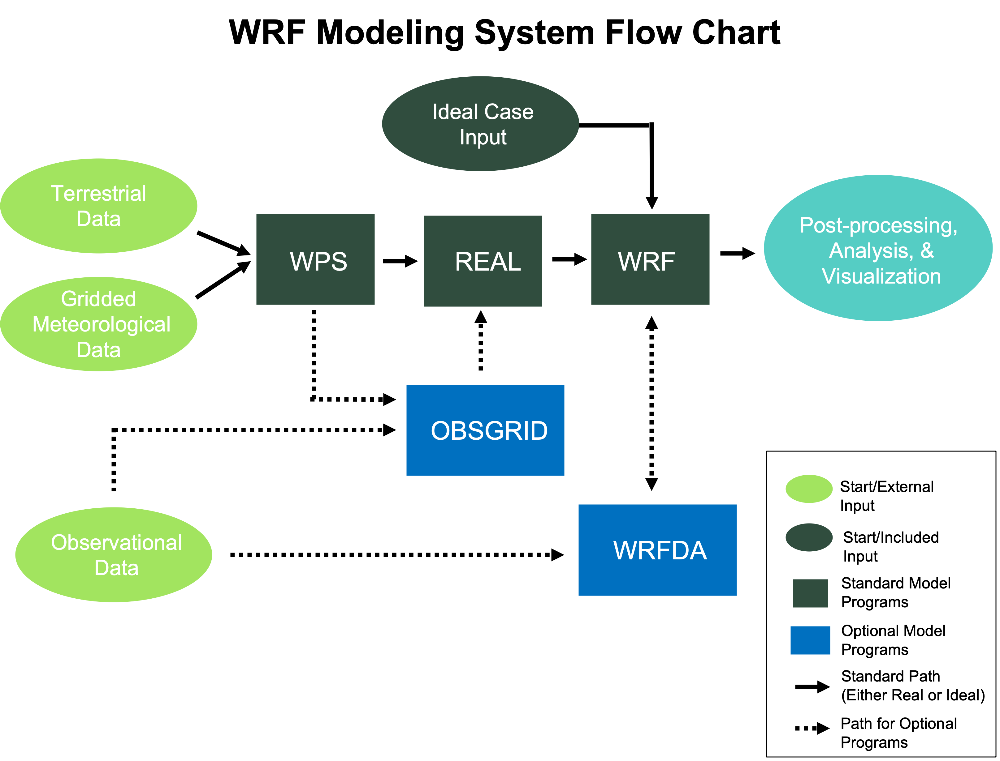

.. role:: underline
    :class: underline

WRF Overview
============

|

The Advanced Research WRF (WRF-ARW) model was developed over several years. The most recent release is available from the `WRF GitHub Repository`_. The WRF model is a flexible, state-of-the-art atmospheric simulation system, and is portable and efficient on parallel computing platforms. It is suitable for use across scales, ranging from meters to thousands of kilometers, for a broad range of applications, including the following.

|

.. csv-table:: 
   :header: "Research Applications", "Functional Applications"
   :widths: 30, 30
   :width: 75%

   "Parameterization", "Idealized simulations"
   "Data assimilation", "Real-time numerical weather prediction"
   "Forecasting",       "Model coupling"
   "Tropical cyclones", "Teaching"
   "Regional climate" 
   "Fire"

| 

|

WRF Modeling System Components
------------------------------

The following is a flowchart of the WRF Modeling System.

|

|

|
 
|

|br|

As shown in the diagram, the WRF Modeling System consists of the following programs.

* :ref:`WRF Preprocessing System` (WPS)
* :ref:`WRF Initialization Programs` (Real and Ideal)
* :ref:`WRF-ARW Solver` (WRF)
* :ref:`WRF Data Assimilation` (WRFDA)
* :ref:`Post-processing, Analysis, and Visualization Tools`

|

|

.. _WRF Preprocessing System:

WRF Preprocessing System (WPS)
++++++++++++++++++++++++++++++

The WPS is used for real-data simulations. Its functions are to 1) define simulation domains; 2) interpolate terrestrial data (e.g., terrain, landuse, and soil types) to the simulation domain; and 3) degrib and interpolate meteorological input data from an outside model to the simulation domain.

|

.. _WRF Initialization Programs:

Initialization
++++++++++++++

The WRF model is capable of simulating both real- and ideal-data cases. *ideal.exe* is a program that simulates in a controlled environment. Idealized simulations are initiated from an included initial condition file from an existing sounding, and assumes a simplified orography. Real-data cases use output from the WPS, which includes meteorological input originally generated from a previously-run external analysis or forecast model (e.g., GFS) as input to the *real.exe* program.

|

.. _WRF-ARW Solver:

WRF-ARW Solver
++++++++++++++

The *wrf.exe* program is the primary component of the modeling system.
         
| 

:underline:`Key Features`
        
        * Fully-compressible nonhydrostatic equations with a hydrostatic option
        * Complete Coriolis and curvature terms
        * Mass-based hybrid sigma-pressure vertical coordinate
        * Map-scale factors for these projections:
           - Polar Stereographic (conformal)
           - Lambert-conformal
           - Mercator (conformal)
           - Latitude and longitude, which can be rotated
        * Arakawa C-grid staggering
        * Scalar-conserving flux form for prognostic variables
        * Upper boundary absorption and Rayleigh damping
        * Lateral boundary conditions
           - Idealized cases: periodic, symmetric, and open radiative
           - Real cases: specified with relaxation zone
        * Full physics options for land-surface, planetary boundary layer, atmospheric and surface radiation, microphysics and cumulus convection
        * Orographic gravity wave drag

        |

:underline:`Additional Options`

        * Regional and global applications
        * Two-way nesting with multiple nests and nest levels
        * Concurrent one-way nesting with multiple nests and nest levels
        * Offline one-way nesting with vertical nesting
        * Moving nests (prescribed moves and vortex tracking)
        * Vertical grid-spacing can vary with height
        * Runge-Kutta 2nd and 3rd order time integration options
        * 2nd to 6th order advection options (horizontal and vertical)
        * Monotonic transport and positive-definite advection option for moisture, scalar, tracer, and TKE
        * Weighted Essentially Non-Oscillatory (WENO) advection option
        * Time-split small step for acoustic and gravity-wave modes:
           - Small step horizontally explicit, vertically implicit
           - Divergence damping option and vertical time off-centering
           - External-mode filtering option
        * Ocean models
        * Grid analysis nudging using separate upper-air and surface data, and observation nudging
        * Spectral nudging
        * Digital filter initialization
        * Adaptive time stepping
        * Stochastic parameterization schemes
        * A number of idealized examples

        |

.. _WRF Data Assimilation:

WRF Data Assimilation (WRFDA)
+++++++++++++++++++++++++++++

WRF Data Assimilation (WRFDA) is an optional program used to ingest observations into interpolated analysis created by WPS. It may also be used to update the WRF model's initial conditions by running in "cycling" mode. WRFDA's primary features are:

        * The capability of 3D and 4D hybrid data assimilation (Variational + Ensemble)
        * Based on an incremental variational data assimilation technique
        * Tangent linear and adjoint of WRF are fully integrated with WRF for 4D-Var
        * Utilizes the conjugate gradient method to minimize cost function in the analysis control variable space
        * Analysis on an un-staggered Arakawa A-grid
        * Analysis increments interpolated to staggered Arakawa C-grid, which is then added to the background (first guess) to get the final analysis of the WRF-model grid
        * Conventional observation data input may be supplied in either ASCII format via the *obsproc* utility, or *PREPBUFR* format
        * Multiple-satellite observation data input may be supplied in BUFR format
        * Two fast radiative transfer models, CRTM and RTTOV, are interfaced to WRFDA to serve as satellite radiance observation operator
        * Variational bias correction for satellite radiance data assimilation
        * All-sky radiance data assimilation capability
        * Multiple radar data (reflectivity & radial velocity) input is supplied through ASCII format
        * Multiple outer loop to address nonlinearity
        * Capability to compute adjoint sensitivity
        * Horizontal background (first guess) error is represented via a recursive filter (for regional) or power spectrum (for global)
        * Vertical background error is applied through projections on climatologically-generated, averaged eigenvectors and its corresponding Eigen values
        * Horizontal and vertical background errors are non-separable. Each eigenvector has its own horizontal climatologically-determined length scale
        * Preconditioning of the background of the cost function is done via the control variable transform U defined as B=UUT
        * *gen_be* utility to generate climatological background error covariance estimate via the NMC-method or ensemble perturbations
        * Utility program to update WRF boundary condition file after WRF-DA 

        |

.. _Post-processing, Analysis, and Visualization Tools:

Post-processing, Analysis, and Visualization Tools
++++++++++++++++++++++++++++++++++++++++++++++++++

Several post-processing programs are supported, including RIP (based on NCAR Graphics), NCAR Graphics Command Language (NCL), and conversion programs for other readily-available graphics packages (e.g., GrADS).

            * **wrf-python** (wrf-python_) is a collection of diagnostic and interpolation routines for use with output from the WRF model. 
            * **NCL** (`NCAR Command Language`_) is a free, interpreted language designed specifically for scientific data processing and visualization. NCL has robust file input and output. It can read in netCDF, HDF4, HDF4-EOS, GRIB, binary and ASCII data. The graphics are world-class and highly customizable.
            * **RIP** (`Read/Interpolate/Plot`_) is a Fortran program that invokes NCAR Graphics routines for the purpose of visualizing output from gridded meteorological data sets, primarily from mesoscale numerical models. 

            * **ARWpost** is a package that reads-in WRF-ARW model data and creates GrADS output files.

            * **UPP** (`Unified Post Processing`_) is a system deleveloped at the National Centers for Environmental Prediction (NCEP) and is used operationally for models maintained by NCEP. It is currently supported by the Research Applications Laboratory (RAL) at NCAR.

            * **VAPOR** (`Visualization and Analysis Platform for Ocean, Atmosphere, and Solar Researchers`_), is a 3-dimensional data visualization tool developed and supported by the VAPOR team at NCAR (vapor at ucar dot edu).

            * **MET** (`Model Evaluation Tools`_), is developed and supported by the Developmental Testbed Center at NCAR (met_help at ucar dot edu).

        Details of these programs (with the exception of MET) can be found in the `Post-processing, Utilities, and Tools`_ section of this users' guide. 

|

|

Resources
---------
`WRF Users Website`_

`WRF Tutorial Presentations`_

`WRF-ARW Tech Note`_

`WRF Online Tutorial`_

`WRF Compiling Tutorial`_

`How to Cite WRF`_

`WRF Support Forum`_

.. _`How to Cite WRF`: https://www2.mmm.ucar.edu/wrf/users/citing_wrf.html
.. _`Model Evaluation Tools`: http://www.dtcenter.org/met/users/
.. _`NCAR Command Language`: http://www.ncl.ucar.edu/
.. _`Post-processing, Utilities, and Tools`: ../post_processing_utilities_tools/index.html
.. _`Read/Interpolate/Plot`: https://www2.mmm.ucar.edu/wrf/users/docs/ripug.htm
.. _`Unified Post Processing`: https://ral.ucar.edu/solutions/products/unified-post-processor-upp
.. _`Visualization and Analysis Platform for Ocean, Atmosphere, and Solar Researchers`: http://www.vapor.ucar.edu/
.. _`WRF-ARW Tech Note`: https://www2.mmm.ucar.edu/wrf/users/docs/technote/contents.html
.. _`WRF Compiling Tutorial`: https://www2.mmm.ucar.edu/wrf/OnLineTutorial/compilation_tutorial.php
.. _`WRF GitHub Repository`: https://github.com/wrf-model/WRF/releases
.. _`WRF Online Tutorial`: https://www2.mmm.ucar.edu/wrf/OnLineTutorial/index.php
.. _wrf-python: https://wrf-python.readthedocs.io/en/latest/
.. _`WRF Support Forum`: https://forum.mmm.ucar.edu/phpBB3/
.. _`WRF Tutorial Presentations`: http://www2.mmm.ucar.edu/wrf/users/tutorial/tutorial.html
.. _`WRF Users Website`: https://www2.mmm.ucar.edu/wrf/users/
  
|

|

|

