.. role:: underline
    :class: underline

WRF Physics
===========

|

Numerous physical processes take place in the Earth's atmosphere. The image below shows how many of them interact with each other. 

|

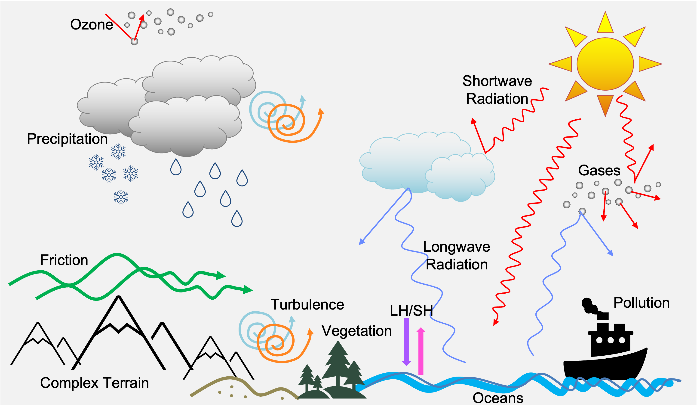

The sun creates shortwave radiation that can be absorbed, reflected, and/or scattered by the Earth's surface, clouds, aerosols, gases, etc. Longwave radiation is emitted back up from the Earth's surface and up and down from gases and clouds in the atmosphere, and can exit to space. Heating from diurnal radiation creates boundary-layer development, which increases turbulence and can produce convection. Clouds produce precipitation in many forms (such as rain, snow, and graupel), and are created by radiative or lifting processes. There are chemical components, such as aerosols, ozone, and pollutants that can modify clouds and radiation. At the surface, the roughness and other properties of land types (e.g., mountains, trees, buildings) modify surface fluxes. All of these processes work together to create our weather and climate. 

|

The WRF model includes a variety of physics schemes responsible for different components of the physical processes. These schemes interact with each other during model simulations to emulate physical processes in the Earth's atmosphere.

|

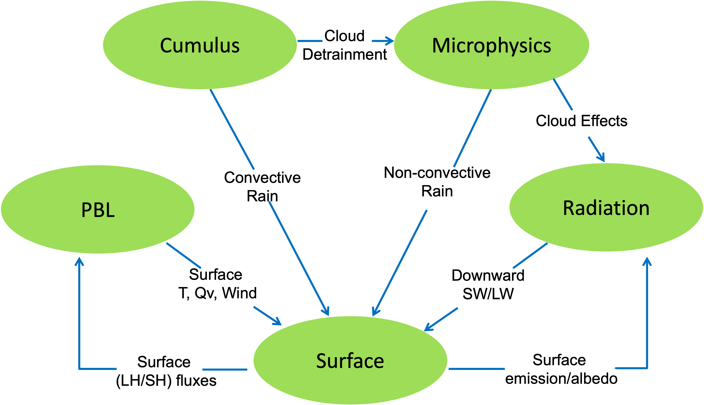

|

|

|

Cumulus Parameterization
------------------------

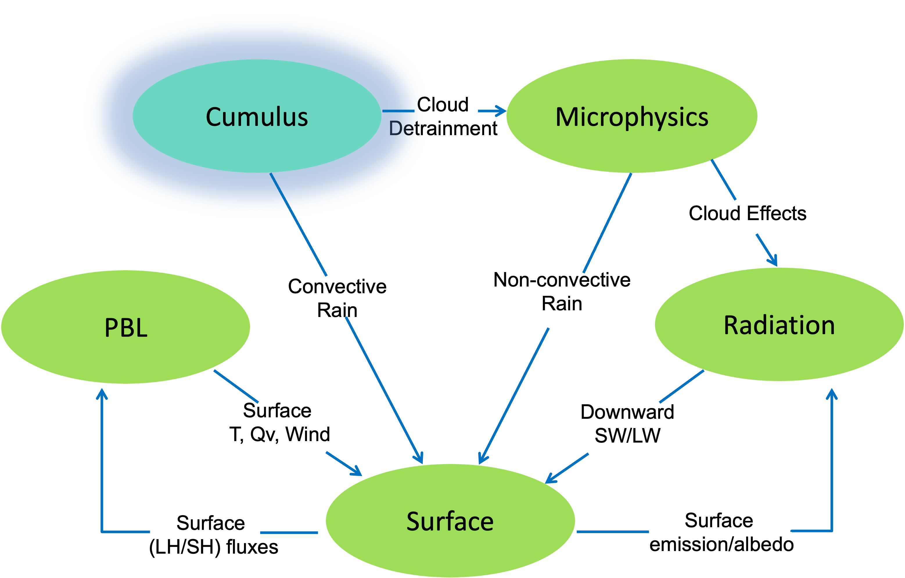

Several cumulus schemes are available and they all have varying features, but they all parameterize sub-grid-scale effects of convective and shallow clouds. They activate column-by-column, depending on the presence of convective instability, and provide column tendencies of heat and moisture, as well as the convective part of surface rainfall, to the model. 

Cumulus parameterization schemes redistribute air in gridded columns to account for vertical convective fluxes. Updrafts move boundary layer air upward and downdrafts move mid-level air downward. Schemes are designed to determine when to trigger a convective column and how quickly to create the convection. 

All WRF cumulus schemes (except BMJ), are mass flux schemes, meaning they determine updraft (and often downdraft) mass flux and other fluxes, sometimes including momentum transport. Updrafts are driven by buoyancy, allowing moist surface air to rise to the upper troposphere and condensation becomes convective rainfall. Downdrafts are driven by convective rain evaporation, which cools air to the boundary layer. Subsidence warms and dries the troposphere and is the primary warming contributor in the column. The BMJ scheme is an adjustment type, and relaxes toward a post-convective (mixed) sounding. 
 
|

It may not always be necessary to use cumulus parameterization. It is designed for grid sizes unable to parameterize the convective processes (i.e., when updrafts and downdrafts are sub-grid).

|

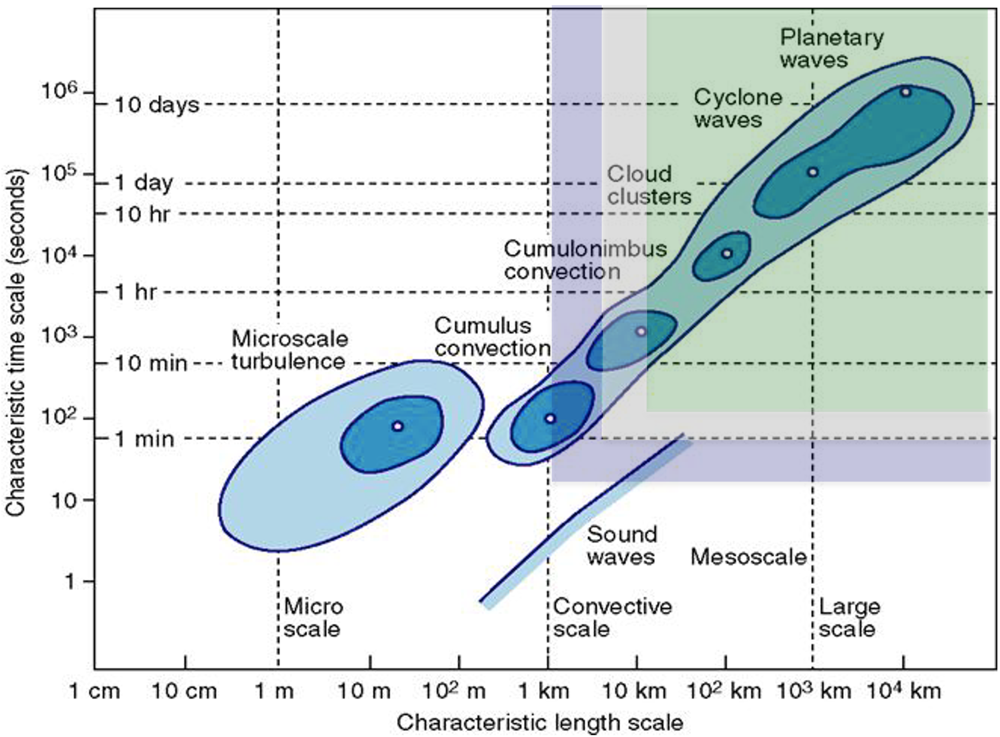

Following are the general rules for WRF cumulus parameterization.

    * Domains with grid spacing **>=10km** :  a cumulus scheme is necessary
    * Domains with grid spacing **<=3km** : unlikely that a cumulus scheme is necessary (although it may help when convection exists prior to the run)
    * Domains with grid spacing **>=3km** to **<=10km** : This is a "gray zone" where cumulus parameterization may or may not be necessary. If possible, try to avoid domains this size, but if it is unavoidable, it is best to use either the Multi-scale Kain Fritsch or Grell-Freitas scheme, as these take this scale into account.

|

    .. note::
       See the `WRF Tutorial presentation on Cumulus Parameterization`_ for additional details.

|

|

Cumulus Options
+++++++++++++++
In the table below, moisture tendencies are mixing ratios of (c) cloud water, (r) rain water, (i) cloud ice, and (s) snow.

.. csv-table:: 
   :widths: 70, 30, 50, 50, 60, 50  
   :align: left 
   :header: "Scheme", "Option", "Moisture Tendencies", "Momentum Tendencies", "Shallow Convection", "Radiation Interaction"

   "Kain-Fritsch (KF)", 1, "Qc Qr Qi Qs", no, yes, yes
   "BMJ", 2, "N/A", no, yes, GFDL
   "Grell-Freitas", 3, "Qc Qi", no, yes, yes
   "Old SAS", 4, "Qc Qi", no, yes, GFDL
   "Grell-3", 5, "Qc Qi", no, yes, yes
   "Tiedtke", 6, "Qc Qi", yes, yes, no
   "Zhang-McFarlane", 7, "Qc Qi", yes, yes, RRTMG
   "KF-CuP", 10, "Qc Qi", no, yes, yes
   "Multi-scale KF", 11, "Qc Qr Qi Qs", no, yes, ?
   "KIAPS SAS", 14, "Qc Qi", yes, use shcu_physics=4, GFDL
   "New Tiedtke", 16, "Qc Qi", yes, yes, no
   "Grell-Devenyi", 93, "Qc Qi", no, no, yes
   "NSAS", 96, "Qc Qi", yes, no/yes, GFDL
   "Old KF", 99, "Qc Qr Qi Qs", no, no, GFDL

|

Cumulus Details and References
++++++++++++++++++++++++++++++

**Kain-Fritsch (KF)** |br|
*cu_physics=1* |br|
Deep and shallow convection sub-grid scheme using a mass flux approach with downdrafts and CAPE removal time scale |br|
`Kain, 2004`_
   
    * **kfeta_trigger** : =1 – default trigger; =2 – moisture-advection modulated trigger function (`Ma and Tan, 2009`_). This option may improve results in subtropical regions when large-scale forcing is weak; =3 - RH dependent additional perturbation to option 1
    * **cu_rad_feedback=.true.** : allow sub-grid cloud fraction interaction with radiation (`Alapaty et al., 2012`_)

|

**Betts-Miller-Janjic (BMJ)** |br|
*cu_physics=2* |br|
Operational Eta scheme. Column moist adjustment scheme relaxing towards a well-mixed profile. |br|
`Janjic, 1994`_
    
|

**Grell-Freitas (GF)** |br|
*cu_physics=3* |br|  
An improved GD scheme that tries to smooth the transition to cloud-resolving scales, as proposed by `Arakawa et al., 2004`_). |br|
`Grell and Freitas, 2014`_

|

**Simplified Arakawa-Schubert (SAS)** |br|
*cu_physics=4* |br|
Simple mass-flux scheme with quasi-equilibrium closure with shallow mixing scheme. |br|
`Pan et al., 1995`_
    
|

**Grell 3D (G3)** |br|
*cu_physics=5* |br|
An improved version of the GD scheme that may also be used on high resolution (in addition to coarser resolutions) if subsidence spreading (option cugd_avedx) is turned on. |br|
`Grell, 1993`_ |br|
`Grell and Devenyi, 2002`_
    
|

**Tiedtke scheme** |br|
*cu_physics=6* |br| 
(U. of Hawaii version); Mass-flux type scheme with CAPE-removal time scale, shallow component and momentum transport. |br|
`Tiedtke, 1989`_ |br|
`Zhang et al., 2011`_
    
|

**Zhang-McFarlane** |br|
*cu_physics=7* |br|
Mass-flux CAPE-removal type deep convection from CESM climate model with momentum transport. |br|
`Zhang and McFarlane, 1995`_
    
|

**Kain-Fritsch (KF)**
*cu_physics=10* |br|
Cumulus Potential scheme; this option modifies the KF ad-hoc trigger function with one linked to boundary layer turbulence via probability density function (PDFs) using cumulus potential scheme. The scheme also computes the cumulus cloud fraction based on the time
scale relevant for shallow cumuli. |br|
`Berg et al., 2013`_

|

**Multi-scale Kain-Fritsch** |br|
*cu_physics=11* |br|
Using scale-dependent dynamic adjustment timescale, LCC-based entrainment. Also uses new trigger function based on `Bechtold et al., 2001`_. Includes an option to use CESM aerosol. In V4.2, convective momentum transport is added. It can be turned off by setting switch cmt_opt_flag = .false. inside the code. |br|
`Zheng et al., 2016`_ |br|
`Glotfelty et al., 2019`_

|

**KIAPS SAS (KSAS)** |br|
*cu_physics=14* |br|
Based on NSAS, but scale-aware |br|
`Han and Pan, 2011`_ |br|
`Kwon and Hong, 2017`_

|

**New Tiedtke** |br|
*cu_physics=16* |br|
This version is similar to the Tiedtke scheme used in REGCM4 and ECMWF cy40r1. |br|
`Zhang and Wang, 2017`_

|

**Grell-Devenyi (GD)** |br|
*cu_physics=93* |br|
An ensemble scheme; Multi-closure, multi-parameter, ensemble method with typically 144 sub-grid members. |br|
`Grell and Devenyi, 2002`_

|

**New Simplified Arakawa-Schubert (NSAS)** |br|
*cu_physics=96* |br|
New mass-flux scheme with deep and shallow components and momentum transport. |br|
`Han and Pan, 2011`_
    
|

**Old Kain-Fritsch** |br|
*cu_physics=99* |br|
Deep convection scheme using a mass flux approach with downdrafts and CAPE removal time scale. |br|
`Kain and Fritsch, 1990`_

|

Shallow Convection
++++++++++++++++++
Shallow convection schemes are an additional option. Non-precipitating shallow mixing dries the planetary boundary layer, then moistens and cools above. This is done by enhanced mixing or a mass-flux approach. These options may be useful for grid sizes that do not resolve shallow cumulus clouds (>1 km). 

Some cumulus schemes already include shallow convection:

    * Kain-Fritsch
    * Old SAS
    * KIAPS SAS
    * Grell-3
    * Grell-Freitas
    * BMJ
    * Tiedtke

However, to use the standalone shallow schemes, use one of the following options.

    * **ishallow=1** : Shallow convection that works with the Grell 3D scheme (cu_physics=5) 

    * **shcu_physics=2** : UW (Bretherton and Park) Shallow cumulus option from the CESM climate model with momentum transport |br|
      `Park et al., 2009`_

    * **shcu_physics=3** : GRIMS (Global/Regional Integrated Modeling System) scheme; represents the shallow convection process by using eddy-diffusion and the pal algorithm, and couples directly to the YSU PBL scheme |br|
      `Hong and Jang, 2018`_

    * **shcu_physics=4** : NSAS shallow scheme; extracted from NSAS, and should be used with KSAS deep cumulus scheme

    * **shcu_physics=5** : Deng shallow scheme; only works with MYNN and MYJ PBL schemes; *(new in V4.1)* |br|
      `Deng et al., 2003`_

|

|

Microphysics
------------

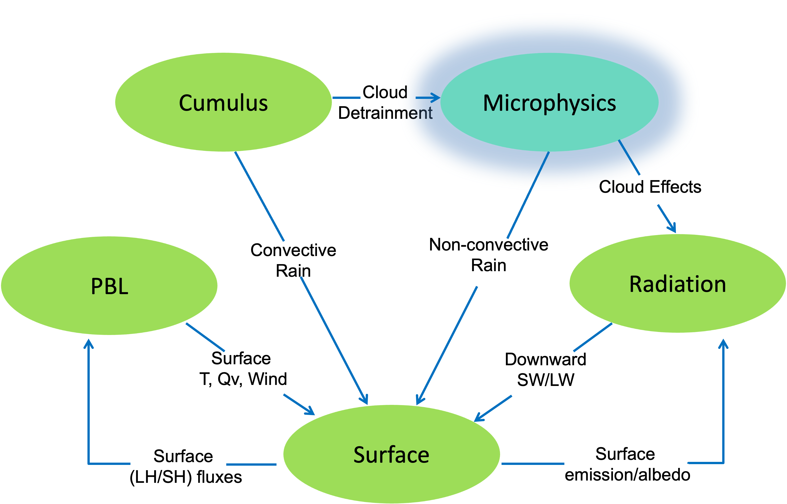

WRF microphysics schemes resolve cloud and precipitation processes, and some schemes account for ice and/or mixed-phases processes. Microphysics schemes provide atmospheric heat and moisture tendencies to the model, and the resolved-scale (or NON-convective) rainfall at the surface. WRF microphysics schemes take into account many different microphysical processes, and formation of particles differs, depending on their type. 

    * Cloud droplets (10s of microns) condense from vapor at water saturation.
    * Rain (~mm diameter) forms from cloud droplet growth.
    * Ice crystals (10s of microns) form from freezing of droplets or deposition on nuclei, which are assumed or explicit (e.g., dust particles).
    * Snow (100s of microns) forms from growth of ice crystals at ice supersaturation and their aggregation.
    * Graupel/hail (mm to cm) form and grow from mixed-phase interactions between water and ice particles.
    * Precipitating particles are typically assigned to an observationally-based size distribution.

There are many types of microphysics schemes available in WRF. Single-moment schemes have a single prediction equation for mass per species, with particle size distribution being derived from fixed parameters (Qr, Qs, etc.). Double-moment schemes add a prediction equation for number concentration per double-moment species (Nr, Ns, etc.), and allow for additional processes, such as size-sorting during fall-out and aerosol effects. Spectral bin schemes resolve size distribution by doubling mass bins. The more advanced the scheme type, the more computationally expensive the model simulation will be. 

|

    .. note:: 
       For additional details, see the `WRF Tutorial presentation on Microphysics`_.

|

Microphysics Options
++++++++++++++++++++

|

*In the below table, abbreviations are defined as follows*

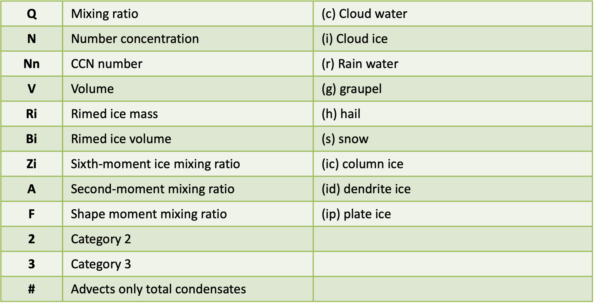

|

.. csv-table:: 
   :widths: 50, 20, 50, 50 
   :align: left 
   :header: "Scheme", "Option", "Mass Variables", "Number Variables"

   "Kessler", 1, "Qc Qr", N/A
   "Purdue Lin", 2, "Qc Qr Qi Qs Qg", N/A
   "WSM3", 3, "Qc Qr", N/A
   "WSM5", 4, "Qc Qr Qi Qs", N/A
   "Eta (Ferrier)", 5, "Qc Qr Qs Qt*", N/A
   "WSM6", 6, "Qc Qr Qi Qs Qg", N/A
   "Goddard 4-ice", 7, "Qc Qr Qi Qs Qg Qh", N/A
   "Thompson", 8, "Qc Qr Qi Qs Qg", "Ni Nr"
   "Milbrandt 2-mom", 9, "Qc Qr Qi Qs Qg Qh", "Nc Nr Ni Ns Ng Nh"
   "Morrison 2-mom", 10, "Qc Qr Qi Qs Qg", "Nr Ni Ns Ng"
   "CAM 5.1", 11, "Qc Qr Qi Qs", "Nc Nr Ni Ns"
   "SBU-YLin", 13, "Qc Qr Qi Qs", N/A
   "WDM5", 14, "Qc Qr Qi Qs", "Nn Nc Nr"
   "WDM6", 16, "Qc Qr Qi Qs Qg", "Nn Nc Nr"
   "NSSL 2-mom", 17, "Qc Qr Qi Qs Qg Qh", "Nc Nr Ni Ns Ng Nh"
   "NSSL 2-mom+CCN", 18, "Qc Qr Qi Qs Qg Qh", "Nc Nr Ni Ns Ng Nh Nn"
   "NSSL 7-class", 19, "Qc Qr Qi Qs Qg Qh", "Vg"
   "NSSL 6-class", 21, "Qc Qr Qi Qs Qg", N/A
   "NSSL 6-class 2-mom", 22, "Qc Qr Qi Qs Qg", "Nn Nc Nr Ni Ns Ng Vg"
   "WSM7", 24, "Qc Qr Qi Qs Qg Qh", N/A
   "WDM7", 26, "Qc Qr Qi Qs Qg Qh", "Nc Nr"
   "Thompson Aerosol", 28, "Qc Qr Qi Qs Qg", "Nc Ni Nr Nn Nni"
   "HUJI Fast", 30, "Qc Qr Qi Qs Qg", "Nn Nc Nr Ni Ns Ng"
   "Thompson Hail/Graupel/Aerosol", 38, "Qc Qr Qi Qs Qg", "Nc Ni Nr Nn Nni Ng Vg"
   "P3", 50, "Qc Qr Qi", "Nr Ni Ri Bi"
   "P3-nc", 51, "Qc Qr Qi", "Nc Nr Ni Ri Bi"
   "P3-2nd", 52, "Qc Qr Qi2", "Nc Nr Ni Ni2 Ri Ri2 Bi Bi2"
   "P3-3mc", 53, "Qc Qr Qi", "Nc Nr Ni Ri Bi Zi"
   "ISHMAEL", 55, "Qc Qr Qi Qi2 Qi3", "Nr Ni Ni2 Ni3 Vi Vi2 Vi3 Ai Ai2 Ai3"
   "NTU", 56, "Qc Qr Qi Qs Qg Qh Qden Qten Qccn Qrcn", "Nc Nr Ni Ns Ng Nh Nin Ai As Ag Ah Vi Vs Vg Fi Fs"

|

..
   "HUJI Full", 32, "Qc Qr Qic Qip Qid Qs Qg Qh", "Nn Nc Nr Nic Nip Nid Ns Ng Nh"

Microphysics Option Details and References
++++++++++++++++++++++++++++++++++++++++++

**Kessler** |br|
*mp_physics=1* |br|
A warm-rain (i.e., no ice) scheme used commonly in idealized cloud modeling studies |br|
`Kessler, 1969`_

|

**Purdue Lin** |br|
*mp_physics=2* |br|
A sophisticated scheme that has ice, snow, and graupel processes, suitable for real-data high-resolution simulations |br|
`Chen and Sun, 2002`_

|

**WRF Single-moment 3-class (WSM3)** |br|
*mp_physics=3* |br|
A simple, efficient scheme with ice and snow processes, suitable for mesoscale grid sizes |br|
`Hong et al., 2004`_

|

**WRF Single-moment 5-class (WSM5)** |br|
*mp_physics=4* |br|
A slightly more sophisticated version of WSM3 that allows for mixed-phase processes and super-cooled water |br|
`Hong et al., 2004`_

|

**Ferrier Eta** |br|
*mp_physics=5* |br|
The operational microphysics used in NCEP models; simple and efficient, with diagnostic mixed-phase processes; for use with fine resolutions (<5km) |br|
`NOAA, 2001`_

|

**WRF Single-moment 6-class (WSM6)** |br|
*mp_physics=6* |br|
Includes ice, snow and graupel processes, suitable for high-resolution simulations |br|
`Hong and Lim, 2006`_

|

**Goddard 4-ice** |br|
*mp_physics=7* |br|
Predicts hail and graupel separately; provides effective radii for radiation. *Replaced older Goddard scheme in V4.1.* |br|
`Tao et al., 1989`_ |br|
`Tao et al., 2016`_

|

**Thompson et al.** |br|
*mp_physics=8* |br|
Includes ice, snow and graupel processes suitable for high-resolution simulations |br|
`Thompson et al., 2008`_

|

**Milbrandt-Yau Double-moment 7-class** |br|
*mp_physics=9* |br|
Includes separate categories for hail and graupel with double-moment cloud, rain, ice, snow, graupel and hail |br|
`Milbrandt and Yau, 2005 (Part I)`_ |br|
`Milbrandt and Yau, 2005 (Part II)`_

|

**Morrison Double-moment** |br|
*mp_physics=10* |br|
Double-moment ice, snow, rain and graupel for cloud-resolving simulations |br|
`Morrison et al., 2009`_

|

**CAM V5.1 2-moment 5-class** |br|
*mp_physics=11* |br|
`User's Guide to the CAM-5.1`_

|

**Stony Brook University (Y. Lin)** |br|
*mp_physics=13* |br|
A 5-class scheme with riming intensity predicted to account for mixed-phase processes |br|
`Lin and Colle, 2011`_

|

**WRF Double-moment 5-class (WDM5)** |br|
*mp_physics=14* |br|
Similar to WSM5 (option 4), but includes double-moment rain, and cloud and CCN for warm processes |br|
`Lim and Hong, 2010`_

|

**WRF Double-moment 6-class (WDM6)** |br|
*mp_physics=16* |br|
Similar to WSM6 (option 6), but includes double-moment rain, and cloud and CCN for warm processes |br|
`Lim and Hong, 2010`_

|

        **Note** |br|
        *For NSSL single-moment schemes (options 19 and 21), intercept and particle densities can be set for snow, graupel, hail, and rain. For the single- and double-moment schemes (options 17,18, 19, 21, and 22), shape parameters for graupel and hail can be set (in te &physics section of namelist.input).*
                
                * **nssl_alphah=0.** : shape parameter for graupel
                * **nssl_alphahl=2.** : shape parameter for hail
                * **nssl_cnoh=.e5** : graupel intercept
                * **nssl_cnohl=4.e4** : hail intercept
                * **nssl_cnor=8.e5** : rain intercept
                * **nssl_cnos=3.e6** : snow intercept
                * **nssl_rho_qh=500.** : graupel density
                * **nssl_rho_qhl=900.** : hail density
                * **nssl_rho_qs=100.** : snow density

|

**NSSL Double-moment** |br|
*mp_physics=17* |br|
Two-moment scheme for cloud droplets, rain drops, ice crystals, snow, graupel, and hail; also predicts average graupel particle density, which allows graupel to span the range from frozen drops to low-density graupel |br|
`Mansell et al., 2010`_

|

**NSSL Double-moment with CCN prediction** |br|
*mp_physics=18* |br|
Similar to option 17 (above), but also predicts cloud condensation nuclei (CCN) concentration (intended for idealized simulations); intended for cloud-resolving simulations (dx <= 2km) in research applications |br|
`Mansell et al., 2010`_

    * To set global CCN value, use "nssl_cccn=0.7e9," which also sets the same value for "ccn_conc"

|

**NSSL Single-moment 7-class** |br|
*mp_physics=19* |br|
A single-moment version of option 17 (above) |br|
*No publication available*

|

**NSSL single-moment 6-class** |br|
*mp_physics=21* |br|
Intended for cloud-resolving simulations (dx <= 2km) in research applications; similar to |br|
`Gilmore et al. (2004)`_ 

|

**NSSL Double-moment with Graupel** |br|
*mp_physics=22* |br|
Similar to option 17 (above), without hail |br|
*No publication available*

|

**WRF Single-moment 7-class (WSM7)** |br|
*mp_physics=24* |br|
Similar to WSM6 (option 6), but with an added hail category *(effective beginning with V4.1)* |br|
`Bae et al., 2018`_

|

**WRF Double-moment 7-class (WDM7)** |br|
*mp_physics=26* |br|
Similar to WDM6 (option 16), but with an added hail category *(effective beginning with V4.1)* |br|
`Bae et al., 2018`_

|

**Thompson Aerosol-aware** |br|
*mp_physics=28* |br|
Considers water- and ice-friendly aerosols |br| 
`Thompson and Eidhammer, 2014`_
    
    * A climatology data set may be used to specify initial and boundary conditions for the aerosol variables; includes a surface dust scheme. 
    * Since V4.4 a `black carbon aerosol category`_ is added; biomass burning can also be added.

|

**Hebrew University of Jerusalem Fast (HUJI)** |br|
*mp_physics=30* |br|
Spectral bin microphysics, fast version |br|
`Khain et al., 2010`_

..
  **Hebrew University of Jerusalem Full (HUJI)** |br|
..
  *mp_physics=32* |br|
..
  Spectral bin microphysics, full version |br|
..
  `Khain et al., 2004`_

|

**Thompson Hail/Graupel/Aerosol** |br|
*mp_physics=38* |br|
Similar to option 28, but computes two-moment prognostics for graupel and hail and includes a predicted density graupel category. This option requires the datafile qr_acr_qg_mp38V1.dat_ to be in the directory where wrf.exe is run. Alternatively, that file can be computed by using namelist option *write_thompson_mp38table=.true.* (but this can take up to 18 min to compute this table using a 12-CPU job, 4 min on 128-CPU, and several hours if computed on a single CPU). 

**Morrison double-moment scheme with CESM aerosol** |br|
*mp_physics=40* |br|
Similar to option 10, but with CESM aerosol added. *This option must be used with the MSKF cumulus scheme (option 11)* |br|
*No publication available for this specific scheme*

|

**Morrison and Milbrandt Predicted Particle Property (P3)** |br|
*mp_physics=50* |br|
A single ice category that represents a combination of ice, snow and graupel, and also carries prognostic arrays for rimed ice mass and rimed ice volume; single-moment rain and ice. |br|
`Morrison and Milbrandt, 2015`_

|

**Morrison and Milbrandt Predicted Particle Property (P3-nc)** |br|
*mp_physics=51* |br|
As in 50, but adds supersaturation dependent activation and double-moment cloud water |br|
`Morrison and Milbrandt, 2015`_

|

**Morrison and Milbrandt Predicted Particle Property (P3-2ice)** |br|
*mp_physics=52* |br|
As in option 50, but with two arrays for ice and double-moment cloud water |br|
`Morrison and Milbrandt, 2015`_

|

**Morrison and Milbrandt Predicted Particle Property (P3-3moment)** |br|
*mp_physics=53* |br|
As in option 50, but with 3-moment ice, plus double-moment cloud water |br|
*No publication available for this specific scheme*

|

**Jensen ISHMAEL** |br|
*mp_physics=55* |br|
Predicts particle shapes and habits in ice crystal growth; *(new in V4.1)* |br|
`Jensen et al., 2017`_

|

**National Taiwan University (NTU)** |br|
*mp_physics=56* |br|
double-moments for the liquid phase, and triple-moments for the ice phase, together with consideration for ice crystal shape and density variations; supersaturation is resolved so that condensation nuclei (CN) activation is explicitly calculated; CN’s mass in droplets is tracked to account for aerosol recycling. |br|
`Tsai and Chen, 2020`_

|

|

Radiation
---------

|

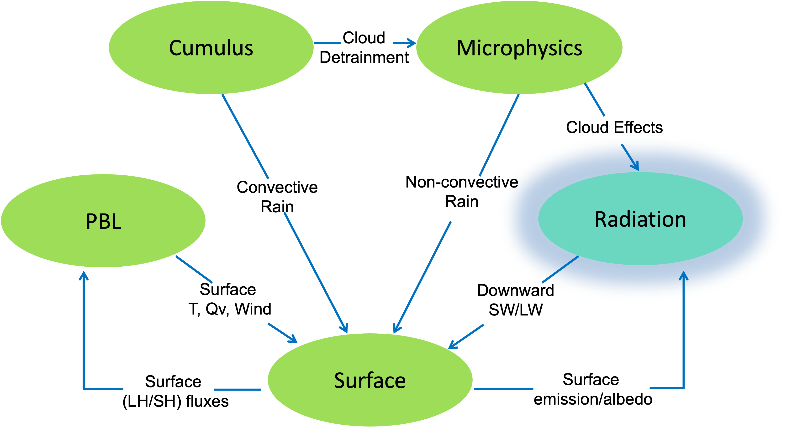

WRF radiation schemes obtain cloud properties from the microphysics scheme, and then compute an atmospheric temperature tendency profile, as well as surface radiative fluxes, due to longwave and shortwave radiation. 

|

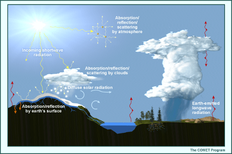

Longwave schemes are responsible for computing the longwave radiation emitted and absorbed by the surface and clouds, and gases such as water vapor and CO2. The wavelengths are the thermal IR wavelengths, longer than about three microns. 

Shortwave schemes compute incoming solar fluxes that may be reflected by the surface or clouds, or absorbed by gases, such as water vapor and ozone, and aerosols. Shortwave schemes take into consideration annual cycles, as well as the diurnal cycle. These schemes include the ultraviolet, visible, and near-IR wavelengths in the solar spectrum.
 
|

    .. note::
       See the `WRF Tutorial presentation on Radiation`_ for additional details.

|

Longwave Radiation Schemes
++++++++++++++++++++++++++
WRF longwave radiation schemes compute clear-sky and cloud upward and downward raditation fluxes. 

    * They consider infrared emissions from layers. 
    * Surface emissivity is calculated, based on the land type in each grid point.
    * Flux divergence of the layer emissions leads to cooling in each layer. 
    * Downward flux at the surface is important in the land-energy budget.
    * Infrared radiation generally leads to cooling in clear air (~2K/day), with stronger cooling at cloud tops and warming at cloud bases. 

|

In the table below, microphysics interactions are mixing ratios of (c) cloud water, (r) rain water, (i) cloud ice, (s) snow, and (g) graupel.

.. csv-table:: 
   :widths: 45, 25, 50, 55, 70 
   :align: left 
   :header: "Scheme", "Option", "Microphysics Interaction", "Cloud Fraction", "GHG"

   "RRTM", 1, "Qc Qr Qi Qs Qg", 1/0, "constant or yearly GHG" 
   "CAM", 3, "Qc Qi Qs", "Max-rand overlap", "yearly CO2 or GHG"
   "RRTMG", 4, "Qc Qr Qi Qs", "Max-rand overlap", "constant or yearly GHG"
   "New Goddard", 5, "Qc Qr Qi Qs Qg", "Max-rand", "constant"
   "FLG", 7, "Qc Qr Qi Qs Qg", "1/0", "constant"
   "RRTMG-K", 14, "Qc Qr Qi Qs", "Max-rand overlap", "constant"
   "Held-Suarez", 31, "none", "none", "none"
   "GFDL", 99, "Qc Qr Qi Qs", "Max-rand overlap", "constant"

|

Longwave Radiation Scheme Details and References
++++++++++++++++++++++++++++++++++++++++++++++++

**RRTM** |br|
*ra_lw_physics=1* |br|
Rapid Radiative Transfer Model. An accurate scheme using look-up tables for efficiency. Accounts for multiple bands, and microphysics species. For trace gases, the volume-mixing ratio values for CO2=379e-6, N2O=319e-9 and CH4=1774e-9. See section 2.3 for time-varying option. |br|
`Mlawer et al., 1997`_

|

**CAM** |br|
*ra_lw_physics=3* |br|
from the CAM 3 climate model used in CCSM. Allows for aerosols and trace gases. It uses yearly CO2, and constant N2O (311e-9) and CH4 (1714e-9). See section 2.3 for the time-varying option. |br|
`Collins et al., 2004`_

|

**RRTMG** |br|
*ra_lw_physics=4* |br|
A newer version of RRTM. It includes the MCICA method of random cloud overlap. For major trace gases, CO2=379e-6 (valid for 2005), N2O=319e-9, CH4=1774e-9. See section 2.3 for the time-varying option. Since V4.2, the CO2 value is replaced by a function of the year: CO2(ppm) = 280 + 90 exp (0.02*(year-2000)), which has about 4% of error for 1920s and 1960s, and about 1 % after year 2000 when compared to observed values. Since V4.4, a new cloud overlap option is available |br|
`Iacono et al., 2008`_

|

**New Goddard** |br|
*ra_lw_physics=5* |br|
Efficient, multiple bands, ozone from simple climatology. Designed to run with Goddard microphysics particle radius information. Updated in V4.1. |br|
`Chou and Suarez, 1999`_ |br|
`Chou et al., 2001`_

|

**Fu-Liou-Gu (FLG)** |br|
*ra_lw_physics=7* |br|
multiple bands, cloud and cloud fraction effects, ozone profile from climatology and tracer gases. CO2=345e-6. |br|
`Gu et al., 2011`_ |br|
`Fu and Liou, 1992`_

|

**RRTMG-K** |br|
*ra_lw_physics=14* |br|
A version of RRTMG scheme improved by Baek (2017). Note: To use this option, WRF must be built with the configuration setting -DBUILD_RRTMK = 1 (modify in configure.wrf) |br|
`Baek, 2017`_

|

**RRTMG-fast** |br|
*ra_lw_physics=24* |br|
A fast version of the RRTMG scheme for GPU and MIC. |br|
Default values for GHG (since V4.2): |br|
        
        * co2vmr=(280. + 90.*exp(0.02*(yr-2000)))*1.e-6
        * n2ovmr=319.e-9
        * ch4vmr=1774.e-9
        * cfc11=0.251e-9
        * cfc12=0.538e-9

`Iacono et al., 2008`_

|

**GFDL** |br|
*ra_lw_physics=99* |br|
Eta operational radiation scheme. An older multi-band scheme with carbon dioxide, ozone and microphysics effects |br|
`Fels and Schwarzkopf, 1981`_

|

Shortwave Radiation Schemes
+++++++++++++++++++++++++++
WRF shortwave radiation schemes

    * compute clear-sky and cloudy solar fluxes
    * include annual and diurnal solar cycles
    * consider downward and upward (reflected) fluxes *(with the exception of the Dudhia (option 1) scheme, which only considers downward flux)*
    * have a primarily warming effect in clear sky
    * are an important component of surface energy balance

|

In the table below, microphysics interactions are mixing ratios of (c) cloud water, (r) rain water, (i) cloud ice, (s) snow, and (g) graupel.

.. csv-table:: 
   :widths: 70, 30, 50, 50, 50 
   :align: left 
   :header: "Scheme", "Option", "Microphysics Interaction", "Cloud Fraction", "GHG"

   "Dudhia", 1, "Qc Qr Qi Qs Qg", 1/0, "none" 
   "Goddard", 2, "Qc Qi", 1/0, "5 profiles"
   "CAM", 3, "Qc Qi Qs", "Max-rand overlap", "lat/month"
   "RRTMG", 4, "Qc Qr Qi Qs", "Max-rand overlap", "1 profile or lat/month"
   "New Goddard", 5, "Qc Qr Qi Qs Qg", "Max-rand", "5 profiles"
   "FLG", 7, "Qc Qr Qi Qs Qg", "1/0", "5 profiles"
   "RRTMG-K", 14, "Qc Qr Qi Qs", "Max-rand overlap", "1 profile or lat/month"
   "GFDL", 99, "Qc Qr Qi Qs", "Max-rand overlap", "lat/month"

|

Shortwave Radiation Scheme Details and References
+++++++++++++++++++++++++++++++++++++++++++++++++

**Dudhia** |br|
*ra_sw_physics=1* |br|
Simple downward integration allowing efficiency for clouds and clear-sky absorption and scattering |br|
`Dudhia, 1989`_

|

**Goddard** |br|
*ra_sw_physics=2* |br|
Two-stream multi-band scheme with ozone from climatology and cloud effects |br|
`Chou and Suarez, 1994`_ |br|
`Matsui et al., 2018`_

|

**CAM** |br|
*ra_sw_physics=3* |br|
Originates from the CAM 3 climate model used in CCSM; allows for aerosols and trace gases |br|
`Collins et al., 2004`_

|

**RRTMG** |br|
*ra_sw_physics=4* |br|
Uses the MCICA method of random cloud overlap; use for major trace gases, CO2=379e-6 (valid for 2005), N2O=319e-9, CH4=1774e-9. See section 2.3 for the time-varying option. Since V4.2, the CO2 value is replaced by a function of the year: CO2(ppm) = 280 + 90 exp (0.02*(year-2000)), which has about 4% error for the 1920s and 1960s, and about 1% after 2000, when compared to observed values. To include a cloud overlap option, add namelist option cldovrlp = 1,2,3,4,or 5, along with decorrelation length option, idcor = 0 or 1 for use with cldovrlp=4 or 5. See namelist section for descriptions of options. |br|
`Iacono et al., 2008`_

|

**New Goddard** |br|
*ra_sw_physics=5* |br|
Efficient, multiple bands, ozone from simple climatology; designed to run with Goddard microphysics particle radius information; updated in V4.1. |br|
`Chou and Suarez, 1999`_ |br|
`Chou et al., 2001`_

|

**Fu-Liou-Gu (FLG)** |br|
*ra_sw_physics=7* |br|
Includes multiple bands, cloud and cloud fraction effects, ozone profile from climatology, can allow for aerosols |br|
`Gu et al., 2011`_ |br|
`Fu and Liou, 1992`_

|

**RRTMG-K** |br|
*ra_sw_physics=14* |br|
An improved version of the RRTMG scheme; *note: To use this option, WRF must be built with the configuration setting -DBUILD_RRTMK = 1 (modify in configure.wrf)* |br|
`Baek, 2017`_

|

**RRTMG-fast** |br|
*ra_sw_physics=24* |br|
A fast version of RRTMG (option 4) |br|
`Iacono et al., 2008`_

|

**Held-Suarez** |br|
*ra_sw_physics=31* |br|
A temperature relaxation scheme designed **for idealized tests only** |br|
*No publication available*

|

**GFDL** |br|
*ra_sw_physics=99* |br|
Eta operational scheme; two-stream multi-band scheme with ozone from climatology and cloud effects |br|
`Fels and Schwarzkopf, 1981`_

|

**Namelist Options Related to Shortwave Radiation**

    * **slope_rad=1** : include slope and shading effects; modifies surface solar radiation flux according to terrain slope
    * **topo_shading=1** : allows for shadowing of neighboring grid cells; *use only with high-resolution runs with grid size less than a few kilometers*
    * **swrad_scat** : scattering turning parameter for use with "ra_sw_physics=1;" default value is 1, which is equivalent to 1.e-5 m2/kg; when the value is greater than 1, scattering is increased
    * **ra_sw_eclipse=1** : eclipse effect on shotwave radiation; only works with ra_sw_physics options 4 (RRTMG), 5 (New Goddard), 2 (Goddard), and 1 (Duhhia). The eclipse data from 1950 – 2050 is provided in WRF/run/eclipse_besselian_elements.dat.
    * **swint_opt=1** : interpolation of short-wave radiation based on the updated solar zenith angle between shortwave calls
    * **swint_opt=2** : activates the Fast All-sky Radiation Model for Solar applications (FARMS). FARMS is a fast radiative transfer model that allows simulations of broadband solar radiation every model time step. The model uses lookup tables of cloud transmittances and reflectances by varying cloud optical thicknesses, cloud particle sizes, and solar zenith angles. A more detailed description is provided in `Xie et al., 2016`_

|

Input to Radiation Options
++++++++++++++++++++++++++

**CAM Green House Gases** |br|
Provides yearly green house gases from 1765 to 2500. Beginning with V4.4, this is a runtime option (controlled by ghg_input=1 in the &physics section of the namelist; previously had to be activated by compiling WRF with the macro –DCLWRFGHG added in configure.wrf). Once compiled, CAM (3), RRTM (1), and RRTMG (4) long-wave schemes will see these gases. Ten scenario files are available in the test/em_real and run/ directories:
 
    * from IPCC AR5: CAMtr_volume_mixing_ratio.RCP4.5/RCP6/RCP8.5
    * from IPCC AR4: CAMtr_volume_mixing_ratio.A1B/A2
    * from IPCC AR6: CAMtr_volume_mixing_ratio.SSP119/SSP126/SSP245/SSP370/SSP585
    * the default points to the CAMtr_volume_mixing_ratio.SSP245 file

|

**Climatological ozone and aerosol data for RRTMG** |br|
The ozone data are adapted from CAM radiation (ra_*_physics=3), and have latitudinal (2.82 degrees), height, and temporal (monthly) variation, as opposed to the default ozone used in the scheme, which only varies with height. This is activated by namelist option "o3input=2," which is the default option. The aerosol data are based on `Tegen et al., 1997`_, which has 6 types: organic carbon, black carbon, sulfate, sea salt, dust, and stratospheric aerosol (volcanic ash, which is zero). The data also have spatial (5 degrees in longitude and 4 degrees in latitudes) and temporal (monthly) variations. The option is activated by the namelist option "aer_opt=1."

|

**Aerosol input for RRTMG and Goddard radiation options (aer_opt=2)** |br|
Either AOD or AOD plus Angstrom exponent, single scattering albedo, and cloud asymmetry parameter can be provided via constant values from the namelist or 2D input fields via auxiliary input stream 15. Aerosol type can also be set.

|

**Aerosol input for RRTMG radiation scheme (aer_opt=3)** |br|
From climatological water- and ice-friendly aerosols. This option only works with Thompson aerosol-aware microphysics (option 28).

|

**Effective cloud water, ice and snow radii for RRTMG radiation scheme (use_mp_re=1)** |br|
These come from Thompson (8), WSM (3,4,6,24), WDM (14,16,26), Goddard 4-ice (7), NSSL (17,18,19,21,22), and P3 (50-53) microphysics schemes.

|

Clouds and Cloud Fraction Options
+++++++++++++++++++++++++++++++++

**Longwave Radation and Clouds** |br|
All radiation schemes interact with resolved model cloud fields, allowing for ice and water clouds and precipitating species. Some nuances include

    * Some microphysics options pass their own particle sizes to RRTMG radiation (cloud droplets, ice and snow)
    * Other combinations only use mass information from microphysics, and assume effective sizes in the radiation scheme
    * Rain and graupel effects are smaller than cloud and snow, and are not often explicitly considered

Clouds strongly affect IR at all wavelengths (considered “grey bodies”) and are almost opaque to it.

|

**Shortwave Radiation and Clouds** |br|
Considerations for shortwave radiation schemes are similar to those of longwave schemes. There are interactions with model resolved clouds, and, in some cases, cumulus schemes. There are also fraction and overlap assumptions, as well as cloud albedo reflection. Surface albedo reflection is based on the land-surface type and snow cover. 

|

**Cloud Fraction for Microphysics Clouds**

    * **icloud=1** : Xu and Randall method; fraction is only <1 for small cloud amounts, 0 for no resolved cloud
    * **icloud=2** : Simple 0 or 1 method with small resolved cloud threshold
    * **icloud=3** : Thompson option (RH dependent); 1 > Fraction > 0 for high RH and no resolved clouds

**Cloud Fraction for Unresolved Convective Clouds** 

    * **cu_rad_feedback=.true.** : only works for Grell Freitas (3), Grell 3 (5), Grell-Devenyi (93), and Kain Fritsch (1) radiation options. 
    * ZM separately provides cloud fraction to radiation

|

Radiation Time Step (radt)
++++++++++++++++++++++++++
The namelist parameter "radt" controls the radiation time step. Consider the following when setting radt.

    * Radiation is too expensive to call every step.
    * Frequency should resolve cloud-cover changes with time.
    * radt=1 minute per km grid size (of innermost domain) is about right (e.g., radt=10 for dx=10 km).
    * Each domain can have its own value but it is recommended to use the same value on all 2-way nests.

|

|

Planetary Boundary Layer Physics
--------------------------------

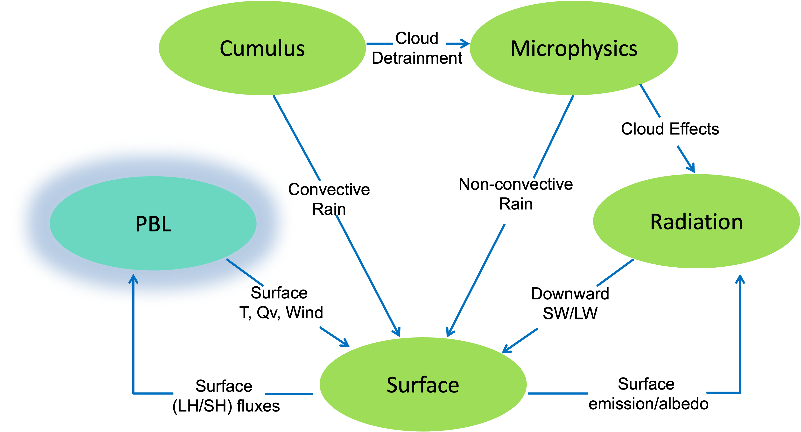

WRF Planetary Boundary Layer (PBL) schemes' purpose is to distribute surface fluxes with boundary layer eddy fluxes, and allow for PBL growth by entrainment. They are also responsible for any vertical mixing above the boundary layer.  

    * There are two different classes of PBL schemes:
        #. Turbulent kinetic energy prediction (Mellor-Yamada Janjic, MYNN, Bougeault-Lacarrere, TEMF, QNSE, and CAM UW). Some also include non-local mass-flux terms (QNSE-EDMF, MYNN, and TEMF)
        #. Diagnostic non-local (YSU, GFS, MRF, ACM2)
    * Above the PBL, all schemes also do vertical diffusion due to turbulence. 
    * PBL schemes can be used for most grid sizes when surface fluxes are present; however, at grid size dx << 1 km, this assumption breaks down. To get around this, you can use 3d diffusion instead of a PBL scheme (coupled to surface physics). This works best when dx and dz are comparable.
    * The lowest level should be in the surface layer (0.1h). This is important for surface (2m, 10m) diagnostic interpolation.
    * With ACM2, GFS, and MRF PBL schemes, the lowest full level should be .99 or .995 (not too close to 1).
    * TKE schemes and YSU can use thinner surface layers.
    * PBL schemes assume PBL eddies are not resolved.

|

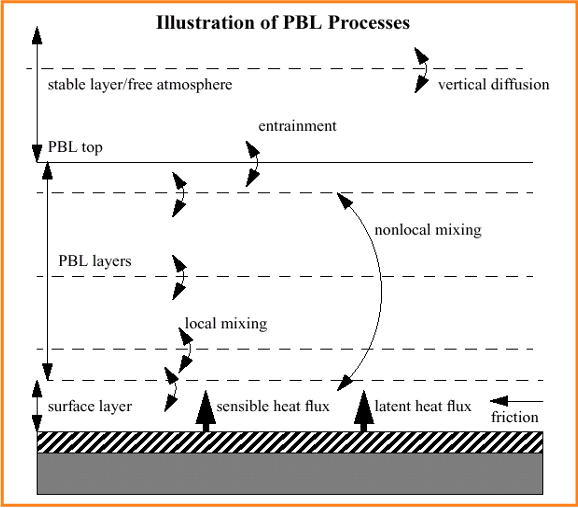

|

    .. note::
       See the `WRF Tutorial presentation on PBL`_ for additional details.

|

PBL Scheme Options
++++++++++++++++++

|

.. csv-table:: 
   :widths: 60, 40, 70, 55, 70, 50  
   :align: left 
   :header: "Scheme", "Option", "Works With |br| sfclay Option", "Prognostic Variables", "Diagnostic Variables", "Cloud Mixing"

   "YSU", 1, "1 91", none, exch_h, "QC QI"
   "MYJ", 2, 2, 4, "EL_PBL exch_h", "QC QI"
   "QNSE-EDMF", 4, TKE_PBL, "EL_PBL exch_h exch_m", "QC QI"
   "MYNN2", 5, "1 2 5 91", QKE, "Tsq Qsq Cov exch_h exch_m", QC
   "ACM2", 7, "1 7 91", " ", " ", "QC QI"
   "BouLac", 8, "1 2 91", TKE_PBL, "EL_PBL exch_h exch_m", QC
   "UW", 9, "1 2 91", TKE_PBL, "exch_h exch_m", QC
   "TEMF", 10, 10, TE_TEMF, "\*_temf", "QC QI"
   "Shin-Hong", 11, "1 91", " ", exch_h, "QC QI"
   "GBM", 12, "1 91", TKE_PBL, "EL_PBL exch_h exch_m", "QC QI"
   "EEPS", 16, "1 5 91 ", "PEK_PBL PEP_PBL", "exch_h exch_m", "QC QI"
   "KEPS", 17, "1 2", "TPE_PBL DISS_PBL TKE_PBL", "exch_h exch_m", "QC"
   "MRF", 99, "1 91", " ", " ", "QC QI"

|

PBL Scheme Details and References
+++++++++++++++++++++++++++++++++

**Yonsei University (YSU)** |br|
*bl_pbl_physics=1* |br|
Non-local-K scheme with explicit entrainment layer and parabolic K profile in unstable mixed layer; includes capability of topdown mixing for turbulence driven by cloud-top radiative cooling, which is separate from bottom-up surface-flux-driven mixing |br|
`Hong et al., 2006`_

Additional options specific for use with YSU:

    * **topo_wind** : =1 - topographic correction for surface winds to represent extra drag from sub-grid topography and enhanced flow at hill tops (`Jimenez and Dudhia, 2012`_); =2 - a simpler terrain variance-related correction
    * **ysu_topdown_pblmix=1** : option for top-down mixing driven by radiative cooling

|

**Mellor-Yamada-Janjic (MYJ)** |br|
*bl_pbl_physics=2* |br|
Eta operational scheme; one-dimensional prognostic turbulent kinetic energy scheme with local vertical mixing |br|
`Janjic, 1994`_ |br|
`Mesinger, 1993`_
 
|

**Quasi-Normal Scale Elimination (QNSE-EDMF)** |br|
*bl_pbl_physics=4* |br|
A TKE-prediction option that uses a new theory for stably-stratified regions; daytime part uses eddy diffusivity mass-flux method with shallow convection (mfshconv = 1); includes shallow convection using a mass-flux approach through the whole cloud-topped boundary layer |br|
`Sukoriansky et al., 2005`_

|

**Mellor-Yamada Nakanishi and Niino Level 2.5 (MYNN2)** |br|
*bl_pbl_physics=5* |br|
Predicts sub-grid TKE terms; includes shallow convection using a mass-flux approach through the whole cloud-topped boundary layer; includes a capability of top-down mixing for turbulence driven by cloud-top radiative cooling, which is separate from bottom-up surface-flux-driven mixing |br|
`Nakanishi and Niino, 2006`_ |br|
`Nakanishi and Niino, 2009`_ |br|
`Olson et al., 2019`_

Additional options specific for use with MYNN:

    * **icloud_bl=1** : option to couple subgrid-scale clouds from MYNN to radiation
    * **bl_mynn_cloudpdf** : =1 - `Kuwano et al., 2010`_ ; =2 - `Chaboureau and Bechtold, 2002`_ (with mods, default)
    * **bl_mynn_cloudmix=1** : mixing cloud water and ice (qnc and qni are mixed when scalar_pblmix=1)
    * **bl_mynn_edmf=1** : activate mass-flux in MYNN
    * **bl_mynn_mixlength** : =1 is from RAP/HRRR; =2 is from blending

|

**ACM2** |br| 
*bl_pbl_physics=7* |br|
Asymmetric Convective Model with non-local upward mixing and local downward mixing |br|
`Pleim, 2007`_

|

**BouLac** |br|                                               
*bl_pbl_physics=8* |br|
Bougeault-Lacarrère PBL; a TKE-prediction option; designed for use with BEP urban model |br|
`Bougeault, 1989`_

|

**UW** |br|                                               
*bl_pbl_physics=9* |br|
TKE scheme from CESM climate model; includes shallow convection using a mass-flux approach from the cloud base; includes capability of topdown mixing for turbulence driven by cloud-top radiative cooling, which is separate from bottom-up surface-flux-driven 
mixing |br|
`Bretherton and Park, 2009`_

|

**Total Energy - Mass Flux (TEMF)** |br|                                               
*bl_pbl_physics=10* |br|
Sub-grid total energy prognostic variable, plus mass-flux type shallow convection; includes shallow convection using a mass-flux approach through the whole cloud-topped boundary layer |br|
`Angevine et al., 2010`_

|

**Shin-Hong** |br|                                               
*bl_pbl_physics=11* |br|
Includes scale dependency for vertical transport in convective PBL; vertical mixing in the stable PBL and free atmosphere follows YSU; this scheme also has diagnosed TKE and mixing length output |br|
`Shin and Hong, 2015`_

|

**Grenier-Bretherton-McCaa (GBM)** |br|                                               
*bl_pbl_physics=12* |br|
A TKE scheme; tested in cloud-topped PBL cases; includes shallow convection using a mass-flux approach from the cloud base |br|
`Grenier and Bretherton, 2001`_

|

**TKE (E)-TKE dissipation rate (epsilon) (EEPS)** |br|
*bl_pbl_physics=16* |br|
This scheme predicts TKE, as well as TKE dissipation rate; it also advects both TKE and the dissipation rate; **Only works with sf_sfclay_physics options 1, 91, and 5** |br|
*No publication available*

|

**K-epsilon-theta^2 (KEPS)** |br|
*bl_pbl_physics=17* |br|
This scheme includes two additional prognostic equations for dissipation rate and temperature variance. |br|
`Zonato et al., 2022`_

|

**MRF** |br|                                               
*bl_pbl_physics=99* |br|
Older version of YSU (option 1) with implicit treatment of entrainment layer as part of non-local-K mixed layer |br|
`Hong and Pan, 1996`_

|

Additional PBL Options
++++++++++++++++++++++

**LES PBL** |br|
Settings for a large-eddy-simulation (LES) boundary layer:

    bl_pbl_physic = 0 |br|
    isfflx = 1 |br|
    sf_sfclay_physics = *any option, except 0* |br|
    sf_surface_physics = *any option, except 0* |br|
    diff_opt = 2 |br|
    km_opt = 2 or 3

This uses diffusion for vertical mixing. Alternative idealized ways of running the LES PBL are chosen with "isfflx = 0 or 2". It is best to use dx~dz, especially in the boundary layer, and avoid stretching to very large dz/dx aspect ratios at upper levels. This also tends to work better with continuous stretching to the top, rather than with fixed upper-level dz when dz >> dx. 

|

**SMS-3DTKE** |br|
This is a 3D TKE subgrid mixing scheme that is self-adaptive to the grid size between the large-eddy simulation (LES) and mesoscale limits (new since V4.2). It can be activated by setting 
  
    bl_pbl_physic = 0 |br|
    km_opt = 5 |br|
    diff_opt = 2 |br|
    sf_sfclay_physics = 1, 5, or 91

|

**Gravity Wave Drag** |br|
*gwd_opt* |br|
Can be used for all grid sizes with appropriate input fields from geogrid to represent sub-grid orographic gravity-wave vertical momentum transport

    * **=1** : (default); gravity wave drag and blocking; recommended for all grid sizes; includes the subgrid topography effects gravity wave drag and low-level flow blocking; input wind is rotated to the earth coordinate, and output is adjusted back to the projection domain - this enables the scheme to be used for all map projections supported by WRF; to apply this option, appropriate input fields from geogrid must be used; see the Selecting Static Data for the Gravity Wave Drag Scheme in the `WPS Chapter`_ of this guide for details.

    * **=3** : gravity wave drag, blocking, small-scale gravity drag and turbulent orographic form drag; similar to option 1, with an additional two subgrid-scale sources of orographic drag: one is small-scale GWD (`Tsiringakis et al., 2017`), which represents gravity wave propagation and breaking in and above stable boundary layers; the other is the turbulent orographic form drag of `Beljaars et al., 2004`_. Both are applicable down to a grid size of 1 km. Large-scale GWD and low-level flow blocking from gwd_opt=1 are properly adjusted for the horizontal grid resolution. More diagnostic fields from the scheme can be output by setting namelist option "gwd_diags=1." New GWD input fields are required from WPS.

|

**Fog** |br|
*grav_settling=2* |br|
Gravitational settling of fog/cloud droplets

|

PBL and Land Surface Time-step (bldt)
+++++++++++++++++++++++++++++++++++++
"bldt" is a namelist.input parameter used to determine the minutes between boundary layer and land-surface model calls. The typical value is 0 (every step), and this is reasonable for all schemes, with the exception of the CSM land-surface scheme. CSM LSM is expensive, so it may be better to consider increasing the value of bldt when using it.

|

Model Grid Spacing
++++++++++++++++++

|

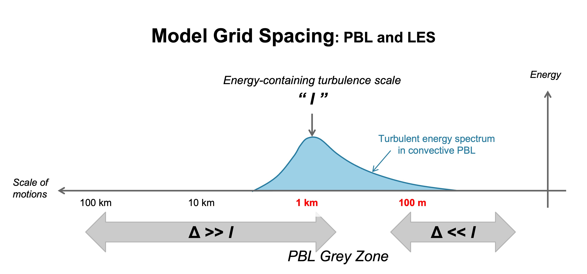

|

WRF PBL schemes are designed for grid resolution >> I in the image above, while LES schemes are designed for grid resolution << I. For coarse grid spacing, all eddies are sub-grid, and 1-D column schemes handle sub-grid vertical fluxes. For fine grid spacing, all major eddies are resolved, and 3-D turbulence schemes handle sub-grid mixing. 

The remaining grid-spacing is a grey-zone, which is sub-kilometer grids, where PBL and LES assumptions are not perfect. There are scale-aware schemes that can be used for this zone. 

    * Shin-Hong PBL based on YSU, designed for sub-kilometer transition scales (200 m – 1 km); nonlocal mass-flux and Kv term is reduce in strength as the grid size gets smaller and resolved mixing increases
    * New 3d TKE option (km_opt=5) in V4.2; becomes 3-D LES at fine scales; adds scale-dependent Shin-Hong nonlocal mass flux and implicit vertical diffusion at coarse grid sizes
    * Other schemes may work in this range but will not have correctly partitioned resolved/sub-grid energy fractions

For grid sizes up to about 100m, LES is preferable. 

|

Turbulence and Diffusion
++++++++++++++++++++++++
The namelist.input parameter "diff_opt" is used to specify the turbulence and mixing option. When diffusion is used with a PBL scheme, vertical diffusion is deactivated, so diff_opt only affects horizontal diffusion. 

    * **diff_opt=0** : no turbulence or explicit spatial numerical filters
    * **diff_opt=1** : (default); evaluates the 2nd-order diffusion term on coordinate surfaces; limited to constant vertical diffusion coefficient (kvdif); should not be used with calculated diffusion coefficient options (km_opt=2,3); can be used with PBL schemes that include vertical diffusion internally; horizontal diffusion acts along model levels; simple numerical method with only neighboring points on the same model level
    * **diff_opt=2** : evaluates mixing terms in physical space (stress form - x,y,z); strictly horizontal and better for complex terrain - avoids diffusion up and down slopes included in "diff_opt=1;" horizontal diffusion acts on strictly horizontal gradients; numerical method includes vertical correction term, using more grid points; for stability, diffusion strength is reduced in steep coordinate slopes (dz ~ dx)

|

**Recommended Diffusion Options** |br|

#. Real-data case with PBL option on
    * diff_opt=2
    * km_opt=4
    * Less diffusive in complex terrain (while diff_opt=1 diffuses along slopes)
    * These options compliment vertical diffusion done by the PBL scheme

#. High-resolution real-data cases (~100m grid)
    * No PBL scheme
    * diff_opt=2
    * km_opt=2 or 3 (TKE or Smagorinsky scheme)

#. Idealized cloud-resolving (dx= 1-3 km) modeling (smooth or no topography, no surface heat fluxes)
    * diff_opt=2
    * km_opt=2 or 3

|

|

|

|

|

Surface physics
---------------

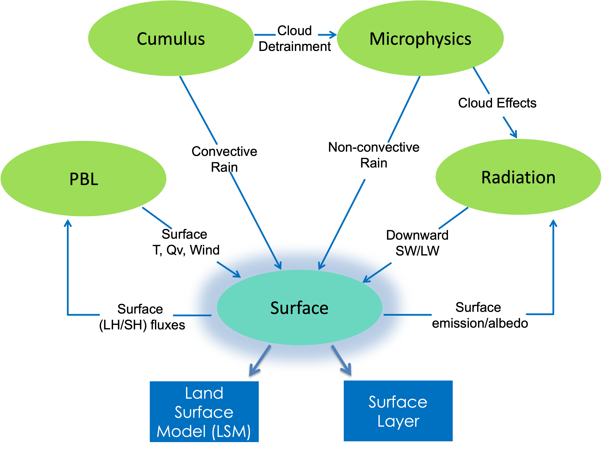

|

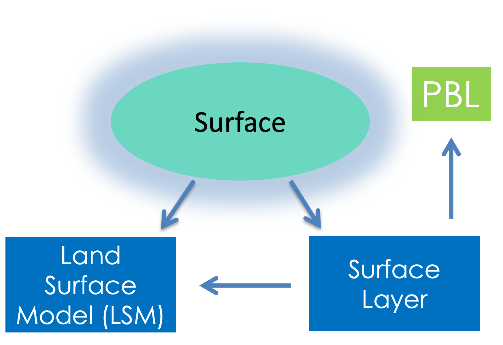

WRF surface physics consist of surface layer (sfclay) schemes and land surface model (LSM) schemes. Surface layer schemes determine surface layer diagnostics, which includes exchange and transfer coefficients. They provide these exchange coefficients for heat and moisture to the land surface model (LSM), which then provides land-surface fluxes of heat and moisture to the planetary boundary layer (PBL). The surface schemes also provide friction stress and water-surface fluxes of heat and moisture to the PBL. LSMs are responsible for soil temperature, moisture, snow prediction and sea-ice temperature.

|

    .. note::
       See the `WRF Tutorial presentation on surface physics`_ for additional details.

|

Surface Layer Schemes
+++++++++++++++++++++

|

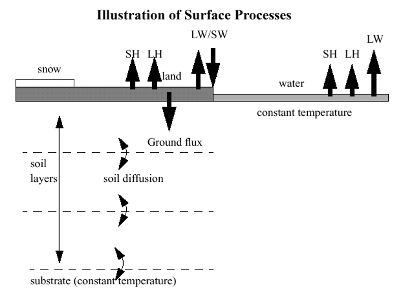

|

The surface layer has a constant flux layer of about 0.1 x PBL height (~100 m). The lowest WRF model level is found within this layer (typically 10-50 m). The WRF surface layer scheme is chosen by the namelist.input parameter "sf_sfclay_physics" in the &physics section. Some key points to note about WRF sfclay schemes is

    * They use similarity theory to determine exchange coefficients and diagnostics of 2m temperature, 2m qvapor, and 10m winds.
    * They provide exchange coefficient to land-surface models.
    * They provide friction velocity to the PBL scheme.
    * They provide surface fluxes over water points.
    * Schemes have variations in stability functions and roughness lengths.

|

Surface Layer Scheme Details and References
+++++++++++++++++++++++++++++++++++++++++++

**Revised MM5** |br|
*sf_sfclay_physics=1* |br|
Removes limits and uses updated stability functions; thermal and moisture roughness lengths (or exchange coefficients for heat and moisture) over the ocean use the COARE 3 formula (`Fairall et al., 2003`_) |br|
`Jimenez et al., 2012`_

|

**Eta Similarity** |br|
*sf_sfclay_physics=2* |br|
Used in Eta model; based on Monin-Obukhov with Zilitinkevich thermal roughness length and standard similarity functions from look-up tables |br|
`Monin and Obukhov, 1954`_ |br|
`Janjic, 1994`_ |br|
`Janjic, 1996`_ |br|
`Janjic, 2001`_

|

**QNSE** |br|
*sf_sfclay_physics=4* |br|
Quasi-Normal Scale Elimination PBL scheme’s surface layer option |br|
*No publication available*

|

**MYNN** |br|
*sf_sfclay_physics=5* |br|
Nakanishi and Niino PBL’s surface layer scheme |br|
*No publication available*

|

**Pleim-Xiu** |br|
*sf_sfclay_physics=7* |br|
`Pleim, 2006`_

|

**Total Energy - Mass Flux (TEMF)** |br|
*sf_sfclay_physics=10* |br|
`Angevine et al., 2010`_

|

**MM5 Similarity** |br|
*sf_sfclay_physics=91* |br|
Based on Monin-Obukhov, with Carslon-Boland viscous sub-layer and standard similarity functions from look-up tables  thermal and moisture roughness lengths (or exchange coefficients for heat and moisture) over ocean use the COARE 3 formula (`Fairall et al., 2003`_)  |br|
`Paulson, 1970`_ |br|
`Dyer and Hicks, 1970`_ |br|
`Webb, 1970`_ |br|
`Belijaars, 1994`_ |br|
`Zhang and Anthes, 1982`_

|

**Other Options Related to Surface Layer**

    * **iz0tlnd** : =1 - Chen-Zhang thermal roughness length over land, which depends on vegetation height (works with sf_sfclay_physics = 1, 91, and 5); =0 - original thermal roughness length in each sfclay option |br|
      `Chen and Zhang, 2009`_
    * **shalwater_z0=1** : Shallow-water roughness for offshore roughness adjustment in water depths less tha 100 m. This option works with a specified depth or real bathymetry input, and only with sf_sfclay_physics=1. The bathymetry data is available from the `WPS V4 Geographical Static Data Downloads Page`_. If no bathymetry data is available, set constant depth (in meters; must be positive) using namelist option "shalwater_depth." Any depths outside the range of 10-100 m are rounded to the nearest limit value. |br|
      `GEBCO Compilation Group, 2021`_ |br|
      `Jimenez and Dudhia, 2018`_

|

Land Surface Model
++++++++++++++++++
 
|

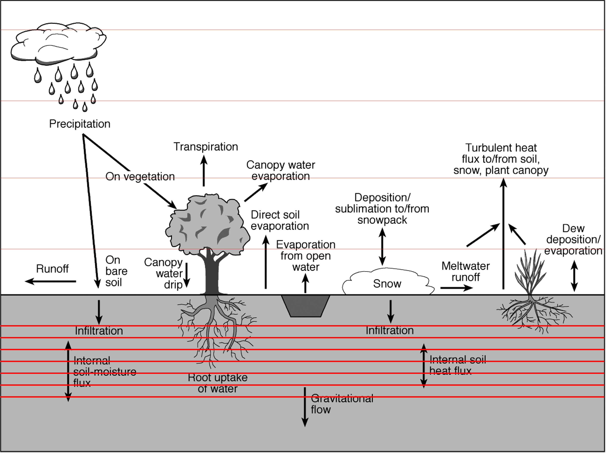

|

WRF LSM schemes are driven by surface energy and water fluxes. They predict soil temperature and soil moisture in 3 or 4 layers, depending on the scheme, as well as snow water equivalent on the ground. 

|

**Vegetation and Soil** |br|

LSMs consider the effects of vegetation and soil components, such as vegetation fraction, vegetation categories (e.g., cropland, forest types, etc.), and soil categories (e.g., sandy, clay, etc.). Below are some key notes. 

    * Processes include evapotranspiration, root zone, and leaf effects. 
    * Vegetation fraction varies seasonally.
    * Soil categories are considered for drainage and thermal conductivity.

|

**Snow Cover** |br|

LSMs include fractional snow cover and predict snow water equivalent development based on precipitation, sublimation, melting, and run-off. The number of layers is dependent on the scheme. 

    * Single-layer snow (Noah, PX)
    * Multi-layer snow (RUC, NoahMP, SSiB,CLM4)
    * 5-layer option has no snow prediction

*Note: Frozen soil water is also predicted by the Noah, NoahMP, RUC, and CLM4 schemes.*

|

**Urban Effects** |br|

An urban category in LSMs is typically adequate for larger-scale studies. An alternative is to use an urban model with either the Noah or NoahMP LSM scheme. To do this, set sf_urban_physics in namelist.input to one of the following options.

    * **=1** : Urban Canopy Model (UCM); single layer
    * **=2** : Building Environment Parameterization (BEP); multi-layer; *only works with YSU, MYJ and BouLac PBL schemes*
    * **=3** : Building Energy Model (BEM); adds heating and air-conditioning to BEP; *only works with YSU, MYJ and BouLac PBL schemes*

    .. note::
       * NUDAPT detailed map data is available for use in WPS, and includes data for 40+ U.S. cities.
       * Beginning with V4.3, code is updated to include a capability to use local climate zones, which is incorporated for all three urban applications (`additional details`_)

|

**LSM Tables** |br|

There are LSM tables (text files) available in both the test/em_real and run/ directories within the WRF code structure. These are set categories for the various LSMs, but these properties can be modified in the tables. 

    * **VEGPARM.TBL** : used by Noah and RUC for vegetation categories (albedo, roughness length, emissivity, vegetation properties)
    * **MPTABLE.TBL** : used by NoahMP
    * **SOILPARM.TBL** : used by Noah and RUC for soil properties
    * **LANDUSE.TBL** : used by the 5-layer model
    * **URBPARM.TBL** : used by urban models
 
|

**Initializing LSMs** |br|

All LSMs (except for the slab option) require the following additional fields for initialization.

    * Soil temperature
    * Soil moisture
    * Snow liquid equivalent
 
These fields are available in the Grib first-guess files, but do not come from observations. They come from "offline" models driven by observations for rainfall, radiation, surface temperature, humidity, and  wind. These are part of operational analysis or reanalysis system.

There are consistent model-derived data sets for Noah and RUC LSMs that correspond to the levels in WRF. 
    * Eta/GFS/AGRMET/NNRP for Noah (although some older data sets have limited soil levels available)
    * RUC for RUC (just North America; limited availability)

ECMWF/ERA soil analyses can be used and real.exe interpolates to WRF soil levels, but resolution of mesoscale land use means there is inconsistency in elevation, soil type and vegetation. The only adjustment for soil temperature takes place during the real.exe process, and addresses elevation differences between the original elevation and model elevation (SOILHGT used). Inconsistency leads to spin-up, as adjustments occur in soil temperature and moisture at the beginning of the simulation. This spin-up can only be avoided by running an offline model on the same grid (e.g. HRLDAS for Noah), but it may take months to spin up soil moisture. Cycling the land state between forecasts also helps, but may propagate errors (e.g in rainfall effect on soil moisture).

|

LSM Scheme Details and References
+++++++++++++++++++++++++++++++++

**5-layer thermal diffusion (SLAB)** |br|
*sf_surface_physics = 1* |br|
Soil temperature only scheme; uses five layers |br|
`Dudhia, 1996`_

|

**Noah** |br|
*sf_surface_physics = 2* |br|
Unified NCEP/NCAR/AFWA scheme with soil temperature and moisture in four layers; fractional snow cover and frozen soil physics |br|
`Tewari et al., 2004`_

    * A sub-tiling option can be activated by namelist option **sf_surface_mosaic=1**, and the number of tiles in a grid box is defined by namelist option **mosaic_cat**, with a default value of 3.

|

**RUC** |br|
*sf_surface_physics = 3* |br|
This model uses a layer approach to the solution of energy and moisture budgets. Atmospheric and soil fluxes are computed in the middle of the first atmospheric layer and the top soil layer, respectively, and these fluxes modify the heat and moisture storage in the layer spanning the ground surface. The RUC LSM uses 9 soil levels with higher resolution near the interface with the atmosphere. 

   .. note::
      *If initialized from the model with low resolution near the surface, like the Noah LSM, the top levels could be too moist causing moist/cold biases in the model forecast. Solution: cycle soil moisture and let it spin-up for several days to fit the vertical structure of RUC LSM.*

The prognostic variable for soil moisture is volumetric soil moisture content, minus the residual soil moisture tied to soil particles, and therefore not participating in moisture transport. The RUC LSM takes into account freezing and thawing processes in the soil. It is able to use explicit mixed-phase precipitation provided by cloud microphysics schemes. It uses a simple treatment of sea ice, which solves heat diffusion in sea ice and allows evolving snow cover on top of sea ice. In the warm season, RUC LSM corrects soil moisture in cropland areas to compensate for irrigation in these regions.

Snow accumulated on top of soil can have up to two layers, depending on snow depth (ref S16). When the snow layer is very thin, it is combined with the top soil layer to avoid excessive radiative cooling at night. The grid cell can be partially covered with snow, when snow water equivalent is below a threshold value of 3 cm. When this condition occurs, surface parameters, such as roughness length and albedo, are computed as a weighted average of snow-covered and snow-free areas. The energy budget utilizes an iterative snow melting algorithm. Melted water can partially refreeze and remain within the snow layer, and the rest of it percolates through the snow pack, infiltrates into soil and forms surface runoff. Snow density evolves as a function of snow temperature, snow depth and compaction parameters. Snow albedo is initialized from the maximum snow albedo for the given vegetation type, but it can also be modified, depending on snow temperature and snow fraction. To obtain a better representation of snow accumulated on the ground, the RUC LSM has introduced estimation of frozen precipitation density.

The most recent modifications to RUC LSM include refinements to the interception of liquid or frozen precipitation by the canopy, and also the "mosaic" approach for patchy snow with a separate treatment of energy and moisture budgets for snow-covered and snow-free portions of the grid cell, and aggregation of the separate solutions at the end of time step.

The data sets needed to initialize RUC LSM include: 

    * High-resolution data set for soil and land-use types
    * Climatological albedo for snow-free areas
    * Spatial distribution of maximum surface albedo in the presence of snow cover
    * Fraction of vegetation types in the grid cell to take into account sub-grid-scale heterogeneity in computation of surface parameters
    * Fraction of soil types within the grid cell
    * Climatological greenness fraction
    * Climatological leaf area index
    * Climatological mean temperature at the bottom of soil domain
    * Real-time sea-ice concentration
    * Real-time snow cover to correct cycled in RAP and HRRR snow fields

Recommended namelist options: |br|

    sf_surface_physics=3 |br|
    num_soil_layers=9 |br|
    usemonalb=.true. *(uses monthly albedo fields from geogrid instead of table values)* |br|
    rdlai2d=.true.  *(uses monthly LAI data from geogrid and is included in the "wrflowinp" file if sst_update=1)* |br|
    mosaic_lu=1 |br|
    mosaic_soil=1

    .. note::
       See RAP_ and HRRR_ that use RUC LSM as their land component.

`Benjamin et al., 2004`_ |br|
`Smirnova et al., 2016`_

|
 
**Noah-MP** |br|
*sf_surface_physics = 4* |br| 
Uses multiple options for key land-atmosphere interaction processes. Noah-MP contains a separate vegetation canopy defined by a canopy top and bottom with leaf physical and radiometric properties used in a two-stream canopy radiation transfer scheme that includes shading effects. Noah-MP contains a multi-layer snow pack with liquid water storage and melt/refreeze capability and a snow-interception model describing loading/unloading, melt/refreeze, and sublimation of the canopy-intercepted snow. Multiple options are available for surface water infiltration and runoff, and groundwater transfer and storage including water table depth to an unconfined aquifer. Horizontal and vertical vegetation density can be prescribed or predicted using prognostic photosynthesis and dynamic vegetation models that allocate carbon to vegetation (leaf, stem, wood and root) and soil carbon pools (fast and slow). |br|
`Niu et al., 2011`_ |br|
`Yang et al., 2011`_ |br|
`Noah-MP Technical Note (He et al., 2023)`

|

|

**Community Land Model Version 4 (CLM4)**
*sf_surface_physics = 5* |br| 
Contains sophisticated treatment of biogeophysics, hydrology, biogeochemistry, and dynamic vegetation. In CLM4, the land surface in each model grid cell is characterized into five primary sub-grid land cover types (glacier, lake, wetland, urban, and vegetated). The vegetated sub-grid consists of up to 4 plant functional types (PFTs) that differ in physiology and structure. The WRF input land cover types are translated into the CLM4 PFTs through a look-up table. The CLM4 vertical structure includes a single-layer vegetation canopy, a five-layer snowpack, and a ten-layer soil column. |br|
`Oleson et al., 2010`_ |br|
`Lawrence et al., 2011`_ |br|

*An earlier version of CLM has been quantitatively evaluated within WRF; referenced here:* |br|
`Jin and Wen, 2012`_ |br|
`Lu and Kueppers, 2012`_ |br|
`Subin et al., 2011`_

|

|

**Pleim-Xiu** |br|
*sf_surface_physics = 7* |br| 
Two-layer scheme with vegetation and sub-grid tiling; has been developed and improved over the years to provide realistic ground temperature, soil moisture, and surface sensible and latent heat fluxes in mesoscale meteorological models. The PX LSM is based on the ISBA model (`Noilhan and Planton, 1989`_), and includes a 2-layer force-restore soil temperature and moisture model. The top layer is 1 cm thick, and the lower layer is 99 cm. Grid aggregate vegetation and soil parameters are derived from fractional coverage of land use categories and soil texture types. There are two indirect nudging schemes that correct biases in 2-m air temperature and moisture by dynamic adjustment of soil moisture (`Pleim and Xiu, 2003`_) and deep soil temperature (`Pleim and Gilliam, 2009`_).

The PX LSM was primarily developed for retrospective simulation, where surface-based observations are available to inform the indirect soil nudging. While soil nudging can be disabled using the FDDA namelist.input setting **pxlsm_soil_nudge**, little testing has been done in this mode, although some users report reasonable results. `Gilliam and Pleim, 2010`_ discuss implementation in the WRF model and provide typical configurations for retrospective applications. To activate soil nudging the Obsgrid_ objective re-analysis utility must be used to produce a surface nudging file with the naming convention "wrfsfdda_d0*." The PX LSM uses 2-m temperature and mixing ratio re-analyses from this file for deep soil moisture and temperature nudging. To test PX LSM in forecast mode with soil nudging activated, forecasted 2-m temperature and mixing ratio can be used with empty observation files to produce "wrfsfdda_d0*" files, using Obsgrid, but results are tied to the governing forecast model.

    .. note::
       See a `detailed description of the PX LSM`_, including pros/cons, best practices, and recent improvements.

*Additional References:*
`Pleim and Xiu, 1995`_ |br|
`Xiu et al., 2001`_

|

**Simplified Simple Biosphere (SSiB)** |br|
*sf_surface_physics=8* |br|
This is the third generation of the Simplified Simple Biosphere Model, and is developed for land/atmosphere interaction studies in the climate model. The aerodynamic resistance values in SSiB are determined in terms of vegetation properties, ground conditions and bulk Richardson number according to the modified Monin-bukhov similarity theory. SSiB-3 includes three snow layers to realistically simulate snow processes, including destructive metamorphism, densification process due to snow load, and snow melting, which substantially enhances the model's ability for the cold season study. To use this option, ra_lw_physics and ra_sw_physics should be set to either 1, 3, or 4. The second full model level should be set to no larger than 0.982 so that the height of that level is higher than vegetation height.
`Xue et al., 1991`_ |br|
`Sun and Xue, 2001`_

|

**Other Options Related to LSM**

    * **ua_phys=.true.** : University of Arizona snow physics for use with Noah LSM |br|
        `Wang et al., 2010`_
    * **sf_surface_mosaic=1** : Sub-tiling option for use with Noah LSM |br|
        `Li et al., 2013`_

|

PBL and Land Surface Time-step (bldt)
+++++++++++++++++++++++++++++++++++++
"bldt" is a namelist.input parameter used to determine the minutes between boundary layer and land-surface model calls. The typical value is 0 (every step), and this is reasonable for all schemes, with the exception of the CSM land-surface scheme. CSM LSM is expensive, so it may be better to consider increasing the value of bldt when using it.

|

Model Grid Spacing
++++++++++++++++++

|

|

WRF PBL schemes are designed for grid resolution >> I in the image above, while LES schemes are designed for grid resolution << I. For coarse grid spacing, all eddies are sub-grid, and 1-D column schemes handle sub-grid vertical fluxes. For fine grid spacing, all major eddies are resolved, and 3-D turbulence schemes handle sub-grid mixing. 

The remaining grid-spacing is a grey-zone, which is sub-kilometer grids, where PBL and LES assumptions are not perfect. There are scale-aware schemes that can be used for this zone. 

    * Shin-Hong PBL based on YSU, designed for sub-kilometer transition scales (200 m – 1 km); nonlocal mass-flux and Kv term is reduce in strength as the grid size gets smaller and resolved mixing increases
    * New 3d TKE option (km_opt=5) in V4.2; becomes 3-D LES at fine scales; adds scale-dependent Shin-Hong nonlocal mass flux and implicit vertical diffusion at coarse grid sizes
    * Other schemes may work in this range but will not have correctly partitioned resolved/sub-grid energy fractions

For grid sizes up to about 100m, LES is preferable. 

|

Turbulence and Diffusion
++++++++++++++++++++++++
The namelist.input parameter "diff_opt" is used to specify the turbulence and mixing option. When diffusion is used with a PBL scheme, vertical diffusion is deactivated, so diff_opt only affects horizontal diffusion. 

    * **diff_opt=0** : no turbulence or explicit spatial numerical filters
    * **diff_opt=1** : (default); evaluates the 2nd-order diffusion term on coordinate surfaces; limited to constant vertical diffusion coefficient (kvdif); should not be used with calculated diffusion coefficient options (km_opt=2,3); can be used with PBL schemes that include vertical diffusion internally; horizontal diffusion acts along model levels; simple numerical method with only neighboring points on the same model level
    * **diff_opt=2** : evaluates mixing terms in physical space (stress form - x,y,z); strictly horizontal and better for complex terrain - avoids diffusion up and down slopes included in "diff_opt=1;" horizontal diffusion acts on strictly horizontal gradients; numerical method includes vertical correction term, using more grid points; for stability, diffusion strength is reduced in steep coordinate slopes (dz ~ dx)

|

**Recommended Diffusion Options** |br|

#. Real-data case with PBL option on
    * diff_opt=2
    * km_opt=4
    * Less diffusive in complex terrain (while diff_opt=1 diffuses along slopes)
    * These options compliment vertical diffusion done by the PBL scheme

#. High-resolution real-data cases (~100m grid)
    * No PBL scheme
    * diff_opt=2
    * km_opt=2 or 3 (TKE or Smagorinsky scheme)

#. Idealized cloud-resolving (dx= 1-3 km) modeling (smooth or no topography, no surface heat fluxes)
    * diff_opt=2
    * km_opt=2 or 3

|

Tropical Cyclone Options
++++++++++++++++++++++++
The following options, specific to tropical cyclone options, can be added to the &physics section of namelist.input.

**Ocean Mixed Layer Model** |br|
*sf_ocean_physics=1* |br|
Ocean Mixed Layer Model; 1-d slab ocean mixed layer (specified initial depth); includes wind-driven ocean mixing for SST cooling feedback |br|
`Pollard et al., 1973`_

|

**3d PWP Ocean** |br|
*sf_ocean_physics=2* |br|
3-d multi-layer (~100) ocean, salinity effects; fixed depth |br|
`Price, 1981`_ |br|
`Price et al., 1994`_ |br|
`Lee and Chen, 2012`_

|

**Alternative surface-layer option for high-wind ocean** |br|
*surface (isftcflx=1,2)* |br|
Modifies Charnock relation to give less surface friction at high winds (lower Cd); modifies surface enthalpy (Ck, heat/moisture) either with constant z0q (isftcflx=1) or Garratt formulation (isftcflx=2); *must be used with sf_sfclay_physics=1*

|

Fractional Sea Ice
++++++++++++++++++
The fractional sea ice option (**fractional_seaice=1**) includes input sea-ice fraction data that partitions land and water fluxes within a grid box, treating sea-ice as a fractional field. The option requires fractional sea-ice as input data; data sources may include those from GFS or the `National Snow and Ice Data Center`_; use **XICE** for the Vtable entry instead of SEAICE; this option works with sf_sfclay_physics = 1, 2, 5, and 7, and sf_surface_physics = 2, 3, and 7.

|

Sub-grid Mosaic
+++++++++++++++
Without using an additional sub-grid mosaic option, the default behavior is to use a single dominant vegetation and soil type per grid cell. However, the following schemes have additional options available.

    * Noah: use **sf_surface_mosaic=1** to allow multiple categories within a grid cell
    * RUC: use **mosaic_lu=1** and **mosaic_soil=1** to allow multiple categories within a grid cell
    * Pleim-Xu: additionally averages properties of sub-grid categories

|

Sea-surface Update
++++++++++++++++++
To use the sea-surface update option, set **sst_update=1** in the &physics section of namelist.input. This option reads a lower boundary file periodically to update the sea-surface temperature (as opposed to being fixed with time, which is default)
    
    * Should be used for long-period simulations (a week or more)
    * A file called **wrflowinp_d0n** is created by real
    * Sea-ice can be updated, as well
    * Vegetation fraction update is included; allows seasonal change in albedo, emissivity, and roughness length if using the Noah LSM
    * **usemonalb=.true.** to use monthly albedo input

|

Regional Climate Options
++++++++++++++++++++++++

    * **tmn_update=1** : Updates deep-soil temperature for multi-year future-climate runs
    * **sst_skin=1** : Adds a diurnal cycle to sea-surface temperature
    * **output_diagnostics=1** : Ability to output max/min/mean/std of surface fields in a specified period (e.g. daily)
    * **bucket_mm** and **bucket_J** : Provides a more accurate way to accumulate water and energy for long-run budgets (see the next section)

|

Accumulation Budgets
++++++++++++++++++++
    * Some outputs fields are accumulated from the start of the simulation
    * These include rainfall totals (mm or kg/m2) RAINC, RAINNC, and radiation totals (J/m2), ACLWUPT, ACSWDNB, etc.
    * Averages over any period can use just the output at the end minus output at the beginning, divided by the interval
    * For regional climate simulations (months), 32-bit accuracy makes adding small time-step values to accumulated totals inaccurate since only about 7 significant figures are stored.
    * Use **bucket_mm** and **bucket_J** to carry the total in integer and remainder parts, e.g.
          * Total rain = RAINC + I_RAINC*bucket_mm
    * Default bucket value is typical monthly accumulation
          * bucket_mm=100 mm and bucket_J=109 Joules

|

Lake Model
++++++++++
The CLM 4.5 lake model (**sf_lake_physics=1**) was obtained from the ommunity Land Model version 4.5 (CLM4) with some modifications. It is a one-dimensional mass and energy balance scheme with 20-25 model layers, including up to 5 snow layers on the lake ice, 10 water layers, and 10 soil layers on the lake bottom. The lake scheme is used with actual lake points and lake depth derived from the WPS, and can also be used with user-defined lake points and lake depth in WRF (**lake_min_elev** and **lakedepth_default**). The lake scheme is independent of a land surface scheme and therefore can be used with any land surface scheme embedded in WRF. |br| 
`Gu et al., 2013`_ |br|
`Subin et al., 2012`_

There are also global bathymetry data available for most large lakes. This can be obtained from the `WPS Geographical Static Data Downloads`_ web page, and can be used during the WPS/geogrid process. 

|

WRF-Hydro
+++++++++
This capability couples the WRF model with hydrology processes (such as routing and channeling). It requires a separate compile by setting the environment variable WRF_HYDRO. In a c-shell environment, issue |br|
``setenv WRF_HYDRO 1`` |br|
or in a bash environment, issue |br|
``export WRF_HYDRO=1`` |br|
before configure and compile. Once WRF is compiled, copy files from the hydro/Run/ directory to your working directory (e.g. test/em_real/). This option requires a specail initialization for hydrological data sets. Please refer to the `RAL WRF-Hydro Modeling System`_ web page for detailed information.

|

|

Using Physics Suites
--------------------
A WRF physics suite is a set of physics options that performs well for a given application and is supported by a sponsoring group. Suites may offer guidance to users in applying WRF, improve understanding of model performance, and facilitate model advancement.  

When running WRF, a suite of physics schemes can be set by using the **physics_suite** namelist option. The physics options covered by this suite specification are: 
    
    mp_physics |br|
    cu_physics |br|
    bl_pbl_physics |br|
    sf_sfclay_physics |br|
    sf_surface_physics |br|
    ra_sw_physics |br|
    ra_lw_physics
    
There are currently 2 available approved physics suite options: the NCAR Convection-permitting Suite (CONUS), and the NCAR Tropical Suite (tropical) that can be specified in the &physics section of the namelist.input file. By simply setting the "physics_suite" namelist parameter, the included physics schemes are assumed and, therefore, the specific schemes (e.g., mp_physics, cu_physics, etc.) do not need to be set. These two suites consist of a combination of physics options that have been highly tested and have shown reasonable results.

A summary of the physics schemes used in the simulation are printed to the WRF output log (e.g., rsl.out.0000). 

|

NCAR Convection-permitting Suite
++++++++++++++++++++++++++++++++
**physics_suite='CONUS'** |br|

Real-time forecasting focused on convective weather over the contiguous U.S.

|

.. csv-table:: 
   :widths: 70, 50, 50  
   :align: left 
   :header: "Physics Type", "Scheme Name", "Namelist Option"

   Microphysics, Thompson, mp_physics=8 
   Cumulus, Tiedtke, cu_physics=6
   Longwave Radiation, RRTMG, ra_lw_physics=4
   Shortwave Radiation, RRTMG, ra_sw_physics=4
   PBL, MYJ, bl_pbl_physics=2
   Surface Layer, MYJ, sf_sfclay_physics=2
   LSM, Noah, sf_surface_physics=2

|

    .. note::
       See `NCAR Convection-permitting Physics Suite for WRF` for additional details.

|

NCAR Tropical Suite
+++++++++++++++++++
**physics_suite='tropical'** |br|

Real-Time forecasting focused on tropical storms and tropical convection

|

    .. note::
       This is the same as the "mesoscale_reference" suite in the MPAS model.

|

.. csv-table:: 
   :widths: 70, 50, 50  
   :align: left 
   :header: "Physics Type", "Scheme Name", "Namelist Option"

   Microphysics, WSM6, mp_physics=6 
   Cumulus, New Tiedtke, cu_physics=16
   Longwave Radiation, RRTMG, ra_lw_physics=4
   Shortwave Radiation, RRTMG, ra_sw_physics=4
   PBL, YSU, bl_pbl_physics=1
   Surface Layer, MM5, sf_sfclay_physics=91
   LSM, Noah, sf_surface_physics=2

|

    .. note::
       See `NCAR Tropical Physics Suite for WRF` for additional details.

|

Overriding Physics Suite Options
++++++++++++++++++++++++++++++++
To override any of the above options, simply add that particular parameter to the namelist. 

**Example 1** : You wish to use the CONUS suite but would like to turn off cu_physics for domain 3 (note: a setting of "-1" means the default setting is used):

.. code-block::

   physics_suite = 'CONUS' |br|
   cu_physics = -1, -1, 0

|

**Example 2** : You wish to use the CONUS suite but would like to use a different cu_physics option, and to turn cu_physics off for domain 3:

.. code-block::

   physics_suite = 'CONUS'
   cu_physics = 2, 2, 0

|

|

Other Specific Applications
---------------------------

The following applications are discussed below. Click any link to go directly to that application.

        * :ref:`Tropical Storms and Cyclones`
        * :ref:`Long Simulations`
        * :ref:`Windfarm`
        * :ref:`Surface Irrigation Parameterization`
        * :ref:`WRF-Solar`
        * :ref:`MAD-WRF`
        * :ref:`Physics Sensitivity Options`

|

|

.. _Tropical Storms and Cyclones:

Tropical Storms and Cyclones
++++++++++++++++++++++++++++
Options to use for tropical storms and tropical cyclone/typhoon/hurricane applications

    * **sf_ocean_physics=1** : simple 1-D ocean mixed layer model following that of `Pollard et al., 1972`_. Two other namelist options are available to specify the initial mixed layer depth (although one may ingest real mixed layer depth data) (oml_hml0) and a temperature lapse rate below the mixed layer (oml_gamma). This option works with all sf_surface_physics options.

        * oml_hml0 : Ocean mixed-layer depth; a setting **< 0** initializes with real-time ocean mixed depth, and setting the value to **=0** initializes with climatological ocean mixed depth. 
        * oml_gamma : oml deep water lapse rate (K m-1)

    * **sf_ocean_physics=2** : 3D Price-Weller-Pinkel (PWP) ocean model based on `Price et al., 1994`_. This model predicts horizontal advection, pressure gradient force, and mixed layer processes. Only simple initialization via namelist variables ocean_z, ocean_t, and ocean_s is available.

        * ocean_z : vertical profile of layer depths for ocean (in meters)
        * ocean_t : vertical profile of ocean temps (K)
        * ocean_s : vertical profile of salinity

        For e.g., 

        .. code-block::
       
                 &physics
                 sf_ocean_physics = 2

                 &domains
                 ocean_z =  5.,       15.,       25.,       35.,       45.,       55.,
                            65.,       75.,       85.,       95.,      105.,      115.,
                            125.,      135.,      145.,      155.,      165.,      175.,
                            185.,      195.,      210.,      230.,      250.,      270.,
                            290.,      310.,      330.,      350.,      370.,      390.
                 ocean_t = 302.3493,  302.3493,  302.3493,  302.1055,  301.9763,  301.6818,
                           301.2220,  300.7531,  300.1200,  299.4778,  298.7443,  297.9194,
                           297.0883,  296.1443,  295.1941,  294.1979,  293.1558,  292.1136,
                           291.0714,  290.0293,  288.7377,  287.1967,  285.6557,  284.8503,
                           284.0450,  283.4316,  283.0102,  282.5888,  282.1674,  281.7461
                 ocean_s =  34.0127,   34.0127,   34.0127,   34.3217,   34.2624,   34.2632,
                            34.3240,   34.3824,   34.3980,   34.4113,   34.4220,   34.4303,
                            34.6173,   34.6409,   34.6535,   34.6550,   34.6565,   34.6527,
                            34.6490,   34.6446,   34.6396,   34.6347,   34.6297,   34.6247,
                            34.6490,   34.6446,   34.6396,   34.6347,   34.6297,   34.6247

|

    * **isftcflx** : Modify surface bulk drag (Donelan) and enthalpy coefficients to be more in line with recent research results of those for tropical storms and hurricanes. This option includes dissipative heating term in heat flux. It is only available for sf_sfclay_physics=1. There are two options for computing enthalpy coefficients: 
          
            * isftcflx=1: constant Z0q for heat and moisture
            * isftcflx = 2 Garratt formulation, slightly different forms for heat and moisture

|

.. _Long Simulations:

Long Simulations
++++++++++++++++

* **tmn_update=1** : update deep soil temperature
* **sst_skin=1** : calculate skin SST based on `Zeng and Beljaars, 2005`_
* **bucket_mm=1** : bucket reset value for water equivalent precipitation accumulations (value in mm, -1=inactive)
* **bucket_J**: bucket reset value for energy accumulations (value in Joules, -1=inactive); only works with CAM and RRTMG radiation options (ra_lw_physics = 3, 4, 14, 24 and ra_sw_physics = 3, 4, 14, 24)
* To drive the WRF model with climate data that does not include a leap year, prior to compiling WRF, edit the configure.wrf file by adding **-DNO_LEAP_CALENDAR** to the macro "ARCH_LOCAL."

|

.. _Windfarm:

Windfarm
++++++++

**windfarm_opt=1** |br|

Wind turbine drag parameterization scheme. It represents sub-grid effects of specified turbines on wind and TKE fields. The physical charateristics of the wind farm is read-in from a file; use of the manufacturer's specification is recommeded. An example of the file is provided in "run/wind-turbine-1.tbl." The location of the turbines are read-in from the file "windturbines.txt." See "README.windturbine" in the WRF/doc/ directory for more detail. *This option only works with 2.5 level MYNN PBL option (bl_pbl_physics=5).*

|

.. _Surface Irrigation Parameterization:

Surface Irrigation Parameterization
+++++++++++++++++++++++++++++++++++
Three irrigation schemes added in V4.2 allow representation of surface irrigation processes within the model, with explicit control over water amount and timing (for more information refer to `Vira et al., 2019`_). The schemes are set in the "&physics" namelist and represent different techniques, depending on the water evaporative loss in the application process. The evaporative processes consider loss from:

    * **sf_surf_irr_scheme=1** : surface evapotranspiration; *only works with Noah-LSM*
    * **sf_surf_irr_scheme=2** : leaves/canopy interception and surface evapotranspiration
    * **sf_surf_irr_scheme=3** : microphysics process, leaves/canopy interception and surface evapotranspiration

The daily irrigation water amount applied is defined in "irr_daily_amount" (mm/day). The period within the day for the application starts at "irr_start_hours" UTC and lasts for "irr_num_hours." The period within the year where irrigation is applied is defined by Julian days within "irr_start_julianday" and "irr_end_julianday." To account for greater than daily irrigation intervals "irr_freq" can be set to a value greater than 1; thus water applied in the active day within the "irr_freq" period is ( irr_daily_amount * irr_freq ). "irr_ph" regulates spatial activation of irrigation (with irr_freq >1), especially determining whether it is activated for all domains on the same day (irr_ph = 0). Two options are given for irr_ph not equal to 0:

    * **irr_ph=1** : activation field as a function of ( i , j , IRRIGATION)
    * **irr_ph=2** : activation field is created with the fortran RANDOM function

Given the possibility of multiple nests in WRF, irrigation schemes should run on only one domain for each simulation. This ensures the water application is not repeated and is consistent to the irr_daily_amount calculated. For additional information regarding the code changes, see `GitHub Code Commit 9bd5b61d9a`_.

Example of irrigation namelist parameters for a two domain case:

.. code-block::

    sf_surf_irr_scheme    =  0, 1
    irr_daily_amount      =  0, 8
    irr_start_hour        =  0, 14
    irr_num_hours         =  0, 2
    irr_start_julianday   =  0, 121
    irr_end_julianday     =  0, 170
    irr_ph                =  0, 0
    irr_freq              =  0, 3

|

These settings use the channel method to irrigate the inner domain starting at 14 UTC for 2 hours, with a value of 8mm/day. Irrigation starts on Julian day 121 and ends on Julian day 170. Water is applied to the entire inner domain for all irrigated grid-points simultaneously, every 3 days (irr_freq=3). This leads to an hourly irrigation of 12 mm/h (daily application of 24 mm), which is then multiplied by the irrigation percentage within the grid-cell (given by the IRRIGATION field processed in WPS).

|

.. _WRF-Solar:

WRF-Solar
+++++++++

WRF-Solar is a specific configuration and augmentation of the basic WRF model specifically designed for specialized numerical forecast products for solar energy applications. For additional information and instructions for use, visit the NCAR Research Applications Laboratory's `WRF-Solar site`_. 

        .. note::
           WRF-Solar is managed and supported by the NCAR/RAL group. All support inquiries should go through the `WRF-Solar forum`_, and should not be posted in the WRF & MPAS-A Support Forum.

|

.. _MAD-WRF:

MAD-WRF
+++++++

The MAD-WRF model is designed to improve the cloud analysis and solar irradiance short-range forecast. There are two options to run MAD-WRF:

        #. madwrf_opt = 1: The initial hydrometeors are advected and diffused with the model dynamics without accounting for any microphysical processes. Users should set mp_physics = 96 and use_mp_re = 0 in the physics block of namelist.input.
        #. madwrf_opt = 2: There is a set of hydrometeor tracers that are advected and diffused with the model dynamics. At initial time the tracers are equal to the standard hydrometeors. During the simulation the standard hydrometeors are nudged toward the tracers. The namelist variable madwrf_dt_nudge sets the temporal period for hydrometeor nudging [min]. Namelist madwrf_dt_relax sets the relaxation time for hydrometeor nudging [s].

MAD-WRF has an option to enhance cloud initialization. To turn on (off) cloud initialization, set the namelist variable madwrf_cldinit=1 (0). By default the model enhances cloud analysis based on the analyzed relative humidity. 
Users can enhance cloud initialization by providing additional variables to metgrid via the WPS intermediate format:

        #. Cloud mask (CLDMASK variable): Remove clouds if clear (cldmask = 0)
        #. Cloud mask (CLDMASK variable) + brightness temperature (BRTEMP variable) sensitive to hydrometeor content (e.g. GOES-R channel 13):

                * Remove clouds if clear (cldmask = 0)
                * Reduce / extend cloud top heights to match observations
                * Add clouds over clear sky regions (cldmask = 1)

        #. Cloud top height (CLDTOPZ variable) with 0 values over clear sky regions:

                * Remove clouds if clear (cldmask = 0)
                * Reduce / extend cloud top heights to match observations
                * Add clouds over clear sky regions (cldmask = 1)

        #. Either 2 or 3 + the cloud base height (CLDBASEZ variable):

                * Remove clouds if clear (cldmask = 0)
                * Reduce / extend cloud top / base heights to match observations

        .. note::
           Missing values in any of these variables should be set to -999.9

|

.. _Physics Sensitivity Options:

Physics Sensitivity Options
+++++++++++++++++++++++++++

* **no_mp_heating=1** : turns off latent heating from microphysics. When using this option, cu_physics should be set to 0.
* **icloud=0** : turns off cloud effect on optical depth in shortwave/longwave radiation options 1 and 4. Note, this namelist also controls which cloud fraction method to use for radiation.
* **isfflx=0** : turns off both sensible and latent heat fluxes from the surface. This option works for sf_sfclay_physics = 1, 5, 7, 11.
* **ifsnow=0** : turns off snow effect in sf_surface_physics=1.

|

|

|

|

.. _`additional details`: https://ral.ucar.edu/sites/default/files/public/product-tool/urban-canopy-model/WRF_urban_update_Readme_file_WRF4.3.pdf
.. _`Alapaty et al., 2012`: https://doi.org/10.1029/2012GL054031
.. _`Angevine et al., 2010`: https://doi.org/10.1175/2010MWR3142.1
.. _`Arakawa et al., 2004`: https://doi.org/10.1175/1520-0442(2004)017%3C2493:RATCPP%3E2.0.CO;2
.. _`Bae et al., 2018`: https://doi.org/10.1007%2Fs13143-018-0066-3
.. _`Baek, 2017`: https://doi.org/10.1002/2017MS000994
.. _`Bechtold et al., 2001`: https://journals.ametsoc.org/view/journals/clim/27/20/jcli-d-13-00718.1.xml#bib2
.. _`Belijaars, 1994`: https://doi.org/10.1002/qj.49712152203
.. _`Beljaars et al., 2004`: https://doi.org/10.1256/qj.03.73
.. _`Benjamin et al., 2004`: https://doi.org/10.1175/1520-0493(2004)132%3C0473:MWPWTF%3E2.0.CO;2
.. _`Berg et al., 2013`: https://doi.org/10.1175/MWR-D-12-00136.1
.. _`black carbon aerosol category`: https://www2.mmm.ucar.edu/wrf/users/physics/mp28_updated_new.html
.. _`Bougeault, 1989`: https://doi.org/10.1175/1520-0493(1989)117%3C1872:POOITI%3E2.0.CO;2
.. _`Bretherton and Park, 2009`: https://doi.org/10.1175/2008JCLI2556.1
.. _`Chaboureau and Bechtold, 2002`: https://doi.org/10.1175/1520-0469(2002)059%3C2362:ASCPDF%3E2.0.CO;2
.. _`Chen and Zhang, 2009`: https://doi.org/10.1029/2009GL037980
.. _`Chou and Suarez, 1994`: http://citeseerx.ist.psu.edu/viewdoc/download?doi=10.1.1.26.4850&rep=rep1&type=pdf
.. _`Chou and Suarez, 1999`: https://ntrs.nasa.gov/citations/19990060930
.. _`Chou et al., 2001`: https://ntrs.nasa.gov/citations/20010072848
.. _`Chen and Sun, 2002`: https://doi.org/10.2151/jmsj.80.99
.. _`Collins et al., 2004`: https://www.cesm.ucar.edu/models/atm-cam/docs/description/description.pdf
.. _`Deng et al., 2003`: https://doi.org/10.1175/1520-0469(2003)060%3C0034:ASCPFM%3E2.0.CO;2
.. _`detailed description of the PX LSM`: http://www2.mmm.ucar.edu/wrf/users/docs/PX-ACM.pdf
.. _`Dudhia, 1989`: https://doi.org/10.1175/1520-0469(1989)046%3C3077:NSOCOD%3E2.0.CO;2 
.. _`Dudhia, 1996`: https://www.researchgate.net/profile/Jimy-Dudhia/publication/259865197_A_Multi-layer_Soil_Temperature_Model_for_MM5/links/0046352e307710e99c000000/A-Multi-layer-Soil-Temperature-Model-for-MM5.pdf
.. _`Dyer and Hicks, 1970`: https://doi.org/10.1002/qj.49709641012
.. _`Fairall et al., 2003`: https://doi.org/10.1175/1520-0442(2003)016%3C0571:BPOASF%3E2.0.CO;2
.. _`Fels and Schwarzkopf, 1981`: https://doi.org/10.1029/JC086iC02p01205
.. _`Fu and Liou, 1992`: https://doi.org/10.1175/1520-0469(1992)049%3C2139:OTCDMF%3E2.0.CO;2
.. _`GEBCO Compilation Group, 2021`: https://www.bodc.ac.uk/data/published_data_library/catalogue/10.5285/c6612cbe-50b3-0cff-e053-6c86abc09f8f
.. _`Gilliam and Pleim, 2010`: https://doi.org/10.1175/2009JAMC2126.1
.. _`Gilmore et al. (2004)` : https://doi.org/10.1175/MWR2810.1
.. _`GitHub Code Commit 9bd5b61d9a`: https://github.com/wrf-model/WRF/commit/9bd5b61d9a
.. _`Glotfelty et al., 2019`: https://doi.org/10.1175/MWR-D-18-0267.1
.. _`Grell, 1993`: https://doi.org/10.1175/1520-0493(1993)121%3C0764:PEOAUB%3E2.0.CO;2
.. _`Grell and Devenyi, 2002`: https://doi.org/10.1029/2002GL015311
.. _`Grell and Freitas, 2014`: https://acp.copernicus.org/articles/14/5233/2014/
.. _`Grenier and Bretherton, 2001`: https://doi.org/10.1175/1520-0493(2001)129%3C0357:AMPPFL%3E2.0.CO;2
.. _`Gu et al., 2011`: https://doi.org/10.1029/2010JD014574
.. _`Gu et al., 2013`: https://link.springer.com/article/10.1007/s10584-013-0978-y
.. _`Hong and Pan, 1996`: https://doi.org/10.1175/1520-0493(1996)124%3C2322:NBLVDI%3E2.0.CO;2
.. _`Han and Pan, 2011`: https://doi.org/10.1175/WAF-D-10-05038.1
.. _`Hong et al., 2004`: https://doi.org/10.1175/1520-0493(2004)132%3C0103:ARATIM%3E2.0.CO;2
.. _`Hong et al., 2006`: https://doi.org/10.1175/MWR3199.1
.. _`Hong and Jang, 2018`: https://doi.org/10.1007/s13143-018-0013-3
.. _`Hong and Lim, 2006`: https://www.researchgate.net/profile/Song-You-Hong/publication/331192569_Hongandlim-JKMS-2006/links/5c6b581f92851c1c9dea9d10/Hongandlim-JKMS-2006.pdf?_sg%5B0%5D=started_experiment_milestone&origin=journalDetail
.. _HRRR: https://rapidrefresh.noaa.gov/hrrr/HRRR.
.. _`Iacono et al., 2008`: https://doi.org/10.1029/2008JD009944
.. _`Janjic, 1994`: https://doi.org/10.1175/1520-0493(1994)122%3C0927:TSMECM%3E2.0.CO;2
.. _`Janjic, 1996`: https://www2.mmm.ucar.edu/wrf/users/physics/phys_refs/SURFACE_LAYER/eta_part3.pdf
.. _`Janjic, 2001`: https://repository.library.noaa.gov/view/noaa/11409
.. _`Jensen et al., 2017`: https://doi.org/10.1175/JAS-D-16-0350.1
.. _`Jimenez et al., 2012`: https://doi.org/10.1175/MWR-D-11-00056.1
.. _`Jimenez and Dudhia, 2012`: https://doi.org/10.1175/JAMC-D-11-084.1
.. _`Jimenez and Dudhia, 2018`: https://doi.org/10.1175/JAMC-D-17-0137.1
.. _`Jin and Wen, 2012`: https://doi.org/10.1029/2011JD016980
.. _`Kain, 2004`: https://doi.org/10.1175/1520-0450(2004)043%3C0170:TKCPAU%3E2.0.CO;2
.. _`Kain and Fritsch, 1990`: https://doi.org/10.1175/1520-0469(1990)047%3C2784:AODEPM%3E2.0.CO;2
.. _`Kessler, 1969`: https://doi.org/10.1007/978-1-935704-36-2_1
.. _`Khain et al., 2010`: https://doi.org/10.1175/2009JAS3210.1
.. _`Khain et al., 2004`: https://doi.org/10.1175/JAS-3350.1
.. _`Kuwano et al., 2010`: https://doi.org/10.1002/qj.660
.. _`Kwon and Hong, 2017`: https://doi.org/10.1175/MWR-D-16-0034.1
.. _`Lawrence et al., 2011`: https://doi.org/10.1029/2011MS00045 
.. _`Lee and Chen, 2012`: doi:10.1175/JAS-D-12-046.1
.. _`Li et al., 2013`: https://doi.org/10.1002/2013JD02065
.. _`Lim and Hong, 2010`: https://doi.org/10.1175/2009MWR2968.1
.. _`Lin and Colle, 2011`: https://doi.org/10.1175/2010MWR3293.1
.. _`Lu and Kueppers, 2012`: https://doi.org/10.1029/2011JD016991
.. _`Ma and Tan, 2009`: https://doi.org/10.1016/j.atmosres.2008.09.022
.. _`Mansell et al., 2010`: https://doi.org/10.1175/2009JAS2965.1
.. _`Matsui et al., 2018`: https://doi.org/10.1007/s00382-018-4187-2
.. _`Mesinger, 1993`: https://www2.mmm.ucar.edu/wrf/users/physics/phys_refs/PBL/MYJ_part2.pdf
.. _`Milbrandt and Yau, 2005 (Part I)`: https://doi.org/10.1175/JAS3534.1
.. _`Milbrandt and Yau, 2005 (Part II)`: https://doi.org/10.1175/JAS3535.1
.. _`Mlawer et al., 1997`: https://doi.org/10.1029/97JD00237
.. _`Monin and Obukhov, 1954`: https://moodle2.units.it/pluginfile.php/267453/mod_resource/content/1/ABL_lecture_13.pdf
.. _`Morrison et al., 2009`: https://doi.org/10.1175/2008MWR2556.1
.. _`Morrison and Milbrandt, 2015`: https://doi.org/10.1175/JAS-D-14-0065.1
.. _`Nakanishi and Niino, 2006`: https://doi.org/10.1007/s10546-005-9030-8
.. _`Nakanishi and Niino, 2009`: https://doi.org/10.2151/jmsj.87.895
.. _`National Snow and Ice Data Center`: https://nsidc.org/
.. _`NCAR Convection-permitting Physics Suite for WRF`: https://www2.mmm.ucar.edu/wrf/users/physics/ncar_convection_suite.php
.. _`NCAR Tropical Physics Suite for WRF`: https://www2.mmm.ucar.edu/wrf/users/physics/ncar_tropical_suite.php 
.. _`Niu et al., 2011`: https://doi.org/10.1029/2010JD015139
.. _`NOAA, 2001`: http://www.emc.ncep.noaa.gov/mmb/mmbpll/eta12tpb/
.. _`Noah-MP Technical Note (He et al., 2023)`: https://opensky.ucar.edu/islandora/object/technotes:599
.. _`Noilhan and Planton, 1989`: https://doi.org/10.1175/1520-0493(1989)117%3C0536:ASPOLS%3E2.0.CO;2
.. _Obsgrid: https://www2.mmm.ucar.edu/wrf/users/docs/user_guide_v4/v4.2/users_guide_chap7.html
.. _`Oleson et al., 2010`: https://d1wqtxts1xzle7.cloudfront.net/44532695/Technical_Description_of_version_4.0_of_20160408-23450-1lwj9zc-with-cover-page-v2.pdf?Expires=1665619677&Signature=LLxHTun6ZR7rMW87nBTqgEWtA9AstcWdJa~sNhWVF0OPK7uLtgH8effNGt0ZrvdDpp4URljLdF-dW7Bhobr0fp5CB-Loxdh6xlOoDi-ymvmQ3MFVkqOcL~ha6~uzvowZZBtPpa4eUVwaeHHECNwpdovOpHbSQIQWBFYCC5fP3KUEtpirLRZz~vRK29jIVd17Bd8GUSvax8qsXKX-5qck6B4EUCeU7xdiW649EorUVmfrkJHCVk13ICRDTD~mgCpfPFDn6-mgVA7Kv-hYqrODqGDlXFy-ziL4cxfdgbQbB4Vl3W~Hp5tyBH3uNWUJeM4aIggVzvqtCWldrYhovUHfqQ__&Key-Pair-Id=APKAJLOHF5GGSLRBV4ZA
.. _`Olson et al., 2019`: https://doi.org/10.25923/n9wm-be49
.. _`Pan et al., 1995`: https://repository.library.noaa.gov/view/noaa/11429
.. _`Park et al., 2009`: https://doi.org/10.1175/2008JCLI2557.1
.. _`Paulson, 1970`: https://doi.org/10.1175/1520-0450(1970)009%3C0857:TMROWS%3E2.0.CO;2
.. _`Pleim, 2007`: https://doi.org/10.1175/JAM2539.1
.. _`Pleim, 2006`: https://doi.org/10.1175/JAM2339.1
.. _`Pleim and Gilliam, 2009`: https://doi.org/10.1175/2009JAMC2053.1
.. _`Pleim and Xiu, 1995`: https://doi.org/10.1175/1520-0450-34.1.16
.. _`Pleim and Xiu, 2003`: https://doi.org/10.1175/1520-0450(2003)042%3C1811:DOALSM%3E2.0.CO;2
.. _`Pollard et al., 1972`: https://doi.org/10.1080/03091927208236105
.. _`Pollard et al., 1973`: https://doi.org/10.1080/03091927208236105
.. _`Price, 1981`: https://doi.org/10.1175/1520-0485(1981)011%3C0153:UORTAH%3E2.0.CO;2
.. _`Price et al., 1994`: https://doi.org/10.1175/1520-0485(1994)024%3C0233:FSRTAM%3E2.0.CO;2
.. _qr_acr_qg_mp38V1.dat: http://www2.mmm.ucar.edu/wrf/src/wrf_files/qr_acr_qg_mp38V1.dat
.. _`RAL WRF-Hydro Modeling System`: http://www.ral.ucar.edu/projects/wrf_hydro
.. _RAP: https://rapidrefresh.noaa.gov/RAP
.. _`Shin and Hong, 2015`: https://doi.org/10.1175/MWR-D-14-00116.1
.. _`Smirnova et al., 2016`: https://doi.org/10.1175/MWR-D-15-0198.1
.. _`Subin et al., 2012`: https://doi.org/10.1029/2011MS000072
.. _`Subin et al., 2011`: https://doi.org/10.1175/2010EI331.1
.. _`Sukoriansky et al., 2005`: https://doi.org/10.1007/s10546-004-6848-4
.. _`Sun and Xue, 2001`: https://doi.org/10.1007/BF02919314
.. _`Tao et al., 1989`: https://doi.org/10.1175/1520-0493(1989)117%3C0231:AIWSA%3E2.0.CO;2
.. _`Tao et al., 2016`: https://doi.org/10.1002/2015JD023986
.. _`Tegen et al., 1997`: https://doi.org/10.1029/97JD01864
.. _`Tewari et al., 2004`: https://ams.confex.com/ams/84Annual/techprogram/paper_69061.htm
.. _`Thompson et al., 2008`: https://doi.org/10.1175/2008MWR2387.1
.. _`Tiedtke, 1989`: https://doi.org/10.1175/1520-0493(1989)117%3C1779:ACMFSF%3E2.0.CO;2
.. _`Thompson and Eidhammer, 2014`: https://doi.org/10.1175/JAS-D-13-0305.1
.. _`Tsai and Chen, 2020`: https://doi.org/10.1175/JAS-D-19-0125.1
.. _`Tsiringakis et al., 2017`: https://doi.org/10.1002/qj.3021
.. _`User's Guide to the CAM-5.1`: https://www.cesm.ucar.edu/models/cesm1.0/cam/docs/ug5_1/ug.html
.. _`Vira et al., 2019`: https://doi.org/10.5194/gmd-2019-233
.. _`Wang et al., 2010`: https://doi.org/10.1029/2009JD013761
.. _`Webb, 1970`: https://doi.org/10.1002/qj.49709640708
.. _`WPS Chapter`: ./wps.rst
.. _`WPS V4 Geographical Static Data Downloads Page`: https://www2.mmm.ucar.edu/wrf/users/download/get_sources_wps_geog.html
.. _`WPS Geographical Static Data Downloads`: https://www2.mmm.ucar.edu/wrf/users/download/get_sources_wps_geog.html
.. _`WRF-Solar forum`: https://forum.mmm.ucar.edu/forums/wrf-solar.112/
.. _`WRF-Solar site`: https://ral.ucar.edu/solutions/products/wrf-solar
.. _`WRF Tutorial presentation on Cumulus Parameterization`: https://www2.mmm.ucar.edu/wrf/users/tutorial/presentation_pdfs/202101/dudhia_physics_cumulus.pdf
.. _`WRF Tutorial presentation on Microphysics`: https://www2.mmm.ucar.edu/wrf/users/tutorial/presentation_pdfs/202101/dudhia_physics_microphysics.pdf
.. _`WRF Tutorial presentation on PBL`: https://www2.mmm.ucar.edu/wrf/users/tutorial/presentation_pdfs/202101/dudhia_physics_pbl_turbulence.pdf
.. _`WRF Tutorial presentation on Radiation`: https://www2.mmm.ucar.edu/wrf/users/tutorial/presentation_pdfs/202101/dudhia_physics_radiation.pdf
.. _`WRF Tutorial presentation on surface physics`: https://www2.mmm.ucar.edu/wrf/users/tutorial/presentation_pdfs/202101/dudhia_physics_surface.pdf
.. _`Xie et al., 2016`: https://doi.org/10.1016/j.solener.2016.06.003
.. _`Xiu et al., 2001`: https://doi.org/10.1175/1520-0450(2001)040%3C0192:DOALSM%3E2.0.CO;2
.. _`Xue et al., 1991`: https://doi.org/10.1175/1520-0442(1991)004%3C0345:ASBMFG%3E2.0.CO;2
.. _`Yang et al., 2011`: https://doi.org/10.1029/2010JD015140
.. _`Zeng and Beljaars, 2005`: https://doi.org/10.1029/2005GL023030
.. _`Zhang et al., 2011`: https://doi.org/10.1175/MWR-D-10-05091.1
.. _`Zhang and Anthes, 1982`: https://doi.org/10.1175/1520-0450(1982)021%3C1594:AHRMOT%3E2.0.CO;2
.. _`Zhang and McFarlane, 1995`: https://doi.org/10.1080/07055900.1995.9649539
.. _`Zhang and Wang, 2017`: https://doi.org/10.1175/JCLI-D-16-0597.1
.. _`Zheng et al., 2016`: https://doi.org/10.1175/MWR-D-15-0005.1
.. _`Zonato et al., 2022`: https://journals.ametsoc.org/view/journals/mwre/150/8/MWR-D-21-0299.1.xml

