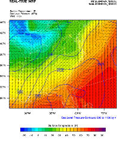

WRF Post-processing
===================

.. role:: underline
    :class: underline

.. role:: nlnote
    :class: nlnote

.. role:: nlheader
    :class: nlheader

There are a number of visualization tools available to display WRF model output data, which are typically in netCDF format, but not always. The following post-processing utilities are supported.

        * NCL
        * wrf-python
        * RIP
        * ARWpost *(converter to GrADS)*
        * UPP
        * VAPOR

        .. note::
           NCL, wrf-python, RIP, ARWpost and VAPOR can only read data in netCDF format, while UPP can read data in netCDF and binary format.

|

**Required Software**

The only library that is always required is the netCDF package from Unidata_: login > Downloads > netCDF *(registration login required)*. NetCDF stands for "Network Common Data Form." This format is platform independent (i.e., data files can be read on both big-endian and little-endian computers, regardless of where the file was created). To use netCDF libraries, ensure that the paths to these libraries are set correctly in the login scripts as well as in all Makefiles.

Additional libraries may be required by each of the supported post-processing packages. Those are discussed below.

|

NCAR Command Language (NCL)
---------------------------

WRF output can easily by dispayed with the use of NCL_ Libraries. Some `example scripts`_ are available online, but must be adapted to individual case specifics. NCL can process WRF static, input, and output files, as well as WRFDA output data. Both single and double precision data can be processed.

|br|

WRF and NCL
+++++++++++
        * WRF-NCL processing scripts are incorporated into the NCL Libraries, thus only the NCL Libraries are needed.
        * NCL versions prior to version 6.1.0 are not recommended, as they do not contain major WRF-related upgrades necessary for many of the NCL functions. 
        * Special :ref:`functions` are provided to simplify the plotting of WRF data. These functions are located in *$NCARG_ROOT/lib/ncarg/nclscripts/wrf/WRFUserARW.ncl*. This file can be modified to accommodate specific needs. 
                .. note::
                   If users wish to edit this file, but do not have write permission, they should copy the file to a local directory, edit and load the new version, when running NCL scripts.

        * Special `NCL built-in functions`_ are included in the NCL libraries to help calculate basic diagnostics for WRF data.
        * All `Fortran subroutines`_ used for diagnostics and interpolation are coded into NCL in-line functions. This means users do not need to compile these routines.

|

What is NCL?
++++++++++++
The NCAR Command Language (NCL) is a free, interpreted language designed specifically for scientific data processing and visualization. It is able to read netCDF, HDF4, HDF4-EOS, GRIB, binary and ASCII data. The graphics are world-class and highly customizable.

It runs on many different operating systems including Solaris, AIX, IRIX, Linux, MacOSX, Dec Alpha, and Cygwin/X running on Windows. The `NCL binaries`_ are freely available for download.

See `Overview of NCL`_ for additional information.

|

Required Software
+++++++++++++++++
NCL libraries, version 6.1.0+

|

Environment Variable
++++++++++++++++++++
Set the environment variable *NCARG_ROOT* to the location where the NCL libraries are installed. For e.g., (for cshrc shell):

.. code-block::

        setenv NCARG_ROOT /usr/local/ncl

|

.hluresfile
+++++++++++
Create a file called *.hluresfile* in the *$HOME* directory. This file controls the color, background, fonts, and basic size of plots. See `.hluresfile documentation`_ for additional information.

|br|

        .. note::
           This file must reside in the $HOME directory and not where NCL will be run.

|

Below is the *.hluresfile* used in the `example scripts`_ mentioned above. The appearance of plots can differ based on which color table is used. These particular settings can be used by copying the following to the *~/.hluresfile* directory. If interested, take a look at the `color differences in plots`_.

|br|

.. code-block::

        *wkColorMap : BlAqGrYeOrReVi200
        *wkBackgroundColor : white
        *wkForegroundColor : black
        *FuncCode : ~
        *TextFuncCode : ~
        *Font : helvetica
        *wkWidth : 900
        *wkHeight : 900

|br|

        .. note::
           If an image has a black background with white lettering, .hluresfile has not been created correctly, or is in the wrong location. "wkColorMap" is set in .hluresfile, and can be overwritten in any NCL script with the use of the function "gsn_define_colormap," so .hluresfile does not need to be modified to change the color map for a single plot.

|

Create NCL Scripts
++++++++++++++++++
Below is the basic outline for any NCL script.

.. code-block::

        load external functions and procedures

        begin
             ; Open input file(s)
             ; Open graphical output
             ; Read variables
             ; Set up plot resources & Create plots
             ; Output graphics
        end

|br|

For example the below code can be used to create a script to plot surface temperature, sea level pressure and wind (as is shown in the picture below).

|br|

|br|

.. code-block::
      
        ; load functions and procedures
        load "$NCARG_ROOT/lib/ncarg/nclscripts/csm/gsn_code.ncl"
        load "$NCARG_ROOT/lib/ncarg/nclscripts/wrf/WRFUserARW.ncl"
         
        begin
         
        ; WRF ARW input file (NOTE, your wrfout file does not need
        ; the .nc, but NCL needs it so make sure to add it in the
        ; line below)
        a = addfile("../wrfout_d01_2000-01-24_12:00:00.nc","r")
         

        ; Output on screen. Output will be called "plt_Surface1"
        type = "x11"
        wks = gsn_open_wks(type,"plt_Surface1")

        ; Set basic resources
        res = True
        res@MainTitle = "REAL-TIME WRF"          ; Give plot a main title
        res@Footer = False                              ; Set Footers off
        pltres = True                                ; Plotting resources
        mpres = True                                      ; Map resources

        ;---------------------------------------------------------------
        times = wrf_user_getvar(a,"times",-1))    ; get times in the file
        it = 0                            ; only interested in first time
        res@TimeLabel = times(it)            ; keep some time information

        ;---------------------------------------------------------------
        ; Get variables

        slp = wrf_user_getvar(a,"slp",it)                         Get slp
           wrf_smooth_2d( slp, 3 )                           ; Smooth slp
        t2 = wrf_user_getvar(a,"T2",it)                  ; Get T2 (deg K)
           tc2 = t2-273.16                             ; Convert to deg C
           tf2 = 1.8*tc2+32.                           ; Convert to deg F
           tf2@description = "Surface Temperature"
           tf2@units = "F"

        u10 = wrf_user_getvar(a,"U10",it)                       ; Get U10
        v10 = wrf_user_getvar(a,"V10",it)                       ; Get V10
           u10 = u10*1.94386                           ; Convert to knots
           v10 = v10*1.94386
           u10@units = "kts"
           v10@units = "kts"

        ;---------------------------------------------------------------

        ; Plotting options for T
        opts = res                                  ; Add basic resources
        opts@cnFillOn = True                                ; Shaded plot
        opts@ContourParameters = (/ -20., 90., 5./)   ; Contour intervals
        opts@gsnSpreadColorEnd = -3
        contour_tc = wrf_contour(a,wks,tf2,opts)            ; Create plot
        delete(opts)

        ; Plotting options for SLP
        opts = res                                  ; Add basic resources
        opts@cnLineColor = "Blue"                        ; Set line color
        opts@cnHighLabelsOn = True                           ; Set labels
        opts@cnLowLabelsOn = True
        opts@ContourParameters = (/ 900.,1100.,4./)   ; Contour intervals
        contour_psl = wrf_contour(a,wks,slp,opts)           ; Create plot delete(opts)

        ; Plotting options for Wind Vectors
        opts = res                                  ; Add basic resources
        opts@FieldTitle = "Winds"             ; Overwrite the field title
        opts@NumVectors = 47                      ; Density of wind barbs
        vector = wrf_vector(a,wks,u10,v10,opts)             ; Create plot
        delete(opts)

        ; MAKE PLOTS
        plot = wrf_map_overlays(a,wks,  \
              (/contour_tc,contour_psl,vector/),pltres,mpres)

        ;---------------------------------------------------------------

        end

|

Run NCL Scripts
+++++++++++++++
        #. Ensure NCL is successfully installed.
        #. Ensure that the environment variable *NCARG_ROOT* is set to the location where NCL is installed on the system. 
        #. Create an NCL plotting script, or use an existing script as a template.
        #. Run the NCL script: ``>ncl  NCL_script``

The output type created is controlled by the line:

.. code-block::

        wks = gsn_open_wk (type,"Output")    ;  inside the NCL script

where type can be *x11, pdf, ncgm, ps*, or *eps*.

|br|

For high quality images, create pdf, ps, or eps images directly via the ncl scripts (*type = pdf / ps / eps*).

See the `WRF Utilities and Tools`_ chapter of this guide for additional information regarding other types of graphical formats and conversions between graphical formats.

|

.. _functions:

WRFUserARW.ncl Functions
++++++++++++++++++++++++

The *WRFUserARW.ncl* file is found in the *$NCARG_ROOT/lib/ncarg/nclscripts/wrf/* directory, where the following functions are available.

|

:underline:`wrf_user_getvar (nc_file,fld,it)`

**Usage** : ``ter = wrf_user_getvar (a, "HGT", 0)``

Obtain any of the following *time* fields from a netCDF file.

        * any specific time, by setting it to the time required.
        * all times in the input file(s), by setting it = -1
        * a list of times from the input file(s), by setting it to *(/start_time,end_time,interval/)* ( e.g. (/0,10,2/) ).
        * A list of times from the input file(s), by setting it to the list required ( e.g. (/1,3,7,10/) ).

Any field available in the netCDF file can be extracted.

*fld* is case sensitive. The policy adapted during development was to set all diagnostic variables calculated by NCL, to lower-case to distinguish them from fields directly available from the netCDF files.

**List of Available Diagnostics**

.. csv-table::
   :widths: 20, 80
   :width: 100%

   **avo**, Absolute Vorticity [10-5 s-1]
   **pvo**, Potential Vorticity [PVU]
   **eth**,  Equivalent PotentialTtemperature [K]
   **cape_2d**, Returns 2D fields mcape/mcin/lcl/lfc
   **cape_3d**, Returns 3D fields cape/cin
   **dbz**, Reflectivity [dBZ]
   **mdbz**, Maximum Reflectivity [dBZ]
   **geopt/geopotential**, Full Model Geopotential [m2 s-2]
   **helicity**, Storm Relative Helicity [m-2/s-2]
   **updraft_helicity**, Updraft Helicity [m-2/s-2]
   **lat**, Latitude (returns either XLAT or XLAT_M - depending on which is available)
   **lon**, Longitude (returns either XLONG or XLONG_M -  depending on which is available)
   **omg**, Omega
   **p/pres**, Full Model Pressure [Pa]
   **pressure**, Full Model Pressure [hPa]
   **pw**, Precipitable Water
   **rh2**, 2m Relative Humidity [%]
   **rh**, Relative Humidity [%]
   **slp**, Sea Level Pressure [hPa]
   **ter**, Model Terrain Height [m] (returns either HGT or HGT_M -  depending on which is available)
   **td2**, 2m Dew Point Temperature [C]
   **td**, Dew Point Temperature [C]
   **tc**, Temperature [C]
   **tk**, Temperature [K]
   **th/theta**, Potential Temperature [K]
   **tv**, Virtual Temperature
   **twb**, Wetbulb Temperature
   **times**, Times in file (note this return strings - recommended)
   **Times**, Times in file (note this return characters)
   **ua**, U component of wind on mass points
   **va**, V component of wind on mass points
   **wa**, W component of wind on mass points
   **uvmet10**, 10m U and V components of wind rotated to earth coordinates
   **uvmet**, U and V components of wind rotated to earth coordinates
   **z/height**, Full Model Height [m]

|

:underline:`wrf_contour (nc_file, wks, data, res)`

**Usage** : ``contour = wrf_contour (a, wks, ter, opts)``

Returns a graphic (contour). 

        * This graphic is only created, but not plotted to a *wks*, which enables generation and overlaying multiple graphics before plotting the resulting picture to the wks.
        * The returned graphic (contour) does not contain map information, and can therefore be used for both real and idealized data cases.
        * This function can plot both line contours and shaded contours. Default is line contours.

|br| 

Several resources are set, and most can be overwritten. Below is a list of resources to consider changing before generating graphics:

|br|

.. csv-table::
   :width: 100%
   :class: nlnote

   "**Resources Unique to WRF-ARW Model Data**"

.. csv-table::
   :widths: 30, 70 
   :width: 100%

   **opts@MainTitle**, "Controls main title on the plot"
   **opts@MainTitlePos**, "Main title position - Left/Right/Center (default is left)"
   **opts@NoHeaderFooter**, "Switch off all Headers and Footers"
   **opts@Footer**, "Add some model information to the plot as a footer (default is True)"
   **opts@InitTime**, "Plot initial time on graphic (default is True); if True the initial time is extracted from the input file"
   **opts@ValidTime**, "Plot valid time on graphic (default is True); a user must set **opts@TimeLabel** to the correct time"
   **opts@TimeLabel**, "Time to plot as valid time"
   **opts@TimePos**, "Time position - Left/Right (default is Right)"
   **opts@ContourParameters**, "A single value is treated as an interval; three values represent: Start End and Interval"
   **opts@FieldTitle**, "Overwrite the field title - if not set the field description is used for the title"
   **opts@UnitLabel**, "Overwrite the field units - seldom needed as the units associated with the field will be used"
   **opts@PlotLevelID**, "Use to add level information to the field title"

|

.. csv-table::
   :width: 100%
   :class: nlnote

   "**General NCL Resources** *(most standard NCL options for 'cn' and 'lb' can be set by the user to overwrite the default values)*"

.. csv-table::
   :widths: 30, 70 
   :width: 100%

   **opts@cnFillOn**, "Set to True for shaded plots (default is False)"
   **opts@cnLineColor**, "Color of line plot"
   **opts@lbTitleOn**, "Set to False to switch the title on the label bar off (default is True)"
   "**opts@cnLevelSelectionMode** |br| **opts @cnLevels** |br| **opts@cnFillColors** |br| **optr@cnConstFLabelOn**", "Can be used to set contour levels and colors manually"

|

:underline:`wrf_vector(nc_file, wks, data_u, data_v, res)`

**Usage** : ``vector = wrf_vector (a, wks, ua, va, opts)``

Returns a graphic (vector) of the data. 

        * This graphic is only created, but not plotted to a *wks*, which enables generation and overlaying multiple graphics before plotting the resulting picture to the wks. 
        * The returned graphic (vector) does not contain map information, and can therefore be used for both real and idealized data cases.
        * Several resources are set, and most can be overwritten. Below is a list of resources to consider changing before generating graphics:

|br|

.. csv-table::
   :width: 100%
   :class: nlnote

   "**Resources Unique to WRF-ARW Model Data**" 

.. csv-table::
   :widths: 30, 70
   :width: 100%

   **opts@MainTitle**, "Controls main title on the plot"
   **opts@MainTitlePos**, "Main title position - Left/Right/Center (default is Left)"
   **opts@NoHeaderFooter**, "Switch off all Headers and Footers"
   **opts@Footer**, "Add some model information to the plot as a footer (default is True)"
   **opts@InitTime**, "Plot initial time on graphic (default is True); if True the initial time will be extracted from the input file."
   **opts@ValidTime**, "Plot valid time on graphic (default is True); a user must set opts@TimeLabel to the correct time"
   **opts@TimeLabel**, "Time to plot as valid time"
   **opts@TimePos**, "Time position - Left/Right (default is Right)"
   **opts@ContourParameters**, "A single value is treated as an interval; three values represent - 'Start' 'End' and 'Interval'"
   **opts@FieldTitle**, "Overwrite the field title - if not set the field description is used for the title"
   **opts@UnitLabel**, "Overwrite the field units - seldom needed as the units associated with the field will be used"
   **opts@PlotLevelID**, "Use to add level information to the field title"
   **opts@NumVectors**, "Density of wind vectors"

.. csv-table::
   :width: 100%
   :class: nlnote

   "**General NCL Resources** *(most standard NCL options for 'vc' can be set by the user to overwrite the default values)*"

.. csv-table::
   :widths: 25, 40
   :width: 100%

   **opts@vcGlyphStyle**, "Wind style (WindBarb is default)"

|

:underline:`wrf_map_overlays (nc_file, wks, (/graphics/), pltres, mpres)`

**Usage** : ``plot = wrf_map_overlays (a, wks, (/contour,vector/), pltres, mpres)``

Overlays contour and vector plots generated with *wrf_contour* and *wrf_vector*. 

        * Can overlay any number of graphics. 
        * Overlays are done in the order given, so always list shaded plots before line or vector plots to ensure the lines and vectors are visible and not hidden behind the shaded plot.

A map background is automatically added to the plot. Map details are controlled with the *mpres* resource. The following are commonly-set map resources:

.. code-block::

        mpres@mpGeophysicalLineColor
        mpres@mpNationalLineColor
        mpres@mpUSStateLineColor
        mpres@mpGridLineColor
        mpres@mpLimbLineColor
        mpres@mpPerimLineColor

|br|

Other useful options:

.. csv-table::
   :widths: 30, 70
   :width: 100%

   **mpres@ZoomIn = True**, "Allows zooming-in to the plot"
   "**mpres@Xstart** |br| **mpres@Xend** |br| **mpres@Ystart** |br| **mpres@Yend**", "Set to the corner x/y positions of the zoomed plot when ``mpres@ZoomIn = True``"
   **pltres@NoTitles**, "Set to True to remove all field titles on a plot"
   **pltres@CommonTitle**, "Overwrite field titles with a common title for the overlaid plots - must set ``pltres@PlotTitle`` to desired new plot title"
   **pltres@PanelPot**, "Set to True to generate images for a panel plot"
   **pltres@FramePlot**, "set to False to add text/lines to the plot before advancing the frame; add text/lines directly after the call to the *wrf_map_overlays* function; then advance the frame with the command ``frame (wks)``"

|

:underline:`wrf_overlays (nc_file, wks, (/graphics/), pltres)`

**Usage** : ``plot = wrf_overlays (a, wks, (/contour,vector/), pltres)``

Overlays contour and vector plots generated with *wrf_contour* and *wrf_vector*. 

        * Can overlay any number of graphics. 
        * Overlays are done in the order given, so always list shaded plots before line or vector plots to ensure the lines and vectors are visible and not hidden behind the shaded plot. 
        * This option is typically used for idealized data or cross-sections, which does not have map background information.

|

.. csv-table::
   :widths: 30, 70
   :width: 100%

   **pltres@NoTitles**, "Set to True to remove all field titles on a plot"
   **pltres@CommonTitle**, "Overwrite field titles with a common title for the overlaid plots; must set ``pltres@PlotTitle`` to desired new plot title"
   **pltres@PanelPot**, "Set to True to generate images for a panel plot"
   **pltres@FramePlot**, "Set to False to add text/lines to the plot before advancing the frame; add text/lines directly after the call to the *wrf_overlays* function; then advance the frame with the command ``frame (wks)``"

|

:underline:`wrf_map (nc_file, wks, res)`

**Usage** : ``map = wrf_map (a, wks, opts)``

Creates a map background. As maps are added to plots automatically via the *wrf_map_overlays* function, this function is seldom needed as a stand-alone.

|

:underline:`wrf_user_intrp3d (var3d, H, plot_type, loc_param, angle, res)`

This function is used for both horizontal and vertical interpolation.

|

.. csv-table::
   :widths: 30, 70
   :width: 100%
   :escape: '

   **var3d**, "The variable to interpolate; this can be an array of up to 5 dimensions; the 3 right-most dimensions must be bottom_top x south_north x west_east"
   **H**, "The field to interpolate to; either pressure (hPa or Pa) or z (m); dimensionality must match var3d"
   **plot_type**, Use *\"h"* for horizontally-interpolated plots and *\"v"* for vertically-interpolated plots
   **loc_param**, Can be a scalar or an array holding either 2 or 4 values |br| |br| For ``plot_type = \"h"`` |br| This is a scalar representing the level to interpolate to. |br| Must match the field to interpolate to (H) |br| When interpolating to pressure this can be in hPa or Pa (e.g. 500. to interpolate to 500 hPa). When interpolating to height this must in in m (e.g. 2000. to interpolate to 2 km).  |br| |br| For ``plot_type = \"v"`` |br| This can be a pivot point though which a line is drawn - in this case a single x/y point (2 values) is required. Or this can be a set of x/y points (4 values) indicating start x/y and end x/y locations for the cross-section.
   **angle**, Set to 0. for *plot_type=\"h\"* or for *plot_type=\"v\"* when start and end locations of cross-section are supplied in loc_param. If a single pivot point was supplied in loc_paramangle is the angle of the line that passes through the pivot point (where: 0. is SN and 90. is WE)
   **res**, Set to False for *plot_type=\"h"* or for *plot_type=\"v"* when a single pivot point is supplied. Set to True if start and end locations are supplied.

|

:underline:`wrf_user_intrp2d (var2d, loc_param, angle, res)`

This function interpolates a 2D field along a given line.

|

.. csv-table::
   :widths: 30, 70
   :width: 100%
   :escape: '

   **var2d**, The 2D field to interpolate. This can be an array of up to 3 dimensions. The 2 right-most dimensions must be south_north x west_east.
   **loc_param**, An array holding either 2 or 4 values. This can be a pivot point though which a line is drawn - in this case a single x/y point (2 values) is required.  Or this can be a set of x/y points (4 values) indicating start x/y and end x/y locations for the cross-section.
   **angle**, Set to 0 when start and end locations of the line are supplied in loc_param. If a single pivot point is supplied in loc_param angle is the angle of the line that passes through the pivot point. Where: 0. is SN and 90. is WE.
   **res**, Set to False when a single pivot point is supplied. Set to True if start and end locations are supplied.

|

:underline:`wrf_user_ll_to_ij (nc_file, lons, lats, res)`

**Usage** : ``loc = wrf_user_latlon_to_ij (a, 100., 40., res)`` |br|
**Usage** : ``loc = wrf_user_latlon_to_ij (a, (/100., 120./), (/40., 50./), res)``

Converts a lon/lat location to the nearest x/y location. 

        * This function makes use of map information to find the closest point; therefore this returned value may potentially be outside the model domain. 
        * lons/lats can be scalars or arrays.

|br|

Optional resources:

.. csv-table::
   :widths: 30, 70
   :width: 100%

   **res@returnInt**, "If set to False the return values will be real (default is True with integer return values)"
   **res@useTime**, "Default is 0; set if you want the reference longitudes and latitudes to come from a specific time - one uses this for moving nest output which has been stored in a single file"

|br|

        .. note::
           loc(0,:) represents the x (WE) locations, and loc(1,:) the y (SN) locations.

|

:underline:`wrf_user_ij_to_ll (nc_file, i, j, res)`

**Usage** : ``loc = wrf_user_latlon_to_ij (a, 10, 40, res)`` |br|
**Usage** : ``loc = wrf_user_latlon_to_ij (a, (/10, 12/), (/40, 50/), res)``

Converts an i/j location to a lon/lat location. 

        * This function makes use of map information to find the closest point, so this returned value may potentially be outside the model domain. 
        * i/j can be scalars or arrays.

|br|

Optional resources:

.. csv-table::
   :widths: 30, 70
   :width: 100%

   **res@useTime**, "Default is 0; set if you want the reference longitude/latitudes to come from a specific time - one uses this for moving nest output which has been stored in a single file"

|

        .. note::
           loc(0,:) represents the lons locations, and loc(1,:) the lats locations.

|

:underline:`wrf_user_unstagger (varin, unstagDim)`

This function unstaggers an array, and returns an array on ARW WRF mass points.

.. csv-table::
   :widths: 30, 70
   :width: 100%

   **varin**, Array to be unstaggered
   **unstagDim**, Dimension to unstagger. Must be either X Y or Z. This is case sensitive. If you do not use one of these strings the returning array is unchanged.

|

:underline:`wrf_wps_dom (wks, mpres, lnres, txres)`

Allows previewing the location of a domain.

        * *lnres* and *txres* are standard NCL line and text resources that are used to add nests to the preview. 
        * *mpres* is used for standard map background resources like:

        .. code-block::

                mpres@mpFillOn
                mpres@mpFillColors
                mpres@mpGeophysicalLineColor
                mpres@mpNationalLineColor
                mpres@mpUSStateLineColor
                mpres@mpGridLineColor
                mpres@mpLimbLineColor
                mpres@mpPerimLineColor

Its primary function, however, is to set map resources to preview a domain. These resources are similar to the resources set in WPS. Below is an example to display 3 nested domains on a Lambert projection(the output is shown below).

        .. code-block:: 

                mpres@max_dom           = 3
                mpres@parent_id         = (/ 1,    1,   2 /)
                mpres@parent_grid_ratio = (/ 1,    3,   3 /)
                mpres@i_parent_start    = (/ 1,   31,  15 /)
                mpres@j_parent_start    = (/ 1,   17,  20 /)
                mpres@e_we              = (/ 74, 112, 133/)
                mpres@e_sn              = (/ 61,  97, 133 /)
                mpres@dx                = 30000.
                mpres@dy                = 30000.
                mpres@map_proj          = "lambert"
                mpres@ref_lat           = 34.83
                mpres@ref_lon           = -81.03
                mpres@truelat1          = 30.0
                mpres@truelat2          = 60.0
                mpres@stand_lon         = -98.0

|br|

|

|

NCL Built-in Functions
++++++++++++++++++++++

A number of NCL built-in functions are available to calculate simple diagnostics. `Full descriptions of these functions`_ are available on the NCL web site.

|br|

.. csv-table::
   :widths: 30, 70
   :width: 100%

   **wrf_avo**, "Calculates absolute vorticity"
   **wrf_cape_2d**, "Computes convective available potential energy (CAPE), convective inhibition (CIN), lifted condensation level (LCL), and level of free convection (LFC)"
   **wrf_cape_3d**, "Computes convective available potential energy (CAPE) and convective inhibition (CIN)"
   **wrf_dbz**, "Calculates the equivalent reflectivity factor"
   **wrf_eth**, "Calculates equivalent potential temperature"
   **wrf_helicity**, "Calculates storm relative helicity"
   **wrf_ij_to_ll**, "Finds the longitude, latitude locations to the specified model grid indices (i,j)"
   **wrf_ll_to_ij**, "Finds the model grid indices (i,j) to the specified location(s) in longitude and latitude"
   **wrf_omega**, "Calculates omega"
   **wrf_pvo**, "Calculates potential vorticity"
   **wrf_rh**, "Calculates relative humidity"
   **wrf_slp**, "Calculates sea level pressure"
   **wrf_smooth_2d**, "Smooth a given field"
   **wrf_td**, "Calculates dewpoint temperature in [C]"
   **wrf_tk**, "Calculates temperature in [K]"
   **wrf_updraft_helicity**, "Calculates updraft helicity"
   **wrf_uvmet**, "Rotates u,v components of the wind to earth coordinates"
   **wrf_virual_temp**, "Calculates virtual temperature"
   **wrf_wetbulb**, "Calculates wetbulb temperature"

|

Adding Diagnostics Using Fortran Code
+++++++++++++++++++++++++++++++++++++

It is possible to link Fortran diagnostics routines to NCL. It is easier to use Fortran 77 code, but NCL also recognizes basic Fortran 90 code. The below example uses a routine that calculates temperature (K) from theta and pressure.

**Fortran 90 Routine called 'myTK.f90'**

.. code-block::
     
        subroutine compute_tk (tk, pressure, theta, nx, ny, nz)
        implicit none

        !! Variables
            integer  :: nx, ny, nz
            real, dimension (nx,ny,nz) :: tk, pressure, theta

        !! Local Variables
            integer :: i, j, k
            real, dimension (nx,ny,nz):: pi
                   
            pi(:,:,:) = (pressure(:,:,:) / 1000.)**(287./1004.)
            tk(:,:,:) = pi(:,:,:)*theta(:,:,:)
         
        return
        end subroutine compute_tk

|

For simple routines like this, it is easiest to re-write the routine into a Fortran 77 routine:

**Fortran 77 Routine called 'myTK.f'**

.. code-block::

      subroutine compute_tk (tk, pressure, theta, nx, ny, nz)
      implicit none

        C     Variables
                integer  nx, ny, nz
                real   tk(nx,ny,nz) , pressure(nx,ny,nz), theta(nx,ny,nz)

        C     Local Variables
                integer  i, j, k
                real   pi

                DO k=1,nz
                  DO j=1,ny 
                    DO i=1,nx             
                       pi=(pressure(i,j,k) / 1000.)**(287./1004.)
                       tk(i,j,k) = pi*theta(i,j,k)
                    ENDDO
                  ENDDO
                ENDDO

              return
              end

|

Add the markers *NCLFORTSTART* and *NCLEND* to the subroutine as indicated below. Note that local variables are outside these block markers:

**Fortran 77 Routine Called 'myTK.f', with NCL Markers Added**

.. code-block::

        C NCLFORTSTART
        subroutine compute_tk (tk, pressure, theta, nx, ny, nz)
        implicit none

        C     Variables
                integer  nx, ny, nz
                real   tk(nx,ny,nz) , pressure(nx,ny,nz), theta(nx,ny,nz)

        C NCLEND

        C     Local Variables
                integer  i, j, k
                real   pi

                DO k=1,nz
                  DO j=1,ny 
                    DO i=1,nx             
                       pi=(pressure(i,j,k) / 1000.)**(287./1004.)
                       tk(i,j,k) = pi*theta(i,j,k)
                    ENDDO
                  ENDDO
                ENDDO

              return
              end

|

Now compile this code using the NCL script *WRAPIT*.

.. code-block::

        WRAPIT myTK.f

|br|

        .. note::
           If WRAPIT cannot be found, make sure the environment variable NCARG_ROOT has been set correctly.

|br|

If the subroutine compiles successfully, the *myTK.so* library is created. This library can be linked to an NCL script to calculate TK. See the example below:

.. code-block::

        load "$NCARG_ROOT/lib/ncarg/nclscripts/csm/gsn_code.ncl"          
        load "$NCARG_ROOT/lib/ncarg/nclscripts/wrf/WRFUserARW.ncl"
        external myTK "./myTK.so"      

        begin

              t = wrf_user_getvar (a,"T",5)
              theta = t + 300
              p = wrf_user_getvar (a,"pressure",5)

              dim = dimsizes(t)
              tk = new( (/ dim(0), dim(1), dim(2) /), float)

              myTK :: compute_tk (tk, p, theta, dim(2), dim(1), dim(0))

        end

|

To use Fortran 90, provide an interface block for the Fortran 90 program. The Fortran 90 program may also not contain any of the following features:

        * pointers or structures as arguments
        * missing/optional arguments
        * keyword arguments
        * if the procedure is recursive

**Interface Block for Fortran 90 Code, Called 'myTK90.stub'**

.. code-block::

        C NCLFORTSTART
                subroutine compute_tk (tk, pressure, theta, nx, ny, nz)

                integer  nx, ny, nz
                real   tk(nx,ny,nz) , pressure(nx,ny,nz), theta(nx,ny,nz)

        C NCLEND

|

Now compile this code using the NCL script *WRAPIT*.

.. code-block::

        WRAPIT myTK90.stub myTK.f90

|br|

        .. note::
           The WRAPIT script may need to be copied to a local location and edited to point to a Fortran 90 compiler.

|br|

If the subroutine compiles successfully, a library called *myTK90.so* is created *(note the change in name from the Fortran 77 library)*. This library can similarly be linked to an NCL script to calculate TK. See how this is done in the example below:

.. code-block::

        load "$NCARG_ROOT/lib/ncarg/nclscripts/csm/gsn_code.ncl"
        load "$NCARG_ROOT/lib/ncarg/nclscripts/wrf/WRFUserARW.ncl"
        external myTK90 "./myTK90.so"

        begin
             t = wrf_user_getvar (a,"T",5)
             theta = t + 300
             p = wrf_user_getvar (a,"pressure",5)

             dim = dimsizes(t)
             tk = new( (/ dim(0), dim(1), dim(2) /), float)

             myTK90 :: compute_tk (tk, p, theta, dim(2), dim(1), dim(0))

        end

|

|

|

wrf-python
----------

Please see the wrf-python_ website and the `WRF Tutorial presentation on wrf-python`_. Additional information will be added to this section in the future. 

Read/Interpolate/Plot (RIP)
---------------------------

RIP is a Fortran program that invokes NCAR Graphics routines for the purpose of visualizing output from gridded meteorological data sets, primarily from mesoscale numerical models, such as the WRF modeling system. It can also be used to visualize model input or analyses on model grids. It was primarily developed by Mark Stoelinga at both NCAR and the University of Washington. The `RIP Users' Guide`_ is essential reading.

|

:underline:`Code History`

.. csv-table::
   :widths: 20, 50
   :width: 75%
   

   Version 4.0, able to read WRF-ARW real output files
   Version 4.1, added ability to read idealized WRF-ARW data sets
   Version 4.2, added ability to read all files produced by WPS
   Version 4.3, added ability to read files produced by WRF-NMM model
   Version 4.4, added ability to output different graphical types
   Version 4.5, added configure/compiler capabilities
   Version 4.6, bug fix changes between 4.5 and 4.6
   Version 4.7, added capability to plot MPAS output

|

Required Software
+++++++++++++++++

RIP only requires low-level NCAR Graphics libraries, which are included with the NCL_ code. If NCAR Graphics is not already installed, it, it can be installed by installing pre-compiled NCL code. RIP code is available from the `RIP GitHub repository`_. If *git* is installed, use the following command to clone the RIP code.  

.. code-block::

        > git clone https://github.com/NCAR/RIP

Alternatively, obtain the code from the from the `WRF Post-processing and Utility Software Download Page`_, and then unpackage the file. 

|br|

The *RIP* top-level directory contains the following directories and files.

.. csv-table::
   :widths: 20, 70
   :width: 100%
   :escape: '

   **CHANGES**, a text file that logs changes to the RIP tar file
   **Doc/**, "a directory that contains documentation of RIP\, most notably the Users' Guide (ripug)"
   **README**, a text file containing basic information on running RIP
   **arch/**, directory containing the default compiler flags for different machines
   **clean**, script to clean compiled code
   **compile**, script to compile code
   **configure**, script to create a configure file for your machine
   **color.tbl**, a file that contains a table defining the colors you want to have available for RIP plots
   **eta_micro_lookup.dat**, a file that contains 'look-up' table data for the Ferrier microphysics scheme
   **psadilookup.dat**, a file that contains 'look-up' table data for obtaining temperature on a pseudoadiabat
   **sample_infiles/**, a directory that contains sample user input files for RIP and related programs
   **src/**, "a directory that contains all of the source code files for RIP\, RIPDP\, and several other utility programs"
   **stationlist**, a file containing observing station location information

|

Environment Variables
+++++++++++++++++++++

Before installing RIP, the *RIP_ROOT* environment variable must be assigned the path name and directory that contains the RIP program and utility files (color.tbl, stationlist, lookup tables, etc.) reside. For e.g., (for cshell):

.. code-block::

        setenv RIP_ROOT /my-path/RIP

|br|

The RIP_ROOT environment variable can also be overwritten with the variable *rip_root* in the RIP user input file (UIF).

|br|

A second environment variable, *NCARG_ROOT* must also be set to the location where NCAR Graphics or NCL resides. For e.g., (for cshell):

.. code-block::

        setenv NCARG_ROOT /usr/local/ncarg     ! for NCARG V4
        setenv NCARG_ROOT /usr/local/ncl       ! for NCL V5

|br|

Finally, the *NETCDF* environment variable must also be set. This should point to the location where netCDF is installed. 

|

Compiling RIP and Associated Programs
+++++++++++++++++++++++++++++++++++++

|br|

:underline:`Configuring RIP` |br|
RIP must first be configured, using the below command, before it can be compiled.

.. code-block::

        ./configure

A list of configuration options specific to the system should appear, and users can choose a compiler option (below is an example for a Linux machine):

.. code-block::

        Will use NETCDF in dir: /usr/local/netcdf-pgi
        -----------------------------------------------------------
        Please select from among the following supported platforms.
        1.  PC Linux i486 i586 i686 x86_64, PGI compiler
        2.  PC Linux i486 i586 i686 x86_64, g95 compiler
        3.  PC Linux i486 i586 i686 x86_64, gfortran compiler
        4.  PC Linux i486 i586 i686 x86_64, Intel compiler

        Enter selection [1-4]

|br|

After configuring, the *configure.rip* file should be created.

|br|

:underline:`Compiling RIP` |br|
To compile the code, issue the following command:

.. code-block::

        ./compile

|br|

After a successful compilation, the following new files should be created.

.. csv-table::
   :widths: 20, 70
   :width: 100%
   :escape: '

   **rip**, "RIP post-processing program; before using this program\, first convert the input data to the correct format expected by this program, using the program *ripdp*"
   **ripcomp**, "A program that reads two rip data files and compares their content"
   **ripdp_mm5**, "RIP Data Preparation program for MM5 data"
   **ripdp_wrfarw** |br| **ripdp_wrfnmm**, "RIP Data Preparation program for WRF data"
   **ripinterp**, "A program that reads model output (in rip-format files) from both a coarse- and fine-resolution domain\, then creates a new file containing data from the coarse domain file interpolated (bi-linearly) to the fine domain. Header\, data dimensions\, and the case name of the new file is that from the fine domain."
   **ripshow**, "A program that reads a rip data file and prints out the contents of the header record"
   **showtraj**, "A program that reads the binary-formatted trajectory position file and prints out its contents in a readable form. When *showtraj* is run, it requests the name of the trajectory position file to be printed out."
   **tabdiag**, "If fields are specified in the plot specification table for a trajectory calculation run\, then RIP produces a *.diag* file that contains values of those fields along the trajectories. This file is an unformatted Fortran file\, so *tabdiag* enables the ability to view the diagnostics."
   **upscale**, "A program that reads model output (in RIP-formatted files) from a both coarse- and fine-resolution domain and replaces the coarse data with fine data at overlapping points. Any refinement ratio is allowed\, and the fine domain borders do not have to coincide with coarse domain grid points."

|

Preparing data with RIPDP
+++++++++++++++++++++++++

RIP is not capable of ingesting files directly from model output. A preprocessor must first be executed that converts model output data files to RIP-formatted data files. The primary difference between these two types of files is that model output data files typically contain all times and all variables in a single file (or a few files), whereas RIP data has each variable at each time in a separate file. The preprocessing step involves use of the program *RIPDP* (which stands for RIP Data Preparation). RIPDP reads a model output file (or files), and separates out each variable at each time.

|

Running RIPDP
+++++++++++++

The program has the following usage:

.. code-block::

        > ripdp_XXX [-n namelist] model-dataset-name [basic|all] data_file_1 data_file_2 data_file_3 ...

|br|
        
        * **XXX** : refers to *mm5*, *wrfarw*, or *wrfnmm* 
        * **model-data-set-name** : can be any string that uniquely defines this model output data set
        * The use of the namelist file is optional. The most important information in the namelist is the times to process. As this step creates a large number of extra files, creating a new directory in which to place these files enables easier management of the files (``mkdir RIPDP``). The following would place the files in the *RIPDP* directory created in our example.  

.. code-block::

        > ripdp_wrfarw  RIPDP/arw  all  wrfout_d01_*

|

The RIP User Input File
+++++++++++++++++++++++

Once model output has been preprocessed by RIPDP, the user input file (UIF) for RIP can be prepared (see Chapter 4 of the  `RIP Users' Guide`_ for details). This is a text file that instructs the RIP program on which plots to create, and how they should be plotted. A sample UIF, called *rip_sample.in*, is provided with the RIP tar file, and can serve as a template.

A UIF is divided into two primary sections. The first section specifies various general parameters about the set-up of RIP, in a namelist format. 

        *  **userin** - controls the general input specifications
        *  **trajcalc** - controls the creation of trajectories
                   
The second section is the plot specification section, which specifies which plots are generated.

|br|

Below are some available parameters for the UIF (namelist).

|br|

:underline:`namelist : userin`

.. csv-table::
   :widths: 20, 20, 60
   :width: 100%
   :escape: \
   :header: "Variable", "Value", "Description"

   idotitle, 1, Controls the first part of the title
   **title**, 'auto' , Defines a user-specified title or allows RIP to generate one
   titlecolor, 'def.foreground', Controls color of the title
   iinittime, 1, Prints initial date and time (in UTC) on the plot
   ifcsttime, 1, Prints forecast lead-time (in hours) on the plot
   ivalidtime, 1, Prints valid date and time (in both UTC and local time) on the plot
   inearesth, 0, "This allows the hour portion of the initial and valid time to be specified with two digits\, rounded to the nearest hour\, rather than the standard 4-digit HHMM specification"
   timezone, -7.0, Specifies the offset from Greenwich time
   iusdaylightrule, 1, Flag to determine if U.S. daylight saving should be applied
   ptimes, "9.0E+09", "Times to process |br| |br| This can be a string of times (e.g. 0\,3\,6\,9\,12\,) or a series in the form of A\,-B\,C\, which means 'times from hour A to hour B\, every C hours' (e.g. 0\,-12\,3,). Either *ptimes* or *iptimes* can be used\, but not both. To plot all available times, omit both *ptimes* and *iptimes* from the namelist\, or set a negative first value"
   ptimeunits, "'h'", "Time units |br| |br| This can be \'h\' (hours)\, \'m\' (minutes)\, or \'s\' (seconds); only valid with *ptimes*"
   iptimes, 99999999, "Times to process |br| |br| This is an integer array that specifies the desired times for RIP to plot\, but in the form of 8-digit 'mdate' times (i.e. YYMMDDHH). Either *ptimes* or *iptimes* can be used\, but not both. To plot all available times, omit both *ptimes* and *iptimes* from the namelist\, or set a negative first value."
   tacc, 1.0, "Time tolerance in seconds |br| |br| Any time in the model output that is within tacc seconds of the time specified in ptimes/iptimes are processed."
   "flmin |br| flmax |br| fbmin |br| ftmax", ".05\, .95\, .10\, .90", "Left\, right\, bottom\, and top frame limit"
   ntextq, 0, Text quality specifier (0=high; 1=medium; 2=low)
   ntextcd, 0, Text font specifier [0=complex (Times); 1=duplex (Helvetica)]
   fcoffset, 0.0, An optional parameter that tells RIP that the start of the forecast should be different from what is indicated by the forecast time recorded in the model output; Example: fcoffset=12 means hour 12 of the model output should mark the beginning of the true forecast
   idotser, 0, Generates time-series output files (no plots); only an ASCII file that can be used as input to a plotting program
   idescriptive, 1, Uses more descriptive plot titles
   icgmsplit, 0, Splits metacode into several files
   maxfld, 10, Reserves memory for RIP
   ittrajcalc, 0, Generates trajectory output files (use namelist *trajcalc* when this is set)
   imakev5d, 0, Generates output for Vis5D
   ncarg_type, 'cgm', "Output type required; options are 'cgm' (default)\, 'ps'\, 'pdf'\, 'pdfL'\, 'x11' (where 'pdf' is portrait and 'pdfL' is landscape)"
   istopmiss, 1, A switch that determines the behavior for RIP when a user-requested field is not available; default is to stop; setting the switch to 0 tells RIP to ignore the missing field and to continue plotting
   rip_root, '/dev/null', Overwrites the environment variable *RIP_ROOT*

|

Plot Specification Table
++++++++++++++++++++++++

The second part of the RIP UIF consists of the Plot Specification Table (PST), whcih provides all the user control over particular aspects of individual frames and overlays. The basic structure of the PST is as follows:

        * The first line of the PST is a line of consecutive equal signs. This line, as well as the next two lines, is ignored by RIP. It is simply a banner that declares this this as the start of the PST section.
        * Following are several groups of one or more lines, separated by a full line of equal signs. Each group of lines is a frame specification group (FSG), which describes what is plotted in a single frame of metacode. Each FSG must end with a full line of equal signs, so that RIP can determine where individual frames start and end.
        * Each line within an FSG is referred to as a plot specification line (PSL). An FSG that consists of three PSL lines results in a single metacode frame with three over-laid plots.

:underline:`Example of a Frame Specification Group (FSG)`

.. code-block::

        ==============================================
        feld=tmc; ptyp=hc; vcor=p; levs=850; >
        cint=2; cmth=fill; cosq=-32,light.violet,-24,
        violet,-16,blue,-8,green,0,yellow,8,red,>
        16,orange,24,brown,32,light.gray
        feld=ght; ptyp=hc; cint=30; linw=2
        feld=uuu,vvv; ptyp=hv; vcmx=-1; colr=white; intv=5
        feld=map; ptyp=hb
        feld=tic; ptyp=hb
        ===============================================

This FSG generates 5 frames to create a single plot (as shown below), with the following variables and specifications:

        * Temperature in degrees C (*feld=tmc*): this creates a horizontal contour plot (*ptyp=hc*) on pressure levels (*vcor=p*). The data is interpolated to 850 hPa. The contour intervals are set to 2 (*cint=2*), and shaded plots (*cmth=fill*) are generated with a color range from light violet to light gray.
        * Geopotential heights (*feld=ght*): creates a horizontal contour plot. This time the contour intervals are 30 (*cint=30*), and contour lines with a line width of 2 (*linw=2*) are used.
        * Wind vectors (*feld=uuu,vvv*): plotted as barbs (*vcmax=-1*).
        * A map background is displayed (*feld=map*).
        * Tic marks are placed on the plot (*feld=tic*).

|br|

|

Running RIP
+++++++++++

To execute RIP, a RIP executable, a model data set, and a user input file (UIF) must be available. The syntax for the executable, *rip*, is as follows.

.. code-block::

   > rip [-f] model-data-set-name rip-execution-name

|br|

        * **model-data-set-name** : this is the same model-data-set-name that was used during the *ripdp* post-processing step. 
        * **rip-execution-name** : the unique name for this RIP execution, and it defines the name of the UIF that RIP looks for. 
        * **-f** : this option causes the standard output (i.e., the textual print out) from RIP to be written to a file called *rip-execution-name.out*. Without the *-f* option, the standard output is sent to the screen. 
          
For e.g., 

.. code-block::

        > rip  -f  RIPDP/arw  rip_sample

|br|

If this is successful, the following files will be created.

        * **rip_sample.TYPE** : metacode file with requested plots
        * **rip_sample.out** : log file (if *-f*  used); view this file if a problem occurred

The default output *TYPE* is a *cgm* metacode file. To view these, use the command ``idt``. For e.g., 

.. code-block::

        > idt rip_sample.cgm

|br|

For high quality images, use *ncarg_type = pdf / ps* to create *pdf* or *ps* images.

See `examples of plots`_ created for both idealized and real cases.

|

|

ARWpost
-------

The ARWpost package reads WRF-ARW model data and creates GrADS output files. ARWpost is a converter that can read-in WPS geogrid and metgrid data, and WRF-ARW input and output files in netCDF format. 

|

Required Software
++++++++++++++++++

        * **GrADS** : See the GrADS_ website to download and install the GrADS software. 
          
           .. note::
              GrADS software is not needed to compile and run ARWpost, but is needed to display the output files.

        * **ARWpost** : Obtain the TAR file from the `WRF Post-processing and Utility Software Download Page`_ 

|br|

Unzip and untar the ARWpost tar file, which contains the following directories and files:

.. csv-table::
   :width: 75%
   :widths: 20, 40

   README, a text file containing basic information on running ARWpost
   arch/, a directory containing configure and compilation control
   clean, a script to clean compiled code
   compile, a script to compile the code
   configure, a script to configure the compilation for the system
   namelist.ARWpost, the namelist that controls the running of the code
   src/, a directory containing all source code
   scripts/, a directory containing grads sample scripts
   util/, a directory containing utilities

| 

Environment Variables
+++++++++++++++++++++

Set the environment variable *NETCDF* to the location where netCDF libraries are installed. For e.g., (for cshell):

.. code-block:: 

        setenv NETCDF /usr/local/netcdf

|

Configure and Compile ARWpost
+++++++++++++++++++++++++++++

To configure, issue the following command.

.. code-block::
 
        > ./configure

|br| 

A list of options for applicable to the system/computer will appear (below is an example for a Linux machine):

.. code-block::

        Will use NETCDF in dir: /usr/local/netcdf-pgi
        -----------------------------------------------------------
        Please select from among the following supported platforms.
        1. PC Linux i486 i586 i686, PGI compiler
        2. PC Linux i486 i586 i686, Intel compiler

        Enter selection [1-2]

|br|

Pick the compile option appropriate for the machine.

To compile, issue the following command.

.. code-block::

        > ./compile

|br|

If successful, the executable *ARWpost.exe* is created.

|
 
Edit the namelist.ARWpost file
++++++++++++++++++++++++++++++

Set input and output file names and fields to process.

|br|

.. csv-table::
   :width: 100%
   :class: nlnote

   "**&datetime**"

.. csv-table::
   :widths: 20, 20, 60
   :width: 100%
   :escape: \
   :header: "Variable", "Value", "Description"

   "start_date |br| end_date", " ", Start and end dates to process |br| |br| Format: YYYY-MM-DD_HH:00:00
   interval_seconds, 0, Interval in seconds between data to process; If data are available every hour and this is set to every 3 hours\, the code skips past data not required.
   tacc, 0, Time tolerance in seconds |br| Any time in the model output that is within tacc seconds of the time specified is processed
   debug_level, 0, Set this higher for more print-outs that can be useful for debugging later

.. csv-table::
   :width: 100%
   :class: nlnote

   "**&io**"

.. csv-table::
   :widths: 20, 20, 60
   :width: 100%
   :escape: \
   :header: "Variable", "Value", "Description"

   input_root_name, ./, Path and root name of files to use as input |br| All files starting with the root name are processed. Wild characters are allowed.
   output_root_name, ./, Output root name |br| When converting data to GrADS\, *output_root_name.ctl* and *output_root_name.dat* are created.
   output_title, Title as in WRF file, Use to overwrite title used in GrADS .ctl file
   mercator_defs, .False., Set to true if mercator plots are distorted
   split_output, .False., Use to split out GrADS output files into a number of smaller files (a common .ctl file is used for all .dat files)
   frames_per_outfile, 1, If *split_output=.true.*\, how many time periods are required per output (.dat) file
   plot, 'all', Which fields to process |br| |br| 'all' - all fields in the WRF file |br| 'list' - only fields as listed in the *fields* variable |br| 'all_list' - all fields in the WRF file and all fields listed in the *fields* variable |br| Order has no effect\, i.e.\, 'all_list' and 'list_all' are the same |br| If 'list' is used\, a list of variables must be supplied under *fields* |br| Use 'list' to calculate diagnostics
   fields, " ", Which fields to plot |br| Only used if 'list' was used in the *plot* variable.

.. csv-table::
   :width: 100%
   :class: nlnote

   "**&interp**"

.. csv-table::
   :widths: 20, 20, 60
   :width: 100%
   :escape: \
   :header: "Variable", "Value", "Description"

   interp_method, 0, 0 - sigma levels |br| -1 - code-defined *nice* height levels |br| 1 - user-defined height or pressure levels
   interp_levels, " ", Only used if *interp_method=1* |br| Supply levels to interpolate to\, in hPa (pressure) or km (height) |br| Supply levels bottom to top
   extrapolate, .false., Extrapolate the data below the ground if interpolating to either pressure or height

|

:underline:`Available Diagnostics`

.. csv-table:: 
   :widths: 30, 45
   :width: 75%

   cape, 3d cape
   cin, 3d cin
   mcape, maximum cape
   mcin, maximum cin
   clfr, low/middle and high cloud fraction
   dbz, 3d reflectivity
   max_dbz, maximum reflectivity
   geopt, geopotential
   height, model height in km
   lcl, lifting condensation level
   lfc, level of free convection
   pressure, full model pressure in hPa
   rh, relative humidity
   rh2,  2m relative humidity
   theta,  potential temperature
   tc, temperature in degrees C
   tk, temperature in degrees K
   td, dew point temperature in degrees C
   td2, 2m dew point temperature in degrees C
   slp, sea level pressure
   umet and vmet, winds rotated to earth coordinates
   u10m and v10m, 10m winds rotated to earth coordinates
   wdir, wind direction
   wspd, wind speed coordinates
   wd10, 10m wind direction
   ws10, 10m wind speed 

|

Run ARWpost
+++++++++++

Issue the command:

.. code-block::
    
        > ./ARWpost.exe

|br|

This creates the *output_root_name*.dat and *output_root_name*.ctl files required as input by the GrADS visualization software.

|

Viewing Output
++++++++++++++

GrADS must be used to view ARWpost output. Visit the GrADS_ website for general information about working with the software.

To help users get started, a number of GrADS scripts have been provided:

        * The scripts are all available in the *scripts* directory.
        * These are only to serve as examples of the type of plots that can be generated with GrADS.
        * These scripts must be modified to suit the data (e.g., if 0.25 km and 2 km are not specified as levels to interpolate to when running *bwave* data through the converter, the *bwave.gs* script will not display any plots, since it specifically looks for these levels).
        * Scripts must be copied to the location of the input data.

|br|

:underline:`General Scripts`

.. csv-table::
   :widths: 20, 80
   :width: 100%
   :escape: \

   **cbar.gs**, Plots a color bar on shaded plots (from GrADS home page)
   **rgbset.gs**, Provides extra colors - colors can be added/changed from color number 20 to 99)
   **skew.gs**, Program to plot a skewT |br| |br| To run, issue: ``run skew.gs`` (needs pressure level TC\,TD\,U\,V as input); it will prompt if a hardcopy of the plot must be created (- 1 for yes and 0 for no); if 1 is entered\, a GIF image is created; lat/lon of point of interest must be entered; time of interested must be entered; can overlay 2 different times
   **plot_all.gs**, Once a GrADS window is open\, this script can be run; it automatically finds all *.ctl* files in the current directory and lists them so one can pick which file to open; then the script loops through all available fields and plot the ones requested

|

:underline:`Scripts for Real Data`

.. csv-table::
   :widths: 20, 80
   :width: 100%
   :escape: \

   **real_surf.gs**, Plots surface data; needs input data on model levels
   **plevels.gs**, Plots pressure level fields; needs model output on pressure levels
   **rain.gs**, Plots total rainfall; needs a model output data set (any vertical coordinate) that contains fields "RAINC" and "RAINNC"
   **cross_z.gs**, Needs *z* level data as input; plots a north-south and east-west cross section of relative humidity and temperature (in Celsius); plots run through the middle of the domain
   **zlevels.gs**, Plots height level fields; needs input data on height levels; plots data on 2 km\, 5 km\, 10 km and 16 km levels
   **input.gs**, Needs WRF input data on height levels

|

:underline:`Scripts for Idealized Data`

.. csv-table::
   :widths: 20, 80
   :width: 100%
   :escape: \

   **bwave.gs**, Need height level data as input; looks for 0.25 and 2 km data to plot
   **grav2d.gs**, Need normal model level data
   **hill2d.gs**, Need normal model level data
   **qss.gs**, Need height level data as input; looks for heights 0.75\, 1.5\, 4\, and 8 km to plot
   **sqx.gs**, Need normal model level data as input
   **sqy.gs**, Need normal model level data as input

|

`Example plots`_ for both idealized and real data cases are also available. 

|

Troubleshooting
+++++++++++++++

**Problem : The code executes correctly, but "NaN" or "Undefined Grid" is printed for all fields when displaying the data.**

Take a look in the .ctl file.

        #. If the second line is:
           
                .. code-block::

                        options byteswapped

           Remove this line from the .ctl file and try to display the data again. If this solves the problem, remove the *-Dbytesw* option from *configure.arwp*.

        #. If the line below does not appear in your .ctl file:

                .. code-block::

                        options byteswapped

           Add this line as the second line in the .ctl file. Try to display the data again. If this solves the problem, add the *-Dbytesw* option for *configure.arwp*.

The line *options byteswapped* is often needed on some computers. It is also often needed to run the converter on one computer and use another to display the data.  

|

|

NCEP Unified Post-Processor (UPP)
---------------------------------

The NCEP Unified Post Processor (UPP) has replaced the WRF Post Processor (WPP). The UPP software package is based on WPP, but has enhanced capabilities to post-process output from a variety of NWP models, including WRF-NMM, WRF-ARW, Non-hydrostatic Multi-scale Model on the B grid (NMMB), Global Forecast System (GFS), and Climate Forecast System (CFS). At this time, community user support is provided for the WRF-based systems and NMMB.

In addition to the option to output fields on the model's native vertical levels, UPP interpolates output from the model's native grids to National Weather Service (NWS) standard levels (pressure, height, etc.) and standard output grids (AWIPS, Lambert Conformal, polar-stereographic, etc.) in NWS and World Meteorological Organization (WMO) GRIB format. With the release of UPPv3.0, preliminary capabilities to output in GRIB Edition 2 (GRIB2) format for select models has been included and a simple template is available for users to modify to fit their needs. Caution should be taken when utilizing GRIB2; exhaustive testing has not been conducted and it is recommend to use this feature in testing/exploratory mode at this time. Updates are provided as GRIB2 output capabilities become available and  more comprehensive information is included in the Users' Guide.

UPP incorporates the Joint Center for Satellite Data Assimilation (JCSDA) Community Radiative Transfer Model (CRTM) to compute model derived brightness temperature (T\ :sub:`B`) for various instruments and channels. This additional feature enables the generation of a number of simulated satellite products including GOES and AMSRE products for WRF-NMM, Hurricane WRF (HWRF), WRF-ARW and GFS. For CRTM documentation, refer to `The JCSDA Community Radiative Transfer Model (CRTM): From Development to Operations`_.

For full UPP documentation, see `Unified Post Processor (UPP) Documentation`_.

|

UPP Software Requirements
+++++++++++++++++++++++++

The Community UPP requires the same Fortran and C compilers used to build the WRF model. In addition, the netCDF library, JasPer library, PNG library, Zlib, and the WRF I/O API libraries, which are included in the WRF model software package, are also required.  UPP uses WRF I/O libraries for data processing of all models, and as a result, UPP is dependent on a WRF build. The JasPer library, PNG library, and Zlib are new requirements with the release of UPPv2.0 and higher, due to the addition GRIB2 capabilities. NCEP provides these `necessary codes for download`_.

The UPP has some sample visualization scripts included to create graphics using either GrADS_ or GEMPAK_. These are not part of the UPP installation and need to be installed separately to use either plotting package.

UPP has been tested on LINUX platforms (with PGI, Intel and GFORTRAN compilers).

|

Obtaining the UPP Code
++++++++++++++++++++++

The UPP package can be downloaded from the DTC's `Unified Post Processor (UPP)` page. 

|

UPP Functionalities
+++++++++++++++++++

The UPP 

        * is compatible with WRF v3.3 and higher.
        * can be used to post-process WRF-ARW, WRF-NMM, NMMB, GFS, and CFS forecasts (community support provided for WRF-based and NMMB forecasts). 
        * can ingest WRF history files (wrfout*) in two formats: netCDF and binary.
        * can ingest NMMB history files (nmmb_hist*) in binary.

|br|

The UPP is divided into two parts:

|br|

**1. Unipost** 

        * Interpolates the forecasts from the model's native vertical coordinate to NWS standard output levels (e.g., pressure, height) and computes mean sea level pressure. If the requested parameter is on a model's native level, then no vertical interpolation is performed.
        * Computes diagnostic output quantities (e.g., convective available potential energy, helicity, relative humidity).
        * Outputs the results in NWS and WMO standard GRIB1 format (see `GRIB documentation`_).
        * Destaggers the WRF-ARW forecasts from a C-grid to an A-grid.
        * Outputs two navigation files, copygb_nav.txt (for WRF-NMM output only) and copygb_hwrf.txt (for WRF-ARW and WRF-NMM).  These files can be used as input for copygb.

                * copygb_nav.txt: This file contains the GRID GDS of a Lambert Conformal Grid similar in domain and grid spacing to the one used to run the WRF-NMM. The Lambert Conformal map projection works well for mid-latitudes.
                * copygb_hwrf.txt: This file contains the GRID GDS of a Latitude-Longitude Grid similar in domain and grid spacing to the one used to run the WRF model. The latitude-longitude grid works well for tropics.

**2. Copygb** 

        * Destaggers the WRF-NMM forecasts from the staggered native E-grid to a regular non-staggered grid. (Since unipost destaggers WRF-ARW output from a C-grid to an A-grid, WRF-ARW data can be displayed directly without going through copygb.)
        * Destaggers the NMMB forecasts from the staggered native B-grid to a regular non-staggered grid.
        * Interpolates the forecasts horizontally from their native grid to a standard AWIPS or user-defined grid (see `information on AWIPS grids`_).
        * Outputs the results in NWS and WMO standard GRIB1 format (for `GRIB documentation`_).

|

|

VAPOR
-----

The Visualization and Analysis Platform for Ocean, Atmosphere, and Solar Researchers (VAPOR) was developed at NCAR to provide interactive visualization and analysis of numerically simulated fluid dynamics. VAPOR has many capabilities for 3D visualization of WRF-ARW simulation output, including the ability to directly import wrfout files, and support for calculating derived variables that are useful in visualizing WRF output. 

|

Basic Capabilities of VAPOR with WRF-ARW Output
+++++++++++++++++++++++++++++++++++++++++++++++

**Direct Volume Rendering (DVR)** 

Any 3D variable in the WRF data can be viewed as a density. Users control transparency and color to view temperature, water vapor, clouds, etc. in 3D.

|br|

**Flow**

        * Display barbs associated with 2D or 3D field magnitudes.  Barbs can also be positioned at a specified height above the terrain and aligned to the WRF data grid.
        * Draw 2D and 3D streamlines and flow arrows, showing the wind motion and direction, and how wind changes in time.
        * Path tracing (unsteady flow) enables visualization of trajectories that particles take over time.  Users control when and where the particles are released.
        * Flow images (image based flow visualization) can be used to provide an animated view of wind motion in a planar section, positioned anywhere in the scene.
        * Field line advection can be used to animate the motion of streamlines of any vector field in a moving wind field.

**Isosurfaces**

The isosurfaces of variables are displayed interactively. Users can control iso-values, color and transparency of the isosurfaces. Isosurfaces can be colored according to the values of another variable.

|br|

**Contour Planes and Probes**

3D variables can be intersected with arbitrarily oriented planes. Contour planes can be interactively positioned. Users can interactively pinpoint the values of a variable and establish seed points for flow integration. Wind and other vector fields can be animated in the probe plane.

|br|

**Two-dimensional Variable Visualization**

2D (horizontal) WRF variables can be color-mapped and visualized in the 3D scene. They can be viewed on a horizontal plane in the scene, or mapped onto the terrain surface.

|br|

**Animation**

Control the time-stepping of the data, for interactive replaying and for recording animated sequences.

|br|

**Image display**

Tiff images can be displayed in the 3D scene. If the images are georeferenced (i.e. geotiffs) then they can be automatically positioned at the correct latitude/longitude coordinates. Images can be mapped to the terrain surface, or aligned to an axis-aligned plane. Several useful georeferenced images are preinstalled with VAPOR, including political boundary maps, and the NASA Blue Marble earth image.  VAPOR also provides several utilities for obtaining geo-referenced images from the Web. Images with transparency can be overlaid on the terrain images, enabling combining multiple layers of information.

|br|

**Analysis capabilities**

VAPOR has an embedded Python calculation engine. Derived variables can be easily calculated with Python expressions or programs and these are evaluated as needed for use in visualization. VAPOR provides Python scripts to calculate the following variables from WRF output:

        * *CTT*:  Cloud-top temperature
        * *DBZ*:  3D radar reflectivity
        * *DBZ_MAX*: radar reflectivity over vertical column
        * *ETH*: equivalent potential temperature
        * *RH*: relative humidity
        * *PV*: potential vorticity
        * *SHEAR*: horizontal wind hear
        * *SLP*: 2D sea-level pressure
        * *TD*: dewpoint temperature
        * *TK*: temperature in degrees Kelvin

Instructions for calculating and visualizing these and other variables are provided on the VAPOR_ website.

Derived variables can also be calculated in IDL and imported into the current visualization session. Variables can also be calculated in other languages (e.g. NCL) and adjoined to the Vapor Data Collection. Documentation of these capabilities can be found in the Documentation menu on the VAPOR_ website.

|

VAPOR Requirements
++++++++++++++++++

VAPOR is supported on Linux, Mac, and Windows systems. VAPOR works best with a recent graphics card (say 1-2 years old). The advanced features of VAPOR perform best with nVidia, ATI, or AMD graphics accelerators.

VAPOR is installed on NCAR visualization systems. Users with UCAR accounts can connect their (Windows, Linux or Mac) desktops to the NCAR visualization systems using NCAR's VNC-based remote visualization services, to run VAPOR and visualize the results remotely. Instructions for using NCAR visualization services are at `NCAR Visualization Lab`_.

|

VAPOR Support Resources
+++++++++++++++++++++++

        * The VAPOR_ website includes software, documentation, example data, and links to other resources. 
        * The `VAPOR GitHub`_ website enables users to post bugs, request features, download software, etc. 
        * Contact the support team at "vapor at ucar dot edu" or visit the `VAPOR forum`_ for assistance.
        * To watch how VAPOR works interactively, see the `VAPOR YouTube Channel`_.

Users are encouraged to provide feedback. Questions, problems, bugs etc. should be reported to vapor at ucar dot edu. The VAPOR development priorities are set by users as well as by the VAPOR steering committee, a group of turbulence researchers who are interested in improving the ability to analyze and visualize time-varying simulation results. Post a feature request to the `VAPOR GitHub`_ website, or e-mail vapor at ucar dot edu if you have requests or suggestions about improving VAPOR capabilities.

|

Basic Steps for Using VAPOR to Visualize WRF-ARW Data
+++++++++++++++++++++++++++++++++++++++++++++++++++++

**1. Install VAPOR** |br|
VAPOR installers for Windows, Macintosh and Linux are available on the VAPOR_ home page. For most users, a binary installation is fine. Installation instructions are also provided in the VAPOR documentation pages. VAPOR's `QuickStart Guide`_ is the fastest way to get up and running, but the same steps are summarized in this document.

|br|

**2. (Optional) Convert WRF Output Data to VAPOR Data Collection** |br|
In VAPOR 3.X, you can directly load WRF-ARW output files into VAPOR.  From the VAPOR menu select *File -> Import -> WRF-ARW*. Alternately, if your data is very large, you will be able to visualize it more interactively by converting it to a Vapor Data Collection (VDC).

A VAPOR VDC consists of (1) a metadata file (file type .vdc) that describes an entire VAPOR data collection, and (2) a directory of multi-resolution data files where the actual data is stored. The metadata file is created by the command *wrfvdccreate*, and the multi-resolution data files are written by the command *wrf2vdc*.

|br|

**3. Visualize the WRF Data** |br|
From the command line, issue the command ``vapor``, or double-click the VAPOR desktop icon (on Windows or Mac). This launches the VAPOR user interface.

To directly import WRF-ARW (netCDF) output files, click on the File menu, and select *Import -> WRF-ARW*. Then select all the wrfout files you want to visualize and click *open*. If instead you converted your data to a VAPOR Data Collection, then, from the Data menu, choose *File -> Open VDC*, and select the metadata file that you associated with your converted WRF data.
 
|br|

|

.. _`color differences in plots`: https://www2.mmm.ucar.edu/wrf/OnLineTutorial/Graphics/NCL/NCL_basics.php
.. _`examples of plots`: https://www2.mmm.ucar.edu/wrf/OnLineTutorial/Graphics/RIP4/Examples/index.php
.. _`Example plots`: https://www2.mmm.ucar.edu/wrf/OnLineTutorial/Graphics/ARWpost/Examples/index.php
.. _`example scripts`: https://www2.mmm.ucar.edu/wrf/OnLineTutorial/Graphics/NCL/NCL_examples.php
.. _`FORTRAN subroutines`: https://www2.mmm.ucar.edu/wrf/users/docs/user_guide_v4/v4.4/users_guide_chap9.html#fortran
.. _`Full descriptions of these functions`: http://www.ncl.ucar.edu/Document/Functions/wrf.shtml
.. _GEMPAK: https://www.unidata.ucar.edu/software/gempak/index.html 
.. _GrADS: http://cola.gmu.edu/grads/
.. _`GRIB documentation`: http://www.nco.ncep.noaa.gov/pmb/docs/
.. _`.hluresfile documentation`: http://www.ncl.ucar.edu/Document/Graphics/hlures.shtml
.. _`information on AWIPS grids`: http://www.nco.ncep.noaa.gov/pmb/docs/on388/tableb.html
.. _`NCAR Visualization Lab`: https://www2.cisl.ucar.edu/vislab
.. _NCL: http://www.ncl.ucar.edu
.. _`NCL binaries`: http://www.ncl.ucar.edu/Download/
.. _`NCL built-in functions`: https://www2.mmm.ucar.edu/wrf/users/docs/user_guide_v4/v4.4/users_guide_chap9.html#NCLfunctions
.. _`necessary codes for download`: http://www.nco.ncep.noaa.gov/pmb/codes/GRIB2/
.. _`Overview of NCL`: http://www.ncl.ucar.edu/overview.shtml
.. _`QuickStart Guide`: https://vapor.readthedocs.io/en/readthedocs/quickStartGuide.html 
.. _`RIP GitHub repository`: https://github.com/NCAR/RIP
.. _`RIP Users' Guide`: https://www2.mmm.ucar.edu/wrf/users/docs/ripug.htm
.. _`The JCSDA Community Radiative Transfer Model (CRTM): From Development to Operations`: https://www.star.nesdis.noaa.gov/star/documents/seminardocs/2018/20181220_Johnson.pdf
.. _Unidata: http://www.unidata.ucar.edu/
.. _`Unified Post Processor (UPP) Documentation`: https://dtcenter.org/community-code/unified-post-processor-upp/documentation
.. _`Unified Post Processor (UPP)`: https://dtcenter.org/community-code/unified-post-processor-upp
.. _VAPOR: http://www.vapor.ucar.edu
.. _`VAPOR Downloads and Documentation`: https://vapor.readthedocs.io/en/readthedocs/downloads.html#installationinstructions
.. _`VAPOR forum`: https://vapor.discourse.group/
.. _`VAPOR GitHub`: https://github.com/NCAR/VAPOR
.. _`VAPOR YouTube Channel`: https://www.youtube.com/channel/UCpf-d1GDO1sotzjJ2t_QkDw
.. _`WRF Post-processing and Utility Software Download Page`: https://www2.mmm.ucar.edu/wrf/users/download/get_sources_pproc_util.html
.. _`WRF Tutorial presentation on wrf-python`: https://www2.mmm.ucar.edu/wrf/users/tutorial/presentation_pdfs/202101/jaye_wrfpython.pdf
.. _wrf-python: https://wrf-python.readthedocs.io/en/latest/
.. _`WRF Utilities and Tools`: ./utilities_tools.html
