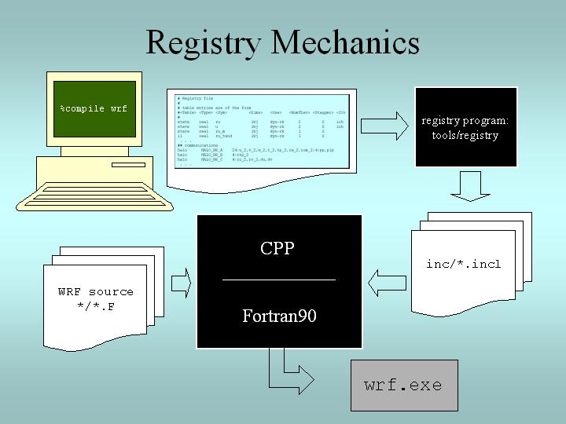
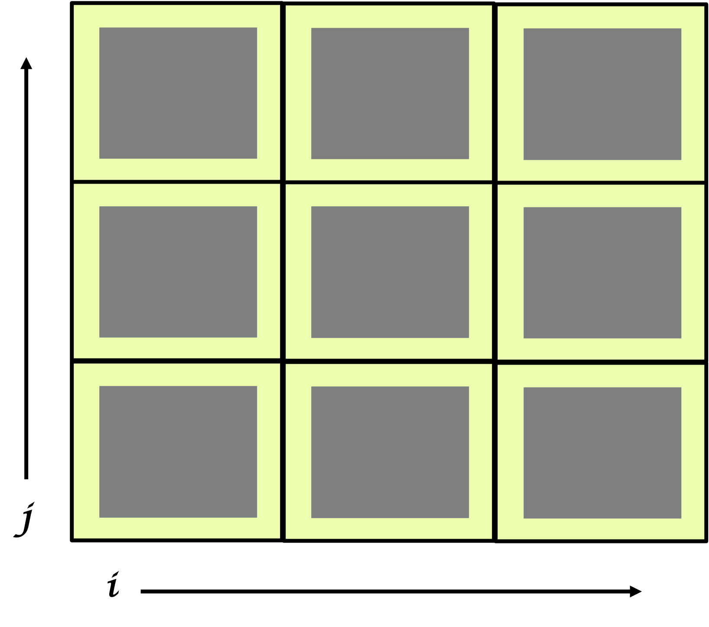

.. role:: underline
    :class: underline

WRF Software & Computation
==========================


WRF Build Mechanism
-------------------

The WRF build mechanism provides a uniform apparatus for configuring and compiling the WRF model, WRFDA, WRF-Chem, and WRF-Hydro systems, as well as the WRF Preprocessing System (WPS) over a range of platforms, with a variety of options. This section describes the components and functioning of the build mechanism. For instructions on building the WRF modeling system code, see the Compiling_ chapter of this Users' Guide.

The primary components of the build mechanism are included in the WRF source code, and consist of the following.

|br|
        :underline:`Scripts` |br|
        The top-level WRF directory contains three user-executable scripts: *configure* (which relies on the Perl script in *arch/Config_new.pl*), *compile*, and *clean*

|br|
        :underline:`Programs` |br|
        A significant number of WRF lines of code are automatically generated at compile time by the *tools/registry* file.

|br|
        :underline:`Makefiles` |br|
        The primary **Makefile** (input to the UNIX ``make`` utility) is in the top-level WRF directory. There are also makefiles in most subdirectories, as well. ``make`` is called recursively over the directory structure when the *compile* script is run by the user.

|br|
        :underline:`Configuration Files` |br|
        The user-invoked **configure** script generates a file called **configure.wrf**. This file contains compiler, linker, and other build settings, as well as rules and macro definitions used by the ``make`` utility. It is included by the Makefiles in most of the WRF source distribution (Makefiles in tools and external directories do not include configure.wrf), and is deleted when the code system is cleaned by the user-issued *clean* script. Thus, configure.wrf can be modified for temporary changes, such as optimization levels and compiling with debugging. Permanent changes should be made in *arch/configure_new.defaults*. The configure.wrf file is composed by the following three files.
                
                * **arch/configure_new.defaults** : contains lists of compiler options for all supported platforms and configurations. Changes made to this file are permanent. 
                * **arch/preamble_new** : constitutes the generic parts (non-architecture-specific) of the configure.wrf file generated by the *configure* script. *See the file for details.**
                * **arch/postamble_new** : similar to *arch/preamble_new*. *See the file for details.*

|br|
        :underline:`Registry` |br| 
        The **Registry** directory contains files that control many compile-time aspects of the WRF code. The files are named *Registry.X*, where 'X' corresponds to the intended application, specified during configuration (for e.g., if a WRF-Chem compile is chosen, the Registry.EM_CHEM file will be used, where 'X' corresponds to the intended application, specified during configuration (for e.g., if a WRF-Chem compile is chosen, the Registry.EM_CHEM file will be used). The configure script copies the appropriate Registry.X file to *Registry/Registry*, which is the file that *tools/registry* uses as input. Changes to Registry/Registry will be lost; permanent changes should be made to Registry.X. For a standard WRF-ARW build, the file is typically *Registry.EM*. The command ``include`` is used by the registry program, allowing the file *REGISTRY.EM_COMMON* to be included during a build. This file holds all shared entries for all applications, which helps to reduce the amount of replicated registry information. *See the Registry section below for additional details.*

|br|
        :underline:`Environment Variables` |br|
        The following aspects of the configuration and build are controlled by environment variables.
            
                * The non-standard locations of netCDF libraries or the Perl command
                * Which dynamic core to compile
                * Machine-specific features
                * Optional build libraries (such as Grib Edition 2, HDF, and parallel netCDF)

        In addition to WRF-related environment settings, there may also be settings specific to particular compilers or libraries. For e.g., local installations may require setting a variable like *MPICH_F90* to make sure the correct instance of the Fortran 90 compiler is used by the ``mpif90`` command.
                
|

How the WRF Build Works
+++++++++++++++++++++++

The two steps in the WRF build process are **configuration** and **compilation**.

        :underline:`Configuration` |br|
        The *configure* script configures the model prior to compilation, and takes only a few seconds to run through the following steps.
                
                #. attempts to locate mandatory and optional libraries (e.g., netCDF or HDF) and tools, such as Perl; it checks for these in standard paths, or uses settings from the user's shell environment
                #. calls the UNIX ``uname`` command to determine the user's platform
                #. calls the Perl script *arch/Config_new.pl*, which traverses the list of known machine configurations and displays a list of available options to the user
                #. The selected set of options is then used to create the *configure.wrf* file in the top-level directory. 
                                   
    .. note::
       The configure.wrf file may be edited, but changes could be temporary if the file is later deleted by the user-invoked 'clean' script, or overwritten by the next invocation of the configure script.

|

        :underline:`Compilation` |br|
        The *compile* script is used to compile the WRF code after it has been configured. This cshell script performs a number of checks, constructs an argument list, copies the appropriate Registry.X file to *Registry/Registry*, and then invokes the UNIX ``make`` command in the top-level directory. The Makefile in the top-level directory directs the rest of the build, accomplished as a set of recursive invocations of ``make`` in the WRF subdirectories. Most makefiles include *configure.wrf* from the top-level directory. The order of a complete build is as follows.

        #. ``make`` in *external* directory
                           
                * ``make`` in *external/io_{grib1,grib_share,int,netcdf}* for Grib Edition 1, binary, and netCDF implementations of I/O API
                * ``make`` in *external/RSL_LITE* to build the communications layer (DM_PARALLEL only)
                * ``make`` in *external/esmf_time_f90* to build the ESMF time manager library
                * ``make`` in *external/fftpack* to build the FFT library for the global filters
                * ``make`` in other *external* directories, as specified by the "external:" target in the configure.wrf file

        #. ``make`` in the *tools* directory to build the program that reads the *Registry/Registry* file and auto-generates files in the *inc* directory
        #. ``make`` in the *frame* directory to build the WRF framework specific modules
        #. ``make`` in the *share* directory to build the mediation layer routines, including WRF I/O modules that call the I/O API
        #. ``make`` in the *phys* directory to build the WRF model layer routines for physics
        #. ``make`` in the *dyn_em* directory for mediation-layer and model-layer subroutines
        #. ``make`` in the *main* directory to build the main programs for WRF, with a symbolic link to create executable files (location depending on the build case that was selected as the argument to the compile script; for e.g., for a real-data case, the executables are linked to test/em_real)
                * Source files (*.F* files, and in some of the external directories, *.F90* files) are preprocessed to produce *.f90* files, which are input to the compiler. As part of the preprocessing, Registry-generated files from the *inc* directory may be included. 
                * *.f90* files are compiled, resulting in the creation of *.o* (object) files that are added to the library *main/libwrflib.a*. *Most external directories generate their own library file.*  
                *  The linking step produces the *wrf.exe* executable and other executables, depending on the case argument to the ``compile`` command: *real.exe* (a preprocessor for real-data cases) or *ideal.exe* (a preprocessor for idealized cases), and the *ndown.exe* program, for one-way nesting of real-data cases.

The *.o* files and *.f90* files created during the compile are retained until the next invocation of the *clean* script. The *.f90* files provide the true reference for tracking down run time errors that refer to line numbers or for sessions using interactive debugging tools such as 'dbx' or 'gdb.'

| 

Registry
--------

Much of the WRF code is automatically generated from a user-edited text-based table called the **Registry**. The Registry provides a high-level, single-point of control over the fundamental structure of the model data. It contains lists describing state data fields and their attributes: 

        * dimensionality
        * binding to particular solvers
        * association with WRF I/O streams
        * communication operations
        * run time configuration options (namelist elements and their bindings to model control structures). 
          
Adding or modifying a state variable to WRF involves modifying a single line of a single file, which is then automatically propagated to scores of locations in the source code the next time the code is compiled.

The WRF Registry has two components: the Registry file (which the user may edit), and the Registry program. The Registry file is located in the *Registry* directory and contains entries that direct auto-generation of WRF code by the Registry program. There are multiple Registry files in this directory, with the filename syntax *Registry.X*, where 'X' specifies the type of build selected during configuration.

|br|

.. csv-table::
   :widths: 20, 40
   :header: "File Name","Type of WRF Build"

   "Registry.EM","Standard/Basic WRF"
   "Registry.EM_CHEM","WRF Chemistry (WRF-Chem)"
   "Registry.wrfvar","WRF Data Assimilation (WRFDA)"
   "Registry.wrfchemvar","WRF-Chem + WRFDA"
   "Registry.tladj","WRFPLUS"

|br|

   .. note::
      The 'Registry.EM_COMMON' file contains variables that are common to all applications. This above Registry.X files make use of this file, reducing replicated registry information. Additionally, files in the 'Registry' directory named "registry.x" (where 'x' represents specific applications) are also included in this manner.

|

The WRF build mechanism copies the appropriate *Registry.X* file to *Registry/Registry* and this file is used to direct the Registry program, which is included in the WRF source code in the *tools* directory. It is built automatically when WRF is compiled from clean code. The executable file is *tools/registry*, which reads the contents of the *Registry/Registry* file and generates files in the *inc* directory. These 'include' files are inserted (with cpp ``#include`` commands) into WRF Fortran source files prior to compilation. The Registry program itself is written in C. The source files and makefile are in the *tools* directory. The syntax and semantics for entries in the Registry are described in detail in `WRF Tiger Team Documentation: The Registry`_.

In addition to the WRF model itself, *Registry/Registry* is used to build the accompanying preprocessors, such as real.exe (for real data) or ideal.exe (for ideal simulations), and the ndown.exe program (used for one-way, off-line nesting).

|

compiler."

When the user compiles WRF, the Registry program reads *Registry/Registry*, producing auto-generated sections of code that are stored in files in the *inc* directory. These are included in WRF using the CPP preprocessor and the Fortran compiler.

|

The Registry describes every variable that is an input or an output field, or is required for parallel communication, specifically associated with a physics package, or needs to provide a tendency to multiple physics or dynamics routines. The following is defined for each variables. 

        * index ordering
        * horizontal and vertical staggering
        * feedback and nesting interpolation requirements
        * the associated IO
          
Adding a variable into the model typically only requires the addition of a single line to the Registry.X file, regardless of dimensionality. The same is true when defining a new run-time option (i.e., a new namelist entry). As with the model state arrays and variables, the entire model configuration is described in the Registry. Since the Registry modifies code for compile-time options, any change to the Registry (i.e., any file in the *Registry* directory) requires the code to be returned to the original unbuilt status with the ``clean -a`` command, and then reconfigured and recompiled.

The Registry file also provides input to generate all communications for distributed memory processing (halo interchanges between patches, support for periodic lateral boundaries, and array transposes for FFTs to be run in the X, Y, or Z directions). The Registry associates various fields with particular physics packages so the memory footprint reflects the actual selection of the options, not a maximal value.

|

Registry Syntax
+++++++++++++++

Each entry in the Registry is specific to a single variable, regardless of whether it applies to a model dimension, a new field, new namelist value, or communication. A single entry may be spread across several lines with a backslach (\) at the end of a line to denote the entry is continuing. When adding a new line to the Registry, keep in mind the following.

        * it is recommended to copy an entry that is similar to the new entry, and then modify the new entry. 
        * The Registry is not sensitive to spatial formatting. 
        * White space separates identifiers in each entry. 
        * After any change to a registry file, the code must be cleaned, reconfigured, and recompiled.
        * If a column has no entry, do not leave it blank. Use the dash character ( - ).

|

Registry Entries
++++++++++++++++

The following entry types are used in the WRF Registry (not case-dependent).

.. csv-table::
   :widths: 20, 40

   "**Dimspec**","Describes dimensions used to define arrays in the model"
   "**State**","Describes state variables and arrays in the domain structure"
   "**I1**","Describes local variables and arrays in 'solve'"
   "**Typedef**","Describes derived types that are subtypes of the domain structure"
   "**Rconfig**","Describes a configuration (e.g. namelist) variable or array"
   "**Package**","Describes attributes of a package (e.g. physics)"
   "**Halo**","Describes halo update interprocessor communications"
   "**Period**","Describes communications for periodic boundary updates"
   "**Xpose**","Describes communications for parallel matrix transposes"
   "**include**","Similar to a CPP #include file"

|br|

These keywords appear as the first word in each line of the Registry file to define which type of information is being provided. Following are details and examples of the more-likely Registry types.

|

:underline:`Dimspec` |br|

The first set of entries in the Registry are specifications of the dimensions for the fields to be defined. To keep the WRF system consistent between build types, a unified *registry.dimspec* file is used (located in the *Registry* directory), and is included in each Registry.* file, using the keyword 'include.' In the example below, three dimensions are defined: i, j, and k.  Issuing the command ``ncdump -h`` on a WRF file, provides three directional dimensions as 'west_east,' 'south_north,' and 'bottom_top.' That information is contained in this example. |br|
|br|
``#<Table>  <Dim>  <Order> <How defined>  <Coord-axis>  <Dimname in Data sets>`` |br|
``dimspec    i      1     standard_domain     x          west_east`` |br|
``dimspec    j      3     standard_domain     y          south_north`` |br|
``dimspec    k      2     standard_domain     z          bottom_top`` |br| 
|br|
Because WRF uses horizontal and vertical staggering, dimension names are extended with a '_stag' suffix, representing staggered sizes. The list of names in the *<Dim>* column may either be a single, unique character, or a string with no embedded spaces (e.g., 'my_dim'). When this dimension is used later to dimension-ize a state or i1 variable, it must be surrounded by curly braces (e.g., {my_dim}). This *<Dim>* variable is not case specific.

|

:underline:`State and I1` |br|

A WRF **state** variable is a field that is eligible for input/output (IO) and communications, and exists for the duration of the model forecast. **I1** variables (intermediate level one) are typically considered tendency terms, computed during a single model time-step, and then discarded prior to the next time-step. The space allocation and de-allocation for these I1 variables is automatic (on the stack for the model solver).

Below are the columns used for state and I1 variables (printed in order from left to right in the Registry file).

|br|

.. csv-table::
   :header: "Column Heading","Description","Notes"

   "**Table**","either 'state' or 'I1'","string"
   "**Type**","type of variable or array","real, double, integer, logical, character, or derived"
   "**Sym**","symbolic name inside WRF","string; not case-sensitive"
   "**Dims**","dimensionality of the array","string; use hyphen (-) when dimensionless" 
   "**Use**","denotes association with the solver (dyn_em), or 4D scalar array","string; if not specific, declared 'misc'"
   "**NumTLev**","number of time levels","integer for arrays; use hyphen (-) for variables"
   "**Stagger**","indicates staggered dimensions","string; X,Y,Z, or hyphen (-) if not staggered"
   "**IO**","whether and how it is subject to I/O and nesting","string; use hyphen (-) when no specification"
   "**Dname**","metadata name","string; in quotes"
   "**Descrip**","metadata description","string; in quotes"
   "**Units**","metadata units","string; in quotes"

|

The following is a state variable that is a Fortran type *real*. The name of the field inside the WRF model is 'u_gc.' It is a three-dimensional array (igj), has a single time level, and is staggered in the X and Z directions. This field is input only to the real program (i1). On output, the netCDF name is 'UU,' with the accompanying description and units provided(the example is broken across two lines for this guide, but represents a single line in the Registry file). |br|
|br|
``#<Table> <Type> <Sym> <Dims>  <Use>  <NumTLev>`` |br| 
``state    real   u_gc   igj     dyn_em     1`` |br|
|br|
``<Stagger> <IO> <DNAME>  <DESCRIP>             <UNITS>`` |br|
``XZ       i1   "UU"    "x-wind component"    "m s-1"`` 

|br|

Note that instead of leaving a blank column, a hypen/dash ('-') is used for some fields listed in the table above. The variable description and units columns are used for post-processing purposes only; this information is not directly utilized by the model, but is useful for users to understand them better.

The above example can be used as a template for adding a new variable. Use information provided in the table above, as well as some additional details below.

        * New variables added to the Registry file must use unique variable names, and should not use imbedded spaces. It is not required that *<Sym>* and *<DNAME>* use the same character string, but it is highly recommended.
        * If the new variable is not specific to any build type (e.g., basic WRF, WRF-Chem), the *<Use>* column entry should be 'misc' (for miscellaneous). The misc entry is typical for fields used in physics packages.  
        * Only dynamics variables have more than a single time level (*<NumTLev>*). *Note: this introductory guide is not suitable for describing the impact of multiple time periods on the registry program.*
        * For *<Stagger>*, select any subset from {X, Y, Z} or {-}, where the dash character signifies no staggering. For example, the x-direction wind component (u) is staggered in the X direction, and the y-direction wind component (v) is staggered in the Y direction.
        * *<DESCRIP>* and *<UNITS>* are optional, but are highly encouraged for users to understand them better. Since the <DESCRIP> value is used in the automatic code generation, restrict the variable description to 40 characters or less.
        * The **<IO>** column handles file input and output, output streams, and the nesting specification for the field.

                **Input & Output** |br|
                There are three options for I/O: **i** (input), **r** (restart), and **h** (history). For e.g., if the field should be in the input file to the model, the restart file from the model, and the history file from the model, the entry would be 'irh' (in any order).  

                **Streams** |br|
                To allow more flexibility, the input and history fields are associated with streams. A digit can be specified after the *i* or the *h* token, stating that this variable is associated with a specified stream (1 through 9) instead of the default (0, which means 'history'). A single variable may be associated with multiple streams. Once any digit is used with the *i* or *h* tokens, the default *0* stream must be explicitly stated. For example, *i* and *i0* are the same. However, *h1* outputs the field to the first auxiliary stream, but does not output the field to the default history stream. *h01* outputs the field to both the default history stream and the first auxiliary stream. For streams larger than a single digit, such as stream number thirteen, the multi-digit numerical value is enclosed inside braces (e.g., *i{13}* ). The maximum stream value is 24 for both input and history. |br|

                **Nesting Specification** |br|
                The letter values parsed for nesting are: **u** (up, as in feedback up), **d** (down, as in downscale from coarse to fine grid), **f** (forcing, how the lateral boundaries are processed), and **s** (smoothing). Users must determine whether it is reasonable to smooth the field in the area of the coarse grid, where the fine-grid feeds back to the coarse grid. Variables that are defined over land and water, non-masked, are usually smoothed. Lateral boundary forcing is primarily for dynamics variables (*not discussed in this guide*). For non-masked fields (e.g., wind, temperature, pressure), downward interpolation (controlled by d) and feedback (controlled by u) use default routines. Variables that are land fields (e.g., soil temperature - TSLB) or water fields (e.g., sea ice - XICE) have special interpolators, as shown in the examples below (again, interleaved for readability):

                ``#<Table> <Type> <Sym> <Dims>  <Use>  <NumTLev> <Stagger>`` |br|
                ``state    real   TSLB   ilj    misc       1          Z``  |br|
                ``state    real   XICE   ij     misc       1          -`` |br|
           
                ``<IO>`` |br|
                ``i02rhd=(interp_mask_land_field:lu_index)u=(copy_fcnm)`` |br|
                ``i0124rhd=(interp_mask_water_field:lu_index)u=(copy_fcnm)`` |br|

                ``<DNAME>  <DESCRIP>           <UNITS>`` |br|
                ``"TSLB"   "SOIL TEMPERATURE"   "K"`` |br|
                ``"SEAICE" "SEA ICE FLAG"       ""`` |br|

                |br|

                .. note::
                   The d and u entries are followed by an "=" then a parenthesis-enclosed subroutine, and a colon-separated list of additional variables to pass to the routine. It is recommended to follow the pattern: du for non-masked variables, and the above syntax for the existing interpolators for masked variables.

|

:underline:`Rconfig` |br|

Run-time configuration options, **rconfig**, (namelist.input options) are also defined in the Registry file, where each namelist option is described in its own line. Default values for each namelist variable are assigned in the Registry. The standard form for the entry for two namelist variables is given in the example below.

        ``<Table>  <Type>    <Sym>       <How set>              <Nentries>   <Default>`` |br|
        ``rconfig  integer   run_days    namelist,time_control        1           0``` |br|
        ``rconfig  integer   start_year  namelist,time_control   max_domains    1993`` |br| 

Below are the columns used for **rconfig** variables (printed in order from left to right in the Registry file).

|br|

.. csv-table::
   :header: "Column Heading","Description","Notes"

   "**Table**","entry type","'rconfig'"
   "**Type**","type of variable or array","real, integer, logical"
   "**Sym**","symbolic name inside WRF","string; not case-sensitive"
   "**How set**","namelist,<fortran record>","string"
   "**Nentries**","dimensionality (# of entries)","either '1' (single entry valid for all domains) or 'max_domains' (value specified for each domain)"
   "**Default**","default setting for the variable","if entry is missing from namelist, this value is used"

|

        .. note::
           Each namelist variable is a member of one of the specific namelist records. The previous example shows that run_days and start_year are both members of the time_control record.

|

The registry program constructs two subroutines for each namelist variable: one to retrieve the value of the namelist variable, and the other to set the value. For an integer variable named *my_nml_var*, the following code snippet provides an example of the easy access to the namelist variables.

        ``INTEGER :: my_nml_var, dom_id`` |br|
        ``CALL nl_get_my_nml_var ( dom_id , my_nml_var )`` |br|

The subroutine takes two arguments. The first is the input integer domain identifier, *dom_id*, (for example, 1 for the most coarse grid, 2 for the second domain), and the second argument is the returned value of the namelist variable. The associated subroutine to set the namelist variable, with the same argument list, is *nl_set_my_nml_var*. For namelist variables that are scalars, the grid identifier should be set to 1.

The rconfig line may also be used to define variables that are convenient to pass around in the model, usually part of a derived configuration (such as the number of microphysics species associated with a physics package). In this case, the *<How set>* column entry is derived. This variable does not appear in the namelist, but is accessible with the same generated *nl_set* and *nl_get* subroutines.

|

:underline:`Halo, Period, and Xpose`

|br|

**Halo** |br|

Distributed memory, inter-processor communications are fully described in the Registry file. An entry in the Registry constructs a code segment which is included (with cpp) in the source code. Following is an example of a *halo* communication. 

        ``#<Table>  <CommName>   <Core>   <Stencil:varlist>`` |br|
        ``halo      HALO_EM_D2_3 dyn_em    24:u_2,v_2,w_2,t_2,ph_2;24:moist,chem,scalar;4:mu_2,al`` |br| 

Below are the columns used for halos (printed in order from left to right in the Registry file).

|br|

.. csv-table::
   :header: "Column Heading","Description","Notes"

   "**Table**","entry type","'halo'"
   "**CommName**","communication","case-sensitive, starts with 'HALO_EM'"
   "**Core**","dynamical core","all are set to 'dyn_em;' no longer relevant since dyn_nmm is removed from WRF"
   "**Stencil:varlist**","stencil size and variables communicated with that stencil size","portion prior to colon (:) is size; comma-separated list after defines variables; "

|

        .. note::
           Different stencil sizes are available, and are separated in the same <Stencil:varlist> column by a semi-colon (;). Stencil sizes 8, 24, and 48 all refer to a square with an odd number of grid cells on a side, with the center grid cell removed (8 = 3x3-1, 24 = 5x5-1, 48 = 7x7-1). The special small stencil 4 is just a simple north, south, east, west communication pattern.

|

The WRF model provides a communication immediately after a variable has been updated. The communications are restricted to the mediation layer (an intermediate layer of the software placed between the framework and model levels). The model level is where developers spend most of their time. The majority of users will insert communications into the *dyn_em/solve_em.F* subroutine. The *HALO_EM_D2_3* communication shown in the above example is activated by inserting a small section of code that includes an automatically-generated code segment into the solve routine, via standard cpp directives.

        ``#ifdef DM_PARALLEL`` |br|
        ``#    include "HALO_EM_D2_3.inc"`` |br|
        ``#endif`` |br|

Parallel communications are only required when the code is built for distributed-memory parallel processing, which accounts for the surrounding ``#ifdef``.

|

**Period** |br|

**Period** communications are required when periodic lateral boundary conditions are selected. The Registry syntax is very similar for period and halo communications, but here stencil size refers to how many grid cells to communicate, in a direction that is normal to the periodic boundary.

        ``#<Table>     <CommName>        <Core>   <Stencil:varlist>`` |br|
        ``period   PERIOD_EM_COUPLE_A    dyn_em    2:mub,mu_1,mu_2``

|

**Xpose** |br|

The **xpose** (a data transpose) entry is used when decomposed data is to be re-decomposed. This is required when doing FFTs in the x-direction for polar filtering, for example. No stencil size is necessary.

        ``#<Table>     <CommName>        <Core>      <Varlist>`` |br|
        ``xpose    XPOSE_POLAR_FILTER_T  dyn_em   t_2,t_xxx,dum_yyy``

It is likely additions will be added to the the parallel communications portion of the Registry file (halo and period), but unlikely that additions will be added to xpose fields.

|

:underline:`Package` |br|

The **package** option in the Registry file associates fields with particular physics packages. It is mandatory that all 4-D arrays be assigned. Any 4-D array not associated with the selected physics option at run-time is neither allocated, used for IO, nor communicated. All other 2-D and 3-D arrays are eligible for use with a package assignment, but that is not required. The package option's purpose is to allow users to reduce the memory used by the model, since only necessary fields are processed. An example for a microphysics scheme is given below.

        ``#<Table>  <PackageName>  <NMLAssociated>    <Variables>`` |br|
        ``package   kesslerscheme   mp_physics==1   - moist:qv,qc,qr``

|br|

.. csv-table::
   :header: "Column Heading","Description","Notes"

   "**Table**","entry type","'package'"
   "**PackageName**","name of associated options for code IF/CASE statements","string"
   "**NMLAssociated**","package is associated with these namelist options","namelist setting, using '==' syntax"
   "**Variables**","all variables included in the package","syntax is:  dash (-), space, 4-D array name, colon (:), then comma-separated list of 3-D arrays constituting 4-D amalgamation" 

|br|

In the example above, the 4-D array is *moist*, and the selected 3-D arrays are *qv, qc*, and *qr*. If more than one 4-D array is required, a semi-colon (;) separates those sections from each other in the *<Variables>* column. 

The package entry is also used to associate generic state variables, as shown in the example following. If the namelist variable *use_wps_input* is set to 1, then the variables *u_gc* and *v_gc* are available to be processed.

        ``#<Table>  <PackageName> <NMLAssociated>     <Variables>`` |br|
        ``package     realonly    use_wps_input==1  - state:u_gc,v_gc``

|

WRF Architecture
----------------

The WRF model architecture is divided into different layers.

:underline:`Driver Layer` |br|

The WRF Driver is responsible for handling domains and their time loop. It allocates, stores, decomposes, and represents abstractly as single data objects. To handle time looping, there are algorithms for integration over nest hierarchy *(see the Timekeeping section below)*.

:underline:`Mediation Layer` |br|

The mediation layer contains the *Solve* routine, which uses a sequence of calls to take a domain object and advance it one time step. It also controls nest forcing, interpolation, and feedback routines. It dereferences fields in calls to the physics dirvers and dynamics code. Calls to message-passing are also contained in the Solve routine.

:underline:`Model Layer` |br|

The model layer contains the actual WRF model routines for physics and dynamics, which are written to perform computation over arbitrarily-sized/shaped, 3D, and rectangular subdomains.

The *Call* structure in the code is as follows (this example shows a call for a specific cumulus parameterization scheme).

``main/wrf.F`` -> ``frame/module_integrate.F`` -> ``dyn_em/solve_em.F`` -> ``dyn_em/module_first_rk_step_part1.F`` -> ``phys/module_cumulus_driver.F`` -> ``phys/module_cu_g3.F``

The main WRF program calls the integration, which calls the solve interface, which calls the mediation solver, which calls the specific physics driver, which calls the specific physics routine. 

|

I/O Applications Program Interface (I/O API)
--------------------------------------------

The software that implements WRF I/O, like the software that implements the model in general, is organized hierarchically, as a `software stack`_. From top (closest to the model code itself) to bottom (closest to the external package implementing the I/O), the I/O stack looks like this:

        #. Domain I/O (operations on an entire domain)
        #. Field I/O (operations on individual fields)
        #. Package-neutral I/O API
        #. Package-dependent I/O API (external package)

The lower-levels of the stack, associated with the interface between the model and the external packages, are described in the `I/O and Model Coupling API specification document`_. 

|

Timekeeping
-----------

Starting times, stopping times, and time intervals in WRF are stored and manipulated as Earth System Modeling Framework (ESMF) time manager objects. This allows exact representation of time instants and intervals as integer numbers of years, months, hours, days, minutes, seconds, and fractions of a second (numerator and denominator are specified separately as integers). All time computations involving these objects are performed exactly by using integer arithmetic, with the result of no accumulated time step drift or rounding, even for fractions of a second.

The WRF implementation of the ESMF Time Manger is distributed with WRF in the *external/esmf_time_f90* directory. This implementation is entirely Fortran90 (as opposed to the ESMF implementation in C++) and it is conformant to the version of the ESMF Time Manager API that was available in 2009.

WRF source modules and subroutines that use the ESMF routines do so by use-association of the top-level ESMF Time Manager module, esmf_mod:

        ``USE esmf_mod`` |br|
        
The code is linked to the library file *libesmf_time.a* in the *external/esmf_time_f90* directory.

ESMF timekeeping is set up on a domain-by-domain basis in the routine *setup_timekeeping* (in *share/set_timekeeping.F*). Each domain keeps track of its own clocks and alarms. Since the time arithmetic is exact, clocks on separate domains will not become unsynchronized.

|

Computation
-----------

The WRF model can be run serially or as a parallel job, depending on the available resources in the computing environment and the option chosen during the WRF compile. When the model is configured with the *serial* option, only a single processor is used to run a simulation. This is typically only useful when using a small domain (no greater than 100x100 grid cells), usually just for instructional purposes. The model can be configured to use parallel processes with the distributed-memory (dmpar) option, shared memory (smpar) option, or a combination of both (dm+sm). 

Parallel processing allows processes to be carried out simultaneously by independent processing units. Most often, simulations require parallel processing. Besides teaching applications, it is not recommended to use domains any smaller than 100x100 grid spaces, meaning most domains will be larger. Parallel computing uses domain decomposition to divide the total amount of work over parallel processes. Since less work is performed by each individual processor, the elapsed time to complete the computational task for each processor is reduced, reducing overall simulation time. 

|br|

:underline:`Distributed-memory Communications` |br|
Distributed-memory parallelism takes place over *patches*, which are sections of the model domain allocated to a single distributed memory node. These patches send and receive information from each other (message passing). WRF uses HALO regions to assist with this. The image below shows an imaginary domain that is using nine processors. Each of the nine squares represents a single patch and is computed by a single processor. The yellow (or lighter) surrounding area in each square is the halo region. Halos are able to communicate with halos in neighboring, tangential patches, sending and receiving information. 

|br|



|

:underline:`Shared-memory Communications` |br| 
Shared-memory parallelism uses OpenMP and takes place over *tiles* within patches. Tiles are sections of a patch allocated to a shared-memory processor within a single node. With shared memory processing, the domain is split among the run-time available OpenMP threads, and this is not sufficient for larger jobs (use dmpar instead for those). OpenMP is always within a single shared-memory processing unit. 

|

Quilting
--------

        .. note::
           * This option is unstable and may not work properly.
           * This option is only used for wrf.exe. It does not work for real or ndown.

This option allows reserving a few processors to manage output only, which can be useful and performance-friendly if the domain size is large, and/or the time taken to write an output time is significant when compared to the time taken to integrate the model in between output times. There are two variables for setting the options:

        * nio_tasks_per_group: Number of processors to use per IO group for IO quilting (1 or 2 is typically sufficient)
        * nio_groups: How many IO groups for IO (default is 1).

|

Software Documentation
----------------------

Detailed and comprehensive documentation aimed at WRF software is available in `WRF v2 Software Tools and Documentation`_. Though the document was written for WRFv2, the information is still relevant for current versions.

|

Performance
-----------

Benchmark information for some WRF model versions is available from the `WRF Benchmarks`_ page.

|

|

|

|

.. _Compiling: ./compiling.html
.. _`WRF Tiger Team Documentation\: The Registry`: https://www2.mmm.ucar.edu/wrf/WG2/Tigers/Registry/
.. _`Software Stack`: https://www2.mmm.ucar.edu/wrf/WG2/Tigers/IOAPI/IOStack.html
.. _`I/O and Model Coupling API specification document`: http://www2.mmm.ucar.edu/wrf/WG2/Tigers/IOAPI/index.html
.. _`WRF v2 Software Tools and Documentation`: https://www2.mmm.ucar.edu/wrf/WG2/software_2.0/index.html
.. _`WRF Benchmarks`:   https://www2.mmm.ucar.edu/wrf/users/benchmark/benchmark.htm
