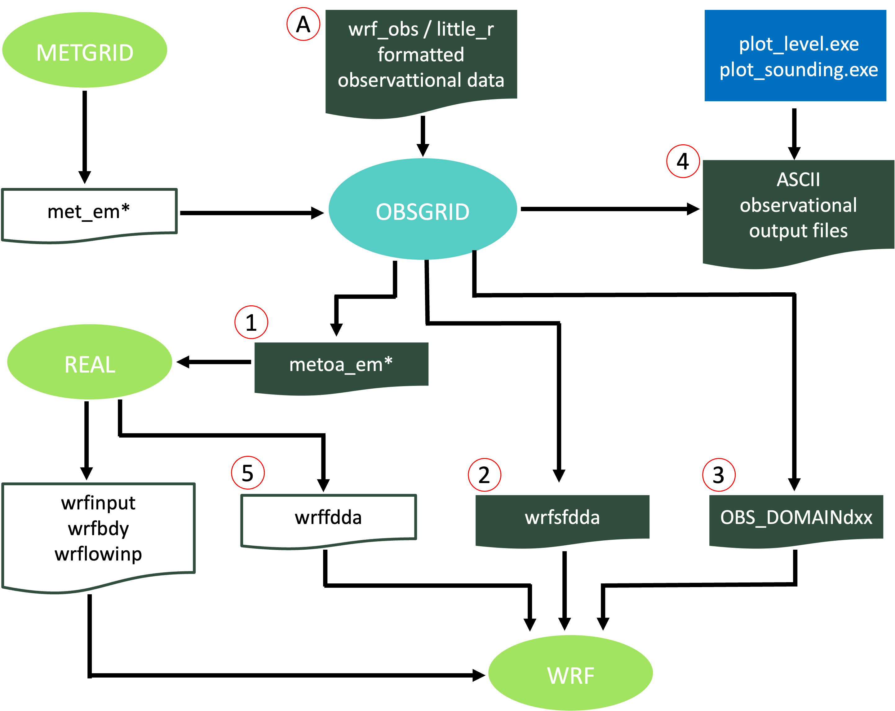
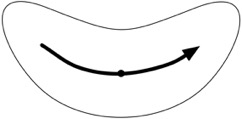

WRF Utilities and Tools
=======================

.. role:: underline
    :class: underline

.. role:: nlnote
    :class: nlnote

.. role:: nlheader
    :class: nlheader

This chapter contains a number of simple utilities to read and manipulate WRF-ARW data, and includes references to some basic third party software, which can be used to view and/or change input and output data files.

|

read_wrf_nc
-----------

The *read_wrf_nc* utility provides a way to take a quick look at a WRF netCDF file.

This differs from the netCDF utility *ncdump* in that read_wrf_nc

        * includes a large number of options, allowing users to look at a specific part of a netCDF file.
        * is written in Fortran 90, which allows users to add options.
        * can be used for both WRF-ARW and WRF-NMM cores.

read_wrf_nc can be used for geogrid, metgrid and wrf input/output files. Only three basic diagnostics are available: *pressure*, *height*, and *tk*, which can be activated with the *-diag* option (these are only available for wrfout files).

|br|

Install read_wrf_nc
+++++++++++++++++++

        #. Obtain the *read_wrf_nc* utility from the `WRF Post-processing and Utility Software Download Page`_.

                * The code should run on any machine with a netCDF library.

        #. To compile the code, use the compiler-specific flags listed near the top of the *read_wrf_nc.f* file. For e.g., for a Linux  machine, issue the command (all one line):

                .. code-block::

                        pgf90  read_wrf_nc.f  -L/usr/local/netcdf/lib
                        -lnetcdf  -lm  -I/usr/local/netcdf/include
                        -Mfree  -o read_wrf_nc

        If successful, the *read_wrf_nc* executable will be created.

|br|

Run read_wrf_nc
+++++++++++++++

To run this program, use the following command.

.. code-block::

        ./read_wrf_nc  wrf_data_file_name  [-options]

        options : [-h / help] [-att] [-m] [-M z] [-s]
        [-S x y z] [-v VAR] [-V VAR] [-w VAR]
        [-t t1 [t2]] [-times]
        [-ts xy X  Y  VAR VAR ....]
        [-ts ll  lat lon VAR VAR ....]
        [-lev z] [-rot] [-diag]
        [-EditData VAR]

|

See a description of the options below.

.. csv-table::
   :width: 100%
   :class: nlnote
   :escape: \

   "Options [-att]\, [-t]\, and [-diag] can be used with other options. Default options are [-att -s]."

.. csv-table::
   :widths: 25, 75
   :width: 100%

   **-h / help**, Prints help information
   **-att**, Prints global attributes
   **-m**, "Prints a list of fields available for each time\, plus the minimum and maximum values for each field"
   **-M z**, "Prints a list of fields available for each time\, plus the minimum and maximum values for each field; the min and max values of 3d fields will be for the *z* level of the field"
   **-s**, "Prints a list of fields available for each time\, plus a sample value for each field; sample value is taken from the middle of the model domain"
   **-S x y z**, "Prints a list of fields available for each time\, plus a sample value for each field; Sample value is at point *x\,y\,z* in the model domain"
   **-t t1 [t2]**, "Applies options only to times t1 to t2 (t2 is optional); if not set\, options will only apply to t1"
   **-times**, Prints only the times in the file
   **-ts**, "Generates time series output; a full vertical profile for each variable will be created |br| |br| *-ts xy X  Y  VAR VAR ...* will generate time series output for all variables (*VAR*) at location *x\,y* |br| |br| *-ts ll lat lon VAR VAR ...* will generate time series output for all variables at the *x\,y* location nearest to lat/lon"
   **-lev z**, "Creates a time series for level *z* (only works with option *-ts*)"
   **-rot**, "Rotates winds to Earth coordinates (only works with option *-ts*)"
   **-diag**, "Add this option to see output for the diagnostics temperature (K)\, full model pressure and model height (tk\, pressure\, and height)"
   **-v VAR**, "Prints basic information about field *VAR*"
   **-V VAR**, "Prints basic information about field *VAR*\, and dumps the full field out to the screen"
   **-w VAR**, "Writes the full field out to a file *VAR.out*"

|br|

:underline:`SPECIAL Option: -EditData VAR` |br|
The ``EditData VAR`` option (where *VAR* is replaced with the variable name) allows users to read a WRF output netCDF file, change a specific field, and write it back into the output file.

        * **Take care when using this option**, as it changes the current WRF output file!
        * Only one field at a time can be changed; therefore, if, for e.g., three fields need to be changed, the program will need to be run three times - each with a different *VAR*.
        * If there are multiple times in the WRF netCDF file, by default, all times for the variable *VAR* will be changed. To only change one time period, use the *-t* option.

**To use this option:**

        .. note::
           Make a copy of the WRF netCDF file before using this option!

**1.** Edit the subroutine *USER_CODE*

        * Add an 'IF-statement' block for the variable that will be changed. This prevents a variable from being overwritten by mistake.
        * For *REAL* data arrays, work with the array *data_real* and for *INTEGER* data arrays, work with the array *data_int*.

        **Example 1** |br|
        To change all (all time periods) values of *U* to a constant 10.0 m/s, add the following IF-statement:
   
        .. code-block::
           
                else if ( var == 'U') then
                      data_real = 10.0

|br|

        **Example 2** |br|
        To change a section of the *LANDMASK* data to water points:

        .. code-block::

                else if ( var == 'LANDMASK') then
                      data_real(10:15,20:25,1) = 0

|br|

        **Example 3** |br|
        Change all *ISLTYP* category 3 values to category 7 values (*Note this is an INTEGER field*):

        .. code-block::

                else if ( var == 'ISLTYP') then
                      where (data_int == 3 )
                          data_int = 7
                      end where

|br|

**2.** Compile and run the program. When prompted, reply "yes" to confirm these changes should be made.

|

|

.. _iowrf:

iowrf
-----

The *iowrf* provides options for basic manipulation of WRF output netCDF files - for e.g., thinning the data, de-staggering the data, or extracting data from a section of the data file.

|br|

Install iowrf
+++++++++++++

        #. Obtain the iowrf utility from the `WRF Post-processing and Utility Software Download Page`_.

                * The code should run on any machine with a netCDF library.

        #. To compile the code, use the compile flags at the top of the utility. For e.g., for a Linux  machine, issue the command (all one line):

                .. code-block::

                        pgf90 iowrf.f  -L/usr/local/netcdf/lib  
                        -lnetcdf  -lm  -I/usr/local/netcdf/include  
                        -Mfree  -o iowrf

           If successful, this will create the executable *iowrf*.

|

Run iowrf
+++++++++

To run iowrf, use the following command.

.. code-block::

        ./iowrf  wrf_data_file_name  [-options]

        options : [-h / help] [-thina X] [-thin X] [-box {}] [-A] [-64bit]

|

See a description of the options below.

.. csv-table::
   :widths: 25, 75
   :width: 100%
   :escape: \

   **-thina X**, Thins the data with a ratio of 1:X; data will be averaged before being fed back
   **-thin X**, Thins the data with a ratio of 1:X; no averaging will be done
   **-box {}**, Extracts a box from the data file; x\,y\,z can be controlled independently; for e.g. |br| -box x 10 30 y 10 30 z 5 15 |br| -box x 10 30 z 5 15 |br| -box y 10 30 |br| -box z 5 15
   **-A**, De-staggers the data; no thinning will take place
   **-64bit**, Allows large files (> 2GB) to have read / write access

|

|

.. _p_interp:

p_interp
--------

The *p_interp* utility interpolates WRF output netCDF files to user-specified pressure levels. Some included capabilities are:

        * The ability to output fields needed to create met_em files, which can be used as input to *real.exe*. This output can be used to change the vertical resolution of WRF input files. Output from p_interp can also be used as input to TC bogusing or OBSGRID.
        * A namelist option to split input files containing multiple times into multiple output files, each with a separate time.
        * p_interp can be compiled and run in parallel to improve the time needed to processes large input files.
        * Output from p_interp can be read directly by the `Model Evaluation Tools (MET)`_ program, removing the requirement to first run WPP/UPP before WRF data can be processed by the MET toolkit.

|

Install p_interp
++++++++++++++++

        #. Obtain the p_interp utility from the `WRF Post-processing and Utility Software Download Page`_.

                * The code should run on any machine with a netCDF library.

        #. To compile the code, use the compile flags at the top of the utility. For e.g., for a serial compile on a Linux machine, issue the command (all one line):

                .. code-block::

                        pgf90 p_interp.F90  -L/usr/local/netcdf/lib
                        -lnetcdf  -lm  -I/usr/local/netcdf/include
                        -Mfree  -o p_interp

           and for a parallel compile on an IBM machine, type (all one line):

                .. code-block::

                        mpxlf_r -qfree=f90 -L/usr/local/netcdf/lib -lnetcdf
                        -lm -I/usr/local/netcdf/include -o p_interp p_interp.F90 -WF,-D_MPI

           If successful, this will create the executable *p_interp*.

|

Edit the Namelist
+++++++++++++++++

Edit the associated *namelist.pinterp* file (see namelist options below).

.. csv-table::
   :widths: 20, 30, 50
   :width: 100%
   :header: "&io", "Default Value", "Description"
   :escape: \

   **path_to_input**, ./, Path to the input data
   **input_name**, None |br| |br| this must be set in the namelist, File name(s) of wrfout files; use a wild character if more than one file is processed
   **path_to_output**, ./, Path where output data will be written
   **output_name**, \'  \', If no name is specified\, output will be written to *input_name_PLEV*
   **process**, \'all', Indicates which fields to process |br| |br| \'all' fields in the wrfout file (diagnostics PRES\, TT\, HGT\, & RH will automatically be calculated) |br| |br| \'list' of fields as indicated in *fields*
   **fields**, \'  \', List of fields to process if \'list' is used in the parameter *process*
   **debug**, .false., Set to *.true.* for more debugging
   **mpi_debug**, .false., Set to *.true.* for additional output that may be helpful when debugging parallel code
   **bit64**, .false., Allows large files (> 2GB) to have read / write access
   **met_em_output**, .false., Set to *.true.* to calculate the output fields needed in a met_em file; these files are used as input to real.exe
   **split_output**, .false., *.true.* will output each time in the input file to a separate output file

|

.. csv-table::
   :widths: 20, 30, 50
   :width: 100%
   :header: "&interp_in", "Default Value", "Description"
   :escape: \
  
   **interp_levels**, -99999., Lists pressure levels to interpolate data to
   **extrapolate**, 0, 0 - Sets values below ground and above the model top to missing values (default) |br| 1 - extrapolate below ground\, and set above the model top to model top values
   **interp_method**, 1, 1 - linear in p-interpolation (default) |br| 2 - linear in log-p-interpolation
   **unstagger_grid**, .false., Set to *.true.* to unstagger the data on output

|

If *met_em_output=.true.*, other options also must be set:

.. code-block::

        split_output   = .true.
        unstagger_grid = .false.
        extrapolate    = 1
        process        = 'all'

If the first three options above are not manually set, the code will set them automatically. If *process='list'*, the code will stop and *process='all'* must be set. Also note that *p_interp* will stop if met_em* files already exist in the *path_to_output* directory. This reduces the chance of overwriting any met_em* files created by metgrid.exe.

|

Run p_interp
++++++++++++

To run p_interp compiled with the serial options, issue the command:

.. code-block::

        > ./p_interp

|br|

For distributed memory systems, some form of *MPI* will be needed to run the executable. To run p_interp (compiled with parallel options) interactively, and using *x* processors, the command may look like:

.. code-block::

        > mpiexec -np x ./p_interp

|

|

TC Bogus Scheme
---------------

The ARW core for the WRF modeling system provides a simple Tropical Cyclone (TC) Bogussing scheme. It can remove an existing tropical cyclone, and may optionally bogus in a Rankine vortex for a new tropical cyclone. Input to the program utilizes a single met_em* file and a few namelist.input variables that describe the bogus TC's location and strength. The output is prefixed with *auxinput1*, and is similar to a met_em* file. This file must be manually renamed to the expected met_em* file name the real.exe program uses prior to running real. The scheme is capable of processing isobaric data. 

|

Namelist Options
++++++++++++++++

Namelist information for the TC scheme is located in an optional namelist record *&tc*. Only a single domain is processed. Users with multiple domains should horizontally-interpolate the generated meteorological fields to the fine-grid domains. Alternatively, users may run the *tc.exe* program on separate metgrid output files for different domains, though this is not recommended.

.. csv-table::
   :widths: 30, 70
   :width: 100%
   :escape: \

   **insert_bogus_storm**, logical\, inserts a bogus storm
   **remove_storm**, logical\, removes an existing storm
   **num_storm**, integer\, the number of storms to bogus; this must be set to 1
   **latc_loc**, real\, latitude of the bogus storm (+ north\, - south)
   **lonc_loc**, real\, longitude of the bogus storm (+ east\, - west)
   **vmax_meters_per_second**, real\, the maximum observed sustained wind speed (m/s)
   **rmax**, real\, the radius from the cyclone center to where the maximum wind speed occurs (m)
   **vmax_ratio**, real\, the scale factor for the model's Rankine vortex

|br|

        .. note::
           If insert_bogus_storm is set to true then remove_storm should be set to false. If remove_storm is set to true then insert_bogus_storm should be set to false.

The value for *vmax_ratio* should be about 0.75 for a 45-km domain and about 0.90 for a 15-km domain (use these values to interpolate for other resolutions). This is a representativeness scale factor. The observed maximum wind speed is not appropriate for an entire grid cell when the domain is fairly coarse. For example, assume that a cyclone report observes the storm centered at 25 degrees N and 75 degrees W, where the maximum sustained winds were observed to be 120 kts, with the maximum winds about 90 km from the storm center. With a 45-km coarse grid model domain, the namelist.input file would be:

.. code-block::

        &tc
         insert_bogus_storm = .true.
         remove_storm = .false.
         latc_loc = 25.0
         lonc_loc = -75.0
         vmax_meters_per_second = 61.7
         rmax = 90000.0
         vmax_ratio = 0.75
         /

|

Program tc.exe
++++++++++++++

The program *tc.exe* is automatically built along with all other WRF model executables. This, however, is a serial program and must be built using serial and no-nesting options.

|

Running tc.exe
++++++++++++++

        #. Run the WPS programs.
        #. As usual, link-in the metgrid output files into either the *test/em_real* or the *run* directory.
        #. Edit the *namelist.input* file for usage with the *tc.exe* program. Add in the required fields in the *&tc* record, and only process a single time period.
        #. Run *tc.exe*
                   
                .. code-block::

                        > ./tc.exe

        #. Rename the output file, *auxinput1_d01_<date>* to the name that the real.exe program expects, *met_em.d01.<date>*. Note that this will overwrite the original metgrid.exe output file for the initial time period.
        #. Edit the namelist.input file to process all time periods for the real.exe program.

|

|

proc_oml.f
----------

The *proc_oml.f* utility may be used to process `3D HYCOM`_ ocean model temperature data in netCDF format to produce initial ocean mixed layer depth field (*H0ML*) for use in a WRF simulation that uses the simple ocean mixed layer model option (*omlcall=1*, and *oml_hml0<0*). The program estimates two fields from the HYCOM data: 

        #. effective mixed layer depth, based on the idea of ocean heat content (*H0ML*)
        #. mean ocean temperature in the top 200 m depth (TMOML). This is used as the lower limit for cooling SSTs in the wake of a hurricane.

|

Install proc_oml.f
++++++++++++++++++

        #. To download the *proc_oml.f* utility, please see `WRF AHW Utilities`_ 

        #. To compile the code, use the compile flags shown at the top of the utility program. For example, for a Linux  machine and pgf90 compiler, enter the command:

                .. code-block::

                        pgf90 proc_oml.f  -L/usr/local/netcdf/lib -lnetcdf \ 
                        -I/usr/local/netcdf/include -Mfree  -o proc_oml.f

           If successful, this will create the executable *proc_oml*.

|

Run proc_oml.f
++++++++++++++

To run the program, issue the command:

.. code-block::

        > ./proc_oml ocean-data-file.nc yyyymmddhh

*where *ocean-data-file.nc* is the HYCOM ocean data file, and *yyyymmddhh* is the 10-digit date when the data is valid for (e.g. *2005082700*). Successfully running the program will produce an output file, *MLD*, which is in intermediate format - the format produced by the WPS/ungrib program.

To use this field in WPS/metgrid, add the *constants_name* parameter to the *&metgrid* namelist record in namelist.wps. For e.g.,:

.. code-block::

         &metgrid
         constants_name = 'MLD',

WPS/metgrid has the additional fields in METGRID.TBL for proper horizontal interpolation. See the presentation `AHW (WRF-ARW): Moving Nest and Ocean Initialization`_ for additional information.

|

|

|

.. note::
   Below is a list of tools that are freely available, and can be used to manipulate model data (WRF model data, as well as other GRIB and netCDF data sets).

|

Converting Graphics
-------------------

|

ImageMagick
+++++++++++

*ImageMagick* is a software suite that creates, edits, and composes bitmap images. It can read, convert and write images in a variety of formats (over 100) including DPX, EXR, GIF, JPEG, JPEG-2000, PDF, PhotoCD, PNG, Postscript, SVG, and TIFF. Use ImageMagick to translate, flip, mirror, rotate, scale, shear and transform images, adjust image colors, apply various special effects, or draw text, lines, polygons, ellipses and B_zier curves.

The software package, as well as download and installation instructions, are freely available from the ImageMagick_ website.

|br|

Examples of converting data with ImageMagick software:

.. code-block::

        convert  file.pdf     file.png
        convert  file.png     file.bmp
        convert  file.pdf     file.gif
        convert  file.ras     file.png

|br|

        .. note::
           ImageMagick cannot convert ncgm (NCAR Graphics) file format to other file formats.

|

Converting ncgm (NCAR Graphics) File Format
+++++++++++++++++++++++++++++++++++++++++++

NCAR Graphics has tools to convert ncgm files to raster file formats. Once files are in raster file format, ImageMagick can be used to translate the files into other formats.

|br|

For ncgm files containing a single frame, use *ctrans*:

.. code-block::

        ctrans  -d sun  file.ncgm  file.ras

|br|

For ncgm files containing multiple frames, first use *med* (metafile frame editor) and then *ctrans*. *med* will create multiple single frame files called *medxxx.ncgm*.

.. code-block::

        med -e '1,$ split $' file.ncgm
        ctrans  -d sun_ med001.ncgm > med001.ras

|

|

Basic Unix Commands
-------------------

The WRF model can be run on any Unix/Linux machine, meaning some basic Unix commands are required to work in this environment. There are numerous web sites that provide basic and advanced Unix commands, but a few useful commands are listed below, as well as some web sites where users can obtain more information.

.. csv-table::
   :widths: 20, 50
   :width: 75%
   :escape: \

   **mkdir** |br| **rmdir**, To make (mkdir) or remove (rmdir) directories
   **cd**, To move (change) to a new directory
   **ls**, List the contents inside a directory
   **ls -l**, Lists files in 'long format'\, which contains useful information; for e.g.\, the size of the file\, who owns the file and who has the right to view it\, and when it was last modified
   **ls -lrt**, Lists files in 'long format'\, in order of time stamp\, and reverse order
   **rm**, Remove files
   **more**, Shows the first part of a file - just as much as will fit on one screen; press the space bar to see more or *q* to quit
   **cat**, Shows the entire file on the screen
   **head**, Shows the first couple of lines of a file on screen
   **tail**, Shows the last couple of lines of a file on screen
   **grep**, Find lines that match patterns in files
   **mv**, Rename or move a file
   **cp**, Copy a file to a different name or location
   **pwd**, Shows the current directory path
   **ln -sf**, Makes a symbolic (*-s*) link (*ln*) of a file; the file will appear to be in two locations\, but is only physically in one location; the *-f* option ensures that if the target file already exists\, it will first be unlinked so that the link may occur correctly
   **vi** |br| **emacs**, File editors; for new users\, emacs may be an easier editor to work with\, as vi requires some extra understanding to navigate between the command and insert modes\, whereas emacs functions more like a conventional editor

Stanford `Basic UNIX Commands`_ |br|
Wikipedia `List of Unix Commands`_ |br|
Colorado State University `Basic vi Commands`_

|

|

Design WRF Model Domains
------------------------

**WPS/util/plotgrids.ncl** |br|
An NCL script, which can either plot the domain on screen, or create a variety of different output types (pdf, ps, ncgm). This script must be run in the same directory where namelist.wps resides. Read more about this option in the WPS_ chapter of this guide. 

|

Display ungrib (Intermediate) Files
-----------------------------------

|

**WPS/util/plotfmt.ncl** |br|
An NCL script that can be used to display intermediate files created by *WPS/ungrib.exe*.

        * If files have been manually converted to `Intermediate File Format`_, it is good practice to use this utility to display the data in the files before running *WPS/metgrid.exe*. 

        * This script reads intermediate files and outputs graphics in a variety of formats (on the screen, pdf, ps, ncgm). The script requires NCL version 6.2.0 or newer. An input file must be supplied, for e.g:

        .. code-block::

                > ncl plotfmt.ncl 'filename="FILE:2005-06-01_00"'

|br|

**WPS/util/int2nc.exe** |br|
Can be used to convert intermediate files created by *WPS/ungrib.exe* into netCDF files.

|br|

**WPS/util/plotfmt_nc.ncl** |br|
An NCL script that can plot netCDF output files created by *int2nc.exe*. This script must be run in the same directory where the netCDF files reside. The file to be plotted should be entered on the command line. For e.g.,

.. code-block::

        > ncl plotfmt_nc.ncl 'inputFILE="FILE:2005-06-01_00.nc"'

Read more about this option in the WPS_ chapter of this guide.

|

|

NetCDF Data
-----------

NetCDF stands for Network Common Data Form. Most of the information below can be used for WRF netCDF data, as well as other netCDF data sets. NetCDF is one of the current supported data formats chosen for WRF I/O API. The advantages of using netCDF data are

        * Most graphical packages support netCDF file formats
        * NetCDF files are platform-independent (big-endian / little-endian)
        * A plethora of software exists that can be used to process/manipulate netCDF data

|

NetCDF Documentation
++++++++++++++++++++

Unidata_ General NetCDF Information |br|
`NetCDF-Fortran User Guide`_

|

NetCDF Utilities
++++++++++++++++

        **ncdump** |br|
        This command is available with the installation of netCDF libraries. It reads a netCDF file and prints information about the data set. For e.g.

                ``ncdump -h file``  (print header information) |br|
                ``ncdump -v VAR file``  (print header information and the full field VAR) |br|
                ``ncdump -v Times file``  (prints the times available in a WRF output file)

        |

        **ncview** |br|
        Displays netCDF data graphically - no overlays and no manipulation of data is possible |br|
        `ncview information`_
        
        |

        **ncBrowse** |br|
        Displays netCDF data graphically - some overlays, maps and manipulation of data are possible |br|
        `ncBrowse information`_

        |

        **read_wrf_nc** |br|
        A utility to display basic information about WRF netCDF files (see :ref:`iowrf` section of this chapter for details

        |

        **p_interp** |br|
        A utility to interpolate WRF-ARW netCDF output files to user specified pressure levels (see :ref:`p_interp` section of this chapter for details)

        |

        **NetCDF Operators** |br|
        Stand-alone programs that can be used to manipulate data (by performing grid point averaging / file differencing / file appending); a few available programs are listed below, see the `NCO site`_ for a list of all available programs.

                * *ncdiff* : Difference between two files; e.g., 

                  .. code-block::

                          ncdiff  input1.nc input2.nc output.nc
                
                * *ncrcat* : Writes specified variables / times to a new file; e.g.

                  .. code-block::

                          ncrcat -v RAINNC wrfout* RAINNC.nc
                          ncrcat -d Time,0,231 -v  RAINNC  wrfout* RAINNC.nc

                * *ncra* : Averages variables and writes to a new file; e.g.

                  .. code-block::

                          ncra -v OLR  wrfout* OLR.nc
                
                * *ncks* (nc kitchen sink) : Combination of NCO tools all in one (handy: one tool for multiple operations). An especially handy use of this tool is to split large files into smaller files, e.g.

                  .. code-block::

                          ncks -A -F -d Time,1,1 wrfout* -o wrfout_time1.nc

|

|

GRIB Data
---------

|

Documentation and Decoders
++++++++++++++++++++++++++

Documentation and decoders for both GRIB1 and GRIB2 can be found on the `WMO Grib Data Format`_ web page. The *unpackgrib2.c* and *grib2to1.c* code can be especially useful tools for gribbed data.

|

GRIB codes
++++++++++

It is useful to be able to to interpret which fields are available in input data set. For instance, NCEP uses the GRIB1 code 33 for the U-component of the wind, and 34 for the V-component. *Other centers may use different codes, so always obtain the GRIB codes from the center where the data originate.*

GRIB2 uses 3 codes for each field - *product*, *category* and *parameter*. *product* 0 refers to meteorological products. *Category* refers to the type of field; e.g., category 0 is temperature, category 1 is moisture and category 2 is momentum. *Parameter* is the field number. So whereas GRIB1 only uses code 33 for the U-component of the wind, GRIB2 will use 0,2,2, for the U-component, and 0,2,3 for the V-component.

|

Display GRIB Header and Field Information
+++++++++++++++++++++++++++++++++++++++++

        **GRIB1 Data** |br|
        *WPS/util/g1print.exe* |br|
        *wgrib*

        |br|

        **GRIB2 Data** |br|
        *WPS/util/g2print.exe* |br|
        *wgrib2*

        |br|

        Both wgrib and wgrib2 are available from the `WMO Grib Data Format`_ website.

|

Convert GRIB Data to NetCDF Format
++++++++++++++++++++++++++++++++++

Use the ncl_grib2nc_ tool.

|

Displaying GRIB Files
+++++++++++++++++++++

GRIB data can be displayed with GrADS with the use of the grib2ctl.pl_ script, and with Panoply_.

|

|

Model Verification
------------------

The `Model Evaluation Tools (MET)`_ program is a highly configurable, state-of-the-art suite of verification tools. It was developed using output from the Weather Research and Forecasting (WRF) modeling system, but may be applied to output from other modeling systems, as well. MET provides a variety of verification techniques, including:

        * Standard verification scores, comparing gridded model data to point-based observations
        * Standard verification scores, comparing gridded model data to gridded observations
        * Object-based verification method, comparing gridded model data to gridded observations

|

|

OBSGRID
-------

Objective analysis in meteorological modeling can improve meteorological analyses (the first guess) on the mesoscale grid by incorporating observations. Traditionally, these observations have been *direct* observations of temperature, humidity, and wind from surface and radiosonde reports. As remote sensing techniques are advancing, more *indirect* observations are available. Effective use of these indirect observations for objective analysis is not a trivial task. Methods commonly employed for indirect observations include three-dimensional or four-dimensional variational techniques (*3DVAR* and *4DVAR*, respectively), which can be used for direct observations as well. This section discusses the objective analysis program, **OBSGRID**. Discussion of variational techniques can be found in the WRFDA_ chapter of this guide.

The first-guess analyses input to OBSGRID are the analyses output from the metgrid program during the WPS_ process.

OBSGRID capabilities include:

        * Choice of Cressman-style or Multiquadric objective analysis
        * Various tests to screen the data for suspect observations
        * Procedures to input bogus data
        * Expanded Grid: OBSGRID includes the capability to reduce the size of the input model domain down during output. This feature allows incorporating data from outside the intended grid to improve analyses near the boundaries. To use this feature, a larger domain than the final intended domain must be created when running WPS.

|

OBSGRID Program Flow
++++++++++++++++++++

|

|

.. |A| image:: ./images/utilities_obsgrid_flow_A.png
   :height: 3ex 
   :class: no-scaled-link

.. |2| image:: ./images/utilities_obsgrid_flow_2.png
   :height: 3ex 
   :class: no-scaled-link

The OBSGRID utility is run after metgrid.exe. It uses the metgrid output (*met_em* files), as well as additional observations |A| as input. The format of these observational files is described below in the :ref:`Format of Observations` section of this chapter.

|br|

Output from the objective analysis programs can be used to provide:

        * fields for initial and boundary conditions |1|. Note that *metoa_em* files are formatted identically to the met_em* files from metgrid.exe. The difference is the fields in the metoa_em files now incorporate observational information.  
        * surface fields for surface-analysis-nudging FDDA |2|. Note - when using the *wrfsfdda* file as input to WRF, it is recommended to use the 3-D fdda file (*wrffdda* |5|, which is an optional output file created when running real.exe) as input to WRF.
        * data for observational nudging |3|. Note - since OBSGRID version 3.1.1, this file can be read directly by the observational nudging code and no longer needs to pass through an additional perl script.
        * ASCII and netCDF output |4|. These files provide information regarding the observations used and the quality control flags assigned. Information in these files can also be plotted with the provided plotting utilities.

|

.. _Source of Observations:

Source of Observations
++++++++++++++++++++++

OBSGRID reads observations that have been formatted as ASCII text files (`wrf_obs / little_r`_ format) by the user. This allows users to adapt their own data to be used as input to the OBSGRID program.

Programs are available to convert `NMC ON29`_ and *NCEP BUFR* formatted files into the *wrf_obs / little_r* format. If users wish to incorporate other other observations into OBSGRID, they are responsible for converting the data into this format. A user-contributed (i.e., unsupported) program is available in the *utils* directory for converting observation files from the GTS to wrf_obs / little_r format.

|

NCEP operational global surface and upper-air observation subsets, as archived by NCAR's `Research Data Archive`_ (RDA).

        * `Upper-air data in NMC ON29 format`_ (from early 1970s to early 2000)
        * `Surface data in NMC ON29 format`_ (from early 1970s to early 2000)
        * `Upper-air data in NCEP BUFR format`_ (from 1999 to present)
        * `Surface data in NCEP BUFR format`_ (from 1999 to present)

*ds351.0* and *ds461.0* data is also available in little_r format. From outside NCAR, these data can be downloaded from the web, and for NCAR supercomputer users, it is available on the *glade* file system. These data are sorted into 6-hourly windows, creating files that are typically too large for use in OBSGRID. To reorder the files into 3-hourly windows:

        1. Obtain the little_r 6-hourly data
                * *Non-NCAR super-computer users* : Get the data directly from the above web sites. Combine (by using the Unix ``cat`` command) all surface and upper-air data into a single file called *rda_obs*.
                * *NCAR super-computer users* : Use the script *util/get_rda_data.csh*, to obtain the data and create the file *rda_obs*. You will need to edit this script to supply the date range that you are interested in.
        2. Compile the Fortran program *util/get_rda_data.f*. Place the rda_obs file in the top OBSGRID directory. Run the *util/get_rda_data.exe* executable, which uses the date range from *namelist.oa*, and creates 3-hourly *OBS:<date>* files, which are ready to use in OBSGRID. 

|br|

An alternative method to obtain little_r observations is to download them from the `Meteorological Assimilation Data Ingest System (MADIS)`_ and convert them to little_r format using the MADIS2LITTLER_ tool provided by NCAR. 

        .. note::
           To allow proper handling of single-level above-surface observations by OBSGRID, MADIS2LITTLER must be modified to mark such observations as soundings (in module_output.F, subroutine write_littler_onelvl must be modified to set is_sound=.true.).

|

Objective Analysis Techniques in OBSGRID
++++++++++++++++++++++++++++++++++++++++

|

:underline:`Cressman Scheme` |br|
Three of the four objective analysis techniques used in OBSGRID are based on the Cressman scheme, in which several successive scans nudge a first-guess field toward the neighboring observed values. The standard Cressman scheme assigns to each observation a circular radius of influence, *R*. The first-guess field at each grid point, *P*, is adjusted by taking into account all the observations that influence P. The differences between the first-guess field and the observations are calculated, and a distance-weighted average of these difference values is added to the value of the first-guess at P. Once all grid points have been adjusted, the adjusted field is used as the first guess for another adjustment cycle. Subsequent passes each use a smaller radius of influence.

|br|

|br|

:underline:`Ellipse Scheme` |br|
In analyses of wind and relative humidity (fields strongly deformed by the wind) at pressure levels, the circles from the standard Cressman scheme are elongated into ellipses, oriented along the flow. The stronger the wind, the greater the eccentricity of the ellipses. This scheme reduces to the circular Cressman scheme under low-wind conditions.

|br|

|br|

:underline:`Banana Scheme` |br|
In analyses of wind and relative humidity at pressure levels, the circles from the standard Cressman scheme are elongated in the direction of the flow, and curved along the streamlines. The result is a banana shape. This scheme reduces to the Ellipse scheme under straight-flow conditions, and the standard Cressman scheme under low-wind conditions.

|br|

|br|

:underline:`Multiquadric Scheme` |br|
The Multiquadric scheme uses hyperboloid radial basis functions to perform the objective analysis. Details of the multiquadric technique may be found in `Nuss and Titley, 1994`_. *Use this scheme with caution, as it can produce some odd results in areas where only a few observations are available*.

|

.. _Quality Control for Observations:

Quality Control for Observations
++++++++++++++++++++++++++++++++

A critical component of OBSGRID is the screening for bad observations. Many of these quality control checks are optional in OBSGRID.

:underline:`Quality Control on Individual Reports` 

        * Gross Error Checks (same values, pressure decreases with height, etc.)
        * Remove spikes from temperature and wind profiles
        * Adjust temperature profiles to remove superadiabatic layers
        * No comparisons to other reports or to the first-guess field

|br|

:underline:`The ERRMAX Test` |br|
The ERRMAX quality control check is optional, but is highly recommended.

        * Limited user control over data removal - the user may set thresholds, which vary the tolerance of the error check
        * Observations are compared to the first-guess field.
        * If the difference value (obs - first-guess) exceeds a certain threshold, the observation is discarded.
        * Threshold varies depending on the field, level, and time of day.
        * Works well with a good first-guess field

|br|

:underline:`The Buddy Test` |br|
The Buddy Test is optional, but is highly recommended.

        * Limited user control over data removal - the user may set weighting factors, which vary the tolerance of the error check
        * Observations are compared to both the first guess and neighboring observations.
        * If the difference value of an observation (obs - first-guess) varies significantly from the distance-weighted average of the difference values of neighboring observations, the observation is discarded.
        * Works well in regions with good data density

|

Additional Observations
+++++++++++++++++++++++

Input of additional observations, or modification of existing (and erroneous) observations, can be a useful tool at the objective analysis stage.

In OBSGRID, additional observations are provided to the program the same way (in the same wrf_obs / little_r format) as standard observations. Additional observations must be in the same file as the rest of the observations. Existing (erroneous) observations can be modified easily, as the observations input format is ASCII text. Identifying an observation report as "bogus" simply means that it is assumed to be good data, but no quality control is performed for that report.

|

Surface FDDA Option
+++++++++++++++++++

The surface FDDA option creates additional surface-only analysis files, usually with a smaller time interval between analyses (i.e., more frequently) than the full upper-air analyses. Surface analysis files can then be used later in WRF with the surface analysis nudging option.

The *LAGTEM* option controls how the first-guess field is created for surface analysis files. Typically, the surface and upper-air first-guess (analysis times) data are available at twelve-hour or six-hour intervals, while the surface analysis interval may be 3 hours (10800 seconds). So at analysis times, the available surface first-guess is used. If LAGTEM is set to .false., the surface first-guess at other times will be temporally interpolated from the first-guess at the analysis times. If LAGTEM is set to .true., the surface first guess at other times is the objective analysis from the previous time.

|

Objective Analysis on Model Nests
+++++++++++++++++++++++++++++++++

OBSGRID has the capability to perform objective analysis on a nest. This is done manually with a separate OBSGRID process, performed on met_em_d0x files for the particular nest. 

It can sometimes be useful to do objective analysis on a nest if you have observations available with horizontal resolution somewhat greater than the resolution of your coarse domain. There may also be circumstances in which the representation of terrain on a nest allows for better use of surface observations (i.e., the model terrain better matches the real terrain elevation of the observation).

More often, however, objective analysis on a nest will introduce problems, causing inconsistency in initial conditions between the coarse domain and the nest. Observations that fall just outside a nest will be used in the analysis of the coarse domain, but discarded in the analysis of the nest. With different observations used right at a nest boundary, one can get very different analyses.

|

How to Run OBSGRID
++++++++++++++++++

:underline:`Obtain OBSGRID Source Code` |br|
OBSGRID source code can be obtained from NCAR'S `OBSGRID GitHub Repository`_ or from the `WRF Post-processing and Utility Software Download Page`_. If downloading the file from the webpage, unpack the file (``gunzip OBSGRID.TAR.gz`` and then ``tar -xf OBSGRID.TAR``), which will create a new *OBSGRID* directory. 

|br|

:underline:`Generate the OBSGRID Executable` |br|
The only library required to build OBSGRID is netCDF. NetCDF source code, precompiled binaries, and documentation are available from Unidata_.

To successfully compile the optional utilities *plot_level.exe* and *plot_sounding.exe*, NCAR Graphics must be installed. These utilities are not required to run OBSGRID, but can be useful for displaying observations. Since OBSGRID version 3.7.0, NCL scripts are available and therefore these two utilities are no longer needed to plot the data.

Use the following steps to build OBSGRID.

        #. Configure the code.

                .. code-block::
                  
                        ./configure

        #. Choose one of the configure options, then compile.

                .. code-block::

                        ./compile

If successful, this will create the executable *obsgrid.exe*. Executables *plot_level.exe* and *plot_sounding.exe* will be created if NCAR Graphics is installed.

|br|

:underline:`Prepare the Observation Files` |br|
Preparing observational files is a user responsibility. Some data are available from NCAR's `Research Data Archive`_. Data from the early 1970s are in *ON29* format, while data from 1999 to present are in *NCEP BUFR* format. For additional information and/or help using these datasets, see the :ref:`Source of Observations` section in this chapter.

*gts_cleaner.f* is an **unsupported** program for reformatting observations from the GTS stream. It is located in in *OBSGRID/util*. The code expects to find one observational input file per analysis time. Each file should contain both surface and upper-air data (if available).

|br|

:underline:`Edit the OBSGRID Namelist` |br|
The OBSGRID namelist, *namelist.oa*, is found in the top-level OBSGRID directory. Settings for the start/end dates and file names must be modified for the specific case. 

        .. note::
           Pay attention to file name settings. Mistakes in observation file names can be overlooked and OBSGRID may process the wrong files. If there are no data in the (wrongly-specified) file for a particular time, OBSGRID will provide an analysis of no observations.

|br|

:underline:`Run OBSGRID` |br|
To run OBSGRID, issue the command

        .. code-block::

                ./obsgrid.exe >& obsgrid.out

The *obsgrid.out* file will provide information and runtime errors. This file name is the user's choice. 

|br|

:underline:`Check Output` |br|
Examine *obsgrid.out* for error or warning messages. OBSGRID should have created *metoa_em* files. Additional output files containing information about observations found, used and discarded will probably be created, as well.

Check the number of observations found in the objective analysis, and the number of observations used at various levels, which is found in the print-out file (e.g., obsgrid.out). This can provide information regarding problems specifying observation files or time intervals.

:ref:`Plot Utility Programs` are also available to experiment with.

A number of additional output files, which could be potentially useful, are discussed below.

|

Output Files
++++++++++++

OBSGRID generates ASCII/netCDF files that detail the actions taken on observations through a time cycle of the program. A file is created with information to support users who wish to plot the observations used for each variable (at each level, at each time). The ASCII/netCDF files are intended for consumption by developers for diagnostic purposes. The primary output of the OBSGRID program is the gridded, pressure-level data that will be passed to the real.exe program (files *metoa_em*).

In each of the files listed below, the text *.dn.YYYY-MM-DD_HH:mm:ss.tttt* allows a separate output file for each time period processed by OBSGRID. The final four letters *tttt* indicate the decimal time to ten thousandths of a second. These files are dependent on the domain being processed.

|

:underline:`metoa_em*` |br|
*metoa_em* files are the final analysis at surface and pressure levels. Generating these files is the primary goal of running OBSGRID.

These files can be used in place of the met_em* files from WPS to generate initial and boundary conditions for WRF. To use these files when running real.exe, either:

        #. Rename or link the metoa_em* files back to met_em*. This allows real.exe to read the files automatically.
        #. Use the *auxinput1_inname* option in WRF's namelist.input file to overwrite the default filename real.exe uses. To do this, add the following to the &time_control namelist record before running real.exe (use the exact syntax as below - do not substitute *<domain>* and *<date>* for actual numbers):
                .. code-block::

                        auxinput1_inname = "metoa_em.d<domain>.<date>"
                               
|br|

:underline:`wrfsfdda_dn` |br|
Use of the surface FDDA option in OBSGRID creates a file called *wrfsfdda_dn* (where 'dn' donotes 'domain number'). This file contains the surface analyses at INTF4D intervals, analyses of T, TH, U, V, RH, QV, PSFC, PMSL, and a number of observations within 250 km of each grid point.

Due to WRF model input requirements, data at the current time (*_OLD*) and for the next time (*_NEW*) are supplied at each time interval. Therefore it is important to specify the same surface nudging interval in the &fdda record in WRF's namelist.input as the interval used in OBSGRID to create the wrfsfdda_dn file. Data may also need to be available for OBSGRID to create a surface analysis beyond the last analysis actually used by WRF surface analysis nudging. With a positive value for the length of rampdown, even though the _OLD field at the beginning of the rampdown will be nudged throughout the rampdown, WRF still requires a _NEW field at the beginning of the rampdown period.

|br|

:underline:`OBS_DOMAINdxx` |br|
*OBS_DOMAINdxx* files can be used for observational nudging in WRF. The format of this file differs from the standard wrf_obs/little_r format. See the `A Brief Guide to Observation Nudging in WRF`_ or the `Observational Nudging`_ section in the Running WRF Chapter of this guide for additional details. 

*d* in the file name represents the domain number, while *xx* is a sequential number.

OBS_DOMAINdxx files contain a list of all available observations to the OBSGRID program, and have the following qualities.

        * Observations are sorted and duplicates are removed.
        * Observations outside of the analysis region are removed.
        * Observations with no information are removed.
        * All reports for each location (different levels, but at the same time) are combined to form a single report.
        * Data that is internally set to the "discard" flag (data that is not sent to the quality control or objective analysis portions of the code) are not listed in this output.
        * The data have gone through extensive testing to determine if the report is within the analysis region, and the data have been given various quality control flags. Unless a blatant error is detected (such as a negative sea-level pressure), the observation data are not typically modified, but only assigned quality control flags.
        * Data with qc flags higher than a specified value (user controlled, via the namelist), will be set to missing data.

|br|

The WRF observational nudging code requires that all observational data are in a single file called *OBS_DOMAINd01* (where *d* is the domain number), whereas OBSGRID creates one file per time. Therefore to use these files in WRF, they should first be concatenated to a single file. A script (*run_cat_obs_files.csh*) is provided for this purpose. This script renames the original *OBS_DOMAINd01* files to *OBS_DOMAINd01_sav*, and a new *OBS_DOMAINd01* file (containing all observations for all times) is created and can be used by WRF's observational nudging code.

|br|

:underline:`qc_obs_raw.dn.YYYY-MM-DD_HH:mm:ss.tttt(.nc)` |br|
This file contains a list of all of the observations available to the OBSGRID program, and contain the following qualities.

        * The observations are sorted and duplicates are removed.
        * Observations outside of the analysis region are removed.
        * Observations with no information are removed.
        * All reports for each location (different levels, but at the same time) are combined to form a single report.
        * Data that is internally set to the "discard" flag (data that is not sent to the quality control or objective analysis portions of the code) are not listed in this output.
        * The data have gone through extensive testing to determine if the report is within the analysis region, and the data have been given various quality control flags. Unless a blatant error is detected (such as a negative sea-level pressure), the observation data are not typically modified, but only assigned quality control flags.
        * Two files are available, both containing identical information. 
          
                #. A file in the older ASCII format that can be used as input to the plotting utility *plot_sounding.exe*.
                #. A file in netCDF format that can be used to plot both station data (*util/station.ncl*) and sounding data (*util/sounding.ncl*). This is available since version 3.7 and is the recommended option.

|br|

:underline:`qc_obs_used.dn.YYYY-MM-DD-HH:mm:ss.tttt(.nc)` |br|
These files are similar to the above "raw" files, and can be used in the same way, but these contain the data used by the OBSGRID program, which are also the data saved to the OBS_DOMAINdxx files.

|br|

:underline:`qc_obs_used_earth_relative.dn.YYYY-MM-DD-HH:mm:ss.tttt(.nc)` |br|
These files are identical to the above "qc_obs_used" files except that the winds are in an earth-relative framework rather than a model-relative framework. The non-netCDF version of these files can be used as input to the `Model Evaluation Tools (MET)`_ verification package.

|br|

:underline:`plotobs_out.dn.YYYY-MM-DD_HH:mm:ss.tttt` |br|
This file lists data by variable and by level, where each observation that has gone into objective analysis is grouped with all the associated observations for plotting or some other diagnostic purpose. The first line of this file is the necessary Fortran format required to input the data. Titles are above the data columns to aid in information identification. Below is an example of the top few lines from a typical file. These data can be used as input to the plotting utility *plot_level.exe*, but since version 3.7, it is recommended to use the *station.ncl* script that uses the data in the new netCDF data files.

.. code-block::

        ( 3x,a8,3x,i6,3x,i5,3x,a8,3x,2(g13.6,3x),2(f7.2,3x),i7 )
        Number of Observations 00001214
        Variable Press  Obs    Station Obs        Obs-1st   X         Y         QC
        Name     Level  Number ID      Value      Guess     Location  Location  Value
        U        1001   1      CYYT    6.39806    4.67690   161.51    122.96    0
        U        1001   2      CWRA    2.04794    0.891641  162.04    120.03    0
        U        1001   3      CWVA    1.30433   -1.80660   159.54    125.52    0
        U        1001   4      CWAR    1.20569    1.07567   159.53    121.07    0
        U        1001   5      CYQX    0.470500  -2.10306   156.58    125.17    0
        U        1001   6      CWDO    0.789376  -3.03728   155.34    127.02    0
        U        1001   7      CWDS    0.846182   2.14755   157.37    118.95    0

|

|

.. _Plot Utility Programs:

Plot Utility Programs
+++++++++++++++++++++

OBSGRID provides two utility programs for plotting observations. These programs are called *plot_soundings.exe* and *plot_levels.exe*. These optional programs are built with NCAR Graphics, which can often be problematic. To address this, the NCL scripts, *sounding.ncl* and *station.ncl*, are provided and recommended to be used instead of the Fortran code.

|br|

:underline:`sounding.ncl / plot_soundings.exe` |br|
*util/sounding.ncl* is used to plot soundings. It generates soundings from the *qc_obs_raw.dn.YYYY-MM-DD_HH:mm:ss.tttt.nc* and *qc_obs_used.dn.YYYY-MM-DD_HH:mm:ss.tttt.nc* netCDF files. Only data that are on the requested analysis levels are processed.

By default the script will plot the data from all the *qc_obs_used* files in the directory. This can be customized through the use of command line settings. For example:

        * To plot data from the *qc_obs_raw* files
                .. code-block::
        
                        > ncl ./util/sounding.ncl 'qcOBS="raw"'

        * To plot data from the *qc_obs_used* files for June 2022
                .. code-block::

                        > ncl util/sounding.ncl YYYY=2022 MM=6

Available command line options are:

.. csv-table::
   :width: 75%
   :widths: 20, 55

   qcOBS, Dataset to use; options are *raw* or *used*; default is *used*
   YYYY, Integer year to plot; default is all available years
   MM, Integer month to plot; default is all available months
   DD, Integer day to plot; default is all available days
   HH, Integer hour to plot; default is all available hours
   outTYPE, Output type; default is plotting to the screen (*x11*); other options are *pdf* or *ps* |br| |br| The script creates the following output file(s): |br| ``qc_obs_<qcOBS>.sounding.<date>.<outTYPE>`` |br| for instance: *qc_obs_used.sounding.2022-06-01_09.pdf*
                
|br|

The older program *plot_soundings.exe* also plots soundings. It generates soundings from the *qc_obs_raw.dn.YYYY-MM-DD_HH:mm:ss.tttt* and *qc_obs_used.dn.YYYY-MM-DD_HH:mm:ss.tttt* data files. Only data that are on the requested analysis levels are processed. The program uses information from *&record1*, *&record2* and *&plot_sounding* in the namelist.oa file to generate the required output. The program creates output file(s): *sounding_<file_type>_<date>.cgm*.

|br|

:underline:`plot_level.exe`
*util/station.ncl* creates station plots for each analysis level. These plots contain both observations that have passed all QC tests and observations that have failed the QC tests. Observations that have failed the QC tests are plotted in various colors according to which test failed. This script generates soundings from the *qc_obs_raw.dn.YYYY-MM-DD_HH:mm:ss.tttt.nc* and *qc_obs_used.dn.YYYY-MM-DD_HH:mm:ss.tttt.nc* netCDF files.

By default the script will plot the data from all the *qc_obs_used* files in the directory. This can be customized through the use of command line setting. For example:

        * To plot data from the *qc_obs_raw* files
                .. code-block::

                        > ncl ./util/station.ncl 'qcOBS="raw"'

        * To plot data from the *qc_obs_used* files for June 2022
                .. code-block::

                        > ncl util/station.ncl YYYY=2022 MM=6

Available command line options are:

.. csv-table::
   :width: 75%
   :widths: 20, 55

   qcOBS, Dataset to use; options are *raw* or *used*; default is *used*
   YYYY, Integer year to plot; default is all available years
   MM, Integer month to plot; default is all available months
   DD, Integer day to plot; default is all available days
   HH, Integer hour to plot; default is all available hours
   outTYPE, Output type; default is plotting to the screen (*x11*); other options are *pdf* or *ps* |br| |br| The script creates the following output file(s): |br| ``qc_obs_<qcOBS>.sounding.<date>.<outTYPE>`` |br| for instance: *qc_obs_used.station.2022-06-01_09.pdf*

|br|

The older program *plot_level.exe* creates station plots for each analysis level. These plots contain both observations that have passed all QC tests and observations that have failed the QC tests. Observations that have failed the QC tests are plotted in various colors according to which test failed. The program uses information from *&record1* and *&record2* in the namelist.oa file to generate plots from the observations in the file *plotobs_out.dn.YYYY-MM-DD_HH:mm:ss.tttt*. The program creates the file(s): *levels_<date>.cgm*.

|

|

.. _Format of Observations:

Format of Observations
++++++++++++++++++++++

Understanding the *wrf_obs/little_r* observation format helps to make the best use of the OBSGRID program. Observations are conceptually organized in terms of *reports*, which consist of a single observation or set of observations associated with a single latitude/longitude coordinate.

Examples

        * A surface station report including observations of temperature, pressure, humidity, and winds
        * An upper-air station's sounding report with temperature, humidity, and wind observations at many height or pressure levels
        * An aircraft report of temperature at a specific lat/lon/height
        * A satellite-derived wind observation at a specific lat/lon/height
    
Each report in the wrf_obs/little_r Observations format consists of at least four records:

        * A *report header* record
        * One or more *data* records
        * An *end data* record
        * An *end report* record

The *report header* record is a 600-character-long record (much of which is unused and needs only dummy values) that contains certain information about the station and the report as a whole (location, station id, station type, station elevation, etc.). This record is described in the following table (*note that some options are marked "unused" in the description*).

.. csv-table::
   :widths: 20,15, 65
   :width: 100%
   :header: Variable, "Fortran I/O Format", Description
   :escape: \ 

   latitude, F20.5, station latitude (north positive)
   longitude, F20.5, station longitude (east positive)
   id, A40, ID of station
   name, A40, Name of station
   platform, A40, Description of the measurement device
   source, A40, GTS\, NCAR/ADP\, BOGUS\, etc.
   elevation, F20.5, station elevation (m)
   num_vld_fld, I10, Number of valid fields in the report
   num_error, I10, *(unused)* Number of errors encountered during the decoding of this observation
   num_warning, I10, *(unused)* Number of warnings encountered during decoding of this observation
   seq_num, I10, Sequence number of this observation
   num_dups, I10, *(unused)* Number of duplicates found for this observation
   is_sound, L10, T/F Above-surface or surface (i.e.\, all non-surface observations should use T\, even above-surface single-level obs)
   bogus, L10, T/F bogus report or normal one
   discard, L10, T/F Duplicate and discarded (or merged) report
   sut, I10, *(unused)* Seconds since 0000 UTC 1 January 1970
   julian, I10, *(unused)* Day of the year
   date_char, A20, YYYYMMDDHHmmss
   slp\, qc, F13.5\, I7, Sea-level pressure (Pa) and a QC flag
   ref_pres\, qc, F13.5\, I7, *(unused)* Reference pressure level (for thickness) (Pa) and a QC flag
   ground_t\, qc, F13.5\, I7, *(unused)* Ground temperature (T) and QC flag
   sst\, qc, F13.5\, I7, *(unused)* Sea-surface temperature (K) and QC
   psfc\, qc, F13.5\, I7, *(unused)* Surface pressure (Pa) and QC
   precip\, qc, F13.5\, I7, *(unused)* Precipitation accumulation and QC
   t_max\, qc, F13.5\, I7, *(unused)* Daily maximum T (K) and QC
   t_min\, qc, F13.5\, I7, *(unused)* Daily minimum T (K) and QC
   t_min_night\, qc, F13.5\, I7, *(unused)* Overnight minimum T (K) and QC
   p_tend03\, qc, F13.5\, I7, *(unused)* 3-hour pressure change (Pa) and QC
   p_tend24\, qc, F13.5\, I7, *(unused)* 24-hour pressure change (Pa) and QC
   cloud_cvr\, qc, F13.5\, I7, *(unused)* Total cloud cover (oktas) and QC
   ceiling\, qc, F13.5\, I7, *(unused)* Height (m) of cloud base and QC

|br|

Following the report header record are the *data* records, which contain the observations of pressure, height, temperature, dewpoint, wind speed, and wind direction. There are a number of other fields in the data record that are not used on input. Each data record contains data for a single level of the report. For report types that have multiple levels (e.g., upper-air station sounding reports), each pressure or height level has its own data record. For report types with a single level (such as surface station reports or a satellite wind observation), the report will have a single data record. The data record contents and format are summarized in the following table.

.. csv-table::
   :widths: 20,15, 65
   :width: 100%
   :header: Variable, "Fortran I/O Format", Description
   :escape: \ 

   pressure\, qc, F13.5\, I7, Pressure (Pa) of observation\, and QC
   height\, qc, F13.5\, I7, Height (m MSL) of observation\, and QC
   temperature\, qc, F13.5\, I7, Temperature (K) and QC
   dew_point\, qc, F13.5\, I7, Dewpoint (K) and QC
   speed\, qc, F13.5\, I7, Wind speed (m/s) and QC
   direction\, qc, F13.5\, I7, Wind direction (degrees) and QC
   u\, qc, F13.5\, I7, u component of wind (m/s)\, and QC
   v\, qc, F13.5\, I7, v component of wind (m/s)\, and QC
   rh\, qc, F13.5\, I7, Relative humidity (%) and QC
   thickness\, qc, F13.5\, I7, Thickness (m) and QC

|br|

The *end data* record is simply a record with pressure and height fields, both set to -777777. Following all the *data* records and the *end data* record, is an *end report* record. This record is simply three integers, which are immaterial.

.. csv-table::
   :widths: 20,15, 65
   :width: 100%
   :header: Variable, "Fortran I/O Format", Description
   :escape: \ 

   num_vld_fld, I7, Number of valid fields in the report
   num_error, I7, Number of errors encountered during the decoding of the report
   num_warning, I7, Number of warnings encountered during the decoding the report

|br|

:underline:`QCFlags` |br|
Most meteorological data fields in the observation files also have space for an additional integer quality-control flag. The quality-control values are of the form *2n*, where *n* takes on positive integer values. This allows the various quality control flags to be additive, yet permits decomposition of the total sum into constituent components. Following are the current quality control flags that are applied to observations:

.. code-block::

        pressure interpolated from first-guess height      = 2 **  1 =      2 
        pressure int. from std. atmos. and 1st-guess height= 2 **  3 =      8
        temperature and dew point both = 0                 = 2 **  4 =     16
        wind speed and direction both = 0                  = 2 **  5 =     32
        wind speed negative                                = 2 **  6 =     64
        wind direction < 0 or > 360                        = 2 **  7 =    128
        level vertically interpolated                      = 2 **  8 =    256
        value vertically extrapolated from single level    = 2 **  9 =    512
        sign of temperature reversed                       = 2 ** 10 =   1024
        superadiabatic level detected                      = 2 ** 11 =   2048
        vertical spike in wind speed or direction          = 2 ** 12 =   4096
        convective adjustment applied to temperature field = 2 ** 13 =   8192
        no neighboring observations for buddy check        = 2 ** 14 =  16384
        ----------------------------------------------------------------------
        data outside normal analysis time and not QC-ed    = 2 ** 15 =  32768
        ----------------------------------------------------------------------
        fails error maximum test                           = 2 ** 16 =  65536
        fails buddy test                                   = 2 ** 17 = 131072 
        observation outside of domain detected by QC       = 2 ** 18 = 262144

|

|

OBSGRID Namelist
++++++++++++++++

The OBSGRID namelist file is called *namelist.oa*, and must be in the directory from which OBSGRID is run. The namelist consists of nine namelist records, named *record1* through *record9*, each having a loosely related area of content. Each namelist record begins with *&record<#>* (where *<#>* is the namelist record number) and ends with a slash ("/").

        .. note::
           The namelist record *&plot_sounding* is only used by the corresponding utility.

|br|

:underline:`Namelist record1` |br|
The values in namelist *record1* define the analysis times to process.

.. csv-table::
   :class: nlheader
   :widths: 25, 20, 55
   :width: 100%

   "Variable Name", "Value", "Description"

.. csv-table::
   :widths: 25, 20, 55
   :width: 100%

   start_year, 2022, 4-digit year of the starting time to process
   start_month, 01, 2-digit month of the starting time to process
   start_day, 24, 2-digit day of the starting time to process
   start_hour, 12, 2-digit hour of the starting time to process
   end_year, 2022, 4-digit year of the ending time to process
   end_month, 01, 2-digit month of the ending time to process
   end_day, 25, 2-digit day of the ending time to process
   end_hour, 12, 2-digit hour of the ending time to process
   interval, 21600, Time interval (s) between consecutive times to process

|br|

|br|

:underline:`Namelist record2` |br|
The values in namelist *record2* define the model grid and names of the input files.

.. csv-table::
   :class: nlheader
   :widths: 25, 20, 55
   :width: 100%

   "Variable Name", "Value", "Description"

.. csv-table::
   :widths: 25, 20, 55
   :width: 100%
   :escape: \ 

   grid_id, 1, ID of domain to process
   obs_filename, CHARACTER, Root file name (may include directory information) of the observational files; all input files must have the format *obs_filename:<YYYY-MM-DD_HH>*; one file required for each time period |br| |br| If a *wrfsfdda* file is being created\, then similar input data files are required for each surface fdda time
   remove_data_above_qc_flag, 200000, Data with qc flags higher than this will not be output to the *OBS_DOMAINdxx* files; default is to output all data; use *65536* to remove data that failed the buddy and error max tests; to also exclude data outside analysis times that could not be QC-ed\, use *32768* (recommended) - this does not affect the data used in the OA process
   emove_unverified_data, .false., By setting this parameter to .true. (recommended) any observations that could not be QC'd due to having a pressure insufficiently close to an analysis level will be removed from the *OBS_DOMAINdxx* files; obs QC'd by adjusting them to a nearby analysis level or by comparing them to an analysis level within a user-specified tolerance will be included in the *OBS_DOMAINdxx* files; see *use_p_tolerance_one_lev* in *&record4*
   trim_domain, .false., Set to .true. if this domain must be cut down on output
   trim_value, 5, Value by which the domain will be cut down in each direction

|br|

The met_em* files that are being processed must be available in the *OBSGRID* directory.

Because the *obs_filename* and interval settings can be confusing, additional explanation is provided here. Use of the obs_filename files is related to the times and time interval set in namelist *&record1*, and to the F4D options set in namelist *&record8*. obs_filename files are used for analysis of the full 3D dataset, both at upper levels and the surface. They are also used when *F4D=.true.* (i.e., if surface analyses are being created for surface FDDA nudging). The obs_filename files should contain all observations (upper-air and surface) to be used for a particular analysis at a particular time.

Ideally there should be an obs_filename for each time period for which objective analysis is desired. Time periods are processed sequentially from the starting date to the ending date, by the time interval, all specified in namelist *&record1*. All observational files must have a date associated with them. If a file is not found, the code will process as if this file contains zero observations, and then continue to the next time period.

If the *F4D* option is selected, the obs_filename files are similarly processed for surface analysis, this time with the time interval as specified by *INTF4D*.

If observations from outside the model domain will be included, geogrid.exe (WPS) must be run for a slightly larger domain than the domain of interest. Setting *trim_domain=.true.* will cut all four directions of the input domain down by the number of grid points set in trim_value.

In the example below, the domain of interest is the inner white domain with a total of 100x100 grid points. geogrid.exe has been run for the outer domain (110x110 grid points). By setting the *trim_value=5*, the output domain will be trimmed by 5 grid points in each direction, resulting in the white 100x100 grid point domain. 

|br|

|br|

|br|

:underline:`Namelist record3` |br|
The values in namelist *record3* define space allocation within the program for observations. These values should rarely need modification.

.. csv-table::
   :class: nlheader
   :widths: 25, 20, 55
   :width: 100%

   "Variable Name", "Value", "Description"

.. csv-table::
   :widths: 25, 20, 55
   :width: 100%

   max_number_of_obs, 10000, Anticipated maximum number of reports per time period
   fatal_if_exceed_max_obs, .true., T/F flag allows the user to decide the severity of not having enough space to store all of the available observation

|br|

|br|

:underline:`Namelist record4` |br|
The values in namelist *record4* set quality control options. There are four specific tests that may be activated by the user (see the `Quality Control for Observations` section). Users have control over tolerances for some of these tests, as well.  

.. csv-table::
   :class: nlheader
   :widths: 25, 20, 55
   :width: 100%

   "Variable Name", "Value", "Description"

.. csv-table::
   :widths: 25, 20, 55
   :width: 100%

   qc_psfc, .false., Execute error max and buddy check tests for surface pressure observations (temporarily converted to sea level pressure to run QC)

.. csv-table::
   :width: 100%
   :class: nlnote
   :escape: \ 

   "**Error Max Test** : There is a threshold for each variable. These values are scaled for time of day\, surface characteristics\, and vertical level."

.. csv-table::
   :widths: 25, 20, 55
   :width: 100%
   :escape: \

   qc_test_error_max, .true., Check the difference between the first-guess and the observation
   max_error_t, 10, Maximum allowable temperature difference (K)
   max_error_uv, 13, Maximum allowable horizontal wind component difference (m/s)
   max_error_z, 8, Not used
   max_error_rh, 50, Maximum allowable relative humidity difference (%)
   max_error_p, 600, Maximum allowable sea-level pressure difference (Pa)
   max_error_dewpoint, 20, Maximum allowable dewpoint difference (K)

.. csv-table::
   :width: 100%
   :class: nlnote
   :escape: \

   "**Buddy Check Test** : There is a threshold for each variable. These values are similar to standard deviations"

.. csv-table::
   :widths: 25, 20, 55
   :width: 100%
   :escape: \

   qc_test_buddy, .true., Check the difference between a single observation and neighboring observations
   max_buddy_t, 8, Maximum allowable temperature difference (K)
   max_buddy_uv, 8, Maximum allowable horizontal wind component difference (m/s)
   max_buddy_z, 8, Not used
   max_buddy_rh, 40, Maximum allowable relative humidity difference (%)
   max_buddy_p, 800, Maximum allowable sea-level pressure difference (Pa)
   max_buddy_dewpoint, 20, Maximum allowable dewpoint difference (K)
   buddy_weight, 1.0, Value by which the buddy thresholds are scaled

.. csv-table::
   :width: 100%
   :class: nlnote
   :escape: \

   "**Spike Removal**"

.. csv-table::
   :widths: 25, 20, 55
   :width: 100%
   :escape: \

   qc_test_vert_consistency, .false., Check for vertical spikes in temperature\, dew point\, wind speed\, and wind direction

.. csv-table::
   :width: 100%
   :class: nlnote
   :escape: \

   "**Removal of Super-adiabatic Lapse Rates**"

.. csv-table::
   :widths: 25, 20, 55
   :width: 100%
   :escape: \

   qc_test_convective_adj, .false., Remove any super-adiabatic lapse rate in a sounding by conservation of dry static energy
   
.. csv-table::
   :width: 100%
   :class: nlnote
   :escape: \

   "For satellite and aircraft observations\, data are often horizontally spaced with only a single vertical level. The following entries determine how such data are dealt with and are described in more detail below the table."

.. csv-table::
   :widths: 25, 20, 55
   :width: 100%
   :escape: \ 

   use_p_tolerance_one_lev, .false., Should single-level above-surface observations be directly QC'd against nearby levels (.true.) or extended to nearby levels (.false.)
   max_p_tolerance_one_lev_qc, 700, Pressure tolerance within which QC can be applied directly (Pa)
   max_p_extend_t, 1300, Pressure difference (Pa) through which a single temperature report may be extended
   max_p_extend_w, 1300, Pressure difference (Pa) through which a single wind report may be extended

|br|

**Dewpoint Quality Control** |br|
Note that the dewpoint *error max* check and *buddy* check are using the same moisture field as in the relative humidity checks. Dewpoint checks allow for an additional level of quality control on the moisture fields and may be helpful for dry observations where RH differences may be small, but dewpoint differences are much larger. The maximum dewpoint thresholds are scaled based on the observed dewpoint to increase the threshold for dry conditions where larger dewpoint variations are expected. If dewpoint error checks are not desired, simply set the thresholds to very large values.

|br|

**Quality Control of Single-level Above-surface Observations** |br|

        * (Option 1) : **use_p_tolerance_one_lev=.false** |br|
          Single-level above-surface observations marked as *FM-88 SATOB* or *FM-97 AIREP* are adjusted to the nearest pressure level. If the observation's pressure is within *max_p_extend_t* Pa of the nearest first-guess level, the observation temperature is adjusted to the first-guess level using a standard lapse rate; otherwise the temperature is marked as missing. If the observation's pressure is within *max_p_extend_w* Pa of the nearest first-guess level, the winds are used without adjustment. The dewpoint is marked as missing regardless of the observation pressure. The observation pressure is changed to the pressure of the pressure level against which it is being quality controlled. |br| |br|
          If a single-level above-surface observation is marked as anything other than *FM-88 SATOB* or *FM-97 AIREP*, it will not be quality-controlled unless its pressure happens to exactly match one of the pressure levels in the first guess field. Note that *max_p_tolerance_one_lev_qc* is ignored if *use_p_tolerance_one_lev=.false.*

        * (Option 2): **use_p_tolerance_one_lev=.true.** |br|
          All single-level above-surface observations are quality controlled as long as the closest first-guess field is within *max_p_tolerance_one_lev_qc* Pa of the observation. In order to allow this, the first guess may need to be user-interpolated to additional pressure levels prior to ingestion into OBSGRID. OBSGRID prints out the pressure ranges for which error max quality control is not available (i.e., the pressures for which single-level above-surface observations will not be quality controlled). See *max_p_tolerance_one_lev_oa* in namelist *record9* for the equivalent pressure tolerance for creating objective analyses. Note that *max_p_extend_t* and *max_p_extend_w* are ignored if *use_p_tolerance_one_lev=.true.*

|br|

|br|

:underline:`Namelist record5` |br|
Values in *&record5* control the enormous amount of printout that may be produced by OBSGRID. These values are all logical flags, where *.true.* generates output and *.false.* turns off output (*note the following is all a single line of code)*.

.. code-block::

        print_obs_files ; print_found_obs ; print_header ; print_analysis ;print_qc_vert ; print_qc_dry 
        ; print_error_max ; print_buddy ;print_oa

|br|

|br|

:underline:`Namelist record7` |br|
Values in *&record7* describe the use of first-guess and surface FDDA analysis options - Always use "first-guess*.

.. csv-table::
   :class: nlheader
   :widths: 25, 20, 55
   :width: 100%

   "Variable Name", "Value", "Description"

.. csv-table::
   :widths: 25, 20, 55
   :width: 100%

   use_first_guess, .true., Always use first guess (use_first_guess=.true.)
   f4d, .true., Turns on (.true.) or off (.false.) the creation of surface analysis files
   intf4d, 10800, Time interval in seconds between surface analysis times
   lagtem, .false., Use the previous time-period's final surface analysis for this time-period's first guess (lagtem=.true.); or use a temporal interpolation between upper-air times as the first guess for this surface analysis (lagtem=.false.)

|br|

|br|

:underline:`Namelist record8` |br|
Values in *&record8* describe data smoothing, following objective analysis. Note that only differences fields (*observation, minus first-guess*) of the analyzed are smoothed - i.e., not the full fields. 

.. csv-table::
   :class: nlheader
   :widths: 25, 20, 55
   :width: 100%

   "Variable Name", "Value", "Description"

.. csv-table::
   :widths: 25, 20, 55
   :width: 100%

   smooth_type, 1, 1 = five point stencil of 1-2-1 smoothing; 2 = smoother-desmoother
   smooth_sfc_wind, 0, Number of smoothing passes for surface winds
   smooth_sfc_temp, 0, Number of smoothing passes for surface temperature
   smooth_sfc_rh, 0, Number of smoothing passes for surface relative humidity
   smooth_sfc_slp, 0, Number of smoothing passes for sea-level pressure
   smooth_upper_wind, 0, Number of smoothing passes for upper-air winds
   smooth_upper_temp, 0, Number of smoothing passes for upper-air temperature
   smooth_upper_rh, 0, Number of smoothing passes for upper-air relative humidity

|br|

|br|

:underline:`Namelist record9` |br|
Values in *&record9* describe objective analysis options. There is no user control to select the various Cressman extensions for the radius of influence (circular, ellipical, banana). If the Cressman option is selected, ellipse or banana extensions will be applied as the wind conditions warrant.

.. csv-table::
   :class: nlheader
   :widths: 25, 20, 55
   :width: 100%

   "Variable Name", "Value", "Description"

.. csv-table::
   :widths: 25, 20, 55
   :width: 100%
   :escape: \ 

   oa_type, "Cressman", "MQD" for multiquadric; "Cressman" for the Cressman-type scheme; "None" for no analysis; this string is case sensitive
   oa_3D_type, "Cressman", Set upper-air scheme to "Cressman"\, regardless of the scheme used at the surface
   oa_3D_option, 0, How to switch between "MQD" and "Cressman" if not enough observations are available to perform "MQD"
   mqd_minimum_num_obs, 30, Minimum number of observations for MQD
   mqd_maximum_num_obs, 1000, Maximum number of observations for MQD
   radius_influence, 5\,4\,3\,2, Radius of influence in grid units for Cressman scheme
   radius_influence_sfc_mult, 1.0, Multiply above-surface radius of influence by this value to get surface radius of influence
   oa_min_switch, .true., .true. = switch to Cressman if too few observations for MQD; .false. = no analysis if too few observations
   oa_max_switch, .true., .true. = switch to Cressman if too many observations for MQD; .false. = no analysis if too many observation
   scale_cressman_rh_decreases, .false., .true. = decrease magnitude of drying in Cressman analysis; .false. = magnitude of drying in Cressman analysis unmodified
   oa_psfc, .false., .true. = perform surface pressure objective analysis; .false. = surface pressure only adjusted by sea level pressure analysis
   max_p_tolerance_one_lev_oa, 700, Pressure tolerance within which single-level above-surface observations can be used in the objective analysis (Pa)

|br|

* When *oa_type* is set to *Cressman*, the Cressman scheme will be performed on all data.
* When *oa_type* is set to *None*, no objective analysis will be performed on any data.
* When *oa_type* is set to *MQD*, there is a wide variety of options available that control when the code will revert back to the Cressman scheme.

        * **oa_max_switch ; mqd_maximum_num_obs** |br|
          The code reverts back to Cressman if the switch is set to true and the maximum number of observations is exceeded. This reduces the time the code runs and is not for physical reasons. *It is recommended to leave this set to true and just set the maximum number large.*
        * **oa_min_switch ; mqd_minimum_num_obs** |br|
          The code reverts back to Cressman if the switch is set to true and there are too few observations. How and when the code reverts back to Cressman under these conditions is controlled by the *oa_3D_option* parameter. *It is recommended to leave this set to true and start with the default minimum settings.*
        * **oa_3D_type="Cressman"** |br|
          All upper-air levels use the Cressman scheme, regardless of other settings. The surface will use MQD as long as there are enough observations to do so (*mqd_maximum_num_obs* ; *mqd_minimum_num_obs*), otherwise it reverts to the Cressman scheme. Note that if some time periods have enough observations and others do not, the code only reverts to Cressman for the times without sufficient observations.
        * **oa_3D_option** |br|
          For the three options (0,1,2), the surface uses MQD as long as there are enough observations to do so (*mqd_maximum_num_obs* ; *mqd_minimum_num_obs*); otherwise it reverts to the Cressman scheme. Note that if some time periods have enough observations and others do not, the code only reverts to Cressman for the times without sufficient observations. The upper-air will react as follows:
                
                0 (default): MQD is performed in the upper-air as long as there are enough observations to do so (*mqd_maximum_num_obs* ; *mqd_minimum_num_obs*). As soon as this is no longer the case, the code stops, with suggestions as to which parameters to set to run the code correctly.

                1 : The code first checks to see if, for a given time, all levels and variables in the upper-air have sufficient observations for the MQD scheme. If not, the code reverts to Cressman for that time period. Note that if some time periods have enough observations and others do not, the code  only reverts to Cressman for the times without sufficient observations.

                2 : The code checks if sufficient observations are available per time, level, and variable for the MQD scheme. If not, the code reverts to the Cressman scheme for that particular time, level and variable. Note this can result in uncontrolled switching between MQD and Cressman; therefore this option is not recommended.

|br|

**radius_influence** |br|
There are three ways to set the radius of influence (RIN) for the Cressman scheme:
        
        * Manually: Set the RIN and number of scans directly. E.g., 5,4,3,2, results in 4 scans. The first uses 5 grid points for the RIN and the last, 2 points.
        * Automatically 1: Set RIN to 0 and the code calculates the RIN based on the domain size and an estimated observation density of 325 km. By default there will be 4 scans.
        * Automatically 2: Set RIN to a negative number and the code calculates the RIN based on the domain size and an estimated observation density of 325 km. The number of scans is controlled by the value of the set number (for e.g, -5 will result in 5 scans).

|br|

**radius_influence_sfc_mult** |br|
The RIN calculated as described above is multiplied by this value to determine the RIN for surface observations. This allows the finer scale structures observed at the surface to be retained. If this multiplication results in an RIN greater than 100 model grid points, then the RIN on the first scan is scaled to 100 model grid points and all subsequent scans are scaled by that same ratio. This prevents features from being washed out on fine-scale domains. In order to minimize "spots" on the solution, any scan with an RIN less than 4.5 model grid points is skipped. If this is set to 1.0 then the RIN for surface observations matches the RIN for above-surface observations.

|br|

**scale_cressman_rh_decreases** |br|
This option mitigates overdrying that can occur when the need for drying diagnosed via an observation at one point is spread to another point where the first guess is already drier than the first guess at the location of the observation. If this set to true, then drying applied to a point where the first guess is drier than the first guess at the observation location is scaled by the ratio first guess relative humidity at the point to which drying is being applied to, divided by the first guess relative humidity at the location of the observation. 

Note that this scaling is applied on each Cressman scan. See `Reen et al., 2016`_ for further details.

|br|

**oa_psfc** |br|
An objective analysis of surface pressure may allow OBSGRID surface analyses of other fields to be more effectively utilized in WRF if the first-guess surface pressure field is sufficiently coarse compared to the WRF domains (e.g., `Reen, 2015`_). This is because the surface pressure analysis may provide a better estimate of the pressure of the surface analyses, and thus WRF is less likely to erroneously reject the surface analyses as being too distant from the actual surface. If there are an insufficient number of observations or if the first-guess surface pressure is not much coarser than WRF, this capability is less likely to add value.

|br|

**max_p_tolerance_one_lev_oa** |br|
If *use_p_tolerance_one_lev=.true.* in *record4*, then *max_p_tolerance_one_lev_oa* is the pressure tolerance (Pa) allowed between single-level above-surface observations, and the pressure level being used in an objective analysis. If *use_p_tolerance_one_lev=.false.* in *record4*, then *max_p_tolerance_one_lev_oa* is not used by OBSGRID.

|br|

|br|

:underline:`Namelist plot_sounding` |br|
This is only used for the *plot_sounding.exe* utility.

.. csv-table::
   :class: nlheader
   :widths: 25, 20, 55
   :width: 100%

   "Variable Name", "Value", "Description"

.. csv-table::
   :widths: 25, 20, 55
   :width: 100%
   :escape: \ 

   file_type, "raw", File to read to produce the plots; options are "raw" or "unused"
   read_metoa, .true., If set to .true.\, the model domain information in the metoa_em files is used to add location information on the plot

|

|

.. _`3D HYCOM`: http://www.hycom.org
.. _`A Brief Guide to Observation Nudging in WRF`: https://www2.mmm.ucar.edu/wrf/users/docs/ObsNudgingGuide.pdf
.. _`Basic UNIX Commands`: https://mally.stanford.edu/~sr/computing/basic-unix.html
.. _`Basic vi Commands`: https://www.cs.colostate.edu/helpdocs/vi.html
.. _grib2ctl.pl: http://www.cpc.ncep.noaa.gov/products/wesley/grib2ctl.html 
.. _ImageMagick: http://www.imagemagick.org. 
.. _`Intermediate File Format`: https://www2.mmm.ucar.edu/wrf/users/wrf_users_guide/build/html/wps.html#writing-meteorological-data-to-the-intermediate-format 
.. _`List of Unix Commands`: https://en.wikipedia.org/wiki/List_of_Unix_commands
.. _MADIS2LITTLER: http://www2.mmm.ucar.edu/wrf/users/wrfda/download/madis.html
.. _`Meteorological Assimilation Data Ingest System (MADIS)`: https://madis.noaa.gov
.. _`Model Evaluation Tools (MET)`: https://dtcenter.org/community-code/model-evaluation-tools-met
.. _`ncBrowse information`: https://www.pmel.noaa.gov/epic/java/ncBrowse/
.. _`NCO site`: http://nco.sourceforge.net/
.. _`ncview information`: http://meteora.ucsd.edu/~pierce/ncview_home_page.html
.. _`NetCDF-Fortran User Guide`: https://docs.unidata.ucar.edu/netcdf-fortran/current/
.. _ncl_grib2nc: https://www.ncl.ucar.edu/Document/Tools/ncl_convert2nc.shtml
.. _`NMC ON29`: http://www.emc.ncep.noaa.gov/mmb/data_processing/on29.htm
.. _`Nuss and Titley, 1994`: https://journals.ametsoc.org/view/journals/mwre/122/7/1520-0493_1994_122_1611_uomifm_2_0_co_2.xml
.. _`Observational Nudging`: https://www2.mmm.ucar.edu/wrf/users/wrf_users_guide/build/html/running_wrf.html#observational-nudging
.. _`OBSGRID GitHub Repository`: https://github.com/wrf-model/OBSGRID
.. _Panoply: http://www.giss.nasa.gov/tools/panoply/
.. _`Reen, 2015`: http://www.arl.army.mil/arlreports/2015/ARL-TR-7447.pdf
.. _`Reen et al., 2016`: http://dx.doi.org/10.1175/JAMC-D-14-0301.1
.. _`Research Data Archive`: https://rda.ucar.edu/
.. _`Surface data in NMC ON29 format`: http://rda.ucar.edu/datasets/ds464.0/
.. _`Surface data in NCEP BUFR format`:  http://rda.ucar.edu/datasets/ds461.0/  
.. _`AHW (WRF-ARW): Moving Nest and Ocean Initialization`: http://www2.mmm.ucar.edu/wrf/users/tutorial/presentation_pdfs/hurricanes/AHW_nest_ocean.pdf
.. _Unidata: https://www.unidata.ucar.edu/software/netcdf/
.. _`Upper-air data in NCEP BUFR format`: http://rda.ucar.edu/datasets/ds351.0/
.. _`Upper-air data in NMC ON29 format`: http://rda.ucar.edu/datasets/ds353.4/  
.. _`WMO Grib Data Format`: http://rda.ucar.edu/#!GRIB
.. _WPS: ./wps.rst
.. _`WRF AHW Utilities`: http://www2.mmm.ucar.edu/wrf/users/hurricanes/util.html
.. _`WRF & MPAS-A Support Forum`: https://forum.mmm.ucar.edu/
.. _WRFDA: ../wrfda.rst
.. _`wrf_obs / little_r`: https://www2.mmm.ucar.edu/mm5/mm5v3/data/how_to_get_rawdata.html
.. _`WRF Post-processing and Utility Software Download Page`: https://www2.mmm.ucar.edu/wrf/users/download/get_sources_pproc_util.html
