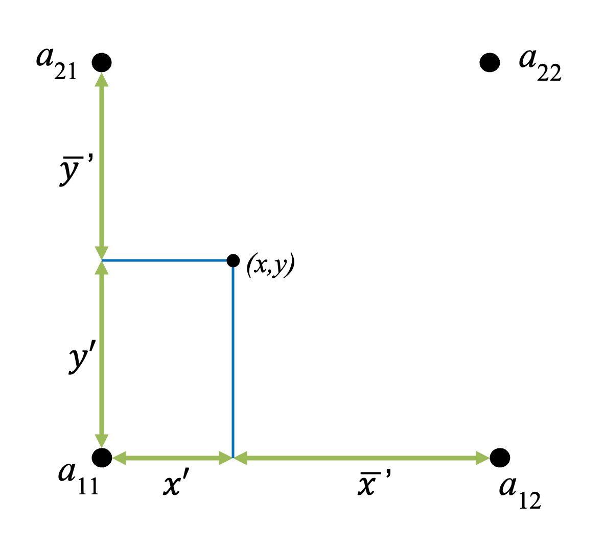

The WRF Preprocessing System (WPS)
==================================

.. role:: underline
    :class: underline

.. role:: nlnote
    :class: nlnote

.. role:: nlheader
    :class: nlheader

The WRF Preprocessing System (WPS) is a set of three programs whose collective role is to prepare input to the real program for real-data simulations. Each program performs one stage of the preparation: 

        * **geogrid** defines model domains and interpolates static geographical data to the grids
        * **ungrib** extracts meteorological fields from GRIB-formatted files
        * **metgrid** horizontally interpolates the meteorological fields extracted by ungrib to the model grids defined by geogrid 
          
The work of vertically interpolating meteorological fields to WRF eta levels is performed within the real program.

|br|

|br|

Data flow between the WPS programs is shown in the figure above. Each program reads parameters from a common namelist file (*namelist.wps*), which contains separate namelist records representing each of the programs, and a shared namelist record, which defines parameters that are used by more than one WPS program. Not shown in the figure are additional table files that are used by individual programs. These tables provide additional control over the programs' operations (and generally do not need to be modified). The *GEOGRID.TBL*, *METGRID.TBL*, and *Vtable* files are explained later in this chapter. 

The build mechanism for the WPS, which is very similar to the build mechanism used by the WRF model, provides options for compiling the WPS on a variety of platforms. When MPI libraries and suitable compilers are available, the metgrid and geogrid programs may be compiled for distributed memory execution, which allows large model domains to be processed in less time. The work performed by the ungrib program is not amenable to parallelization, so ungrib may only be run on a single processor.

|

Function of Each WPS Program
----------------------------

The WPS consists of three independent programs: *geogrid*, *ungrib*, and *metgrid*. Also included in the WPS are several utility programs, which are described in the :ref:`WPS Utility Programs` section. A brief description of each of the three main programs is given below, with further details presented in subsequent sections.

|

Program Geogrid
+++++++++++++++

The purpose of **geogrid** is to define the simulation domains, and to interpolate various terrestrial data sets to the model grids. These domains are defined using information specified by the user in the geogrid namelist record (*&geogrid*) of the WPS namelist file (*namelist.wps*). In addition to computing latitude, longitude, and map scale factors at every grid point, geogrid interpolates soil categories, land use category, terrain height, annual mean deep soil temperature, monthly vegetation fraction, monthly albedo, maximum snow albedo, and slope category to the model grids, by default. Global data sets for each of these fields are provided through the `WPS Geographical Static Data Downloads`_ page, and, because these data are time-invariant, they only need to be downloaded once. Several data sets are available in only one resolution, but others are made available as a "full-resolution" download and as a "low-resolution" download. Generally, the low-resolution sources for static fields are suitable only for code testing and educational purposes, and any applications where model accuracy is of concern should use the full-resolution geographical data sets.

Besides interpolating the default terrestrial fields, the geogrid program is general enough to interpolate most continuous and categorical fields to the simulation domains. New or additional data sets may be interpolated to the simulation domain through the use of the table file, *GEOGRID.TBL*. The GEOGRID.TBL file defines each of the fields that will be produced by geogrid; it describes the interpolation methods to be used for a field, as well as the location on the file system where the data set for that field is located.

Output from geogrid is written in the WRF I/O API format, and thus, by selecting the netCDF I/O format, geogrid can be made to write its output in netCDF for easy visualization using external software packages, including ncview, NCL, and RIP4.

|

Program Ungrib
++++++++++++++

The **ungrib** program reads GRIB files, "degribs" the data, and writes the data in a simple format called the *intermediate format* (see the section on :ref:`Writing Meteorological Data to the Intermediate Format` for details on the format). GRIB files contain time-varying meteorological fields and are typically from another regional or global model, such as NCEP's NAM or GFS models. The ungrib program can read GRIB Edition 1 and, if compiled with a "GRIB2" option, GRIB Edition 2 files.

GRIB files typically contain more fields than are needed to initialize WRF. Both versions of the GRIB format use various codes to identify the variables and levels in the GRIB file. Ungrib uses tables of these codes - called *Vtables*, for "variable tables" - to define which fields to extract from the GRIB file and write to the intermediate format. Details about the codes can be found in the WMO GRIB documentation and in documentation from the originating center. The following *Vtables* for common GRIB model output files are provided with the ungrib software (found in *ungrib/Variable_Tables*):
 
|br|

.. csv-table::
   :header: "Vtable Name", "For Use With", "Input Format"

   "Vtable.AFWAICE", "Air Force Weather Agency (AFWA) ice fields", "Grib1"
   "Vtable.AGRMETSNOW", "AFWA snow fields", "Grib1"
   "Vtable.AGRMETSOIL", "AFWA soil fields with soil category", "Grib1"
   "Vtable.AGRMETSOIL2", "AFWA soil fields with land use & vegetation categories, and green vegetation fraction", "Grib1"
   "Vtable.AGRWRF", "AFWA", "Grib1"
   "Vtable.ARW.UPP", "WRF output that has been processed by UPP; on eta/sigma levels", "Grib1/Grib2"
   "Vtable.ARWp.UPP", "WRF output that has been processed by UPP; on pressure levels", "Grib1/Grib2"
   "Vtable.AVN0P5WRF","AFWA", "Grib1"
   "Vtable.AWIP", "NAM AWIP", "Grib1"
   "Vtable.CFSR", "NCEP Climate Forecast System Reanalysis","Grib1/Grib2"
   "Vtable.CFSR_mean", "NCEP Climate Forecast System Reanalysis monthly mean", "Grib1/Grib2"
   "Vtable.ECMWF", "European Centre for Medium-range Weather Forecasts (ECMWF)", "Grib1"
   "Vtable.ECMWF_sigma", "ECMWF hybrid-level", "Grib1"
   "Vtable.ERA-interim.ml", "ERA-interim model-level", "Grib1"
   "Vtable.ERA-interim.pl", "ERA-interim pressure-level", "Grib1"
   "Vtable.GFDL", "GFDL", "Grib1"
   "Vtable.GFS", "GFS and GFS-FNL Pressure-level data", "Grib1/Grib2"
   "Vtable.GFSENS", "GFS Ensemble", "Grib1/Grib2"
   "Vtable.GODAS", "NCEP's Global Ocean data assimilation system", "Grib1"
   "Vtable.GSM", "GSM data", "Grib1"
   "Vtable.JMAGSM", "Japanese Meteorological Agency Global Spectral Model", "Grib1/Grib2"
   "Vtable.NAM", "North American Model", "Grib1/Grib2"
   "Vtable.NARR", "North American Regional Reanalysis", "Grib1"
   "Vtable.NCEP2", "NCEP/DOE Reanalysis (Reanalysis-2)", "Grib1"
   "Vtable.NNRP", "NCEP/NCAR Reanalysis", "Grib1"
   "Vtable.NOGAPS", "Navy Operational Global Atmospheric Prediction System", "Grib1/Grib2"
   "Vtable.NOGAPS_needs_GFS_soil", "Navy Operational Global Atmospheric Prediction System Surface/Soil Data", "Grib1/Grib2"
   "Vtable.NavySST", "AFWA sea-surface temperature data", "Grib1"
   "Vtable.RAP.hybrid.ncep", "Rapid refresh hybrid-vertical coordinate data", "Grib1/Grib2"
   "Vtable.RAP.pressure.ncep", "Rapid refresh pressure-level data", "Grib1/Grib2"
   "Vtable.RAP.sigma.gsd", "NOAA ESRL Global Systems Division sigma-level data", "Grib1/Grib2"
   "Vtable.RUCb", "Rapid Update Cycle hybrid coordinate data", "Grib1/Grib2"
   "Vtable.RUCp", "Rapid Update Cycle pressure-level data", "Grib1/Grib2"
   "Vtable.SREF", "NCEP's SREF data", "Grib1/Grib2"
   "Vtable.SST", "General sea-surface temperature data", "Grib1/Grib2"
   "Vtable.TCRP", "Twentieth Century Global Reanalysis, Version 2", "Grib1"
   "Vtable.UKMO_ENDGame", "UK Met Office Endgame data", "Grib1/Grib2"
   "Vtable.UKMO_LANDSEA", "UK Met Office landsea data", "Grib1/Grib2"
   "Vtable.UKMO_no_heights", "UK Met Office data, with no heights", "Grib1/Grib2"
   "Vtable.raphrrr", "RAP High-resolution Rapid Refresh", "Grib1/Grib2"

|br|

Users can create their own Vtable for other model output using any of the Vtables as a template; further details on the meaning of fields in a Vtable are provided in the section on :ref:`Creating and Editing Vtables`.

Ungrib can write intermediate data files in any one of three user-selectable formats: WPS - a format containing additional information useful for the downstream programs; SI - an older intermediate format of the WRF system; and MM5 format, which is included here so that ungrib can be used to provide GRIB2 input to the MM5 modeling system. Any of these formats may be used by WPS to initialize WRF, although the WPS format is recommended.

|

Program Metgrid
+++++++++++++++

The **metgrid** program horizontally interpolates the intermediate-format meteorological data that are extracted by the ungrib program onto the simulation domains defined by the geogrid program. The interpolated metgrid output can then be ingested by the WRF *real* program. The range of dates that will be interpolated by metgrid are defined in the *&share* namelist record in namelist.wps, where date ranges must be specified for each simulation domain. Since the work of the metgrid program, like that of the ungrib program, is time-dependent, metgrid is run every time a new simulation is initialized.

The *METGRID.TBL* file controls how each meteorological field is interpolated. It provides one section for each field, and within a section, it is possible to specify options such as interpolation methods to be used for the field, the field that acts as the mask for masked interpolations, and the grid staggering (e.g., U, V in ARW; H, V in NMM) to which a field is interpolated.

Output from metgrid is written in the WRF I/O API format, and thus, by selecting the netCDF I/O format, metgrid can be made to write its output in netCDF for easy visualization using external software packages, including the new version of RIP4.

|

Running the WPS
---------------

There are three primary steps to running the WRF Preprocessing System.

        #. Define a model coarse domain and any nested domains with geogrid.
        #. Extract meteorological fields from GRIB data sets for the simulation period with ungrib.
        #. Horizontally interpolate meteorological fields to the model domains with metgrid.

When multiple simulations are to be run for the same model domains, it is only necessary to perform the first step once; thereafter, only time-varying data need to be processed for each simulation using steps two and three. Similarly, if several model domains are being run for the same time period using the same meteorological data source, it is not necessary to run ungrib separately for each simulation. Below, the details of each of the three steps are explained.

If the WPS software was successfully installed, symbolic links to the *geogrid.exe*, *ungrib.exe*, and *metgrid.exe* programs should exist from the root of the WPS directory structure. In addition to these three links, a namelist.wps file should exist. Thus, a listing in the WPS root directory should look something like:

.. code-block::
   
        > ls -ls

        drwxr-xr-x 2   4096 arch
        -rwxr-xr-x 1   1765 clean
        -rwxr-xr-x 1   4795 compile
        -rw-r--r-- 1 118862 compile.log
        -rwxr-xr-x 1  16613 configure
        -rw-r--r-- 1   3424 configure.wps
        drwxr-xr-x 4   4096 geogrid
        lrwxrwxrwx 1     23 geogrid.exe -> geogrid/src/geogrid.exe
        -rwxr-xr-x 1   1331 link_grib.csh
        drwxr-xr-x 3   4096 metgrid
        lrwxrwxrwx 1     23 metgrid.exe -> metgrid/src/metgrid.exe
        -rw-r--r-- 1    705 namelist.wps
        -rw-r--r-- 1   2749 namelist.wps.all_options
        -rw-r--r-- 1   1637 namelist.wps.global
        -rw-r--r-- 1   6232 README
        drwxr-xr-x 4   4096 ungrib
        lrwxrwxrwx 1     21 ungrib.exe -> ungrib/src/ungrib.exe
        drwxr-xr-x 3   4096 util

|

Step1: Define model domains with geogrid
++++++++++++++++++++++++++++++++++++++++

The model coarse domain and any nested domains are defined in the *&geogrid* record of the namelist.wps file, and, additionally, parameters in the *&share* namelist record need to be set. An example of these two namelist records is given below (see :ref:`WPS Namelist Variables` for more information on the purpose and options for each variable).

.. code-block::

        &share
          wrf_core = 'ARW',
          max_dom = 2,
          start_date = '2019-09-04_12:00:00','2019-09-04_12:00:00',
          end_date   = '2019-09-06_18:00:00','2019-09-04_12:00:00',
          interval_seconds = 10800,
          io_form_geogrid = 2
        /
        
        &geogrid
          parent_id         =   1,   1,
          parent_grid_ratio =   1,   3,
          i_parent_start    =   1,  53,
          j_parent_start    =   1,  25,
          e_we              =  150, 220,
          e_sn              =  130, 214,
          geog_data_res     = 'default','default',
          dx = 15000,
          dy = 15000,
          map_proj = 'lambert',
          ref_lat   =  33.00,
          ref_lon   = -79.00,
          truelat1  =  30.0,
          truelat2  =  60.0,
          stand_lon = -79.0.,
          geog_data_path = '/glade/work/wrfhelp/WPS_GEOG/'
        /

|br|

To summarize a set of typical changes to the *&share* namelist record relevant to **geogrid**, 

        * **wrf_core** : the WRF dynamical core. If WPS is being run for an ARW simulation, wrf_core should be set to 'ARW', and if running for an NMM simulation, it should be set to 'NMM'. 
        * **max_dom** : the total number of domains (in the case of ARW) or nesting levels (in the case of NMM)  
        * **io_form_geogrid** : the output format for geogrid-produced files (*geo_em*\*)
          
        .. note::
           *Since geogrid produces only time-independent data, the start_date, end_date, and interval_seconds variables are ignored by geogrid. Optionally, a location (if not the default, which is the current working directory) to which domain files should be written may be indicated with the opt_output_from_geogrid_path variable*

|br|

In the *&geogrid* namelist record, the projection of the simulation domain is defined, as are the size and location of all model grids. The map projection is specified with the *map_proj* variable. Each of the four possible map projections are shown graphically in the figure below, and the namelist variables used to set the parameters of the projection are summarized in the following table.

|br|

.. csv-table::
   :header: "Map Projection / Value of map_proj", "Projection Parameters"

   "Lambert Conformal / 'lambert'", "truelat1 |br| truelat2 (optional) |br| stand_lon"
   "Mercator / 'mercator'", "truelat1"
   "Polar Stereographic / 'polar'", "truelat1 |br| stand_lon"
   "Regular Latitude-Longitude, or |br| Cylindrical Equidistant / 'lat-lon'", "pole_lat |br| pole_lon |br| stand_lon"

|

In the below illustrations of the Lambert conformal, polar stereographic, and Mercator projections, the so-called true latitude (or true latitudes, in the case of the Lambert conformal), is the latitude at which the surface of projection intersects or is tangent to the surface of the earth. At this latitude, there is no distortion in the distances in the map projection, while at other latitudes, the distance on the surface of the earth is related to the distance on the surface of projection by a *map scale factor*. Ideally, the map projection and its accompanying parameters should be chosen to minimize the maximum distortion within the area covered by the model grids, since a high amount of distortion, evidenced by map scale factors significantly different from unity, can restrict the model time step more than necessary. As a general guideline, 

        * the **polar stereographic** projection is best suited for high-latitude WRF domains, 
        * the **Lambert conformal** projection is well-suited for mid-latitude domains, and 
        * the **Mercator** projection is good for low-latitude domains or domains with predominantly west-east extent. 
        * The **cylindrical equidistant** projection is required for global simulations, although in its rotated aspect (i.e., when *pole_lat*, *pole_lon*, and *stand_lon* are changed from their default values) it can also be well-suited for regional domains anywhere on the earth's surface.

|br|

|

When configuring a rotated latitude-longitude grid, the namelist parameters *pole_lat*, *pole_lon*, and *stand_lon* should be set. 

        * **pole_lat** and **pole_lon** : specify the latitude and longitude of the geographic north pole within the model's computational grid
        * **stand_lon** : gives the rotation about the earth's axis. 
          
The computational grid refers to the regular latitude-longitude grid on which model computation is done, and on whose latitude circles Fourier filters are applied at high latitudes (refer to the `WRF Version 4 Technical Note`_ for details on this filtering process). Note that the computational latitude-longitude grid is always represented with computational latitude lines running parallel to the x-axis of the model grid, and computational longitude lines running parallel to the y-axis of the grid.

If the earth's geographic latitude-longitude grid coincides with the computational grid, a global domain shows the earth's surface as it is normally visualized on a regular latitude-longitude grid (as is shown in the top half of the figure below). If, instead, the geographic grid does not coincide with the model computational grid, geographical meridians and parallels appear as complex curves - see the bottom half of the example below, where the geographic grid (not shown) has been rotated so that the geographic poles of the earth are no longer located at the poles of the computational grid.

|br|

|br|

|

When running WRF for a regional domain configuration, the location of the coarse domain is determined using the following namelist parameters. 

.. csv-table::
   :widths: 25, 40
   :width: 80%
   :escape: \

   **ref_lat** |br| **ref_lon**, Specify the latitude and longitude\, respectively\, of the center of the coarse domain
   **i_parent_start** |br| **j_parent_start**, (If nested domains are to be processed) nest locations with respect to the parent domain; further details of setting up nested domains are provided in the :ref:`WPS Nested Domains` section below. 

|br|

The dimensions of the coarse domain are determined by the following variables.

.. csv-table::
   :widths: 25, 40
   :width: 80%
   :escape: \

   **dx** |br| **dy**, Specify the nominal grid distance in the x-direction and y-direction
   **e_we** |br| **e_sn**, Give the number of velocity points (i.e.\, u-staggered or v-staggered points) in the x- and y-directions |br| |br| For the 'lambert'\, 'mercator'\, and 'polar' projections\, dx and dy are given in meters\, and for the 'lat-lon' projection\, dx and dy are given in degrees |br| |br| For nested domains\, only the variables e_we and e_sn are used to determine the dimensions of the grid\, and dx and dy should not be specified for nests since their values are determined recursively based on the values of the parent_grid_ratio and parent_id variables\, which specify the ratio of a nest's parent grid distance to the nest's grid distance and the grid number of the nest's parent\, respectively.

|br|

If using the regular latitude-longitude projection for a regional domain, ensure that map scale factors in the region covered by the domain do not deviate significantly from unity. To do this, rotate the projection such that the area covered by the domain is located near the equator of the projection, since, for the regular latitude-longitude projection, map scale factors in the x-direction are given by the cosine of the computational latitude. For example, in the figure above showing the unrotated and rotated earth, in the rotated aspect, New Zealand is located along the computational equator, and thus, the rotation used would be suitable for a domain covering New Zealand. As a general guideline for rotating the latitude-longitude projection for regional domains, the namelist parameters *pole_lat*, *pole_lon*, and *stand_lon* may be chosen according to the formulas in the following table.

|br|

.. csv-table::
   :header: "Namelist Parameter Name", "(ref_lat, ref_lon) |br| in North. Hemisphere", "(ref_lat, ref_lon) |br| in South. Hemisphere"
   :width: 80%
   :widths: 10,25,25

   "pole_lat", "90.0 - ref_lat", "90.0 + ref_lat"
   "pole_lon", "180.0", "0.0"
   "stand_lon", "-ref_lon", "180.0 - ref_lon"

|br|

For global WRF simulations, the coverage of the coarse domain is, of course, global, so *ref_lat* and *ref_lon* do not apply, and *dx* and *dy* should not be specified, since the nominal grid distance is computed automatically based on the number of grid points. Also note that the latitude-longitude, or cylindrical equidistant projection (*map_proj = 'lat-lon'*) is the only WRF projection that can support a global domain. 

|br|

        .. note::
           *Nested domains within a global domain must not cover any area north of computational latitude +45 or south of computational latitude -45, since polar filters are applied poleward of these latitudes (although the cutoff latitude can be changed in the WRF namelist).*

|br|

Besides setting variables related to projection, location, and coverage of model domains, the path to static geographical data sets must be specified with the *geog_data_path* variable. Setting *geog_data_res* tells geogrid which resolution of static data to interpolate from, and the value should match one of the data resolutions in the GEOGRID.TBL.

Depending on the value of the *wrf_core* namelist variable, the appropriate GEOGRID.TBL file must be used with geogrid, since the grid staggerings that WPS interpolates to differ between dynamical cores. For the ARW, the GEOGRID.TBL.ARW file should be used, and for the NMM, the GEOGRID.TBL.NMM file should be used. Select the appropriate GEOGRID.TBL by linking the correct file to GEOGRID.TBL in the geogrid directory (or in the directory specified by *opt_geogrid_tbl_path*, if this variable is set in the namelist).

.. code-block::
        
        > ls -ls geogrid/GEOGRID.TBL
          
          lrwxrwxrwx  1         15  GEOGRID.TBL -> GEOGRID.TBL.ARW

For definitions and options for each variable, refer to :ref:`WPS Namelist Variables`.

|

Having suitably defined the simulation coarse domain and nested domains in namelist.wps, the geogrid.exe executable may be run to produce domain files. In the case of ARW domains, domain files are named geo_em.d0N.nc, where N is the number of the nest defined in each file. When run for NMM domains, geogrid produces the file geo_nmm.d01.nc for the coarse domain, and geo_nmm_nest.l0N.nc files for each nesting level N. Also, note that the file suffix will vary depending on the io_form_geogrid that is selected. To run geogrid, issue the following command:

.. code-block::

        > ./geogrid.exe

|br|

When geogrid.exe has finished running, the message

.. code-block::

        !!!!!!!!!!!!!!!!!!!!!!!!!!!!!!!!!!!!!!!!!!!!!
        !  Successful completion of geogrid.        !
        !!!!!!!!!!!!!!!!!!!!!!!!!!!!!!!!!!!!!!!!!!!!!

should be printed, and a listing of the WPS root directory (or the directory specified by *opt_output_from_geogrid_path*, if this variable was set) should display the domain files. If not, consult the *geogrid.log* file to determine the possible cause of failure. See :ref:`Checking WPS Output` for more information.

.. code-block::

        > ls -ls
        
        -rw-r--r-- 1  1957004 geo_em.d01.nc
        -rw-r--r-- 1  4745324 geo_em.d02.nc
        -rw-r--r-- 1    11169 geogrid.log

|

Step 2: Extracting Meteorological Fields from GRIB Files with Ungrib
++++++++++++++++++++++++++++++++++++++++++++++++++++++++++++++++++++

Having already downloaded meteorological data in GRIB format, the first step in extracting fields to the intermediate format involves editing the *share* and *ungrib* namelist records of the namelist.wps file - the same file that was edited to define the simulation domains. An example of the two namelist records is given below.
       
.. code-block::

        &share
          wrf_core = 'ARW',
          max_dom = 2,
          start_date = '2019-09-04_12:00:00','2019-09-04_12:00:00',
          end_date   = '2019-09-04_18:00:00','2019-09-04_12:00:00',
          interval_seconds = 10800,
          io_form_geogrid = 2
        /

        &ungrib
          out_format = 'WPS',
          prefix     = 'FILE'
        /

|br|

In the *share* namelist record, variables relevant to ungrib are the starting and ending times of the coarse domain (*start_date* and *end_date*; alternatively, *start_year*, *start_month*, *start_day*, *start_hour*, *end_year*, *end_month*, *end_day*, and *end_hour*) and the interval between meteorological data files (*interval_seconds*). 

In the *ungrib* namelist record, the variable *out_format* is used to select the intermediate data format ungrib will write; the metgrid program can read any format supported by ungrib ('WPS', 'SI', and 'MM5' - the recommended value is 'WPS'). Users may also specify a path and prefix for the intermediate files with the *prefix* variable. For example, if *prefix* is set to 'GFS', then the ungrib-generated intermediate files are named according to GFS:YYYY-MM-DD_HH, where YYYY-MM-DD_HH is the valid time of the data in the file.

After suitably modifying namelist.wps, a Vtable must be supplied, and the GRIB files must be linked (or copied) to the filenames expected by ungrib. The WPS is supplied with Vtable files for many sources of meteorological data, and the appropriate Vtable may be symbolically linked to the file *Vtable*, which is the Vtable name expected by ungrib. For example, if the GRIB data are from the GFS model: 

.. code-block::

      > ln -s ungrib/Variable_Tables/Vtable.GFS Vtable

|br|

Ungrib will try to read GRIB files named *GRIBFILE.AAA*, *GRIBFILE.AAB*, ..., *GRIBFILE.ZZZ*. To link the GRIB files to these filenames, a shell script, *link_grib.csh*, is provided. The link_grib.csh script takes as a command-line argument a list of GRIB files to be linked. For example, if the GRIB data were downloaded to the directory /data/gfs, the files are linked with link_grib.csh as follows:

.. code-block::

        > ls -ls /data/gfs
        
        -rw-r--r-- 1  42728372 gfs_20190904_12_00
        -rw-r--r-- 1  48218303 gfs_20190904_12_03
        -rw-r--r-- 1  48218303 gfs_20190904_12_06

        > ./link_grib.csh /data/gfs/gfs*

|br|

After linking the GRIB files and Vtable, a listing of the WPS directory should show the linked GRIBFILE* files and their linked paths.

.. code-block::

        > ls -ls
        
        lrwxrwxrwx 1       38 GRIBFILE.AAA -> /data/gfs/gfs_20190904_12_00
        lrwxrwxrwx 1       38 GRIBFILE.AAA -> /data/gfs/gfs_20190904_12_03
        lrwxrwxrwx 1       38 GRIBFILE.AAB -> /data/gfs/gfs_20190904_12_06

|br|

After editing namelist.wps and linking the appropriate Vtable and GRIB files, the ungrib.exe executable is run to produce meteorological data files in the intermediate format. To run ungrib, type the following:

.. code-block::

        > ./ungrib.exe

|br|

If ungrib.exe runs successfully, the message

.. code-block::

       !!!!!!!!!!!!!!!!!!!!!!!!!!!!!!!!!!!!!!!!!!!!!
       !  Successful completion of ungrib.         !
       !!!!!!!!!!!!!!!!!!!!!!!!!!!!!!!!!!!!!!!!!!!!!

will be written to the end of the ungrib.output file, and the intermediate files should appear in the current working directory. Intermediate files written by ungrib will have names of the form *FILE:YYYY-MM-DD_HH* (unless, of course, the prefix variable was set to a prefix other than *FILE*).

.. code-block::

       > ls -ls
       
       -rw-r--r-- 1  154946888 FILE:2019-09-04_12
       -rw-r--r-- 1  154946888 FILE:2019-09-04_15
       -rw-r--r-- 1  154946888 FILE:2019-09-04_18
 
|

Step 3: Horizontally interpolating meteorological data with metgrid
+++++++++++++++++++++++++++++++++++++++++++++++++++++++++++++++++++

In the final step of running the WPS, meteorological data extracted by ungrib are horizontally interpolated to the simulation grids defined by geogrid. In order to run metgrid, the *share* and *metgrid* namelist records of the namelist.wps file must be edited. Examples of these records are shown below.

.. code-block::

        &share
          wrf_core = 'ARW',
          max_dom = 2,
          start_date = '2019-09-04_12:00:00','2019-09-04_12:00:00',
          end_date   = '2019-09-04_18:00:00','2019-09-04_12:00:00',
          interval_seconds = 10800,
          io_form_geogrid = 2
        /

        &metgrid
          fg_name                      = 'FILE',
          io_form_metgrid              = 2,
        /

|br|

By this point, there is generally no need to change any variables in the *share* namelist record, since those variables should have been suitably set in previous steps. If the *share* namelist was not edited while running geogrid and ungrib, however, the WRF dynamical core, number of domains, starting and ending times, interval between meteorological data, and path to the static domain files must be set in the *share* namelist record, as described in the steps to run geogrid and ungrib.

In the *metgrid* namelist record, the path and prefix of the intermediate meteorological data files must be given with *fg_name*, the full path and file names of any intermediate files containing constant fields may be specified with the *constants_name* variable, and the output format for the horizontally interpolated files may be specified with the *io_form_metgrid* variable. Other variables in the *metgrid* namelist record, namely, *opt_output_from_metgrid_path* and *opt_metgrid_tbl_path*, allow specification of the location where interpolated data files should be written by metgrid, and where the METGRID.TBL file may be found.

As with geogrid and the GEOGRID.TBL file, a *METGRID.TBL* file appropriate for the WRF core must be linked in the metgrid directory (or in the directory specified by opt_metgrid_tbl_path, if this variable is set). If using the ARW core, by default, the below is already set. 

.. code-block::

        > ls -ls metgrid/METGRID.TBL
        
        lrwxrwxrwx 1      15 METGRID.TBL -> METGRID.TBL.ARW

After suitably editing namelist.wps and verifying that the correct METGRID.TBL will be used, metgrid is run by issuing the command

.. code-block::

        > ./metgrid.exe

|br|

If metgrid successfully ran, the message

.. code-block::

        !!!!!!!!!!!!!!!!!!!!!!!!!!!!!!!!!!!!!!!!!!!!!
        !  Successful completion of metgrid.        !
        !!!!!!!!!!!!!!!!!!!!!!!!!!!!!!!!!!!!!!!!!!!!!

is printed and metgrid output files should appear in the WPS root directory (or in the directory specified by *opt_output_from_metgrid_path*, if this variable was set). These files will be named *met_em.d0N.YYYY-MM-DD_HH:mm:ss.nc* in the case of ARW domains, where N is the number of the nest whose data reside in the file, or *met_nmm.d01.YYYY-MM-DD_HH:mm:ss.nc* in the case of NMM domains. Here, *YYYY-MM-DD_HH:mm:ss* refers to the date of the interpolated data in each file. If these files do not exist for each of the times in the range given in the *share* namelist record, consult the *metgrid.log* file to determine the problem in running metgrid.

.. code-block::

        > ls -ls
        
        -rw-r--r-- 1    5217648 met_em.d01.2008-03-24_12:00:00.nc
        -rw-r--r-- 1    5217648 met_em.d01.2008-03-24_18:00:00.nc
        -rw-r--r-- 1   12658200 met_em.d02.2008-03-24_12:00:00.nc
        -rw-r--r-- 1      65970 metgrid.log

|

.. _WPS Nested Domains:

WPS Nested Domains
------------------

Running the WPS for nested-domain simulations is similar to running for a single-domain case; the difference with nested-domain simulations is that the geogrid and metgrid programs process more than one grid when they are run, rather than a single grid for the simulation. In order to specify the size and location of nests, a number of variables in the namelist.wps file must be given lists of values, one value per nest.

.. code-block::

        &share
          max_dom = 2,
          start_date = '2019-09-04_12:00:00','2019-09-04_12:00:00',
          end_date   = '2019-09-04_18:00:00','2019-09-04_12:00:00',
        /

        &geogrid
          parent_id         =   1,   1,
          parent_grid_ratio =   1,   3,
          i_parent_start    =   1,  53,
          j_parent_start    =   1,  25,
          e_we              =  150, 220,
          e_sn              =  130, 214,
          geog_data_res     = 'default','default',
        /

|br|

The namelist variables that are affected by nests are displayed in the (partial) namelist records above. The example shows namelist variables for a two-domain run (the coarse domain, plus a single nest), and the effect on the namelist variables generalize to multiple nests in the obvious way: rather than specifying lists of two values, lists of N values must be specified, where N is the total number of model grids.

In the above example, the *max_dom* variable in the *share* namelist record is set to the total number of nests in the simulation, including the coarse domain. Then all other affected namelist variables must be given a list of N values, one for each grid. The only other change to the *share* namelist record is to the starting and ending times. Here, a starting and ending time must be given for each nest, with the restriction that a nest cannot begin before its parent domain or end after its parent domain; also, it is suggested that nest starting and ending times are both set to the starting time of the nest when running WPS. This is because nests get their lateral boundary conditions from their parent domain, and thus, only the initial time for a nest needs to be processed by WPS, **except when grid nudging, also called analysis nudging, and/or the sst_update option, is used in WRF**. *Note that when running WRF, the actual starting and ending times for all nests must be given in the WRF namelist.input file.*

In the *geogrid* namelist record, the parent of each nest must be specified with the *parent_id* variable. Every nest must be a child of exactly one other nest, with the coarse domain being its own parent. The nest's refinement ratio with respect to its parent, which is given by the *parent_grid_ratio* variable, determines the nominal grid spacing for a nest in relation to the grid spacing of the its parent.

|br|

|br|

Next, the lower-left corner of a nest is specified as an (i, j) location in the nest's parent domain, using the *i_parent_start* and *j_parent_start* variables, and the specified location is given with respect to the unstaggered grid. Finally, the dimensions of each nest, in grid points, are given for each nest using the *s_we*, *e_we*, *s_sn*, and *e_sn* variables. The nesting setup in our example namelist is illustrated in the figure above, where it may be seen how each of the above-mentioned variables is determined. Starting grid point values in the south-north (s_sn) and west-east (s_we) directions must be specified as 1, and ending grid point values (e_sn and e_we) determine the nest's full dimensions; to ensure that the upper-right corner of the nest's grid is coincident with an unstaggered grid point in the parent domain, both e_we and e_sn must be one greater than some integer multiple of the nesting ratio. Also, for each nest, the source data resolution (or list of resolutions) to interpolate from is specified with the *geog_data_res* variable. For a complete description of these namelist variables, refer to :ref:`WPS Namelist Variables`.

|

USGS and MODIS Land Use
-----------------------

By default, the geogrid program interpolates land use categories from MODIS IGBP 21-category data. However, an alternative set of land use categories based on the USGS land-cover classification may be selected. Although MODIS-based data contain 21 categories of land use, these categories are not a subset of the 24 USGS categories. See :ref:`Land Use and Soil Categories in the Static Data` for a listing of the specific land use categories for either data set. 

24-category USGS-based land use data may be selected instead of the MODIS data at run-time using the *geog_data_res* variable in the *&geogrid* namelist record by prefixing each resolution of static data with the string *usgs_lakes+*. For example, in a two-domain configuration, where *geog_data_res* would ordinarily be specified as

.. code-block::

        geog_data_res = 'default', 'default',

it should instead be specifed as

.. code-block::

        geog_data_res = 'usgs_lakes+default', 'usgs_lakes+default',

|br|

This change instructs the geogrid program to look in each entry of the GEOGRID.TBL for a resolution of static data denoted by 'usgs_lakes', and if such a resolution is not available, to instead look for a resolution denoted by the string following the '+'. Thus, for the GEOGRID.TBL entry for the LANDUSEF field, the USGS-based land use data, identified with the string 'usgs_lakes', would be used instead of the 'default' resolutions (or source) of land-use data in the example above; for all other fields, the 'default' resolutions would be used for the first and second. As an aside, when none of the resolutions specified for a domain in geog_data_res is found in a GEOGRID.TBL entry, the resolution denoted by 'default' will be used.

        .. note::
           To change from the default 21-class MODIS land-use data, the 'num_land_cat' variable must be set to '21' in the 'physics' namelist record in the WRF namelist.input file. For 24-class USGS data, 'num_land_cat' should be set to 24.

|

Gravity Wave Drag Scheme Static Data
------------------------------------

The WRF gravity wave drag by orography (GWDO) scheme requires ten static fields from the WPS, which are interpolated by the geogrid program (regardless of whether the GWDO scheme will be used in the model). When the GWDO scheme is not used, the fields will simply be ignored in WRF. If the GWDO scheme will be used, however, these fields should be interpolated from a source data resolution that is slightly lower (i.e., coarser) in resolution than the model grid; consequently, an appropriate resolution of GWDO static data should be selected. Five resolutions of GWDO static data are available: 2-degree, 1-degree, 30-minute, 20-minute, and 10-minute, denoted by the strings '2deg', '1deg', '30m', '20m', and '10m', respectively. To select the resolution to interpolate from, the *geog_data_res* variable should be set in the *geogrid* namelist record by the string 'XXX+', where *XXX* is one of the five available resolutions. For example, in a model configuration with a 48-km grid spacing, *geog_data_res* is typically specified as

.. code-block::

        geog_data_res = 'default',

|br|

However, if the GWDO scheme were employed, the finest resolution of GWDO static data that is still lower in resolution than the model grid would be the 30-minute data, in which case the setting should be 

.. code-block::

        geog_data_res = '30m+default',

|br|

If none of '2deg', '1deg', '30m', or '20m' are specified in combination with other resolutions of static data in the geog_data_res variable, the default resolution of '10m' GWDO static data will be used. Note that if 10-minute resolution GWDO data are used, but a different resolution is desired for other static fields (e.g., topography height), '10m' should be emitted from the value given to the geog_data_res variable, since specifying

.. code-block::

        geog_data_res = '10m+30s',

for example, would cause geogrid to use the 10-minute data in preference to the 30-second data for the non-GWDO fields, such as topography height and land use category, as well as for the GWDO fields.

|

Using Multiple Meteorological Data Sources
------------------------------------------

|br|

Interpolating Time-invariant Fields
+++++++++++++++++++++++++++++++++++

The metgrid program is capable of interpolating time-invariant fields using the *constants_name* variable in the *metgrid* namelist record. This variable may be set to a list of filenames - including path information where necessary - of intermediate-formatted files, that contains time-invariant fields, and should be used in the output for every time period processed by metgrid. For example, short simulations may use a constant SST field; this field need only be available at a single time, and may be used by setting the constants_name variable to the path and filename of the SST intermediate file. Typical uses of constants_name might look like

.. code-block::

        &metgrid
          constants_name = '/data/ungribbed/constants/SST_FILE:2006-08-16_12'
        /

or

.. code-block::

        &metgrid
          constants_name = 'LANDSEA', 'SOILHGT'
        /

|

Interpolating from Multiple Sources of Meteorological Data
++++++++++++++++++++++++++++++++++++++++++++++++++++++++++

Metgrid is also capable of interpolating data from multiple sources, which may be useful when two or more complementary data sets must be combined to produce the full input data needed by real.exe. To interpolate from multiple sources of time-varying, meteorological data, the *fg_name* variable in the *metgrid* namelist record should be set to a list of prefixes of intermediate files, including path information when necessary. When multiple path-prefixes are given, and the same meteorological field is available from more than one of the sources, data from the last-specified source will take priority over all preceding sources. Thus, data sources may be prioritized by the order in which the sources are given.

As an example, if surface fields are given in one data source and upper-air data are given in another, the values assigned to the fg_name variable may look something like:

.. code-block::

        &metgrid
          fg_name = '/data/ungribbed/SFC', '/data/ungribbed/UPPER_AIR'
        /

|br|

To simplify the process of extracting fields from GRIB files, the *prefix* namelist variable in the *ungrib* namelist record may be employed. This allows control of the names of (and paths to) the intermediate files created by ungrib. As an example, suppose we wish to work with the North American Regional Reanalysis (NARR) data set, which is split into separate GRIB files for 3-dimensional atmospheric data, surface data, and fixed-field data. Before running ungrib.exe, we should link the "3D" GRIB files using the *link_grib.csh* script, link the NARR Vtable to the filename Vtable, and edit the prefix variable to an appropriate prefix:

.. code-block::

        &ungrib
          out_format = 'WPS',
          prefix = 'NARR_3D',
        /

|br|

After running ungrib.exe, the following files should exist (with a suitable substitution for the appropriate dates):

.. code-block::

        NARR_3D:2008-08-16_12
        NARR_3D:2008-08-16_15
        NARR_3D:2008-08-16_18
        ...

|br|

We may then process the surface fields by linking the surface GRIB files and changing the prefix variable to reflect the appropriate intermediate file prefix:

.. code-block::

        &ungrib
          out_format = 'WPS',
          prefix = 'NARR_SFC',
        /

|br|

Again running ungrib.exe, the following should exist, in addition to the NARR_3D files:

.. code-block::

        NARR_SFC:2008-08-16_12
        NARR_SFC:2008-08-16_15
        NARR_SFC:2008-08-16_18
        ...

|br|

Finally, the fixed file is linked with the link_grib.csh script, and the prefix variable in the namelist is again set:

.. code-block::

        &ungrib
          out_format = 'WPS',
          prefix = 'NARR_FIXED',
        /

|br|

The fixed fields should now be available, in addition to the surface and "3D" fields:

.. code-block::

        NARR_FIXED:1979-11-08_00

|br|

For the sake of clarity, the fixed file may be renamed to remove any date information, for example, by renaming it to simply NARR_FIXED, since the fields in the file are static. In this example, the NARR fixed data are only available at a specific time, 1979 November 08 at 0000 UTC, and thus, the correct starting and ending time for the data will need to be set in the &share namelist record before ungrib is run on the NARR fixed file; *the times should be re-set before metgrid is run*.

Given intermediate files for all three parts of the NARR data set, metgrid.exe may be run after the *constants_name* and *fg_name* variables in the &metgrid namelist record are set:

.. code-block::

        &metgrid
          constants_name = 'NARR_FIXED',
          fg_name = 'NARR_3D', 'NARR_SFC'
        /

|br|

Although a less common situation, multiple data sources would be required when a source of meteorological data from a regional model is insufficient to cover the entire simulation domain, and data from a larger regional model, or a global model, must be used when interpolating to the remaining points of the simulation grid.

For example, to use NAM data wherever possible, and GFS data elsewhere, the following values might be assigned in the namelist:

.. code-block::

        &metgrid
          fg_name = '/data/ungribbed/GFS', '/data/ungribbed/NAM'
        /

|br|

Then the resulting model domain would use data as shown in the figure below.

|br|

|br|

If no field is found in more than one source, then no prioritization need be applied by metgrid, and each field will simply be interpolated as usual; of course, each source should cover the entire simulation domain to avoid areas of missing data.

|

Using Non-isobaric Meteorological Data Sets
-------------------------------------------

When using non-isobaric meteorological data sets to initialize a WRF simulation, they must be supplied to the metgrid.exe program with 3-d pressure and geopotential height fields on the same levels as other 3-d atmospheric variables, such as temperature and humidity. These fields are used by the WRF real.exe pre-processor for vertical interpolation to WRF model levels, for surface pressure computation, and for other purposes.

For some data sources (namely ECMWF model-level data and UK Met Office model data), 3-d pressure and/or geopotential height fields can be derived from the surface pressure and/or surface height fields using an array of coefficients, and the :ref:`WPS Utility Programs` (specifically, *calc_ecmwf_p.exe* and *height_ukmo.exe*) are available to perform this derivation.

Other meteorological data sets explicitly provide 3-d pressure and geopotential height fields, and it must only be ensured that these fields exist in the set of intermediate files provided to the metgrid.exe program.

|

Alternative Initialization of Lake SSTs
---------------------------------------

By default, metgrid interpolates the SST field - both for oceans and lakes - from the intermediate files to all water points in the WRF domain. However, if the lakes that are resolved in the WRF domain are not resolved in the GRIB data, and especially if those lakes are geographically distant from resolved water bodies, SST over lakes will most likely be extrapolated from the nearest resolved water bodies in the GRIB data; this situation can lead to lake SST values that are either unrealistically warm or unrealistically cold.

Without a higher-resolution SST field for metgrid to use, one alternative to extrapolating SST values for lakes is to manufacture a "best guess" at the SST for lakes. In the metgrid and real programs, this can be done using a combination of a special land use data set that distinguishes between lakes and oceans, and a field to be used as a proxy for SST over lakes. A special land use data set is necessary, since WRF's real pre-processing program needs to know where the manufactured SST field should be used instead of the interpolated SST field from the GRIB data.

The alternative procedure for initializing lake SSTs is summarized in the following steps:

1. Before running geogrid, ensure the specification of *geog_data_res* in the &geogrid namelist record indicates either the USGS-based or the MODIS-based land use data with inland water bodies. By default geogrid uses MODIS-based land use that contains a lake category; however, a USGS land use data set that contains a lake category may also be used. For example, in a two-domain configuration, setting

.. code-block::

        geog_data_res = 'usgs_lakes+default', 'usgs_lakes+default',

tells geogrid to use the USGS-based land use data for both domains.

Running geogrid should result in output files that use a separate category for inland water bodies instead of the general water category used for oceans and seas. The lake category is identified by the global attribute ISLAKE in the geogrid output files; this attribute should be set to either 28 (in the case of USGS-based data) or 21 (in the case of the MODIS-based data). See, e.g., the list of :ref:`WPS Output Fields`, where a value of *-1* for *ISLAKE* indicates there is no separate lake category.

2. After running ungrib, use the *avg_tsfc.exe* utility to create an intermediate file containing a daily-average surface air temperature field, which substitutes the SST field only over lakes in the real program; for more information on the avg_tsfc.exe utility, see `WPS Utility Programs`. 

3. Before running the metgrid program, add the *TAVGSFC* file created in the previous step to the specification of *constants_name* in the &metgrid record of the namelist.wps file.

4. Run WRF's real.exe program as usual after setting the number of land categories (*num_land_cat*) in the &physics record of namelist.input to match the global attribute *NUM_LAND_CAT* in the metgrid files. If the global attribute *ISLAKE* in the metgrid files indicates there is a special land use category for lakes, the real program will substitute the *TAVGSFC* field for the *SST* field only over those grid points whose category matches the lake category; additionally, the real program will change the land use category of lakes back to the general water category (the category used for oceans), since neither the LANDUSE.TBL nor the VEGPARM.TBL files contain an entry for a lake category.

|

Parallelism in the WPS
----------------------

If the dimensions of the domains to be processed by the WPS become too large to fit in the memory of a single CPU, it is possible to run the geogrid and metgrid programs in a distributed memory configuration. In order to compile geogrid and metgrid for distributed memory execution, MPI libraries must be installed on the target machine, and WPS must be compiled using one of the "DM parallel" configuration options. Upon successful compilation, the geogrid and metgrid programs may be run with the ``mpirun`` or ``mpiexec`` commands, or through a batch queuing system, depending on the machine.

The ungrib program is not amenable to parallelization, and, further, the memory requirements for ungrib's processing are independent of the memory requirements of geogrid and metgrid; thus, **ungrib is always compiled for a single processor and run on a single CPU**, regardless of whether a "DM parallel" configuration option is selected during configuration.

Each of the standard WRF I/O API formats (netCDF, GRIB1, binary) has a corresponding parallel format, whose number is given by adding 100 to the *io_form* value (i.e., the value of *io_form_geogrid* and *io_form_metgrid*) for the standard format. It is not necessary to use a parallel io_form, but when one is used, each CPU will read/write its input/output to a separate file, whose name is simply the name that would be used during serial execution, but with a four-digit processor ID appended to the name. For example, running geogrid on four processors with io_form_geogrid=102 would create output files named *geo_em.d01.nc.0000*, *geo_em.d01.nc.0001*, *geo_em.d01.nc.0002*, and *geo_em.d01.nc.0003* for the coarse domain.

During distributed-memory execution, model domains are decomposed into rectangular patches, with each processor working on a single patch. When reading/writing from/to the WRF I/O API format, each processor reads/writes only its patch. Consequently, if a parallel io_form is chosen for the output of geogrid, metgrid must be run using the same number of processors as were used to run geogrid. Similarly, if a parallel io_form is chosen for the metgrid output files, the real program must be run using the same number of processors. Of course, it is still possible to use a standard io_form when running on multiple processors, in which case all data for the model domain is distributed/collected upon input/output. As a final note, when geogrid or metgrid are run on multiple processors, each processor writes its own log file with names appended with the same four-digit processor ID numbers used for the I/O API files.

|

.. _Checking WPS Output:

Checking WPS Output
-------------------

When running the WPS, it may be helpful to examine the output produced by the programs. For example, when determining the location of nests, it may be helpful to see the interpolated static geographical data and latitude/longitude fields. As another example, when importing a new source of data into WPS - either static data or meteorological data - it can often be helpful to check the resulting interpolated fields in order to make adjustments to the interpolation methods used by geogrid or metgrid.

By using the netCDF format for the geogrid and metgrid I/O forms, a variety of visualization tools that read netCDF data may be used to check the domain files processed by geogrid or the horizontally interpolated meteorological fields produced by metgrid. In order to set the file format for geogrid and metgrid to netCDF, io_form_geogrid and io_form_metgrid should be set to '2' in the namelist.wps (Note: 2 is the default setting for these options):

.. code-block::

        &share
          io_form_geogrid = 2,
        /

        &metgrid
          io_form_metgrid = 2,
        /

|br|

Among available tools, the *ncdump*, *ncview*, and *RIP* programs may be of interest. 

        * The **ncdump** program is a compact utility distributed with netCDF libraries that lists the variables and attributes in a netCDF file. This can be useful for checking domain parameters (e.g., west-east dimension, south-north dimension, or domain center point) in geogrid domain files, or for listing the fields in a file. 
        * The **ncview** program provides an interactive way to view fields in netCDF files, or for producing plots of fields suitable for use in publications. 
        * The **RIP** (Read/Interpolate/Plot) plots horizontal contours, map backgrounds, and overlaying multiple fields within the same plot.

Output from ungrib is written in a simple binary format (either 'WPS', 'SI', or 'MM5'), so software for viewing netCDF files will almost certainly be of no use. However, an NCAR Graphics-based utility, *plotfmt*, is supplied with the WPS source code, and produces contour plots of the fields found in an intermediate-format file. If the NCAR Graphics libraries are properly installed, the plotfmt program is automatically compiled, along with other utility programs, when WPS is built.

|

.. _WPS Utility Programs:

WPS Utility Programs
--------------------

Besides the three main WPS programs - geogrid, ungrib, and metgrid - there are a number of utility programs that come with the WPS, and are compiled in the *util* directory. These utilities may be used to examine data files, visualize the location of nested domains, compute pressure fields, and compute average surface temperature fields.

avg_tsfc.exe
++++++++++++

The **avg_tsfc.exe** program computes a daily mean surface temperature, given input files in the intermediate format. Based on the range of dates specified in the *share* namelist record of namelist.wps, and considering the interval between intermediate files, avg_tsfc.exe uses as many complete days' worth of data as possible in computing the average, beginning at the starting date specified in the namelist. If a complete day's worth of data is not available, no output file will be written, and the program will halt as soon as this is determined. Similarly, any intermediate files for dates not used as part of a complete 24-hour period are ignored; for example, if five intermediate files are available at a six-hour interval, the last file would be ignored. The computed average field is written to a new file named *TAVGSFC* using the same intermediate format version as the input files. This daily mean surface temperature field can then be ingested by metgrid by specifying 'TAVGSFC' for the *constants_name* variable in the *metgrid* namelist record.

|

..
  kkw

mod_levs.exe
++++++++++++

The **mod_levs.exe** program removes levels of data from intermediate format files. The levels which are to be kept are specified in a new namelist record in the namelist.wps file:

.. code-block::

        &mod_levs
        press_pa = 201300 , 200100 , 100000 ,
                    95000 ,  90000 ,
                    85000 ,  80000 ,
                    75000 ,  70000 ,
                    65000 ,  60000 ,
                     5000 ,  50000 ,
                    45000 ,  40000 ,
                    35000 ,  30000 ,
                    25000 ,  20000 ,
                    15000 ,  10000 ,
                     5000 ,   1000
        /

|br|

Within the *&mod_levs* namelist record, the *press_pa* variable specifies a list of levels to keep; these levels should match values of *xlvl* in the intermediate format files (see the discussion in :ref:`Writing Meteorological Data to the Intermediate Format` for more information). mod_levs takes two command-line arguments as its input. The first argument is the name of the intermediate file on which to operate, and the second is the name of the output file to be written.

Removing all but a specified subset of levels from meteorological data sets is particularly useful, for example, when one data set is to be used for the model initial conditions and a second data set is to be used for the lateral boundary conditions. This is done by providing the initial conditions data set at the first time period to be interpolated by metgrid, and the boundary conditions data set for all other times. If both data sets have the same number of vertical levels, then no work needs to be done; however, when they have a different number of levels, it will be necessary, at a minimum, to remove *(m - n)* levels, where *m > n* and *m* and *n* represent the number of levels in each of the two data sets, from the data set with *m* levels. This process is necessary for real.exe, which requires a constant number of vertical levels to interpolate from.

If using this option, note that, although vertical locations of the levels need not match between data sets, all data sets should have a surface level of data, and, when running real.exe and wrf.exe, the value of *p_top_requested* must be chosen to be below the lowest top among the data sets.

|

calc_ecmwf_p.exe
++++++++++++++++

In the course of vertically interpolating meteorological fields, the real program requires 3-d pressure and geopotential height fields on the same levels as the other atmospheric fields. The **calc_ecmwf_p.exe** utility may be used to create these fields for use with ECMWF sigma-level data sets. Given a surface pressure field (or log of surface pressure field) and a list of coefficients *A* and *B*, calc_ecmwf_p.exe computes the pressure at an ECMWF sigma level *k* at grid point *(i,j)* as *Pijk = Ak + Bk*Psfcij*. The list of coefficients used in the pressure computation can be copied from a table appropriate to the number of sigma levels in the data set from one of the following links:

`16 Model Level Definitions`_

`L19 Model Level Definitions`_

`L31 Model Level Definitions`_

`L40 Model Level Definitions`_

`L50 Model Level Definitions`_

`L60 Model Level Definitions`_

`L62 Model Level Definitions`_

`L91 Model Level Definitions`_

`L137 Model Level Definitions`_

|

This table should be written in plain text to a file, *ecmwf_coeffs*, in the current working directory; for example, with 16 sigma levels, ecmwf_coeffs would contain something like:

.. code-block::

        0         0.000000      0.000000000
        1      5000.000000      0.000000000
        2      9890.519531      0.001720764
        3     14166.304688      0.013197623
        4     17346.066406      0.042217135
        5     19121.152344      0.093761623
        6     19371.250000      0.169571340
        7     18164.472656      0.268015683
        8     15742.183594      0.384274483
        9     12488.050781      0.510830879
        10     8881.824219      0.638268471
        11     5437.539063      0.756384850
        12     2626.257813      0.855612755
        13      783.296631      0.928746223
        14        0.000000      0.972985268
        15        0.000000      0.992281914
        16        0.000000      1.000000000

|br|

Additionally, if soil height (or soil geopotential), 3-d temperature, and 3-d specific humidity fields are available, calc_ecmwf_p.exe computes a 3-d geopotential height field, which is required to obtain an accurate vertical interpolation in the real program.

Given a set of intermediate files produced by ungrib and the file ecmwf_coeffs, calc_ecmwf_p loops over all time periods in namelist.wps, and produces an additional intermediate file, *PRES:YYYY-MM-DD_HH*, for each time, that contains pressure and geopotential height data for each full sigma level, as well as a 3-d relative humidity field. This intermediate file should be specified to metgrid, along with the intermediate data produced by ungrib, by adding *'PRES'* to the list of prefixes in the *fg_name* namelist variable. For e.g.,

.. code-block::

        fg_name = 'FILE','PRES'
        
|

height_ukmo.exe
+++++++++++++++

The real program requires 3-d pressure and geopotential height fields to vertically interpolate the output of the metgrid program; however, though data sets from the UKMO Unified Model contain a 3-d pressure field, they do not contain a geopotential height field. Accordingly, the **height_ukmo.exe** program may be used to compute a geopotential height field for these data sets. 

This program requires no command-line arguments, but reads the *&metgrid* namelist record to obtain the prefix of the intermediate files created by ungrib.exe; the intermediate files are expected to contain a *SOILHGT* field, from which the height_ukmo.exe program computes, with the aid of an auxiliary table, the 3-d geopotential height field. The computed height field is written to a new intermediate file with the prefix *HGT*, which should then be added to the *fg_name* namelist variable in the &metgrid namelist record before running metgrid.exe. For e.g., 

.. code-block::

        &metgrid
         fg_name = 'FILE','HGT'

The name of the file containing the auxiliary table is hard-wired in the height_ukmo.exe code, and this file name must be changed in *WPS/util/src/height_ukmo.F* to the name of the table with the same number of levels as the GRIB data processed by ungrib.exe; tables for data with 38, 50, and 70 levels are provided in the *WPS/util* directory with file names *vertical_grid_38_20m_G3.txt*, *vertical_grid_50_20m_63km.txt*, and *vertical_grid_70_20m_80km.txt*, respectively.

|

plotgrids.ncl
+++++++++++++

**plotgrids.ncl** is an NCAR Graphics-based utility that can plot the locations of all nests defined in the namelist.wps file. The program operates on the namelist.wps file, and thus, may be run without having run any of the three main WPS programs. Upon successful completion, plotgrids produces a graphics file in the chosen format (see inside the plotgrids.ncl script for making changes to the output format). The coarse domain is drawn to fill the plot frame, a map outline with political boundaries is drawn over the coarse domain, and any nested domains are drawn as rectangles outlining the extent of each nest. This utility may be particularly useful during the initial placement of domains, when namelist.wps can be edited to iteratively adjust nest locations, run plotgrids.ncl, and determine a set of adjustments to the nest locations. To run this program from inside the *WPS/* directory, simply type 

.. code-block::

        > ncl util/plotgrids.ncl 

|br|

        .. note::
           *This utility does not work for ARW domains that use the latitude-longitude projection (i.e., when map_proj = 'lat-lon').*

|

g1print.exe
+++++++++++

The **g1print.exe** program takes as its only command-line argument the name of a GRIB Edition 1 file. The program prints a listing of the fields, levels, and dates of the data in the file. To run this program, from the WPS directory, type 

.. code-block::

        > ./util/g1print.exe <path-to-gribbed-file>/<grib1_file>
        
where *<path-to-gribbed-file>* and *<grib1_file>* should be replaced with the path and file name.

|

g2print.exe
+++++++++++

Similar to g1print.exe, the **g2print.exe** program takes as its only command-line argument the name of a GRIB Edition 2 file. The program prints a listing of the fields, levels, and dates of the data in the file. To run this program, from the WPS directory, type 

.. code-block::

        > ./util/g1print.exe <path-to-gribbed-file>/<grib2_file>
        
where *<path-to-gribbed-file>* and *<grib2_file>* should be replaced with the path and file name.

|

rd_intermediate.exe
+++++++++++++++++++

Given the name of a single intermediate format file on the command line, the **rd_intermediate.exe** program prints information about the fields contained in the file. To run this program, from the WPS directory, type 

.. code-block::

        > ./util/rd_intermediate.exe <PREFIX:YYYY-MM-DD_hh>
        
where *<PREFIX:YYYY-MM-DD_hh>* should be replaced with the intermediate file name.

|

.. _Writing Meteorological Data to the Intermediate Format:

Writing Meteorological Data to the Intermediate Format
------------------------------------------------------

The ungrib program decodes GRIB data sets into a simple intermediate format that is understood by metgrid. If meteorological data are not available in GRIB Edition 1 or GRIB Edition 2 formats, the user is responsible for writing such data into the intermediate file format. Fortunately, the intermediate format is relatively simple, consisting of a sequence of unformatted Fortran writes. Note that these unformatted writes use big-endian byte order, which can typically be specified with compiler flags. Below, the WPS intermediate format is described; users interested in the SI or MM5 intermediate formats can first gain familiarity with the WPS format, which is very similar, and later examine the Fortran subroutines that read and write all three intermediate formats (*metgrid/src/read_met_module.F* and *metgrid/src/write_met_module.F*, respectively).

When writing data to the WPS intermediate format, 2-dimensional fields are written as a rectangular array of real values. 3-dimensional arrays must be split across the vertical dimension into 2-dimensional arrays, which are written independently. *Note that for global data sets, either a Gaussian or cylindrical equidistant projection must be used, and for regional data sets, either a Mercator, Lambert conformal, polar stereographic, or cylindrical equidistant may be used*. The sequence of writes used to write a single 2-dimensional array is as follows (note that not all variables declared below are used for a given projection of the data).

|

.. code-block::

        integer :: version             ! Format version (must =5 for WPS format)
        integer :: nx, ny              ! x- and y-dimensions of 2-d array
        integer :: iproj               ! Code for projection of data in array:
                                       !       0 = cylindrical equidistant
                                       !       1 = Mercator
                                       !       3 = Lambert conformal conic
                                       !       4 = Gaussian (global only!)
                                       !       5 = Polar stereographic
        real :: nlats                  ! Number of latitudes north of equator
                                       !       (for Gaussian grids)
        real :: xfcst                  ! Forecast hour of data
        real :: xlvl                   ! Vertical level of data in 2-d array
        real :: startlat, startlon     ! Lat/lon of point in array indicated by
                                       !       startloc string
        real :: deltalat, deltalon     ! Grid spacing, degrees
        real :: dx, dy                 ! Grid spacing, km
        real :: xlonc                  ! Standard longitude of projection
        real :: truelat1, truelat2     ! True latitudes of projection
        real :: earth_radius           ! Earth radius, km
        real, dimension(nx,ny) :: slab ! The 2-d array holding the data
        logical :: is_wind_grid_rel    ! Flag indicating whether winds are                                        
                                       !       relative to source grid (TRUE) or
                                       !       relative to earth (FALSE)
        character (len=8)  :: startloc ! Which point in array is given by
                                       !       startlat/startlon; set either                                       
                                       !       to 'SWCORNER' or 'CENTER  '
        character (len=9)  :: field    ! Name of the field
        character (len=24) :: hdate    ! Valid date for data YYYY:MM:DD_HH:00:00
        character (len=25) :: units    ! Units of data
        character (len=32) :: map_source  !  Source model / originating center
        character (len=46) :: desc     ! Short description of data

        !  1) WRITE FORMAT VERSION
        write(unit=ounit) version

        !  2) WRITE METADATA
        ! Cylindrical equidistant
        if (iproj == 0) then
                write(unit=ounit) hdate, xfcst, map_source, field, &
                                  units, desc, xlvl, nx, ny, iproj
                write(unit=ounit) startloc, startlat, startlon, &
                                  deltalat, deltalon, earth_radius

        ! Mercator
        else if (iproj == 1) then
                write(unit=ounit) hdate, xfcst, map_source, field, &
                                  units, desc, xlvl, nx, ny, iproj
                write(unit=ounit) startloc, startlat, startlon, dx, dy, &
                                  truelat1, earth_radius

        ! Lambert conformal
        else if (iproj == 3) then
                write(unit=ounit) hdate, xfcst, map_source, field, &
                                  units, desc, xlvl, nx, ny, iproj
                write(unit=ounit) startloc, startlat, startlon, dx, dy, &
                                  xlonc, truelat1, truelat2, earth_radius

        ! Gaussian
        else if (iproj == 4) then
                write(unit=ounit) hdate, xfcst, map_source, field, &
                                  units, desc, xlvl, nx, ny, iproj
                write(unit=ounit) startloc, startlat, startlon, &
                                  nlats, deltalon, earth_radius

        ! Polar stereographic
        else if (iproj == 5) then
                write(unit=ounit) hdate, xfcst, map_source, field, &
                                  units, desc, xlvl, nx, ny, iproj
        write(unit=ounit) startloc, startlat, startlon, dx, dy, &
                                  xlonc, truelat1, earth_radius

        end if

        !  3) WRITE WIND ROTATION FLAG
        write(unit=ounit) is_wind_grid_rel

        !  4) WRITE 2-D ARRAY OF DATA
        write(unit=ounit) slab

|

Required Input for Running WRF
------------------------------

To successfully initialize a WRF simulation, the real.exe pre-processor requires a minimum set of meteorological and land-surface fields in the output from the metgrid.exe program. Accordingly, these required fields must be available in the intermediate files processed by metgrid.exe. The set of required fields is described in the table below.

|

.. csv-table::
   :header: "Field Name in Intermediate File", "Units", "Description", "Notes"

   "TT", "K", "3-d air temperature", " "
   "RH", "%", "3-d relative humidity", "Not needed if 3-d SPECHUMD is available"
   "SPECHUMD", "kg kg\ :sup:`-1`", "3-d specific humidity", "Not needed if 3-d RH is available"
   "UU", "m s\ :sup:`-1`", "3-d wind u-component", " "
   "VV", "m s\ :sup:`-1`", "3-d wind v-component", " "
   "GHT", "m", "3-d geopotential height", " "
   "PRESSURE", "Pa", "3-d pressure", "Only neede for non-isobaric data sets"
   "PSFC", "Pa", "Surface pressure", " "
   "PMSL", "Pa", "Mean sea-level pressure", " "
   "SKINTEMP", "K", "Skin temperature", " "
   "SOILHGT", "m", "Soil height", " "
   "TT", "K", "2-meter air temperature", " "
   "RH", "%", "2-meter relative humidity", "Not needed if 2-meter SPECHUMD is available"
   "SPECHUMD", "kg kg\ :sup:`-1`", "2-meter specific humidity", "Not needed if 2-meter RH is available"
   "UU", "m s\ :sup:`-1`", "10-meter wind u-component", " "
   "VV", "m s\ :sup:`-1`", "10-meter wind v-component", " "
   "LANDSEA", "fraction", "Land-sea mask", "0=water; 1=land"
   "SMtttbbb", "m\ :sup:`3` m\ :sup:`-3`", "Soil moisture", "'ttt' is the layer top depth in cm, and 'bbb' is the layer bottom depth in cm"
   "STtttbbb", "K", "Soil temperature", "'ttt' is the layer top depth in cm, and 'bbb' is the layer bottom depth in cm"
   "SOILMmmm", "kg m\ :sup:`-3`", "Soil moisture", "'mmm' is the level depth in cm, not needed if SMtttbbb is available"
   "SOILTmmm", "K", "Soil temperature", "'mmm' is the level depth in cm, not needed if SMtttbbb is available"

|

Using MPAS Output for WRF Input 
-------------------------------

The metgrid.exe program is capable of reading native, unstructured mesh output in netCDF format from the `Model for Prediction Across Scales`_ (MPAS). metgrid.exe can then horizontally interpolate the MPAS fields directly to any domain defined by the geogrid.exe program, to produce output files usable by the WRF real.exe program in the same way as metgrid output interpolated from intermediate files. In this way, output from MPAS may be used to provide initial and lateral boundary conditions for WRF.

When running an MPAS simulation, an output stream must be set up to contain the minimum set of fields necessary to initialize a WRF simulation. The following output stream should be sufficient with the MPAS v5.x and later code.

.. code-block::

        <stream name="wrf_ic_bc"
                type="output"
                filename_template="MPAS.$Y-$M-$D_$h.nc"
                output_interval="3:00:00" >

         <var name="xtime"/>
         <var_array name="scalars"/>
         <var name="pressure"/>
         <var name="zgrid"/>
         <var name="theta"/>
         <var name="uReconstructZonal"/>
         <var name="uReconstructMeridional"/>
         <var name="u10"/>
         <var name="v10"/>
         <var name="q2"/>
         <var name="t2m"/>
         <var name="skintemp"/>
         <var name="surface_pressure"/>
         <var name="mslp"/>
         <var name="tslb"/>
         <var name="smois"/>

        </stream>

|br|

After running MPAS with a suitable output stream defined, a set of netCDF files are produced that contain fields on the native MPAS mesh. Because these files do not include fields describing the locations, geometry, and connectivity of the MPAS grid cells, this information must be provided to the metgrid program with a 'static' file from the MPAS simulation. Therefore, the MPAS netCDF files (prefixed with *mpas*) must be specified in the &metgrid namelist record, for both the *constants_name* and *fg_name* variables, e.g.,

.. code-block::

        &metgrid
          constants_name = 'mpas:static.nc'
          fg_name = 'mpas:MPAS'
        /

|br|

In the above example, metgrid.exe would first read the MPAS *static.nc* file to gather mesh information and compute remapping weights from the MPAS mesh to the WRF domain, defined by the geogrid.exe program, then all time periods of the MPAS files with a prefix of *MPAS* (and a suffix of *YYYY-MM-DD_HH.nc*) would be processed. The real.exe program can then be run as usual.

Data from intermediate files created by the ungrib.exe program can be combined with MPAS data by the metgrid program. This may be useful, e.g., to use SST, sea ice, or land-surface fields from another source. An example of combining MPAS data with ERA-Interim intermediate files with soil data (with the prefix *ERAI_SOIL*) is shown below.

.. code-block::

        &metgrid
          constants_name = 'mpas:static.nc'
          fg_name = 'mpas:MPAS', 'ERAI_SOIL'
        /

|br|

Because the MPAS *zgrid* field does not change in time, it can be omitted from the MPAS periodic output stream; in this case, however, the *zgrid* field must be placed in its own netCDF file that must also define the dimension *Time* as a netCDF unlimited dimension. Then, this file (say, *zgrid.nc*) can be supplied to the metgrid program using the *constants_name* namelist variable, e.g.,

.. code-block::

        &metgrid
          constants_name = 'mpas:static.nc', 'mpas:zgrid.nc'
          fg_name = 'mpas:MPAS'
        /

|br|

Placing *zgrid* in its own file can save considerable space when long MPAS simulations are run, or when the output stream to be used as WRF initial and boundary conditions is written out at high temporal frequency. The python script below may serve as an example of how to extract the *zgrid* field to its own netCDF file.

.. code-block::

        from netCDF4 import Dataset

        fin = Dataset('init.nc')
        fout = Dataset('zgrid.nc','w',format='NETCDF3_64BIT')

        nCells = fin.dimensions['nCells'].size
        nVertLevelsP1 = fin.dimensions['nVertLevelsP1'].size

        fout.createDimension(dimname='Time',size=None)
        fout.createDimension(dimname='nCells',size=nCells)
        fout.createDimension(dimname='nVertLevelsP1',size=nVertLevelsP1)
        fout.createVariable(varname='zgrid',datatype='f',dimensions=('nCells', 'nVertLevelsP1'))
        fout.variables['zgrid'][:] = fin.variables['zgrid'][:]
        fout.close()
        fin.close()

|br|

        .. note::
           The use of native MPAS output with metgrid.exe has not been thoroughly tested for parallel (i.e., *dmpar*) builds of the WPS; it is therefore recommended to run metgrid.exe serially when processing MPAS data sets.

|br|

In cases of large MPAS meshes, it may be necessary to increase the value of two constants in the metgrid code that are used to statically allocate several data structures used in the computation of remapping weights from the MPAS mesh to the WRF domain. These two constants, shown below, are located in the *WPS/src/metgrid/remapper.F* file.

.. code-block::

        ! should be at least (earth circumference / minimum grid distance)
        integer, parameter :: max_queue_length    = 2700

        ! should be at least (nCells/32)
        integer, parameter :: max_dictionary_size = 82000

|br|

After changing the value of these constants, metgrid must be recompiled.

|

.. _Creating and Editing Vtables:

Creating and Editing Vtables
----------------------------

Although Vtables are provided for many common data sets, every possible source of meteorological data in GRIB format is not accounted for, and at times users may be required to create a new Vtable. This can be done either from scratch, or by using an existing Vtable as an example. In either case, basic knowledge of the meaning and use of the various fields of the Vtable will be helpful.

Each Vtable contains either seven or eleven fields, depending on whether the Vtable is for a GRIB Edition 1 or a GRIB Edition 2 data source, respectively. Vtable fields fall into one of three categories: 
        
        #. fields that describe how the data are identified within the GRIB file
        #. fields that describe how the data are identified by the ungrib and metgrid programs
        #. fields specific to GRIB Edition 2. 
          
Each variable will have one or more lines in the Vtable, with multiple lines for data that are split among different level types - for example, surface level and upper-air levels. The fields that must be specified for a line, or entry, in the Vtable depends on the specifics of the field and level.

The first group of fields - those that describe how the data are identified within the GRIB file - are given under the column headings of the Vtable shown below.

.. code-block::

        GRIB1| Level| From |  To  |
        Param| Type |Level1|Level2|
        -----+------+------+------+

|br|

The *GRIB1 Param* field specifies the GRIB code for the meteorological field, which is a number unique to that field within the data set. Different data sets may use different GRIB codes for the same field - for example, temperature at upper-air levels has GRIB code 11 in GFS data, but GRIB code 130 in ECMWF data. To find the GRIB code for a field, the g1print.exe and g2print.exe utility program may be used.

Given a GRIB code, the *Level Type*, *From Level1*, and *From Level2* fields are used to specify on which levels a field may be found. As with the GRIB1 Param field, the g1print.exe and g2print.exe programs may be used to find values for the level fields. The level field meanings are dependent on the *Level Type* field and are summarized in the following table.

|br|

.. csv-table::
   :header: "Level", "Level Type", "From Level1", "To Level2"
   :width: 100%
   :widths: 25, 15, 40, 20 
   :escape: \

   Upper-air, 100, " \* ", (blank)
   Surface, 1, 0, (blank)
   Sea-level, 102, 0, (blank)
   "Levels at a specified height AGL", 105, "Height, in meters, of the level above ground", (blank)
   "Fields given as layers", 112, "Starting level for the layer", "Ending level for the layer"

|

When layer fields (*Level Type 112*) are specified, the starting and ending points for the layer have units that are dependent on the field itself; appropriate values may be found with the g1print.exe and g2print.exe utility programs.

The second group of fields in a Vtable, those that describe how the data are identified within the metgrid and real programs, fall under the column headings shown below.

.. code-block::

        | metgrid  | metgrid | metgrid                                 |
        | Name     |  Units  | Description                             |
        +----------+---------+-----------------------------------------+

|br|

*metgrid Name* determines the variable name that will be assigned to a meteorological field when it is written to the intermediate files by ungrib. This name must match an entry in the METGRID.TBL so the metgrid program can determine how the field is to be horizontally interpolated. *metgrid Units* and *metgrid Description* specify the units and a short description for the field, respectively. If no description is given for a field, that field will not be written out to the intermediate files.

The final group of fields, which provide GRIB2-specific information, are found under the column headings below.

.. code-block::

        |GRIB2|GRIB2|GRIB2|GRIB2|
        |Discp|Catgy|Param|Level|
        +-----------------------+

|br|

GRIB2 fields are only needed in a Vtable that is to be used for GRIB Edition 2 data sets, although having these fields in a Vtable does not prevent the Vtable from being used for GRIB Edition 1 data. For example, *Vtable.GFS* contains GRIB2 Vtable fields, but is used for both 1-degree (GRIB1) GFS and 0.5-degree (GRIB2) GFS data sets. Since Vtables are provided for most known GRIB Edition 2 data sets, the corresponding Vtable fields are not described here at present.

|

.. _Writing Static Data to the Geogrid Binary Format:

Writing Static Data to the Geogrid Binary Format
------------------------------------------------

The static geographical data sets that are interpolated by the geogrid program are stored as regular 2-d and 3-d arrays written in a simple binary raster format. Users with a new source for a given static field can ingest their data with WPS by writing the data set into this binary format. The geogrid format supports single-level and multi-level continuous fields, categorical fields represented as dominant categories, and categorical fields given as fractional fields for each category. The most simple of these field types, in terms of representation in the binary format, is a categorical field given as a dominant category at each source grid point, an example of which is the 30-second USGS land use data set.

|br|

|

*For a categorical field given as dominant categories, the data must first be stored in a regular 2-d array of integers, with each integer giving the dominant category at the corresponding source grid point. Given this array, the data are written to a file, row-by-row, beginning at the bottom, or southern-most, row. For example, in the figure above, the elements of the *n ' m* array are written in the order *x11, x12, ..., x1m, x21, ..., x2m, ..., xn1, ..., xnm*. When written to the file, every element is stored as a 1-, 2-, 3-, or 4-byte integer in big-endian byte order (i.e., for the 4-byte integer *ABCD*, byte *A* is stored at the lowest address and byte *D* at the highest), although little-endian files may be used by setting ``endian=little`` in the *index* file for the data set. Every element in a file must use the same number of bytes for its storage, and it is advantageous to use the fewest number of bytes needed to represent the complete range of values in the array.

When writing the binary data to a file, no header, record marker, or additional bytes should be written. For example, a 2-byte *1000  100* array should result in a file whose size is exactly 2,000,000 bytes. Since Fortran unformatted writes add record markers, it is not possible to write a geogrid binary-formatted file directly from Fortran; instead, the C routines in *read_geogrid.c* and *write_geogrid.c* (in the *geogrid/src* directory) should be called when writing data, either from C or Fortran code.

Similar in format to a field of dominant categories is the case of a field of continuous, or real, values. Like dominant-category fields, single-level continuous fields are first organized as a regular 2-d array, then written, row-by-row, to a binary file. However, because a continuous field may contain non-integral or negative values, the storage representation of each element within the file is slightly more complex. All elements in the array must first be converted to integral values. This is done by first scaling all elements by a constant, chosen to maintain the required precision, and then removing any remaining fractional part through rounding. For example, if three decimal places of precision are required, the value -2.71828 would need to be divided by 0.001 and rounded to -2718. Following conversion of all array elements to integral values, if any negative values are found in the array, a second conversion must be applied: if elements are stored using 1 byte each, then 2\ :sup:`8` is added to each negative element; for storage using 2 bytes, 2\ :sup:`16` is added to each negative element; for storage using 3 bytes, 2\ :sup:`24` is added to each negative element; and for storage using 4 bytes, a value of 2\ :sup:`32` is added to each negative element. Note that no conversion is applied to positive elements. Finally, the resulting positive, integral array is written as in the case of a dominant-category field.

Multi-level continuous fields are handled much the same as single-level continuous fields. For an *n  m *  array, conversion to a positive, integral field is first performed as described above. Then, each *n m* sub-array is written contiguously to the binary file as before, beginning with the smallest *r*-index. Categorical fields that are given as fractional fields for each possible category can be thought of as multi-level continuous fields, where each level *k, 1 <= k <= r*, is the fractional field for category *k*.

When writing a field to a file in the geogrid binary format, the user should adhere to the naming convention used by the geogrid program, which expects data files to have names of the form *xstart-xend.ystart-yend*, where *xstart*, *xend*, *ystart*, and *yend* are five-digit positive integers specifying, respectively, the starting *x*-index of the array contained in the file, the ending *x-index of the array, the starting *y*-index of the array, and the ending *y*-index of the array; here, indexing begins at 1, rather than 0. So, for example, an *800  120* array (i.e., 800 rows and 1200 columns) might be named *00001-01200.00001-00800*.

When a data set is given in several pieces, each of the pieces may be formed as a regular rectangular array, and each array may be written to a separate file. In this case, the relative locations of the arrays are determined by the range of *x*- and *y*-indices in the file names for each of the arrays. It is important to note, however, that *every tile in a data set must have the same x- and y-dimensions*, and that tiles of data within a data set must not overlap; furthermore, all tiles must start and end on multiples of the index ranges. For example, the global 30-second USGS topography data set is divided into arrays of dimension *1200  120*, with each array containing a *10-degree  10-degre* piece of the data set; the file whose south-west corner is located at (90S, 180W) is named *00001-01200.00001-01200*, and the file whose north-east corner is located at (90N, 180E) is named *42001-43200.20401-21600*.

If a data set is to be split into multiple tiles, and the number of grid points in, say, the *x*-direction is not evenly divided by the number of tiles in the x-direction, then the last column of tiles must be padded with a flag value (specified in the *index* file using the *missing_value* keyword - see :ref:`Index Options` below) so that all tiles have the same dimensions. For example, if a data set has 2456 points in the *x*-direction, and three tiles in the *x*-direction will be used, the range of x-coordinates of the tiles might be 1-820, 821-1640, and 1641-2460, with columns 2457 through 2460 being filled with a flag value.

Clearly, since the starting and ending indices must have five digits, a field cannot have more than 99999 data points in either of the *x*- or *y*-directions. In case a field has more than 99999 data points in either dimension, the user can simply split the data set into several smaller data sets which will be identified separately to geogrid. For example, a very large global data set may be split into data sets for the Eastern and Western hemispheres.        

Besides the binary data files, geogrid requires one extra metadata file per data set. This metadata file is always named "index", and thus, two data sets cannot reside in the same directory. This metadata file is the first file geogrid looks for when processing a data set, and the contents of the file provide all of the information necessary for constructing names of possible data files. The contents of an example index file are given below.

.. code-block::

   type = continuous
        signed = yes
        projection = regular_ll
        dx = 0.00833333
        dy = 0.00833333
        known_x = 1.0
        known_y = 1.0
        known_lat = -89.99583
        known_lon = -179.99583
        wordsize = 2
        tile_x = 1200
        tile_y = 1200
        tile_z = 1
        tile_bdr=3
        units="meters MSL"
        description="Topography height"

|br|

See the :ref:`Index Options` section for a complete listing of keywords that may appear in an index file, along with the meaning of each keyword.

|

NLCD Urban Fraction Field
-------------------------
        
        .. note::
           An urban fraction field that has been prepared based on 30-meter NLCD 2011 land cover is available for the continental United States; this data set is available from the `WPS Geographical Static Data Downloads`_ page under the section for "optional fields". The details below may still be helpful for preparation of urban fraction fields for other regions.

|

In order to create a more inhomogeneous and detailed urban fraction field for use with NUDAPT, users may obtain high-resolution land cover information from the `National Land Cover Database`_ (NLCD) through the `Multi-Resolution Land Characteristics Consortium`_. Generation of the urban fraction field, called *FRC_URB2D* in WRF, involves first downloading the NLCD data over the region covered by the WRF domain, converting the data into the binary format used by geogrid (see :ref:`Writing Static Data to the Geogrid Binary Format`), and finally extracting only the urban categories to a new urban fraction field. The following steps can serve as a guide through this process.

        #. Download `NLCD data`_. Either of the 1992, 2001, or 2006 data sets may be used. After selecting an area to download, make sure to select *GeoTIFF* format in the "Request Summary Page" by clicking on *Modify Data Request*. If available, data may instead be downloaded in BIL format, in which case the format conversion described in the next step can be skipped.

        #. Unpack the archive, which should yield a directory with a *.tif* file and a *.tfw* file, among others. In order for the information in the GeoTIFF file to be useful, the .tif image must be converted into the binary format used by the WPS, which can be accomplished using the GDAL translation tool, "`gdal_translate`_, by running the command

           .. code-block::

                   > gdal_translate -of ENVI foo.tif data.bil

           where *foo.tif* is the name of the GeoTIFF image that was downloaded in Step 1. The output format *ENVI* is a simple binary raster format that matches the format used by geogrid. After converting the GeoTIFF to a binary file, the resulting *data.bil* file must be renamed to *00001-ncols.00001-nrows*, where *ncols* is the number of columns (in i5.5 format) and *nrows* is the number of rows (also in i5.5 format) in the image; these values should be printed to the screen when gdal_translate is run.

        #. Use `this converter`_ program to extract the urban categories from the binary tile and write a new tile of data containing urban fraction. The output file of this converter should be copied over the original land use tile, i.e., the urban fraction file should be renamed to *00001-ncols.00001-nrows*, where *ncols* is the number of columns (in i5.5 format) and *nrows* is the number of rows (also in i5.5 format) in the tile, as in Step 2.

        #. Create an index metadata file (see :ref:`Index Options`) for the urban fraction data. In the directory created by unpacking the land use data, a *.tfw* file should also exist. The last two lines in this file give the location of the north-west corner of the data tile, which is used in the index file for variables *known_lat* and *known_lon*. If this location is given as *(x,y)* coordinates, in meters, then this `coordinate converter utility`_ may be used to convert to *(latitude, longitude)*, which is required by the index file. The basic index file should contain the following elements:

           .. code-block::

                   type=continuous
                   projection=albers_nad83
                   dx=30.0
                   dy=30.0
                   known_x=1.0
                   known_y=2351.0            # <- edit
                   known_lat =   40.096571   # <- edit
                   known_lon = -105.405615   # <- edit
                   truelat1=29.5
                   truelat2=45.5
                   stdlon=-96.0
                   wordsize=1
                   scale_factor=0.01
                   row_order=top_bottom
                   tile_x=2407               # <- edit
                   tile_y=2351               # <- edit
                   tile_z=1
                   units="unitless"
                   description="urban fraction"

        #. Add the following entry to the GEOGRID.TBL file (found in WPS/geogrid) before re-running the geogrid.exe program:

           .. code-block::

                   ===============================
                   name=FRC_URB2D
                   priority=1
                   dest_type=continuous
                   fill_missing = 0.
                   interp_option=default: average_gcell(1.0)+four_pt
                   abs_path=default:/path/to/dataset/ 
                   ===============================

           The path to the data set and index files created in Step 3 and Step 4, respectively, should be substituted for "path/to/dataset/" in the entry above. 

|

|

.. _WPS Namelist Variables:

WPS Namelist Variables
----------------------

|

&share Section
++++++++++++++

This section describes variables that are used by more than one WPS program. For example, *wrf_core* specifies whether the WPS is to produce data for the ARW or the NMM core - information which is needed by both the geogrid and metgrid programs.

.. csv-table::
   :class: nlheader
   :widths: 20, 25, 55 
   :width: 100%

   "Variable Name", "Default Value", "Description"

.. csv-table::
   :file: ./csv_files/wps_share.csv
   :widths: 20, 25, 55 

|

|

&geogrid Section
++++++++++++++++

This section includes variables specific to the geogrid program. These variables primarily define the size and location of all model domains, and where the static geographical data are found.
   
.. csv-table::
   :class: nlheader
   :widths: 20, 25, 55 
   :width: 100%

   "Variable Name", "Default Value", "Description"

.. csv-table::
   :file: ./csv_files/wps_geogrid.csv
   :widths: 20, 25, 55

|

|

&ungrib Section
+++++++++++++++

This section contains only two variables, which determine the output format written by ungrib and the name of the output files.

.. csv-table::
   :class: nlheader
   :widths: 20, 25, 55
   :width: 100%

   "Variable Name", "Default Value", "Description"

.. csv-table::
   :file: ./csv_files/wps_ungrib.csv
   :widths: 20, 25, 55

|

|

&metgrid Section
++++++++++++++++

This section defines variables used only by the metgrid program. Typically, users are primarily interested in the *fg_name* variable and may need to modify other variables of this section less frequently.

.. csv-table::
   :class: nlheader
   :widths: 20, 25, 55 
   :width: 100%

   "Variable Name", "Default Value", "Description"

.. csv-table::
   :file: ./csv_files/wps_metgrid.csv
   :widths: 20, 25, 55

|

|

.. _GEOGRID.TBL:

GEOGRID.TBL Options
-------------------

The GEOGRID.TBL is a text file that defines parameters of each of the data sets to be interpolated by geogrid. Each data set is defined in a separate section, with sections being delimited by a line of equality symbols (*e.g., ==============*). Within each section, there are specifications, each of which has the form of *keyword=value*. Some keywords are required in each data set section, while others are optional; some keywords are mutually exclusive with other keywords. Below, the possible keywords and their expected range of values are described.

.. csv-table::
   :class: nlheader
   :widths: 20, 25, 55 
   :width: 100%

   "Variable Name", "Default Value", "Description"

.. csv-table::
   :file: ./csv_files/wps_geogrid_tbl.csv
   :widths: 20, 25, 55

|

|

.. _Index Options:
   
Index Options
-------------

Related to the GEOGRID.TBL are the *index* files associated with each static data set. An index file defines parameters specific to that data set, while the GEOGRID.TBL file describes how each of the data sets should be treated by geogrid. As with the GEOGRID.TBL, specifications in an index file are of the form *keyword=value*. Below are possible keywords and their possible values.

.. csv-table::
   :class: nlheader
   :widths: 20, 25, 55 
   :width: 100%

   "Variable Name", "Default Value", "Description"

.. csv-table::
   :file: ./csv_files/wps_index_options.csv
   :widths: 20, 25, 55 

|

|

.. _METGRID.TBL:

METGRID.TBL Options
-------------------

The METGRID.TBL is a text file that defines parameters of each meteorological field to be interpolated by metgrid. Parameters for each field are defined in a separate section, with sections being delimited by a line of equality symbols (e.g., '=============='). Within each section, there are specifications, each of which has the form of *keyword=value*. Some keywords are required in a section, while others are optional; some keywords are mutually exclusive with other keywords. Below, the possible keywords and their expected range of values are described.

.. csv-table::
   :class: nlheader
   :widths: 20, 25, 55
   :width: 100%

   "Variable Name", "Default Value", "Description"

.. csv-table::
   :file: ./csv_files/wps_metgrid_tbl.csv
   :widths: 20, 25, 55

|

|

Geogrid/Metgrid Interpolation Options
--------------------------------------

The GEOGRID.TBL and METGRID.TBL files can be used to control the method by which source data - either static fields in the case of geogrid or meteorological fields in the case of metgrid - are interpolated. In fact, a list of interpolation methods may be given, in which case, if it is not possible to employ the i-th method in the list, the (i+1)-st method will be employed, until either some method can be used or there are no methods left to try in the list. For example, to use a four-point bi-linear interpolation scheme for a field, *interp_option=four_pt* could be specified. However, if the field had areas of missing values, which could prevent the four_pt option from being used, it could be requested that a simple four-point average be tried if the four_pt method couldn not be used by specifying *interp_option=four_pt+average_4pt* instead. Below, each available interpolation option in the WPS are described conceptually; for details of each method, refer to the source code in the file WPS/geogrid/src/interp_options.F.

|

four_pt: Four-point Bi-linear Interpolation
+++++++++++++++++++++++++++++++++++++++++++

|br|

The four-point bi-linear interpolation method requires four valid source points a\ :sub:`ij` (*1<=i,j<=2*) surrounding the point (x,y), to which geogrid or metgrid must interpolate, as illustrated in the figure above. Intuitively, the method works by linearly interpolating to the x-coordinate of the point (x,y) between a\ :sub:`11` and a\ :sub:`12`, and between a\ :sub:`21` and a\ :sub:`22`, and then linearly interpolating to the y-coordinate using these two interpolated values.

|

sixteen_pt: Sixteen-point Overlapping Parabolic Interpolation
+++++++++++++++++++++++++++++++++++++++++++++++++++++++++++++

|br|

The sixteen_pt overlapping parabolic interpolation method requires sixteen valid source points surrounding the point (x,y), as illustrated in the figure above. The method works by fitting one parabola to the points a\ :sub:`i1`, a\ :sub:`i2`, and a\ :sub:`i3`, and another parabola to the points a\ :sub:`i2`, a\ :sub:`i3`, and a\ :sub:`i4`, for row *i*, *1<=i<=4*; then, an intermediate interpolated value p\ :sub:`i` within row *i* at the *x*-coordinate of the point is computed by taking an average of the values of the two parabolas evaluated at *x*, with the average being weighted linearly by the distance of *x* from a\ :sub:`i2` and a\ :sub:`i3`. Finally, the interpolated value at *(x,y)* is found by performing the same operations as for a row of points, but for the column of interpolated values p\ :sub:`i` to the *y*-coordinate of *(x,y)*.

|

average_4pt: Simple Four-point Average Interpolation
++++++++++++++++++++++++++++++++++++++++++++++++++++

The four-point average interpolation method requires at least one valid source data point from the four source points surrounding the point *(x,y)*. The interpolated value is simply the average value of all valid values among these four points.

|

wt_average_4pt: Weighted Four-point Average Interpolation
+++++++++++++++++++++++++++++++++++++++++++++++++++++++++

The weighted four-point average interpolation method can handle missing or masked source data points, and the interpolated value is given as the weighted average of all valid values, with the weight w\ :sub:`ij` for the source point a\ :sub:`ij`, *1<=i, j<=2*, given by

|br|

|br|

Here, x\ :sub:`i` is the *x*-coordinate of a\ :sub:`ij` and y\ :sub:`j` is the *y*-coordinate of a\ :sub:`ij`.

|

average_16pt: Simple Sixteen-point Average Interpolation
++++++++++++++++++++++++++++++++++++++++++++++++++++++++

The sixteen-point average interpolation method works in an identical way to the four-point average, but considers the sixteen points surrounding the point *(x,y)*.

|

wt_average_16pt: Weighten Sixteen-point Average Interpolation
+++++++++++++++++++++++++++++++++++++++++++++++++++++++++++++

The weighted sixteen-point average interpolation method works like the weighted four-point average, but considers the sixteen points surrounding *(x,y)*; the weights in this method are given by

|br|

|br|

where x\ :sub:`i` and y\ :sub:`j` are as defined for the weighted four-point method, and *1<=i,j<=4*.

|

nearest_neighbor: Nearest Neighbor Interpolation
++++++++++++++++++++++++++++++++++++++++++++++++

When used for continuous data sets (i.e., data sets that have *type=continuous* in their index files), the nearest neighbor interpolation method simply sets the interpolated value at *(x,y)* to the value of the nearest source data point, regardless of whether this nearest source point is valid, missing, or masked. For categorical data sets (i.e., those that have *type=categorical* in their index files), this option causes the geogrid program to consider all source pixels that lie within each WRF grid cell, and to find the fraction of the WRF grid cell that is comprised of each category in the source data.

|

search: Breadth-first Search Interpolation
++++++++++++++++++++++++++++++++++++++++++

The breadth-first search option works by treating the source data array as a 2-d grid graph, where each source data point, whether valid or not, is represented by a vertex. Then, the value assigned to the point *(x,y)* is found by beginning a breadth-first search at the vertex corresponding to the nearest neighbor of *(x,y)*, and stopping once a vertex representing a valid (i.e., not masked or missing) source data point is found. In effect, this method can be thought of as "nearest *valid* neighbor".

|

average_gcell: Model Grid-cell Average
++++++++++++++++++++++++++++++++++++++

|br|

The grid-cell average interpolator may be used when the resolution of the source data is higher than the resolution of the model grid. For a model grid cell, *T*, this method takes a simple average of the values of all source data points that are nearer to the center of *T* than to the center of any other grid cell. The operation of the grid-cell average method is illustrated in the figure above, where the interpolated value for the model grid cell - represented as the large rectangle - is given by the simple average of the values of all of the shaded source grid cells.

|

|

.. _Land Use and Soil Categories in the Static Data:

Land Use and Soil Categories in the Static Data
-----------------------------------------------

The default land use and soil category data sets that are provided as part of the WPS static data tar file (i.e, the "Download Highest Resolution of each Mandatory Field" link from the `WPS Geographical Static Data Downloads` page) contain categories that are matched with the MODIS categories described in the VEGPARM.TBL, LANDUSE.TBL, and SOILPARM.TBL files available in WRF. Descriptions for these categories, in addition to all other land use and soil categories available from the `WPS Geographical Static Data Downloads` page, are provided in the tables, which can be found in the WRF *run* or *test/em_real* directory.

|

|

.. _WPS Output Fields:

WPS Output Fields
-----------------

|

Geogrid Output
++++++++++++++

Below is a listing of the global attributes and fields that are written to the geogrid program's output files. This listing is an abridged version of the output from the *ncdump* program when run on a typical geo_em.d01.nc file.

.. code-block::

        > ncdump -h geo_em.d01.nc

        netcdf geo_em.d01 {
        dimensions:
                Time = UNLIMITED ; // (1 currently)
                DateStrLen = 19 ;
                west_east = 73 ;
                south_north = 60 ;
                south_north_stag = 61 ;
                west_east_stag = 74 ;
                land_cat = 21 ;
                soil_cat = 16 ;
                month = 12 ;
                num_urb_params = 132 ;
        variables:
              char Times(Time, DateStrLen) ;
              float XLAT_M(Time, south_north, west_east) ;
                   XLAT_M:units = "degrees latitude" ;
                   XLAT_M:description = "Latitude on mass grid" ;
              float XLONG_M(Time, south_north, west_east) ;
                   XLONG_M:units = "degrees longitude" ;
                   XLONG_M:description = "Longitude on mass grid" ;
              float XLAT_V(Time, south_north_stag, west_east) ;
                   XLAT_V:units = "degrees latitude" ;
                   XLAT_V:description = "Latitude on V grid" ;
              float XLONG_V(Time, south_north_stag, west_east) ;
                   XLONG_V:units = "degrees longitude" ;
                   XLONG_V:description = "Longitude on V grid" ;
              float XLAT_U(Time, south_north, west_east_stag) ;
                   XLAT_U:units = "degrees latitude" ;
                   XLAT_U:description = "Latitude on U grid" ;
              float XLONG_U(Time, south_north, west_east_stag) ;
                   XLONG_U:units = "degrees longitude" ;
                   XLONG_U:description = "Longitude on U grid" ;
              float CLAT(Time, south_north, west_east) ;
                   CLAT:units = "degrees latitude" ;
                   CLAT:description = "Computational latitude on mass grid" ;
              float CLONG(Time, south_north, west_east) ;
                   CLONG:units = "degrees longitude" ;
                   CLONG:description = "Computational longitude on mass grid" ;
              float MAPFAC_M(Time, south_north, west_east) ;
                   MAPFAC_M:units = "none" ;
                   MAPFAC_M:description = "Mapfactor on mass grid" ;
              float MAPFAC_V(Time, south_north_stag, west_east) ;
                   MAPFAC_V:units = "none" ;
                   MAPFAC_V:description = "Mapfactor on V grid" ;
              float MAPFAC_U(Time, south_north, west_east_stag) ;
                   MAPFAC_U:units = "none" ;
                   MAPFAC_U:description = "Mapfactor on U grid" ;
              float MAPFAC_MX(Time, south_north, west_east) ;
                   MAPFAC_MX:units = "none" ;
                   MAPFAC_MX:description = "Mapfactor (x-dir) on mass grid" ;
              float MAPFAC_VX(Time, south_north_stag, west_east) ;
                   MAPFAC_VX:units = "none" ;
                   MAPFAC_VX:description = "Mapfactor (x-dir) on V grid" ;
              float MAPFAC_UX(Time, south_north, west_east_stag) ;
                   MAPFAC_UX:units = "none" ;
                   MAPFAC_UX:description = "Mapfactor (x-dir) on U grid" ;
              float MAPFAC_MY(Time, south_north, west_east) ;
                   MAPFAC_MY:units = "none" ;
                   MAPFAC_MY:description = "Mapfactor (y-dir) on mass grid" ;
              float MAPFAC_VY(Time, south_north_stag, west_east) ;
                   MAPFAC_VY:units = "none" ;
                   MAPFAC_VY:description = "Mapfactor (y-dir) on V grid" ;
              float MAPFAC_UY(Time, south_north, west_east_stag) ;
                   MAPFAC_UY:units = "none" ;
                   MAPFAC_UY:description = "Mapfactor (y-dir) on U grid" ;
              float E(Time, south_north, west_east) ;
                   E:units = "-" ;
                   E:description = "Coriolis E parameter" ;
              float F(Time, south_north, west_east) ;
                   F:units = "-" ;
                   F:description = "Coriolis F parameter" ;
              float SINALPHA(Time, south_north, west_east) ;
                   SINALPHA:units = "none" ;
                   SINALPHA:description = "Sine of rotation angle" ;
              float COSALPHA(Time, south_north, west_east) ;
                   COSALPHA:units = "none" ;
                   COSALPHA:description = "Cosine of rotation angle" ;
              float LANDMASK(Time, south_north, west_east) ;
                   LANDMASK:units = "none" ;
                   LANDMASK:description = "Landmask : 1=land, 0=water" ;
              float XLAT_C(Time, south_north_stag, west_east_stag) ;
                   XLAT_C:units = "degrees latitude" ;
                   XLAT_C:description = "Latitude at grid cell corners" ;
              float XLONG_C(Time, south_north_stag, west_east_stag) ;
                   XLONG_C:units = "degrees longitude" ;
                   XLONG_C:description = "Longitude at grid cell corners" ;
              float LANDUSEF(Time, land_cat, south_north, west_east) ;
                   LANDUSEF:units = "category" ;
                   LANDUSEF:description = "Noah-modified 21-category IGBP-MODIS landuse" ;
              float LU_INDEX(Time, south_north, west_east) ;
                   LU_INDEX:units = "category" ;
                   LU_INDEX:description = "Dominant category" ;
              float HGT_M(Time, south_north, west_east) ;
                   HGT_M:units = "meters MSL" ;
                   HGT_M:description = "GMTED2010 30-arc-second topography height" ;
              float SOILTEMP(Time, south_north, west_east) ;
                   SOILTEMP:units = "Kelvin" ;
                   SOILTEMP:description = "Annual mean deep soil temperature" ;
              float SOILCTOP(Time, soil_cat, south_north, west_east) ;
                   SOILCTOP:units = "category" ;
                   SOILCTOP:description = "16-category top-layer soil type" ;
              float SCT_DOM(Time, south_north, west_east) ;
                   SCT_DOM:units = "category" ;
                   SCT_DOM:description = "Dominant category" ;
                   SOILCBOT:units = "category" ;
                   SOILCBOT:description = "16-category top-layer soil type" ;
              float SCB_DOM(Time, south_north, west_east) ;
                   SCB_DOM:units = "category" ;
                   SCB_DOM:description = "Dominant category" ;
              float ALBEDO12M(Time, month, south_north, west_east) ;
                   ALBEDO12M:units = "percent" ;
                   ALBEDO12M:description = "Monthly surface albedo" ;
              float GREENFRAC(Time, month, south_north, west_east) ;
                   GREENFRAC:units = "fraction" ;
                   GREENFRAC:description = "MODIS FPAR" ;
              float LAI12M(Time, month, south_north, west_east) ;
                   LAI12M:units = "m^2/m^2" ;
                   LAI12M:description = "MODIS LAI" ;
              float SNOALB(Time, south_north, west_east) ;
                   SNOALB:units = "percent" ;
                   SNOALB:description = "Maximum snow albedo" ;
              float SLOPECAT(Time, south_north, west_east) ;
                   SLOPECAT:units = "category" ;
                   SLOPECAT:description = "Dominant category" ;
              float CON(Time, south_north, west_east) ;
                   CON:units = "" ;
                   CON:description = "Subgrid-scale orographic convexity" ;
              float VAR(Time, south_north, west_east) ;
                   VAR:units = "" ;
                   VAR:description = "Subgrid-scale orographic variance" ;
              float OA1(Time, south_north, west_east) ;
                   OA1:units = "" ;
                   OA1:description = "Subgrid-scale orographic asymmetry" ;
              float OA2(Time, south_north, west_east) ;
                   OA2:units = "" ;
                   OA2:description = "Subgrid-scale orographic asymmetry" ;
              float OA3(Time, south_north, west_east) ;
                    OA3:units = "" ;
                   OA3:description = "Subgrid-scale orographic asymmetry" ;
              float OA4(Time, south_north, west_east) ;
                   OA4:units = "" ;
                   OA4:description = "Subgrid-scale orographic asymmetry" ;
              float OL1(Time, south_north, west_east) ;
                   OL1:units = "" ;
                   OL1:description = "Subgrid-scale effective orographic length scale" ;
              float OL2(Time, south_north, west_east) ;
                   OL2:units = "" ;
                   OL2:description = "Subgrid-scale effective orographic length scale" ;
              float OL3(Time, south_north, west_east) ;
                   OL3:units = "" ;
                   OL3:description = "Subgrid-scale effective orographic length scale" ;
              float OL4(Time, south_north, west_east) ;
                   OL4:units = "" ;
                   OL4:description = "Subgrid-scale effective orographic length scale" ;
              float VAR_SSO(Time, south_north, west_east) ;
                   VAR_SSO:units = "meters2 MSL" ;
                   VAR_SSO:description = "Variance of Subgrid Scale Orography" ;
              float LAKE_DEPTH(Time, south_north, west_east) ;
                   LAKE_DEPTH:units = "meters MSL" ;
                   LAKE_DEPTH:description = "Topography height" ;
              float URB_PARAM(Time, num_urb_params, south_north, west_east) ;
                   URB_PARAM:units = "dimensionless" ;
                   URB_PARAM:description = "Urban_Parameters" ;

        // global attributes:
                   :TITLE = "OUTPUT FROM GEOGRID V4.0" ;
                   :SIMULATION_START_DATE = "0000-00-00_00:00:00" ;
                   :WEST-EAST_GRID_DIMENSION = 74 ;
                   :SOUTH-NORTH_GRID_DIMENSION = 61 ;
                   :BOTTOM-TOP_GRID_DIMENSION = 0 ;
                   :WEST-EAST_PATCH_START_UNSTAG = 1 ;
                   :WEST-EAST_PATCH_END_UNSTAG = 73 ;
                   :WEST-EAST_PATCH_START_STAG = 1 ;
                   :WEST-EAST_PATCH_END_STAG = 74 ;
                   :SOUTH-NORTH_PATCH_START_UNSTAG = 1 ;
                   :SOUTH-NORTH_PATCH_END_UNSTAG = 60 ;
                   :SOUTH-NORTH_PATCH_START_STAG = 1 ;
                   :SOUTH-NORTH_PATCH_END_STAG = 61 ;
                   :GRIDTYPE = "C" ;
                   :DX = 30000.f ;
                   :DY = 30000.f ;
                   :DYN_OPT = 2 ;
                   :CEN_LAT = 34.83001f ;
                   :CEN_LON = -81.03f ;
                   :TRUELAT1 = 30.f ;
                   :TRUELAT2 = 60.f ;
                   :MOAD_CEN_LAT = 34.83001f ;
                   :STAND_LON = -98.f ;
                   :POLE_LAT = 90.f ;
                   :POLE_LON = 0.f ;
                   :corner_lats = 28.17127f, 44.36657f, 39.63231f, 24.61906f, 28.17842f, 44.37617f, \
                   39.57812f, 24.57806f, 28.03771f, 44.50592f, 39.76032f, 24.49431f, 28.04485f, \
                   44.51553f, 39.70599f, 24.45341f ;
                   :corner_lons = -93.64893f, -92.39661f, -66.00165f, -72.64047f, -93.80048f, \
                   -92.59155f, -65.83557f, -72.5033f, -93.65717f, -92.3829f, -65.9313f, \
                   -72.68539f, -93.80841f, -92.57831f, -65.76495f, -72.54843f ;
                   :MAP_PROJ = 1 ;
                   :MMINLU = "MODIFIED_IGBP_MODIS_NOAH" ;
                   :NUM_LAND_CAT = 21 ;
                   :ISWATER = 17 ;
                   :ISLAKE = 21 ;
                   :ISICE = 15 ;
                   :ISURBAN = 13 ;
                   :ISOILWATER = 14 ;
                   :grid_id = 1 ;
                   :parent_id = 1 ;
                   :i_parent_start = 1 ;
                   :j_parent_start = 1 ;
                   :i_parent_end = 74 ;
                   :j_parent_end = 61 ;
                   :parent_grid_ratio = 1 ;
                   :FLAG_MF_XY = 1 ;
                   :FLAG_LAI12M = 1 ;
                   :FLAG_LAKE_DEPTH = 1 ;
        }

|

The global attributes *corner_lats* and *corner_lons* contain the lat-lon location of the corners of the domain with respect to different grid staggerings (mass, u, v, and unstaggered). The locations referred to by each element of the *corner_lats* and *corner_lons* arrays are summarized in the table and figure below.

|br|

|br|

|

Metgrid Output
++++++++++++++

In addition to the fields in a geogrid output file (e.g., geo_em.d01.nc), the following fields and global attributes will also be present in a typical output file from the metgrid program, run with the default METGRID.TBL file and meteorological data from NCEP's GFS model.

.. code-block::
    
        > ncdump met_em.d01.2016-04-07_00:00:00.nc

        netcdf met_em.d01.2016-04-07_00\:00\:00 {
        dimensions:
        Time = UNLIMITED ; // (1 currently)
              DateStrLen = 19 ;
              west_east = 73 ;
              south_north = 60 ;
              num_metgrid_levels = 27 ;
              num_st_layers = 4 ;
              num_sm_layers = 4 ;
              south_north_stag = 61 ;
              west_east_stag = 74 ;
              z-dimension0132 = 132 ;
              z-dimension0012 = 12 ;
              z-dimension0016 = 16 ;
              z-dimension0021 = 21 ;
        variables:
              char Times(Time, DateStrLen) ;
              float PRES(Time, num_metgrid_levels, south_north, west_east) ;
                   PRES:units = "" ;
                   PRES:description = "" ;
              float SOIL_LAYERS(Time, num_st_layers, south_north, west_east) ;
                   SOIL_LAYERS:units = "" ;
                   SOIL_LAYERS:description = "" ;
              float SM(Time, num_sm_layers, south_north, west_east) ;
                   SM:units = "" ;
                   SM:description = "" ;
              float ST(Time, num_st_layers, south_north, west_east) ;
                   ST:units = "" ;
                   ST:description = "" ;
              float GHT(Time, num_metgrid_levels, south_north, west_east) ;
                   GHT:units = "m" ;
                   GHT:description = "Height" ;
              float HGTTROP(Time, south_north, west_east) ;
                   HGTTROP:units = "m" ;
                   HGTTROP:description = "Height of tropopause" ;
              float TTROP(Time, south_north, west_east) ;
                   TTROP:units = "K" ;
                   TTROP:description = "Temperature at tropopause" ;
              float PTROPNN(Time, south_north, west_east) ;
                   PTROPNN:units = "Pa" ;
                   PTROPNN:description = "PTROP, used for nearest neighbor interp" ;
              float PTROP(Time, south_north, west_east) ;
                   PTROP:units = "Pa" ;
                   PTROP:description = "Pressure of tropopause" ;
              float VTROP(Time, south_north_stag, west_east) ;
                   VTROP:units = "m s-1" ;
                   VTROP:description = "V at tropopause" ;
              float UTROP(Time, south_north, west_east_stag) ;
                   UTROP:units = "m s-1" ;
                   UTROP:description = "U at tropopause" ;
              float HGTMAXW(Time, south_north, west_east) ;
                   HGTMAXW:units = "m" ;
                   HGTMAXW:description = "Height of max wind level" ;
              float TMAXW(Time, south_north, west_east) ;
                   TMAXW:units = "K" ;
                   TMAXW:description = "Temperature at max wind level" ;
              float PMAXWNN(Time, south_north, west_east) ;
                   PMAXWNN:units = "Pa" ;
                   PMAXWNN:description = "PMAXW, used for nearest neighbor interp" ;
              float PMAXW(Time, south_north, west_east) ;
                   PMAXW:units = "Pa" ;
                   PMAXW:description = "Pressure of max wind level" ;
              float VMAXW(Time, south_north_stag, west_east) ;
                   VMAXW:units = "m s-1" ;
                   VMAXW:description = "V at max wind" ;
              float UMAXW(Time, south_north, west_east_stag) ;
                   UMAXW:units = "m s-1" ;
                   UMAXW:description = "U at max wind" ;
              float SNOWH(Time, south_north, west_east) ;
                   SNOWH:units = "m" ;
                   SNOWH:description = "Physical Snow Depth" ;
              float SNOW(Time, south_north, west_east) ;
                   SNOW:units = "kg m-2" ;
                   SNOW:description = "Water equivalent snow depth" ;
              float SKINTEMP(Time, south_north, west_east) ;
                   SKINTEMP:units = "K" ;
                   SKINTEMP:description = "Skin temperature" ;
              float SOILHGT(Time, south_north, west_east) ;
                   SOILHGT:units = "m" ;
                   SOILHGT:description = "Terrain field of source analysis" ;
              float LANDSEA(Time, south_north, west_east) ;
                   LANDSEA:units = "proprtn" ;
                   LANDSEA:description = "Land/Sea flag (1=land, 0 or 2=sea)" ;
              float SEAICE(Time, south_north, west_east) ;
                   SEAICE:units = "proprtn" ;
                   SEAICE:description = "Ice flag" ;
              float ST100200(Time, south_north, west_east) ;
                   ST100200:units = "K" ;
                   ST100200:description = "T 100-200 cm below ground layer (Bottom)" ;
              float ST040100(Time, south_north, west_east) ;
                   ST040100:units = "K" ;
                   ST040100:description = "T 40-100 cm below ground layer (Upper)" ;
              float ST010040(Time, south_north, west_east) ;
                   ST010040:units = "K" ;
                   ST010040:description = "T 10-40 cm below ground layer (Upper)" ;
              float ST000010(Time, south_north, west_east) ;
                   ST000010:units = "K" ;
                   ST000010:description = "T 0-10 cm below ground layer (Upper)" ;
              float SM100200(Time, south_north, west_east) ;
                   SM100200:units = "fraction" ;
                   SM100200:description = "Soil Moist 100-200 cm below gr layer" ;
              float SM040100(Time, south_north, west_east) ;
                   SM040100:units = "fraction" ;
                   SM040100:description = "Soil Moist 40-100 cm below grn layer" ;
              float SM010040(Time, south_north, west_east) ;
                   SM010040:units = "fraction" ;
                   SM010040:description = "Soil Moist 10-40 cm below grn layer" ;
              float SM000010(Time, south_north, west_east) ;
                   SM000010:units = "fraction" ;
                   SM000010:description = "Soil Moist 0-10 cm below grn layer (Up)" ;
              float PSFC(Time, south_north, west_east) ;
                   PSFC:units = "Pa" ;
                   PSFC:description = "Surface Pressure" ;
              float RH(Time, num_metgrid_levels, south_north, west_east) ;
                   RH:units = "%" ;
                   RH:description = "Relative Humidity" ;
              float VV(Time, num_metgrid_levels, south_north_stag, west_east) ;
                   VV:units = "m s-1" ;
                   VV:description = "V" ;
              float UU(Time, num_metgrid_levels, south_north, west_east_stag) ;
                   UU:units = "m s-1" ;
                   UU:description = "U" ;
              float TT(Time, num_metgrid_levels, south_north, west_east) ;
                   TT:units = "K" ;
                   TT:description = "Temperature" ;
              float PMSL(Time, south_north, west_east) ;
                   PMSL:units = "Pa" ;
                   PMSL:description = "Sea-level Pressure" ;
         
        // global attributes:
                   :TITLE = "OUTPUT FROM METGRID V4.0" ;
                   :SIMULATION_START_DATE = "2016-04-07_00:00:00" ;
                   :WEST-EAST_GRID_DIMENSION = 74 ;
                   :SOUTH-NORTH_GRID_DIMENSION = 61 ;
                   :BOTTOM-TOP_GRID_DIMENSION = 27 ;
                   :WEST-EAST_PATCH_START_UNSTAG = 1 ;
                   :WEST-EAST_PATCH_END_UNSTAG = 73 ;
                   :WEST-EAST_PATCH_START_STAG = 1 ;
                   :WEST-EAST_PATCH_END_STAG = 74 ;
                   :SOUTH-NORTH_PATCH_START_UNSTAG = 1 ;
                   :SOUTH-NORTH_PATCH_END_UNSTAG = 60 ;
                   :SOUTH-NORTH_PATCH_START_STAG = 1 ;
                   :SOUTH-NORTH_PATCH_END_STAG = 61 ;
                   :GRIDTYPE = "C" ;
                   :DX = 30000.f ;
                   :DY = 30000.f ;
                   :DYN_OPT = 2 ;
                   :CEN_LAT = 34.83001f ;
                   :CEN_LON = -81.03f ;
                   :TRUELAT1 = 30.f ;
                   :TRUELAT2 = 60.f ;
                   :MOAD_CEN_LAT = 34.83001f ;
                   :STAND_LON = -98.f ;
                   :POLE_LAT = 90.f ;
                   :POLE_LON = 0.f ;
                   :corner_lats = 28.17127f, 44.36657f, 39.63231f, 24.61906f, 28.17842f, \
                   44.37617f, 39.57812f, 24.57806f, 28.03771f, 44.50592f, 39.76032f, 24.49431f, \
                   28.04485f, 44.51553f, 39.70599f, 24.45341f ;
                   :corner_lons = -93.64893f, -92.39661f, -66.00165f, -72.64047f, -93.80048f, \
                   -92.59155f, -65.83557f, -72.5033f, -93.65717f, -92.3829f, -65.9313f, \
                   -72.68539f, -93.80841f, -92.57831f, -65.76495f, -72.54843f ;
                   :MAP_PROJ = 1 ;
                   :MMINLU = "MODIFIED_IGBP_MODIS_NOAH" ;
                   :NUM_LAND_CAT = 21 ;
                   :ISWATER = 17 ;
                   :ISLAKE = 21 ;
                   :ISICE = 15 ;
                   :ISURBAN = 13 ;
                   :ISOILWATER = 14 ;
                   :grid_id = 1 ;
                   :parent_id = 1 ;
                   :i_parent_start = 1 ;
                   :j_parent_start = 1 ;
                   :i_parent_end = 74 ;
                   :j_parent_end = 61 ;
                   :parent_grid_ratio = 1 ;
                   :NUM_METGRID_SOIL_LEVELS = 4 ;
                   :FLAG_METGRID = 1 ;
                   :FLAG_EXCLUDED_MIDDLE = 0 ;
                   :FLAG_SOIL_LAYERS = 1 ;
                   :FLAG_SNOW = 1 ;
                   :FLAG_PSFC = 1 ;
                   :FLAG_SM000010 = 1 ;
                   :FLAG_SM010040 = 1 ;
                   :FLAG_SM040100 = 1 ;
                   :FLAG_SM100200 = 1 ;
                   :FLAG_ST000010 = 1 ;
                   :FLAG_ST010040 = 1 ;
                   :FLAG_ST040100 = 1 ;
                   :FLAG_ST100200 = 1 ;
                   :FLAG_SLP = 1 ;
                   :FLAG_SNOWH = 1 ;
                   :FLAG_SOILHGT = 1 ;
                   :FLAG_UTROP = 1 ;
                   :FLAG_VTROP = 1 ;
                   :FLAG_TTROP = 1 ;
                   :FLAG_PTROP = 1 ;
                   :FLAG_PTROPNN = 1 ;
                   :FLAG_HGTTROP = 1 ;
                   :FLAG_UMAXW = 1 ;
                   :FLAG_VMAXW = 1 ;
                   :FLAG_TMAXW = 1 ;
                   :FLAG_PMAXW = 1 ;
                   :FLAG_PMAXWNN = 1 ;
                   :FLAG_HGTMAXW = 1 ;
                   :FLAG_MF_XY = 1 ;
                   :FLAG_LAI12M = 1 ;
                   :FLAG_LAKE_DEPTH = 1 ;
        }

|

.. _`16 Model Level Definitions`: https://confluence.ecmwf.int/display/UDOC/16+model+level+definitions
.. _`coordinate converter utility`: http://www2.mmm.ucar.edu/people/duda/uf/
.. _`gdal_translate`: http://gdal.org
.. _`L19 Model Level Definitions`: https://confluence.ecmwf.int/display/UDOC/L19+model+level+definitions
.. _`L31 Model Level Definitions`: https://confluence.ecmwf.int/display/UDOC/L31+model+level+definitions
.. _`L40 Model Level Definitions`: https://confluence.ecmwf.int/display/UDOC/L40+model+level+definitions
.. _`L50 Model Level Definitions`: https://confluence.ecmwf.int/display/UDOC/L50+model+level+definitions
.. _`L60 Model Level Definitions`: https://confluence.ecmwf.int/display/UDOC/L60+model+level+definitions
.. _`L62 Model Level Definitions`: https://confluence.ecmwf.int/display/UDOC/L62+model+level+definitions
.. _`L91 Model Level Definitions`: https://confluence.ecmwf.int/display/UDOC/L91+model+level+definitions
.. _`L137 Model Level Definitions`: https://confluence.ecmwf.int/display/UDOC/L137+model+level+definitions
.. _`Model for Prediction Across Scales`: https://mpas-dev.github.io/
.. _`Multi-Resolution Land Characteristics Consortium`: https://www.mrlc.gov/ 
.. _`National Land Cover Database`: https://www.usgs.gov/centers/eros/science/national-land-cover-database
.. _`NLCD data`: http://gisdata.usgs.net/website/MRLC/viewer.php
.. _`this converter`: http://www2.mmm.ucar.edu/people/duda/uf/
.. _`WPS Geographical Static Data Downloads`: https://www2.mmm.ucar.edu/wrf/users/download/get_sources_wps_geog.html
.. _`WRF Version 4 Technical Note`: https://opensky.ucar.edu/islandora/object/opensky:2898
