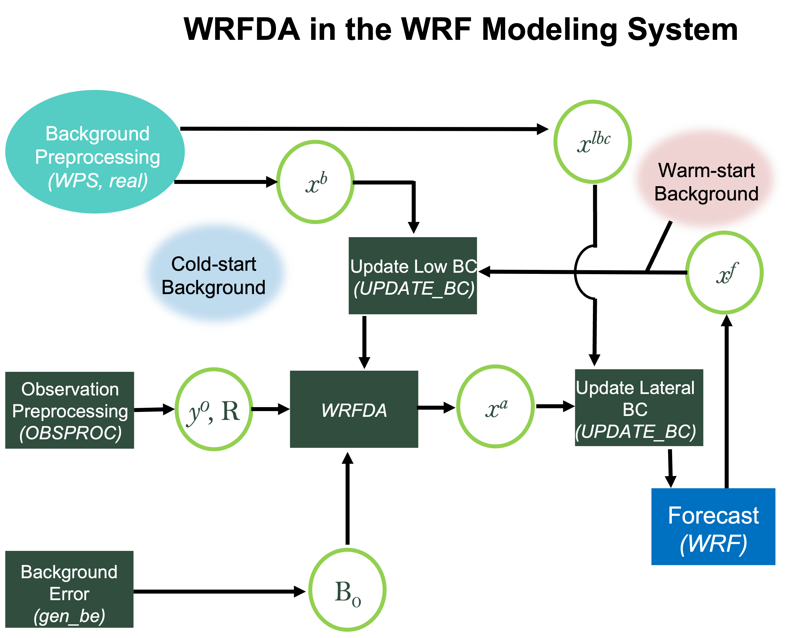
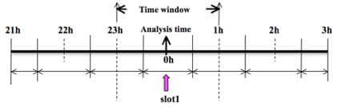
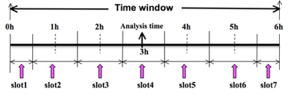
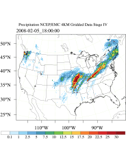
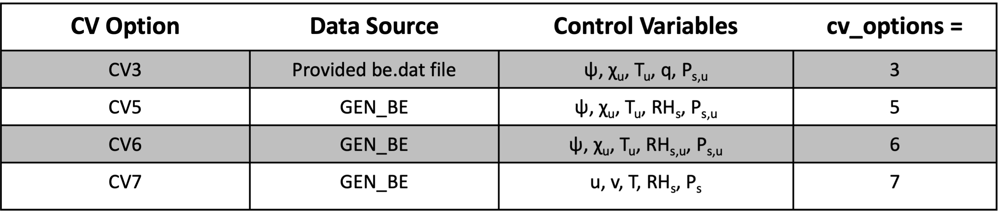
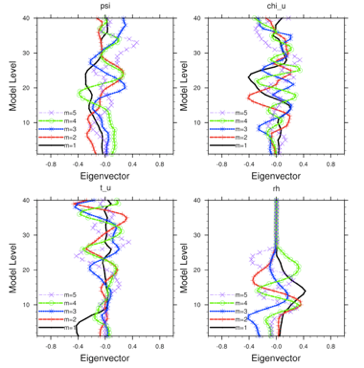
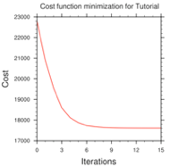
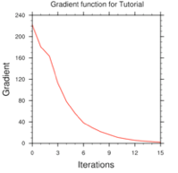
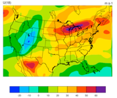
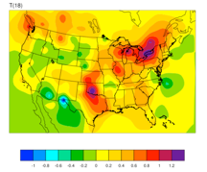

WRF Data Assimilation (WRFDA)
=============================

.. role:: underline
    :class: underline

.. role:: nlnote
    :class: nlnote

.. role:: nlheader
    :class: nlheader

.. role:: admonition
    :class: admonition

.. include:: <isogrk1.txt>

Data assimilation is a technique by which observations are combined with an NWP product (the first guess or background forecast) and their respective error statistics to provide an improved estimate (the analysis) of the atmospheric (or oceanic, Jovian, etc.) state. Variational (Var) data assimilation achieves this through iterative minimization of a prescribed cost (or penalty) function. Differences between the analysis and observations/first guess are penalized (damped) according to their perceived error. The difference between three-dimensional (3D-Var) and four-dimensional (4D-Var) data assimilation is the use of a numerical forecast model in the latter.

NCAR's MMM laboratory provides a unified (global/regional, multi-model, 3/4D-Var) model-space data assimilation system (WRFDA) that is freely available to the general community, along with further documentation and test results from the `WRFDA Users' site_`.

Various components of the WRFDA system are shown in the sketch below, along with their relationship with the components of the basic WRF system.

|br|

|br|

        .. note:: 
           The following data are not processed by OBSPROC: |br|
                 * Radar precipitation data in ASCII format (requires separate pre-processing)
                 * Conventional observations in PREPBUFR format
                 * Radiance GPSRO in BUFR format

|

        .. csv-table::
           :widths: 10, 90
           :width: 100%
           :escape: \

           x\ :sup:`b`, first guess\, either from a previous WRF forecast or from WPS or real.exe output
           x\ :sup:`lbc`, lateral boundary from WPS or real.exe output
           x\ :sup:`a`, analysis from the WRFDA data assimilation system
           x\ :sup:`f`, WRF forecast output
           y\ :sup:`o`, observations processed by OBSPROC; *note: PREPBUFR input\, radar\, radiance\, and rainfall data do not go through OBSPROC*
           B\ :sub:`0`, background error statistics from generic BE data (CV3) or gen_be
           R, observational and representative error statistics

|

|

This chapter provides instructions for installing and running the various components of the WRFDA system. For training purposes, a test case is proviced that includes the following input data:

        * observation files
        * a netCDF background file (WPS or real.exe output, the first guess of the analysis)
        * background error statistics (estimate of errors in the background file)
                * This tutorial data set can be downloaded from the `WRFDA Users' site`_, and will be described later in more detail. Outside of the tutorial, these files will need to be created by the user. See :ref:`Running Observation Preprocessor` for creating observation files. See :ref:`Background Error and running GEN_BE` for generating a background error statistics file, if using *cv_options=5, 6,* or *7*.

Before trying a case with user-created data, it is suggested to first run through the WRFDA-related programs using the supplied test case. This allows users to learn how to run the programs with pre-tested data, and to establish whether the computing environment is capable of running the entire data assimilation system. 

        .. note::
           WARNING: It is impossible to test every permutation of computer, compiler, number of processors, case, namelist option, etc. for every WRFDA release. The namelist options that are supported are indicated in the 'WRFDA/var/README.namelist,' and these are the default options.

|br|

As a professional courtesy, the following references should be included in any publication that uses any component of the community WRFDA system

        * Barker, D.M., W. Huang, Y.R. Guo, and Q.N. Xiao., 2004: A Three-Dimensional (3DVAR) Data Assimilation System For Use With MM5: Implementation and Initial Results. Mon. Wea. Rev., 132, 897-914.
        * `Huang et al., 2009`_
        * `Barker et al., 2012`_
        * `Liu et al., 2020`_
        * `Sun et al., 2020`_

|

Running WRFDA requires a Fortran 90 compiler. The WRFDA system can be compiled on the following platforms. *Note that it is not recommended to make modifications to the configure file used to compile WRFDA.* 

        * Linux (ifort, gfortran, pgf90)
        * Macintosh (gfortran, ifort)
        * IBM (xlf)
        * SGI Altix (ifort)

|

|

Installing WRFDA for 3DVAR Run
------------------------------

|

Obtaining WRFDA Source Code
+++++++++++++++++++++++++++

        #. Start by Downloading the `WRF source code`_, which includes the WRFDA and WRFPLUS systems.

                .. note::
                   Although WRF and WRFDA source code are packaged together, they can not be built together. They must be built in a separate directory. 

           Click on "New User" and become a registered user. After confirming the email address, log in to access the code, which is available on GitHub. The WRF code can either be obtained with a ``git clone...`` command, or by downloading a zipped file. 

           |br|

        #. After the code is cloned from GitHub, or downloaded and unpacked (e.g., ``unzip WRFVX.X.zip``), a new directory *WRF* should exist, and contains the WRFDA source, the WRFPLUS source (now fully integrated into WRF and TLM/ADJ code, located under the *wrftladj* directory), external libraries, and fixed files. The following is a list of the system components and content for each subdirectory:

.. csv-table::
   :widths: 20, 80
   :width: 100%
   :escape: \
   :header: "Directory Name", "Content"

   var/da, "WRFDA source code"
   var/run, "Fixed input files required by WRFDA\, such as background error covariance"
   radiance-related files, "CRTM coefficients and VARBC.in"
   var/external, "Libraries needed by WRFDA\, includes CRTM\, BUFR\, LAPACK\, BLAS"
   var/obsproc, "OBSPROC source code\, namelist\, and observation error files"
   var/gen_be, "Source code of gen_be\, the utility to create background error statistics files"
   var/build, "Builds all .exe files"

|

.. _Compile WRFDA and Libraries:

Compile WRFDA and Libraries
+++++++++++++++++++++++++++

Some external libraries (e.g., *LAPACK, BLAS*, and *NCEP BUFR*) are included with WRF source code. To compile WRFDA, the only mandatory library is *netCDF*. The environment variable *NETCDF* must be set, pointing to the directory where the netCDF library is installed.

.. code-block::

        > setenv NETCDF path-to-netcdf-library/netcdf

|br|

The source code for *BUFRLIB 10.2.3* (with minor modifications) is included with the WRF source code, and is compiled automatically. This library is used for assimilating files in *PREPBUFR* and *NCEP BUFR* format.

*AMSR2* data can be assimilated in HDF5 format, and requires that HDF5 libraries are installed (`download them from the HDF Group`_). To use HDF5 in WRFDA, the environment variable *HDF5* must point to the path to the HDF5 build. For e.g., 

.. code-block::

        > setenv HDF5 hdf5_path

The HDF5 path should contain the directories *include* and *lib*.

Some platforms may require an additional environment variable setting for *LD_LIBRARY_PATH*, that points to the HDF5 *lib* directory. For e.g., 

.. code-block::

        > setenv LD_LIBRARY_PATH ${LD_LIBRARY_PATH}:hdf5_path/lib

|br|

If satellite radiance data are to be used, a Radiative Transfer Model (RTM) is required. The RTM versions that WRFDA supports are CRTM V2.3.0 and RTTOV V12.1.

CRTM V2.3.0 source code is included with the WRF source code, and is compiled automatically. CRTM Coefficients can be downloaded from the `WRFDA CRTM Coefficients`_ page.

To use RTTOV, download and install the `RTTOV v12 library`_ before compiling WRFDA. *The RTTOV libraries must be compiled with the 'emis_atlas' option in order to work with WRFDA; see the RTTOV "readme.txt" for instructions*. After compiling RTTOV (see the RTTOV documentation for detailed instructions), set the *RTTOV* environment variable to the path where the lib directory resides. For example, if the library files can be found in */usr/local/rttov11/gfortran/lib/librttov11.*.a*, 

.. code-block::

        > setenv RTTOV /usr/local/rttov11/gfortran

|br|

        .. note::
           Make sure all required libraries were compiled using the same compiler that will be used to build WRFDA, since the libraries produced by one compiler may not be compatible with code compiled with another.

|br|

Assuming all required libraries are installed correctly, WRFDA can be built using the following steps:

        #. For organization and consistency, rename the WRF directory.

           .. code-block::

                   > mv WRF WRFDA

        #. Enter the WRFDA directory and run the configure script.

           .. code-block::

                   > cd WRFDA
                   > ./configure wrfda

           A list of configuration options should appear. Each option combines an operating system, a compiler type, and a parallelism option. Since the configuration script does not check which compilers are actually installed on the system, be sure to select an option that is available. The available parallelism options are single-processor (serial), shared-memory parallel (smpar), distributed-memory parallel (dmpar), and distributed-memory with shared-memory parallel (sm+dm). *However, beginning with WRFDA Version 4.1, shared-memory (smpar and sm+dm) options are no longer recommended.* The above command will produce something similar to the following.

           .. code-block::

                   checking for perl5... no
                   checking for perl... found /usr/bin/perl (perl)
                   Will use NETCDF in dir: /glade/apps/opt/netcdf/4.3.0/gnu/4.8.2/
                   Will use HDF5 in dir: /glade/u/apps/opt/hdf5/1.8.12/gnu/4.8.2/
                   PHDF5 not set in environment. Will configure WRF for use without.
                   Will use 'time' to report timing information
                   $JASPERLIB or $JASPERINC not found in environment, configuring to build without grib2 I/O...
                   ------------------------------------------------------------------------
                   Please select from among the following Linux x86_64 options:

                     1. (serial)   2. (smpar)   3. (dmpar)   4. (dm+sm)   PGI (pgf90/gcc)
                     5. (serial)   6. (smpar)   7. (dmpar)   8. (dm+sm)   PGI (pgf90/pgcc): SGI MPT
                     9. (serial)  10. (smpar)  11. (dmpar)  12. (dm+sm)   PGI (pgf90/gcc): PGI accelerator
                    13. (serial)  14. (smpar)  15. (dmpar)  16. (dm+sm)   INTEL (ifort/icc)
                                17. (dm+sm)   INTEL (ifort/icc): Xeon Phi (MIC architecture)
                    18. (serial)  19. (smpar)  20. (dmpar)  21. (dm+sm)   INTEL (ifort/icc): Xeon (SNB with AVX mods)
                    22. (serial)  23. (smpar)  24. (dmpar)  25. (dm+sm)   INTEL (ifort/icc): SGI MPT
                    26. (serial)  27. (smpar)  28. (dmpar)  29. (dm+sm)   INTEL (ifort/icc): IBM POE
                    30. (serial)               31. (dmpar)                PATHSCALE (pathf90/pathcc)
                    32. (serial)  33. (smpar)  34. (dmpar)  35. (dm+sm)   GNU (gfortran/gcc)
                    36. (serial)  37. (smpar)  38. (dmpar)  39. (dm+sm)   IBM (xlf90_r/cc_r)
                    40. (serial)  41. (smpar)  42. (dmpar)  43. (dm+sm)   PGI (ftn/gcc): Cray XC CLE
                    44. (serial)  45. (smpar)  46. (dmpar)  47. (dm+sm)   CRAY CCE (ftn/cc): Cray XE and XC
                    48. (serial)  49. (smpar)  50. (dmpar)  51. (dm+sm)   INTEL (ftn/icc): Cray XC
                    52. (serial)  53. (smpar)  54. (dmpar)  55. (dm+sm)   PGI (pgf90/pgcc)
                    56. (serial)  57. (smpar)  58. (dmpar)  59. (dm+sm)   PGI (pgf90/gcc): -f90=pgf90
                    60. (serial)  61. (smpar)  62. (dmpar)  63. (dm+sm)   PGI (pgf90/pgcc): -f90=pgf90
                    64. (serial)  65. (smpar)  66. (dmpar)  67. (dm+sm)   INTEL (ifort/icc): HSW/BDW
                    68. (serial)  69. (smpar)  70. (dmpar)  71. (dm+sm)   INTEL (ifort/icc): KNL MIC
                 
                   Enter selection [1-71] : 34
                   ------------------------------------------------------------------------

                   Configuration successful!
                   ------------------------------------------------------------------------
                   ... ...

           |br|

           After entering an appropriate option, the configure script should print the message *Configuration successful!* followed by some detailed configuration information. 
           
                .. note::
                   Depending on the system, a warning message may appear stating that some Fortran 2003 features have been removed - this message is normal and can be ignored. However, if the message "One of compilers testing failed! Please check your compiler," appears, configuration has probably failed, likely due to an incompatible option being chosen.

           After running the configuration script and choosing a compilation option, a *configure.wrf file* is created. Because of the variety of ways that a computer can be configured, if the WRFDA build ultimately fails, there is a chance that minor modifications to the configure.wrf file may be necessary.
       
           |br|

        #. To compile WRFDA, type

           .. code-block::

                   > ./compile all_wrfvar >& compile.out

           A successful compile produces 44 executables - 43 of which are in the *var/build* directory and linked to the *var/da* directory, with the 44th, *obsproc.exe*, found in the *var/obsproc/src* directory. The executables can be listed with the following command:

           .. code-block::

                   >ls -l var/build/*exe var/obsproc/src/obsproc.exe

                   -rwxr-xr-x 1 user   885143 Apr  4 17:22 var/build/da_advance_time.exe
                   -rwxr-xr-x 1 user  1162003 Apr  4 17:24 var/build/da_bias_airmass.exe
                   -rwxr-xr-x 1 user  1143027 Apr  4 17:23 var/build/da_bias_scan.exe
                   -rwxr-xr-x 1 user  1116933 Apr  4 17:23 var/build/da_bias_sele.exe
                   -rwxr-xr-x 1 user  1126173 Apr  4 17:23 var/build/da_bias_verif.exe
                   -rwxr-xr-x 1 user  1407973 Apr  4 17:23 var/build/da_rad_diags.exe
                   -rwxr-xr-x 1 user  1249431 Apr  4 17:22 var/build/da_tune_obs_desroziers.exe
                   -rwxr-xr-x 1 user  1186368 Apr  4 17:24 var/build/da_tune_obs_hollingsworth1.exe
                   -rwxr-xr-x 1 user  1083862 Apr  4 17:24 var/build/da_tune_obs_hollingsworth2.exe
                   -rwxr-xr-x 1 user  1193390 Apr  4 17:24 var/build/da_update_bc_ad.exe
                   -rwxr-xr-x 1 user  1245842 Apr  4 17:23 var/build/da_update_bc.exe
                   -rwxr-xr-x 1 user  1492394 Apr  4 17:24 var/build/da_verif_grid.exe
                   -rwxr-xr-x 1 user  1327002 Apr  4 17:24 var/build/da_verif_obs.exe
                   -rwxr-xr-x 1 user 26031927 Apr  4 17:31 var/build/da_wrfvar.exe
                   -rwxr-xr-x 1 user  1933571 Apr  4 17:23 var/build/gen_be_addmean.exe
                   -rwxr-xr-x 1 user  1944047 Apr  4 17:24 var/build/gen_be_cov2d3d_contrib.exe
                   -rwxr-xr-x 1 user  1927988 Apr  4 17:24 var/build/gen_be_cov2d.exe
                   -rwxr-xr-x 1 user  1945213 Apr  4 17:24 var/build/gen_be_cov3d2d_contrib.exe
                   -rwxr-xr-x 1 user  1941439 Apr  4 17:24 var/build/gen_be_cov3d3d_bin3d_contrib.exe
                   -rwxr-xr-x 1 user  1947331 Apr  4 17:24 var/build/gen_be_cov3d3d_contrib.exe
                   -rwxr-xr-x 1 user  1931820 Apr  4 17:24 var/build/gen_be_cov3d.exe
                   -rwxr-xr-x 1 user  1915177 Apr  4 17:24 var/build/gen_be_diags.exe
                   -rwxr-xr-x 1 user  1947942 Apr  4 17:24 var/build/gen_be_diags_read.exe
                   -rwxr-xr-x 1 user  1930465 Apr  4 17:24 var/build/gen_be_ensmean.exe
                   -rwxr-xr-x 1 user  1951511 Apr  4 17:24 var/build/gen_be_ensrf.exe
                   -rwxr-xr-x 1 user  1994167 Apr  4 17:24 var/build/gen_be_ep1.exe
                   -rwxr-xr-x 1 user  1996438 Apr  4 17:24 var/build/gen_be_ep2.exe
                   -rwxr-xr-x 1 user  2001400 Apr  4 17:24 var/build/gen_be_etkf.exe
                   -rwxr-xr-x 1 user  1942988 Apr  4 17:24 var/build/gen_be_hist.exe
                   -rwxr-xr-x 1 user  2021659 Apr  4 17:24 var/build/gen_be_stage0_gsi.exe
                   -rwxr-xr-x 1 user  2012035 Apr  4 17:24 var/build/gen_be_stage0_wrf.exe
                   -rwxr-xr-x 1 user  1973193 Apr  4 17:24 var/build/gen_be_stage1_1dvar.exe
                   -rwxr-xr-x 1 user  1956835 Apr  4 17:24 var/build/gen_be_stage1.exe
                   -rwxr-xr-x 1 user  1963314 Apr  4 17:24 var/build/gen_be_stage1_gsi.exe
                   -rwxr-xr-x 1 user  1975042 Apr  4 17:24 var/build/gen_be_stage2_1dvar.exe
                   -rwxr-xr-x 1 user  1938468 Apr  4 17:24 var/build/gen_be_stage2a.exe
                   -rwxr-xr-x 1 user  1952538 Apr  4 17:24 var/build/gen_be_stage2.exe
                   -rwxr-xr-x 1 user  1202392 Apr  4 17:22 var/build/gen_be_stage2_gsi.exe
                   -rwxr-xr-x 1 user  1947836 Apr  4 17:24 var/build/gen_be_stage3.exe
                   -rwxr-xr-x 1 user  1928353 Apr  4 17:24 var/build/gen_be_stage4_global.exe
                   -rwxr-xr-x 1 user  1955622 Apr  4 17:24 var/build/gen_be_stage4_regional.exe
                   -rwxr-xr-x 1 user  1924416 Apr  4 17:24 var/build/gen_be_vertloc.exe
                   -rwxr-xr-x 1 user  2057673 Apr  4 17:24 var/build/gen_mbe_stage2.exe
                   -rwxr-xr-x 1 user  2110993 Apr  4 17:32 var/obsproc/src/obsproc.exe

|

        * The primary executable for running WRFDA is *da_wrfvar.exe*. Make sure it has been created after the compilation: it is not uncommon for all executables, except for this one, to be successfully compiled. If this occurs, check the compilation log file for errors.
        * The basic *gen_be* utility for the regional model consists of *gen_be_stage0_wrf.exe*, *gen_be_stage1.exe*, *gen_be_stage2.exe*, *gen_be_stage2a.exe*, *gen_be_stage3.exe*, *gen_be_stage4_regional.exe*, and *gen_be_diags.exe*.
        * *da_update_bc.exe* is used to update update the WRF lower and lateral boundary conditions before and after a new WRFDA analysis is generated. This is detailed in :ref:`Updating WRF Boundary Conditions`.
        * *da_advance_time.exe* is a useful tool for date/time manipulation. Issue ``$WRFDA_DIR/var/build/da_advance_time.exe`` to see its usage instructions.
        * *obsproc.exe* prepares conventional observations for WRFDA assimilation. Its use is detailed in :ref:`Running Observation Preprocessor`.
        * If CRTM will be used for radiance assimilation, check *$WRFDA_DIR/var/external/crtm_2.3.0/libsrc* to ensure that *libCRTM.a* was generated.

|

Clean Old Compilation
+++++++++++++++++++++

To remove all object files and executables, issue the command:

.. code-block::

        > ./clean

To remove all build files, including configure.wrf, issue the command:

.. code-block::

        > ./clean -a

The *clean -a* command is recommended if the compilation fails, or if the configuration file has been modified and the default settings need to be restored.

|

|

Installing WRFPLUS and WRFDA for 4DVAR Simulation 
-------------------------------------------------

To run WRFDA 4DVAR, *WRFPLUS* must first be installed. WRFPLUS contains the adjoint and tangent linear models, based on a simplified WRF model, which includes a few simplified physics packages, such as surface drag, large scale condensation and precipitation, and cumulus parameterization.

        .. note::
           If both 3DVAR and 4DVAR are going to be run, it is not necessary to compile the code twice. The da_wrfvar.exe executable compiled for 4DVAR can be used for both 3DVAR and 4DVAR assimilation.

|

WRFPLUS Install
+++++++++++++++

        #. WRFPLUS code is fully integrated into WRF and TLM/ADJ code, and is located in the *wrftladj* directory. Obtain the `WRF source code`_ by cloning it from GitHub, or by downloading the packaged file.

        #. Once the code has been obtained (and unpacked, if downloading), rename the new 'WRF' directory appropriately to *WRFPLUS*, and then run the *configure* script.

                .. code-block::

                        > mv WRF WRFPLUS
                        > cd WRFPLUS
                        > ./configure wrfplus

           As with 3D-Var, *serial* means single-processor, and *dmpar* means Distributed Memory Parallel (MPI). Choose the same option for WRFPLUS that will be used for WRFDA.

        #. Compile WRFPLUS
                
                .. code-block::

                        > ./compile wrfplus >& compile.out
                        > ls -ls main/*.exe

           If compilation was successful, there should now be a WRFPLUS executable (*wrfplus.exe*). 
                
                .. code-block::

                        53292 -rwxr-xr-x 1 user man 54513254 Apr  6 22:43 main/wrfplus.exe

        #. Finally, set the environment variable *WRFPLUS_DIR* to the appropriate directory:

                .. code-block::

                        >setenv WRFPLUS_DIR ${source_code_directory}/WRFPLUS

|

WRFDA for 4D-Var Install
++++++++++++++++++++++++

To use RTTOV to assimilate radiance data, the appropriate environment variable must be set prior to compiling. See the previous 3DVAR section for instructions.

.. code-block::

        >./configure 4dvar
        >./compile all_wrfvar >& compile.out
        >ls -ls var/build/*.exe var/obsproc/*.exe

The same 44 executables as are listed in the above 3DVAR section (including *da_wrfvar.exe*) should be listed.

|

|

.. _Running Observation Preprocessor:

Running Observation Preprocessor (OBSPROC)
------------------------------------------

The *OBSPROC* program reads observations in LITTLE_R text-based format. Observations are provided for the tutorial case, but otherwise it is the user's responsiblity to prepare the observation files. Sources of freely-available observations are available from the `WRFDA Free Data`_ page, which also includes instructions for converting observations to LITTLE_R format, since raw observation files are available in a multitude of formats, such as ASCII, BUFR, PREPBUFR, MADIS (see `Converter for MADIS to LITTLE_R`), and HDF. A more complete description of the LITTLE_R format, as well as conventional observation data sources for WRFDA, are available from the `LITTLE_R Help`_ page, the `Observation Pre-processing for WRFDA`_ presentation, or by referencing the *OBSGRID* section of the `WRF Utilities and Tools`_ chapter of this Users' Guide.

The purpose of OBSPROC is to:

        * Remove observations outside the specified temporal and spatial domains
        * Re-order and merge duplicate (in time and location) data reports
        * Retrieve pressure or height, based on observed information using the hydrostatic assumption
        * Check multi-level observations for vertical consistency and superadiabatic conditions
        * Assign observation errors based on a pre-specified error file
        * Write out the observation file to be used by WRFDA in ASCII or BUFR format

The OBSPROC program (*obsproc.exe*) should be in the directory *$WRFDA_DIR/var/obsproc/src* if *compile all_wrfvar* completed successfully.

Download the `tutorial case`_, which contains example files for all the exercises in this guide. 

|

OBSPROC for 3DVAR
+++++++++++++++++

As an example, to prepare the observation file at the analysis time, all observations in the range +/- 1h are processed, meaning, for this example, observations between 23h and 1h are treated as the observations at 0h. This is illustrated in the following figure.

|br|

|br|

OBSPROC requires at least 3 files to run successfully:

        * A namelist file (namelist.obsproc)
        * An observation error file (obserr.txt)
        * One or more observation files
        * *Optionally, a table for specifying the elevation information for marine observations over the US Great Lakes (msfc.tbl)*

        #. The files *obserr.txt* and *msfc.tbl* are included in the source code under *var/obsproc*. An example namelist file (*namelist_obsproc.3dvar.wrfvar-tut*) can be found in the *var/obsproc* directory. Thus, proceed as follows.

           .. code-block::

                   > cd $WRFDA_DIR/var/obsproc
                   > cp namelist.obsproc.3dvar.wrfvar-tut namelist.obsproc

        #. Next, edit namelist.obsproc. It is likely that only variables listed under records 1, 2, 6, 7, and 8 will need modification. See *$WRFDA_DIR/var/obsproc/README.namelist*, or :ref:`OBSPROC Namelist Variables` for details. Pay attention to the record 7 and 8 variables - these determine the domain for which observations are written to the output observation file. Alternative to filtering the observations spatially, set *domain_check_h=.false.* under *&record4*.

        #. If running the tutorial case, copy or link the sample observation file (*ob/2008020512/obs.2008020512*) to the obsproc directory. Alternatively, edit the namelist variable *obs_gts_filename* to point to the observation file's full path.

        #. Issue the following to run OBSPROC.

                .. code-block::

                        > ./obsproc.exe >& obsproc.out

|br|

Once obsproc.exe has completed successfully, an observation file with the naming convention *obs_gts_YYYY-MM-DD_HH:NN:SS.3DVAR* will be available in the obsproc directory. For the tutorial case, this will be *obs_gts_2008-02-05_12:00:00.3DVAR*. This is the observation file that will be input to WRFDA. It is an ASCII file that contains a header section (example shown below) followed by observations. Observation description and format are described in the last six lines of the header section.

.. code-block::

        TOTAL =   9066, MISS. =-888888.,
        SYNOP =    757, METAR =   2416, SHIP  =    145, BUOY  =    250, BOGUS =      0, 
        TEMP  =     86, AMDAR =     19, AIREP =    205, TAMDAR=      0, PILOT =     85, 
        SATEM =    106, SATOB =   2556, GPSPW =    187, GPSZD =      0, GPSRF =      3, 
        GPSEP =      0, SSMT1 =      0, SSMT2 =      0, TOVS  =      0, QSCAT =   2190, 
        PROFL =     61, AIRSR =      0, OTHER =      0, PHIC  =  40.00, XLONC = -95.00, 
        TRUE1 =  30.00, TRUE2 =  60.00, XIM11 =   1.00, XJM11 =   1.00,
        base_temp= 290.00, base_lapse=  50.00, PTOP  =  1000., base_pres=100000., 
        base_tropo_pres= 20000., base_strat_temp=   215.,
        IXC   =     60, JXC   =     90, IPROJ =      1, IDD   =      1, MAXNES=      1,
        NESTIX=     60,
        NESTJX=     90,
        NUMC  =      1,
        DIS   =  60.00,
        NESTI =      1,
        NESTJ =      1,
        INFO  = PLATFORM, DATE, NAME, LEVELS, LATITUDE, LONGITUDE, ELEVATION, ID.
        SRFC  = SLP, PW (DATA,QC,ERROR).
        EACH  = PRES, SPEED, DIR, HEIGHT, TEMP, DEW PT, HUMID (DATA,QC,ERROR)*LEVELS.
        INFO_FMT = (A12,1X,A19,1X,A40,1X,I6,3(F12.3,11X),6X,A40)
        SRFC_FMT = (F12.3,I4,F7.2,F12.3,I4,F7.3)
        EACH_FMT = (3(F12.3,I4,F7.2),11X,3(F12.3,I4,F7.2),11X,3(F12.3,I4,F7.2))
        #------------------------------------------------------------------------------#
        ........... observations ...........

|br|

To visualize the ASCII file's content, NCL (NCAR Command Language) scripts that display the distribution and type of observations are available. Download the `WRFDA Tools Package`_, and then find the relevant script (*plot_ob_ascii_loc.ncl*) in *$TOOLS_DIR/var/graphics/ncl*. NCL must be installed to use this script; see the NCL_ site for more information about this post-processing tool. 

|

OBSPROC for 4DVAR
+++++++++++++++++

To prepare the observation file, for example, at the analysis time 0h for 4D-Var, all observations from 0h to 6h will be processed and grouped in 7 sub-windows (slot1 through slot7) as illustrated in the following figure.

|br|

|br|

        .. note::
           'Analysis time' in the above figure is not the actual analysis time (0h). It indicates the time_analysis setting in the namelist, which in this example is three hours later than the actual analysis time. The actual analysis time is still 0h.

|br|

An example namelist (*namelist_obsproc.4dvar.wrfvar-tut*) has already been provided in the *var/obsproc* directory. Thus, proceed as follows:

.. code-block::

        > cd $WRFDA_DIR/var/obsproc
        > cp namelist.obsproc.4dvar.wrfvar-tut namelist.obsproc

|br|

Change the following variables in the namelist. In this tutorial case, the actual analysis time is *2008-02-05_12:00:00*, but in the namelist, *time_analysis* should be set to 3 hours later. The different values of *time_analysis*, *num_slots_past*, and *time_slots_ahead* contribute to the actual times analyzed. For example, if *time_analysis = 2008-02-05_16:00:00*, *num_slots_past=4*, and *time_slots_ahead=2*, the final results will be the same as before.
!kkw

Edit all the domain settings according to your own experiment; a full list of namelist options and descriptions can be found in the section :ref:`WRFDA Description of Namelist Variables`. You should pay special attention to the record 7 and record 8 variables: these will determine the domain for which observations will be written to the output observation file. Alternatively, if you do not wish to filter the observations spatially, you can set *domain_check_h=.false.* under *&record4*.

If you are running the tutorial case, you should copy or link the sample observation file (*ob/2008020512/obs.2008020512*) to the *obsproc* directory. Alternatively, you can edit the namelist variable *obs_gts_filename* to point to the observation file's full path.

|br|

To run OBSPROC, type

.. code-block::

        > obsproc.exe >& obsproc.out

Once obsproc.exe has completed successfully, you will see 7 observation data files, which for the tutorial case are named

.. code-block::

        obs_gts_2008-02-05_12:00:00.4DVAR
        obs_gts_2008-02-05_13:00:00.4DVAR
        obs_gts_2008-02-05_14:00:00.4DVAR
        obs_gts_2008-02-05_15:00:00.4DVAR
        obs_gts_2008-02-05_16:00:00.4DVAR
        obs_gts_2008-02-05_17:00:00.4DVAR
        obs_gts_2008-02-05_18:00:00.4DVAR

They are the input observation files to WRF 4D-Var.

|

|

.. _Running WRFDA:

Running WRFDA
-------------

|br|

Download Test Data
++++++++++++++++++

The WRFDA system requires three input files to run:

        * WRF first guess file, output from either WPS/real.exe (*wrfinput*) or a WRF forecast (*wrfout*)
        * Observations (in ASCII format, PREPBUFR or BUFR for radiance)
        * A background error statistics file (containing background error covariance)

The following table summarizes the above info:

.. csv-table::
   :widths: 20, 30, 30
   :width: 100%
   :header: "Input Data", "Format", "Created By"
   :escape: \

   **First Guess**, NETCDF, WRF Preprocessing System (WPS) and real.exe or WRF
   **Observations**, ASCII (PREPBUFR also possible), OBSPROC |br| (See \:ref:\`Running Observation Preprocessor\`)
   **Background Error Statistics**, Binary, WRFDA gen_be utility |br| (See \:ref:\`Background Error and running GEN_BE\`) |br| or generic CV3

|br|

In the test case, you will store data in a directory defined by the environment variable *$DAT_DIR*. This directory can be in any location, and it should have read access. Type

.. code-block::

        > setenv DAT_DIR your_choice_of_dat_dir

Here, *your_choice_of_dat_dir* is the directory where the WRFDA input data is stored.

|br|

If you have not already done so, download the sample data for the `tutorial case`_, valid at 12 UTC 5th February 2008. Once you have downloaded the *WRFDAV4.0-testdata.tar.gz* file to *$DAT_DIR*, extract it by typing

.. code-block::

        > gunzip WRFDAV4.0-testdata.tar.gz
        > tar -xvf WRFDAV4.0-testdata.tar

Now you should find the following four files under *$DAT_DIR*

.. code-block::

        ob/2008020512/ob.2008020512      #  Observation data in little_r format
        rc/2008020512/wrfinput_d01       #  First guess file
        rc/2008020512/wrfbdy_d01         #  lateral boundary file
        be/be.dat                        #  Background error file
        ......

|br|

At this point you should have three of the input files (first guess, observations from OBSPROC, and background error statistics files in the directory *$DAT_DIR*) required to run WRFDA, and have successfully downloaded and compiled the WRFDA code. If this is correct, you are ready to run WRFDA.

|

Run 3DVAR Test Case
+++++++++++++++++++

The data for the tutorial case is valid at 12 UTC 5 February 2008. The first guess comes from the NCEP FNL (Final) Operational Global Analysis data, passed through the WRF-WPS and real.exe programs.

To run WRF 3D-Var, first create and enter into a working directory (for example, *$WRFDA_DIR/workdir*), and set the environment variable *WORK_DIR* to this directory (e.g., ``setenv WORK_DIR $WRFDA_DIR/workdir``). Then follow the steps below:

.. code-block::

        > cd $WORK_DIR
        > cp $DAT_DIR/namelist.input.3dvar namelist.input
        > ln -sf $WRFDA_DIR/run/LANDUSE.TBL .
        > ln -sf $DAT_DIR/rc/2008020512/wrfinput_d01 ./fg
        > ln -sf $DAT_DIR/ob/2008020512/obs_gts_2008-02-05_12:00:00.3DVAR ./ob.ascii 
                       (note the different name!)
        > ln -sf $DAT_DIR/be/be.dat .
        > ln -sf $WRFDA_DIR/var/da/da_wrfvar.exe .

|br|        

Now edit the file *namelist.input*, which is a very basic namelist for the tutorial test case, and is shown below.

.. code-block::

        &wrfvar1
        var4d=false,
        print_detail_grad=false,
        /

        &wrfvar2
        /

        &wrfvar3
        ob_format=2,
        /

        &wrfvar4
        /

        &wrfvar5
        /

        &wrfvar6
        max_ext_its=1,
        ntmax=50,
        orthonorm_gradient=true,
        /

        &wrfvar7
        cv_options=5,
        /

        &wrfvar8
        /

        &wrfvar9
        /

        &wrfvar10
        test_transforms=false,
        test_gradient=false,
        /

        &wrfvar11
        /

        &wrfvar12
        /

        &wrfvar13
        /

        &wrfvar14
        /

        &wrfvar15
        /

        &wrfvar16
        /

        &wrfvar17
        /

        &wrfvar18
        analysis_date="2008-02-05_12:00:00.0000",
        /

        &wrfvar19
        /

        &wrfvar20
        /

        &wrfvar21
        time_window_min="2008-02-05_11:00:00.0000",
        /

        &wrfvar22
        time_window_max="2008-02-05_13:00:00.0000",
        /

        &time_control
        start_year=2008,
        start_month=02,
        start_day=05,
        start_hour=12,
        end_year=2008,
        end_month=02,
        end_day=05,
        end_hour=12,
        /

        &fdda
        /

        &domains
        e_we=90,
        e_sn=60,
        e_vert=41,
        dx=60000,
        dy=60000,
        /

        &dfi_control
        /

        &tc
        /

        &physics
        mp_physics=3,
        ra_lw_physics=1,
        ra_sw_physics=1,
        radt=60,
        sf_sfclay_physics=1,
        sf_surface_physics=1,
        bl_pbl_physics=1,
        cu_physics=1,
        cudt=5,
        num_soil_layers=5,
        mp_zero_out=2,
        co2tf=0,
        /

        &scm
        /

        &dynamics
        /

        &bdy_control
        /

        &grib2
        /

        &fire
        /

        &namelist_quilt
        /

        &perturbation
        /   

|br|

No edits should be needed if you are running the tutorial case without radiance data. If you plan to use the PREPBUFR-format data, change the *ob_format=1* in *&wrfvar3* in namelist.input and link the data as *ob.bufr*,

.. code-block::

        > ln -fs $DAT_DIR/ob/2008020512/gdas1.t12z.prepbufr.nr  ob.bufr

|br|

The file *wrfda.log* (or *rsl.out.0000*, if run in distributed-memory mode) contains important WRFDA runtime log information. Always check the log after a WRFDA run - look for the following message at the end of the file.

.. code-block::

        *** WRF-Var completed successfully ***

|br|

The file *namelist.output.da* (which contains the complete namelist settings) will be generated after a successful run of *da_wrfvar.exe*. The settings appearing in namelist.output.da, but not specified in your namelist.input, are the default values from *$WRFDA_DIR/Registry/registry.var*.

After successful completion, *wrfvar_output* (the WRFDA analysis file, i.e. the new initial condition for WRF) should appear in the working directory along with a number of diagnostic files. Text files containing various diagnostics will be explained in the :ref:`WRFDA Diagnostics` section.

To understand the role of various important WRFDA options, try re-running WRFDA by changing different namelist options. Some examples are listed below.

|br|

:underline:`Response of Convergence Criteria`

Run the tutorial case with

.. code-block::

        &wrfvar6
        eps = 0.0001,
        /

You may wish to compare various diagnostics with an earlier run.

|br|

:underline:`Response of outer loop on minimization`

Run the tutorial case with

.. code-block::

        &wrfvar6
        max_ext_its = 2,
        /

You may wish to compare various diagnostics with an earlier run.

|br|

:underline:`Response of outer loop on minimization`

Run the tutorial case with

.. code-block::

        &wrfvar6
        max_ext_its = 2,
        /

With this setting, the outer loop for the minimization procedure will be activated. You may wish to compare various diagnostics with an earlier run. Note that when running multiple outer loops with the CV3 background error option, you must specify the scaling factors which are called as1, as2, as3, as4, and as5. More details can be found in *Modifying CV3 Length Scales and Variance* in the :ref:`Generic BE Option` section.

|br|

:underline:`Response of suppressing particular types of data in WRFDA`

The types of observations that WRFDA gets to use actually depend on what is included in the observation file and the WRFDA namelist settings. For example, if you have SYNOP data in the observation file, you can suppress its usage in WRFDA by setting *use_synopobs=false* in record *&wrfvar4* of namelist.input. It is OK if there are no SYNOP data in the observation file and *use_synopobs=true*.

Turning on and off certain types of observations is widely used for assessing the impact of observations on data assimilations.

        .. note::
           It is important to go through the default 'use_*' settings in record &wrfvar4 in WRFDA/Registry/registry.var to know what observations are activated in default.

For example, try making the WRFDA convergence criterion more stringent. This is achieved by reducing the value of *EPS* to e.g. 0.0001 by adding *EPS=0.0001* in the namelist.input record *&wrfvar6*. See the section :ref:`Additional Background Error Options` for more namelist options.

|br|

:underline:`Run 4DVAR Test Case`

To run WRF 4D-Var, first create and enter a working directory, such as *$WRFDA_DIR/workdir*. Set the *WORK_DIR* environment variable (e.g. ``setenv WORK_DIR $WRFDA_DIR/workdir``)

For the tutorial case, the analysis date is *2008020512* and the test data directories are:

.. code-block::

        > setenv DAT_DIR {directory where data is stored}
        > ls -lr $DAT_DIR
        ob/2008020512
        ob/2008020513
        ob/2008020514
        ob/2008020515
        ob/2008020516
        ob/2008020517
        ob/2008020518
        rc/2008020512
        be

|br|

        .. note::
           WRFDA 4D-Var is able to assimilate conventional observational data, satellite radiance BUFR data, and precipitation data. The input data format can be PREPBUFR format data or ASCII observation data, processed by OBSPROC.

|br|

Now follow the steps below:

#. Link the executable file

        .. code-block::

                > cd $WORK_DIR
                > ln -fs $WRFDA_DIR/var/da/da_wrfvar.exe .

#. Link the observational data, first guess, BE and LANDUSE.TBL, etc.

        .. code-block::

                > ln -fs $DAT_DIR/ob/2008020512/ob01.ascii ob01.ascii
                > ln -fs $DAT_DIR/ob/2008020513/ob02.ascii ob02.ascii
                > ln -fs $DAT_DIR/ob/2008020514/ob03.ascii ob03.ascii
                > ln -fs $DAT_DIR/ob/2008020515/ob04.ascii ob04.ascii
                > ln -fs $DAT_DIR/ob/2008020516/ob05.ascii ob05.ascii
                > ln -fs $DAT_DIR/ob/2008020517/ob06.ascii ob06.ascii
                > ln -fs $DAT_DIR/ob/2008020518/ob07.ascii ob07.ascii

                > ln -fs $DAT_DIR/rc/2008020512/wrfinput_d01 .
                > ln -fs $DAT_DIR/rc/2008020512/wrfbdy_d01 .
                > ln -fs wrfinput_d01 fg

                > ln -fs $DAT_DIR/be/be.dat .
                > ln -fs $WRFDA_DIR/run/LANDUSE.TBL .
                > ln -fs $WRFDA_DIR/run/GENPARM.TBL .
                > ln -fs $WRFDA_DIR/run/SOILPARM.TBL .
                > ln -fs $WRFDA_DIR/run/VEGPARM.TBL .
                > ln -fs $WRFDA_DIR/run/RRTM_DATA_DBL RRTM_DATA
                > ln -fs $WRFDA_DIR/run/CAMtr_volume_mixing_ratio .

   .. note::
      CAMtr_volume_mixing_ratio is needed to run 4D-Var from version 4.4.

#. Copy the sample namelist

        .. code-block::

                > cp $DAT_DIR/namelist.input.4dvar namelist.input

#. Edit necessary namelist variables, link optional files

   WRFDA 4D-Var has the capability to consider lateral boundary conditions as control variables as well during minimization. The namelist variable *var4d_lbc=true* turns on this capability. To enable this option, WRF 4D-Var needs not only the first guess at the beginning of the time window, but also the first guess at the end of the time window.

        .. code-block::

                > ln -fs $DAT_DIR/rc/2008020518/wrfinput_d01 fg02

   .. note::
      WRFDA beginners should not use this option until you have a good understanding of the 4D-Var lateral boundary conditions control. To disable this feature, make sure var4d_lbc in namelist.input is set to false.

|br|

   If you use PREPBUFR format data, set *ob_format=1* in *&wrfvar3* in namelist.input. Because 12UTC PREPBUFR data only includes the data from 9UTC to 15UTC, for 4D-Var you should include 18UTC PREPBUFR data as well:

        .. code-block::

                > ln -fs $DAT_DIR/ob/2008020512/gdas1.t12z.prepbufr.nr  ob01.bufr
                > ln -fs $DAT_DIR/ob/2008020518/gdas1.t18z.prepbufr.nr  ob02.bufr

   Edit namelist.input to match your experiment settings. The most important namelist variables related to 4D-Var are listed below. Please refer to *README.namelist* under the *$WRFDA_DIR/var* directory. A common mistake users make is in the time information settings. The rules are: *analysis_date*, *time_window_min* and *start_xxx* in *&time_control* should always be equal to each other; *time_window_max* and *end_xxx* should always be equal to each other; and *run_hours* is the difference between *start_xxx* and *end_xxx*, which is the length of the 4D-Var time window.

        .. code-block::

                &wrfvar1

                var4d=true,
                var4d_lbc=false,
                var4d_bin=3600,
                /

                &wrfvar18
                analysis_date="2008-02-05_12:00:00.0000",
                /

                &wrfvar21
                time_window_min="2008-02-05_12:00:00.0000",
                /

                &wrfvar22
                time_window_max="2008-02-05_18:00:00.0000",
                /

                &time_control
                run_hours=6,
                start_year=2008,
                start_month=02,
                start_day=05,
                start_hour=12,
                end_year=2008,
                end_month=02,
                end_day=05,
                end_hour=18,
                interval_seconds=21600,
                debug_level=0,
                /

#. Run WRF 4D-Var

        .. code-block::

                > cd $WORK_DIR
                > ./da_wrfvar.exe >& wrfda.log

   4DVAR is much more computationally expensive than 3DVAR, so running may take a while; you can set ntmax to a lower value so that WRFDA uses fewer minimization steps. You can also MPI with multiple processors to speed up the execution:

        .. code-block::
                
                > mpirun -np 4 ./da_wrfvar.exe >& wrfda.log &

   The *mpirun* command may be different depending on your machine. The output logs will be found in files named *rsl.out.####* and *rsl.error.####* for MPI runs.

        .. note::
           If you utilize the lateral boundary conditions option (var4d_lbc=true), in addition to the analysis at the beginning of the time window (wrfvar_output), the analysis at the end of the time window will also be generated as ana02, which will be used in subsequent updating of boundary conditions before the forecast.

|

|

Radiance Data Assimilation in WRFDA
-----------------------------------

This section gives a brief description for various aspects related to radiance assimilation in WRFDA. Each aspect is described mainly from the viewpoint of usage, rather than more technical and scientific details, which will appear in a separate technical report and scientific paper. Namelist parameters controlling different aspects of radiance assimilation will be detailed in the following sections. It should be noted that this section does not cover general aspects of the assimilation process with WRFDA; these can be found in other sections of chapter 6 of this users' guide, or other WRFDA documentation.

|

Running WRFDA with Radiances
++++++++++++++++++++++++++++

In addition to the basic input files (*LANDUSE.TBL, fg, ob.ascii, be.dat*) mentioned in the :ref:`Running WRFDA` section, the following additional files are required for radiances: radiance data (typically in NCEP BUFR format), *radiance_info* files, *VARBC.in* (if you plan on using variational bias correction VARBC, as described in the section on bias correction), and RTM (CRTM or RTTOV) coefficient files.

        .. note::
           A subset of binary CRTM coefficient files is not included in the WRFDA package, and the users need to download it from CRTM_Coefficients_.

Edit namelist.input (Pay special attention to *&wrfvar4, &wrfvar14, &wrfvar21*, and *&wrfvar22* for radiance-related options. A very basic namelist.input for running the radiance test case is provided in *WRFDA/var/test/radiance/namelist.input*).

        .. code-block::

                > ln -sf $DAT_DIR/gdas1.t00z.1bamua.tm00.bufr_d   ./amsua.bufr
                > ln -sf $DAT_DIR/gdas1.t00z.1bamub.tm00.bufr_d   ./amsub.bufr
                > ln -sf $WRFDA_DIR/var/run/radiance_info  ./radiance_info  # (radiance_info is a directory)
                > ln -sf $WRFDA_DIR/var/run/VARBC.in  ./VARBC.in
                (CRTM only)  > ln -sf directory_of_crtm_coeffs ./crtm_coeffs    #(crtm_coeffs is a directory)
                (RTTOV only) > ln -sf your_RTTOV_path/rtcoef_rttov11/rttov7pred54L  ./rttov_coeffs     
                                   #   (rttov_coeffs is a directory)
                (HDF5 only) > ln -sf $WRFDA_DIR/var/run/leapsec.dat .

        .. note::
           You can also specify the path of the crtm_coeffs directory via the namelist; see the following section for more details.

See the following sections for more details on each aspect of radiance assimilation.

|

.. _Reading Radiance Data in WRFDA:

Reading Radiance Data in WRFDA
++++++++++++++++++++++++++++++

Currently, the ingest interface for NCEP BUFR radiance data is implemented in WRFDA. The radiance data are available through `NCEP's public ftp server`_ in near real-time (with a 6-hour delay) and can meet requirements for both research purposes and some real-time applications.
 

WRFDA can read data from NOAA ATOVS instruments (HIRS, AMSU-A, AMSU-B and MHS), EOS Aqua instruments (AIRS, AMSU-A), DMSP instruments (SSMIS), METOP instruments (HIRS, AMSU-A, MHS, IASI), Meteosat instruments (SEVIRI), and JAXA GCOM-W1 instruments (AMSR2). Note that NCEP radiance BUFR files are separated by instrument names (i.e., one file for each type of instrument), and each file contains global radiance (generally converted to brightness temperature) within a 6-hour assimilation window, from multi-platforms. For running WRFDA, users need to rename NCEP corresponding BUFR files (table 1) to *hirs3.bufr* (including HIRS data from NOAA-15/16/17), *hirs4.bufr* (including HIRS data from NOAA-18/19, METOP-2), *amsua.bufr* (including AMSU-A data from NOAA-15/16/18/19, METOP-1 and -2), *amsub.bufr* (including AMSU-B data from NOAA-15/16/17), *mhs.bufr* (including MHS data from NOAA-18/19 and METOP-1 and -2), *airs.bufr* (including AIRS and AMSU-A data from EOS-AQUA) *ssmis.bufr* (SSMIS data from DMSP-16, AFWA provided) *iasi.bufr* (IASI data from METOP-1 and -2) and *seviri.bufr* (SEVIRI data from Meteosat 8-10) for WRFDA filename convention. Note that the *airs.bufr* file contains not only AIRS data but also AMSU-A, which is collocated with AIRS pixels (1 AMSU-A pixel collocated with 9 AIRS pixels). Users must place these files in the working directory where the WRFDA executable is run. It should also be mentioned that WRFDA reads these BUFR radiance files directly without the use of any separate pre-processing program. All processing of radiance data, such as quality control, thinning, bias correction, etc., is carried out within WRFDA. This is different from conventional observation assimilation, which requires a pre-processing package (OBSPROC) to generate WRFDA readable ASCII files. For reading the radiance BUFR files, WRFDA must be compiled with the `NCEP BUFR library`_. 

|br|

**Table 1: NCEP and WRFDA Radiance BUFR File Naming Convention**

.. csv-table::
   :widths: 50, 20
   :width: 75%
   :header: "NCEP BUFT File Names", "WRFDA Naming Convention"

   gdas1.t00z.airsev.tm00.bufr_d, airs.bufr
   gdas1.t00z.1bamua.tm00.bufr_d, amsua.bufr
   gdas1.t00z.1bamub.tm00.bufr_d, amsub.bufr
   gdas1.t00z.atms.tm00.bufr_d, atms.bufr
   gdas1.t00z.1bhrs3.tm00.bufr_d, hirs3.bufr
   gdas1.t00z.1bhrs4.tm00.bufr_d, hirs4.bufr
   gdas1.t00z.mtiasi.tm00.bufr_d, iasi.bufr
   gdas1.t00z.1bmhs.tm00.bufr_d, mhs.bufr
   gdas1.t00z.sevcsr.tm00.bufr_d, seviri.bufr

|br|

Namelist parameters are used to control the reading of corresponding BUFR files into WRFDA. For instance, *USE_AMSUAOBS, USE_AMSUBOBS, USE_HIRS3OBS, USE_HIRS4OBS, USE_MHSOBS, USE_AIRSOBS, USE_EOS_AMSUAOBS, USE_SSMISOBS, USE_ATMSOBS, USE_IASIOBS, and USE_SEVIRIOBS* control whether or not the respective file is read. These are logical parameters that are assigned to .FALSE. by default; therefore they must be set to .TRUE. to read the respective observation file. Also note that these parameters only control whether the data is read, not whether the data included in the files is to be assimilated. This is controlled by other namelist parameters explained in the next section.

Sources for downloading these and other data can be found on the `WRFDA Free Data`_ page.

|br|

:underline:`Other Data Formats`

Most of the above paragraphs describe NCEP BUFR data, but some of the satellite data supported by WRFDA are in alternate formats. Level-1R AMSR2 data from the JAXA GCOM-W1 satellite are available in HDF5 format, which requires compiling WRFDA with HDF5 libraries, as described in the `Compile WRFDA and Libraries`_ section.

HDF5 file naming conventions are different than those for BUFR files. For AMSR2 data, WRFDA will look for two data files: L1SGRTBR.h5 (brightness temperature) and L2SGCLWLD.h5 (cloud liquid water). Only the brightness temperature file is mandatory (you will also need to copy or link the *leapsec.dat* file from *WRFDA/var/run*). If you have multiple data files for your assimilation window, you should name them L1SGRTBR-01.h5, L1SGRTBR-02.h5, etc. and L2SGCLWLD-01.h5, L2SGCLWLD-02.h5, etc.

GOES-Imager GVAR radiance data are in NETCDF format with file names like goes-13-imager-01.nc, goes-13-imager-02.nc, goes-13-imager-03, and goes-13-imager-04.nc for channel 2, 3, 4, and 6, respectively.

Newly-introduced Himawari-8-AHI radiance data in V4.1 are in NETCDF format as well with file names 'L1AHITBR' (Level-1 brightness temperature) and 'L2AHICLP' (level-2 cloud product) generated by GEOCAT software. Notice that the file *var/run/ahi_info* defines a sub-area of full-disk data to read.

In version 4.4, the capability of assimilating GPM Microwave Imager (GMI) radiance in HDF5 format is added. GMI's Level-1B brightness temperature and Level-2A retrieval product needs to be linked to the file name *1B.GPM.GMI* and *2A.GPM.GMI*, respectively before ingesting into WRFDA.

|

Radiative Transfer Models
+++++++++++++++++++++++++

The core component for direct radiance assimilation is to incorporate a radiative transfer model (RTM) into the WRFDA system as one part of observation operators. Two widely used RTMs in the NWP community, RTTOV (developed by ECMWF and UKMET in Europe), and CRTM (developed by the Joint Center for Satellite Data Assimilation (JCSDA) in US), are already implemented in the WRFDA system with a flexible and consistent user interface. WRFDA is designed to be able to compile with or without RTTOV by the definition of the *RTTOV* environment variable at compile time (see the *Compile WRFDA and Libraries* section). At runtime the user must select which RTM they intend to use via the namelist parameter RTM_OPTION (1 for RTTOV, the default, and 2 for CRTM).

Both RTMs can calculate radiances for almost all available instruments aboard the various satellite platforms in orbit. An important feature of the WRFDA design is that all data structures related to radiance assimilation are dynamically allocated during running time, according to a simple namelist setup. The instruments to be assimilated are controlled at run-time by four integer namelist parameters: RTMINIT_NSENSOR (the total number of sensors to be assimilated), RTMINIT_PLATFORM (the platforms IDs array to be assimilated with dimension RTMINIT_NSENSOR, e.g., 1 for NOAA, 9 for EOS, 10 for METOP and 2 for DMSP), RTMINIT_SATID (satellite IDs array) and RTMINIT_SENSOR (sensor IDs array, e.g., 0 for HIRS, 3 for AMSU-A, 4 for AMSU-B, etc.). The full list of instrument triplets can be found in the table below:

|br|

.. csv-table::
   :width: 100%
   :widths: 20,20,20,20
   :header: "Instrument", "Satellite", "Format", "(PLATFORM SATID SENSOR)"
   :escape: \

   AIRS, EOS-Aqua, BUFR, (9\,2\,11)
   AMSR2, GCOM-W1, HDF5, (29\,1\,63)
   AMSU-A, EOS-Aqua, BUFR, (9\,2\,3)
   AMSU-A, METOP-A, BUFR, (10\,2\,3)
   AMSU-A, NOAA 15-19, BUFR, (1\,15-19\,3)
   AMSU-B, NOAA 15-17, BUFR, (1\,15-17\,4)
   ATMS, Suomi-NPP, BUFR, (17\,0\,19)
   HIRS-3, NOAA 15-17, BUFR, (1\,15-17\,0)
   HIRS-4, METOP-A, BUFR, (10\,2\,0)
   HIRS-4, NOAA 18-19, BUFR, (1\,18-19\,0)
   IASI, METOP-A, BUFR, (10\,2\,16)
   IMAGER, GOES 13-15, NETCDF, (4\,13-15\,22)
   MHS, METOP-A, BUFR, (10\,2\,15)
   MHS, NOAA 18-19, BUFR, (1\,18-19\,15)
   MWHS, FY-3A - FY-3B, Binary, (23\,1-2\,41)
   MWTS, FY-3A - FY-3B, Binary, (23\,1-2\,40)
   SEVIRI, Meteosat 8-10, BUFR, (12\,1-3\,21)
   SSMIS, DMSP 16-18, BUFR, (2\,16-18\,10)
   AHI, Himawari 8, NETCDF, (31\,8\,56)
   GMI, GPM, HDF5, (37\,1\,71)

|br|

Below is an example of this section of the namelist for a user assimilating IASI observations from METOP-A, utilizing RTTOV as their RTM.

.. code-block::
        
        &wrfvar14
         rtminit_nsensor = 1
         rtminit_platform = 10,
         rtminit_satid = 2,
         rtminit_sensor = 16,
         rtm_option = 1,
        /

|br|

Below is another example of this section of the namelist, this time for a user assimilating AMSU-A from NOAA 18-19 and EOS-Aqua, MHS from NOAA 18-19, and AIRS from EOS-Aqua, utilizing CRTM as their RTM,

.. code-block::

        &wrfvar14
         rtminit_nsensor = 6
         rtminit_platform = 1, 1, 9, 1, 1, 9
         rtminit_satid = 18, 19, 2, 18, 19, 2
         rtminit_sensor = 3, 3, 3, 15, 15, 11
         rtm_option = 2,
        /

|br|

The instrument triplets (platform, satellite, and sensor ID) in the namelist can be ranked in any order. More detail about the convention of instrument triples can be found in tables 2 and 3 in the `RTTOV v11 Users' Guide`_.

CRTM uses a different instrument-naming method, however, a conversion routine inside WRFDA is implemented such that the user interface remains the same for RTTOV and CRTM, using the same instrument triplet for both.

When running WRFDA with radiance assimilation switched on, a set of RTM coefficient files need to be loaded. For the RTTOV option, RTTOV coefficient files are to be copied or linked to a sub-directory rttov_coeffs/ under the working directory. For the CRTM option, CRTM coefficient files are to be copied or linked to a sub-directory crtm_coeffs/ under the working directory, or the location of this directory can be specified in the namelist:

.. code-block::

        &wrfvar14
         crtm_coef_path = WRFDA/var/run/crtm_coeffs (Can be a relative or absolute path)
        /

Only coefficients for instruments listed in the namelist are needed. Potentially WRFDA can assimilate all sensors as long as the corresponding coefficient files are provided. In addition, necessary developments on the corresponding data interface, quality control, and bias correction are important to make radiance data assimilate properly; however, a modular design of radiance relevant routines already facilitates the addition of more instruments in WRFDA.

The RTTOV package is not distributed with WRFDA, due to licensing restrictions. Users need to follow the instructions to `download the RTTOV source code and supplement coefficient files and the emissivity atlas data set`_. Only RTTOV v11 (11.1-11.3) can be used since WRFDA version 3.9, so if you have an older version of RTTOV you must upgrade. Only RTTOV v12 is supported in version 4.1.

As mentioned in a previous paragraph, the CRTM package is distributed with WRFDA, and is located in $WRFDA_DIR/var/external/crtm_2.3.0. The CRTM code in WRFDA is the same as the source code that users can download from `NCEP's CRTM FTP`_, with only minor modifications (mainly for ease of compilation).

To use one or both of the above radiative transfer models, you will have to set the appropriate environment variable(s) at compile time. See the section *Compile WRFDA and Libraries* for details.

|

Channel Selection
+++++++++++++++++

Channel selection in WRFDA is controlled by radiance *info* files, located in the sub-directory radiance_info, under the working directory. These files are separated by satellites and sensors; e.g., noaa-15-amsua.info, noaa-16-amsub.info, dmsp-16-ssmis.info and so on. An example of 5 channels from noaa-15-amsub.info is shown below. The fourth column is used by WRFDA to control when to use a corresponding channel. Channels with the value *-1* in the fourth column indicate that the channel is *not assimilated*, while the value *1* means *assimilated*. The sixth column is used by WRFDA to set the observation error for each channel. Other columns are not used by WRFDA. It should be mentioned that these error values might not necessarily be optimal for your applications. It is the user's responsibility to obtain the optimal error statistics for his/her own applications.

.. csv-table::
   :width: 100%
   :widths: 15, 15, 15, 10, 10, 20, 20
   :header: "Sensor", "Channel", "IR/MW", "use", "idum", "varch", "polarization |br| (0:vertical;1:horizontal)"

   415, 1, 1, -1, 0, 0.5500000000E+01, 0.0000000000E+00
   415, 2, 1, -1, 0, 0.3750000000E+01, 0.0000000000E+00
   415, 3, 1, 1, 0,  0.3500000000E+01, 0.0000000000E+00
   415, 4, 1, -1, 0, 0.3200000000E+01, 0.0000000000E+00
   415, 5, 1, 1, 0,  0.2500000000E+01, 0.0000000000E+00

|

Bias Correction
+++++++++++++++

Satellite radiance is generally considered to be biased with respect to a reference (e.g., background or analysis field in NWP assimilation) due to systematic error of the observation itself, the reference field, and RTM. Bias correction is a necessary step prior to assimilating radiance data. There are two ways of performing bias correction in WRFDA. One is based on the Harris and Kelly (2001) method, and is carried out using a set of coefficient files pre-calculated with an off-line statistics package, which was applied to a training data set for a month-long period. The other is Variational Bias Correction (VarBC).  Only VarBC is introduced here, and recommended for users because of its relative simplicity in usage.

|br|

Variational Bias Correction
+++++++++++++++++++++++++++

To use VarBC, set the namelist option USE_VARBC to TRUE and have the VARBC.in file in the working directory. VARBC.in is a VarBC setup file in ASCII format. A template is provided with the WRFDA package ($WRFDA_DIR/var/run/VARBC.in).

All VarBC input is passed through a single ASCII file called VARBC.in. Once WRFDA has run with the VarBC option switched on, it will produce a VARBC.out file in a similar ASCII format. This output file will then be used as the input file for the next assimilation cycle.

|br|

VarBC Coldstart
+++++++++++++++

Coldstarting means starting the VarBC from scratch; i.e. when you do not know the values of the bias parameters.

The coldstart is a routine in WRFDA. The bias predictor statistics (mean and standard deviation) are computed automatically and will be used to normalize the bias parameters. All coldstart bias parameters are set to zero, except the first bias parameter (= simple offset), which is set to the mode (=peak) of the distribution of the (uncorrected) innovations for the given channel.

A threshold of a number of observations can be set through the namelist option VARBC_NOBSMIN (default = 10), under which it is considered that not enough observations are present to keep the coldstart values (i.e. bias predictor statistics and bias parameter values) for the next cycle. In this case, the next cycle will do another coldstart.

|br|

Background constraint for bias parameters
+++++++++++++++++++++++++++++++++++++++++

The background constraint controls the inertia you want to impose on the predictors (i.e. the smoothing in the predictor time series). It corresponds to an extra term in the WRFDA cost function.

It is defined in the namelist via the option VARBC_NBGERR; the default value is 5000. This number is related to a number of observations; the bigger the number, the more inertia constraint. If these numbers are set to zero, the predictors can evolve without any constraint.

|br|

Scaling factor
++++++++++++++

The VarBC uses a specific preconditioning, which can be scaled through the namelist option VARBC_FACTOR (default = 1.0).

|br|

Offline bias correction
+++++++++++++++++++++++

The analysis of the VarBC parameters can be performed "offline" ; i.e. independently from the main WRFDA analysis. No extra code is needed.  Just set the following MAX_VERT_VAR* namelist variables to be 0, which will disable the standard control variable and only keep the VarBC control variable.

.. code-block::

        MAX_VERT_VAR1=0.0
        MAX_VERT_VAR2=0.0
        MAX_VERT_VAR3=0.0
        MAX_VERT_VAR4=0.0
        MAX_VERT_VAR5=0.0

|br|

        **Freeze VarBC** |br|
        In certain circumstances, you might want to keep the VarBC bias parameters constant in time (="frozen"). In this case, the bias correction is read and applied to the innovations, but it is not updated during the minimization. This can easily be achieved by setting the namelist options:

        .. code-block::

                USE_VARBC=false
                FREEZE_VARBC=true

        **Passive observations** |br|
        Some observations are useful for preprocessing (e.g. Quality Control, Cloud detection) but you might not want to assimilate them. If you still need to estimate their bias correction, these observations need to go through the VarBC code in the minimization. For this purpose, the VarBC uses a separate threshold on the QC values, called "qc_varbc_bad". This threshold is currently set to the same value as "qc_bad", but can easily be changed to any ad hoc value.

|br|

Other Radiance Assimilation Options
+++++++++++++++++++++++++++++++++++

.. csv-table::
   :widths: 20, 50
   :width: 85%
   :escape: \

   RAD_MONITORING (30), Integer array of dimension RTMINIT_NSENSOR |br| 0 for assimilating mode |br| 1 for monitoring mode (only calculates innovation)
   THINNING, Logical; TRUE will perform thinning on radiance data
   THINNING_MESH (30), Real array with dimension RTMINIT_NSENSOR; values indicate thinning mesh (in km) for different sensors
   QC_RAD, Logical; controls if quality control is performed; always set to TRUE
   WRITE_IV_RAD_ASCII, Logical; controls whether to output observation-minus-background (O-B) files\, which are in ASCII format and separated by sensors and processors
   WRITE_OA_RAD_ASCII, Logical; controls whether to output observation-minus-analysis (O-A) files (including also O-B information)\, which are in ASCII format and separated by sensors and processors
   USE_ERROR_FACTOR_RAD, Logical; controls use of a radiance error tuning factor file (radiance_error.factor)\, which is created with empirical values\, or generated using a variational tuning method (Desroziers and Ivanov\, 2001)
   ONLY_SEA_RAD, Logical; controls whether only assimilating radiance over water
   TIME_WINDOW_MIN, String; (e.g. "2007-08-15_03:00:00.0000"); start time of assimilation time window
   TIME_WINDOW_MAX, String; (e.g. "2007-08-15_09:00:00.0000"); end time of assimilation time window
   USE_ANTCORR (30), Logical array with dimension RTMINIT_NSENSOR; controls if performing Antenna Correction in CRTM
   USE_CLDDET, Integer; controls cloud detection scheme for infrared radiance |br| 0: no cloud detection |br| 1: MMR scheme |br| 2: Particle filter scheme (default) |br| 3: ECMWF scheme
   AIRS_WARMEST_FOV, Logical; controls whether using the observation brightness temperature for AIRS Window channel #914 as criterion for GSI thinning
   USE_CRTM_KMATRIX, Logical; controls whether using the CRTM K matrix rather than calling CRTM TL and AD routines for gradient calculation
   CRTM_CLOUD, Logical; include cloud effects in CRTM calculations; Further information on this capability can be found in \`AMSR2 all-sky radiance assimilation and its impact on the analysis and forecast of Hurricane Sandy with a limited-area data assimilation system\`_ 
   USE_RTTOV_KMATRIX, Logical; controls whether using the RTTOV K matrix rather than calling RTTOV TL and AD routines for gradient calculation
   RTTOV_EMIS_ATLAS_IR, Integer; controls the use of the IR emissivity atlas; Emissivity atlas data (should be downloaded separately from the RTTOV web site) need to be copied or linked under a sub-directory of the working directory (emis_data) if RTTOV_EMIS_ATLAS_IR is set to 1
   RTTOV_EMIS_ATLAS_MW, Integer; controls the use of the MW emissivity atlas; Emissivity atlas data (should be downloaded separately from the RTTOV web site) need to be copied or linked under a sub-directory of the working directory (emis_data) if RTTOV_EMIS_ATLAS_MW is set to 1 or 2

|

Diagnostics and Monitoring
++++++++++++++++++++++++++

        **Monitoring Capability within WRFDA** |br|
        Run WRFDA with the rad_monitoring namelist parameter in record wrfvar14 in namelist.input.

                * 0 means assimilating mode. Innovations (O minus B) are calculated and data are used in minimization.
                * 1 means monitoring mode: innovations are calculated for diagnostics and monitoring. Data are not used in minimization.

        The value of rad_monitoring should correspond to the value of  rtminit_nsensor. If rad_monitoring is not set, then the default value of 0 will be used for all sensors.

        |

        **Outputting radiance diagnostics from WRFDA** |br|
        Run WRFDA with the following namelist options in record wrfvar14 in namelist.input.

        .. csv-table::
           :widths: 15, 50
           :width: 100%
           :escape: \

           **write_iv_rad_ascii**, Logical; TRUE to write out (observation-background\, etc.) diagnostics information in plain-text files with the prefix *inv*\, followed by the instrument name and the processor id; for e.g.\, 01_inv_noaa-17-amsub.0000 (01 is outerloop index\, 0000 is processor index)
           **write_oa_rad_ascii**, Logical; TRUE to write out (observation-background\, observation-analysis\, etc.) diagnostics information in plain-text files with the prefix *oma*\, followed by the instrument name and the processor id; for example\, 01_oma_noaa-18-mhs.0001

        |br|

        Each processor writes out the information for one instrument in one file in the WRFDA working directory.

        |

        **Radiance diagnostics data processing** |br|
        One of the 44 executables compiled as part of the WRFDA system is the file da_rad_diags.exe. This program can be used to collect the 01_inv* or 01_oma* files and write them out in netCDF format (one instrument in one file with prefix diags followed by the instrument name, analysis date, and the suffix .nc) for easier data viewing, handling and plotting with netCDF utilities and NCL scripts. See WRFDA/var/da/da_monitor/README for information on how to use this program.

        |

        **Radiance diagnostics plotting** |br|
        Two NCL scripts (available as part of the `WRFDA Tools package`_) are used for plotting: $TOOLS_DIR/var/graphics/ncl/plot_rad_diags.ncl and $TOOLS_DIR/var/graphics/ncl/advance_cymdh.ncl. The NCL scripts can be run from a shell script, or run alone with an interactive ncl command (the NCL script and set the plot options must be edited, and the path of advance_cymdh.ncl, a date-advancing script loaded in the main NCL plotting script, may need to be modified).

        Steps (3) and (4) can be done by running a single ksh script (also in the WRFDA Tools package: $TOOLS_DIR/var/scripts/da_rad_diags.ksh) with proper settings. In addition to the settings of directories and what instruments to plot, there are some useful plotting options, explained below.

        .. csv-table::
           :width: 100%
           :widths: 25, 40
           :escape: \

           setenv OUT_TYPE=ncgm, ncgm or pdf; pdf will be much slower than ncgm and generate huge output if plots are not split\, but pdf has higher resolution than ncgm
           setenv PLOT_STATS_ONLY=false, true or false; |br| true: only statistics of OMB/OMA vs channels and OMB/OMA vs dates will be plotted |br| false: data coverage\, scatter plots (before and after bias correction)\, histograms (before and after bias correction)\, and statistics will be plotted
           setenv PLOT_OPT=sea_only, all\, sea_only\, land_only
           setenv PLOT_QCED=false, true or false: |br| true: plot only quality-controlled data |br| false: plot all data
           setenv PLOT_HISTO=false, true or false: switch for histogram plots
           setenv PLOT_SCATT=true, true or false: switch for scatter plots
           setenv PLOT_EMISS=false, true or false: switch for emissivity plots
           setenv PLOT_SPLIT=false, true or false; |br| true: one frame in each file |br| false: all frames in one file
           setenv PLOT_CLOUDY=false, true or false; |br| true: plot cloudy data; cloudy data to be plotted are defined by PLOT_CLOUDY_OPT (si or clwp)\, CLWP_VALUE\, SI_VALUE settings
           setenv PLOT_CLOUDY_OPT=si, si or clwp; |br| clwp: cloud liquid water path from model |br| si: scatter index from obs\, for amsua\, amsub\, and mhs only
           setenv CLWP_VALUE=0.2, only plot points with |br| clwp >= clwp_value (when clwp_value > 0) |br| clwp >  clwp_value (when clwp_value = 0)
           setenv SI_VALUE=3.0, " "

        |

        **Evolution of VarBC parameters** |br|
        NCL scripts (also in the WRFDA Tools package: $TOOLS_DIR/var/graphics/ncl/plot_rad_varbc_param.ncl and $TOOLS_DIR/var/graphics/ncl/advance_cymdh.ncl) are used for plotting the evolution of VarBC parameters.

|

|

Radar Data Assimilation in WRFDA
--------------------------------

WRFDA has the ability to assimilate Doppler radar data, either for 3DVAR or 4DVAR assimilation. Both Doppler velocity and reflectivity can be assimilated, and there are several different reflectivity operator options available.

|

Preparing Radar Obsevations
+++++++++++++++++++++++++++

Radar observations are read by WRFDA in a text-based format. This format is described in the `Radar Data Assimilation with WRFDA`_ presentation. Because radar data comes in a variety of different formats, it is the user's responsibility to convert their data into this format. For 3DVAR, these observations should be placed in a file named ob.radar. For 4DVAR, they should be placed in files named ob01.radar, ob02.radar, etc., with one observation file per time slot, as described in the earlier 4DVAR section.

|

Running WRFDA for Radar Assimilation
++++++++++++++++++++++++++++++++++++

Once your observations are prepared, you can run WRFDA the same as you would normally (see the previous sections on how to run either 3DVAR or 4DVAR). For guidance, download the `3DVAR Case Test Data`_. Edit namelist.input and pay special attention to the radar options listed below. Further details on some of these options can be found in the following sections

.. code-block::

        &wrfvar4
        use_radarobs            true: radar observation files will be read by WRFDA
        use_radar_rv            true: Assimilate radar velocity observations
        use_radar_rf            true: Assimilate radar reflectivity using total mixing ratio
        radar_rf_opt            1 or 2: Choose radar reflectivity option
        use_radar_rhv           true: Assimilate retrieved hydrometeors (qr, qs, qg) from radar 
                                      reflectivity
        use_radar_rqv           true: Assimilate estimated humidity (qv) from radar reflectivity
        /

        &wrfvar7
        cloud_cv_options        0 (default): no hydrometeor control variables
                                1: use total water (water vapor+cloud liquid water+rain water) control 
                                   variable
                                2. use individual hydrometeor control variables with statistical error 
                                   covariances in be.dat file produced using gen_be_v3 program available 
                                   in WRFDA package or https://github.com/wrf-model/GENBE_2.0
                                3: use individual hydrometeor control variables with hard-coded error 
                                   covariances
        use_cv_w                false : (default) use omega (vertical velocity with respect to pressure) 
                                        control variable
                                true: use W (vertical velocity with respect to height) control variable. 
                                For cloud_cv_options = 3 only
        /

        &radar_da
        radar_non_precip_opt    0 (default): no null-echo assimilation
                                1: KNU null-echo scheme
        radar_non_precip_rf     Reflectivity flag value (dBz) in observation file indicating 
                                non-precipitation echoes (default: -999.99)

        The following options apply for use_radar_rqv only:
        radar_non_precip_rh_w   RH (%) with respect to water for non-precip retrieved Q_vapor (rqv) 
                                (default: 95)

        radar_non_precip_rh_i   RH (%) with respect to ice for non-precip retrieved rqv (default: 85)
        cloudbase_calc_opt      Option for calculating cloud-base height: below this height retrieved 
                                humidity will not be assimilated for the use_radar_rqv option
                                0: fixed value of 1500 meters
                                1 (default): KNU scheme
                                2: NCAR scheme
        radar_saturated_rf      rf value (dBz) used to indicate precipitation for rqv (default 25.0)
        radar_rqv_thresh1       rf value (dBz) used to scale down retrieved rqv (default 40.0)
        radar_rqv_thresh2       rf value (dBz) used to scale down retrieved rqv (default 50.0)
        radar_rqv_rh1           RH (%) for radar_saturated_rf < rf < radar_rqv_thresh1 (default 85)
        radar_rqv_rh2           RH (%) for radar_rqv_thresh1 < rf < radar_rqv_thresh2 (default 95)
        radar_rqv_h_lbound      height (meters) lower bound for assimilating rqv (default -999.0)
        radar_rqv_h_ubound      height (meters) upper bound for assimilating rqv (default -999.0)

|br|
                .. note::
                   Both namelist settings radar_rqv_h_lbound and radar_rqv_h_ubound must be set and greater than zero for either to have an impact

|

Reflectivity Assimilation Options
+++++++++++++++++++++++++++++++++

There are three different options for assimilating radar reflectivity data. The first directly assimilates the observed reflectivity using a reflectivity operator to convert the model rainwater mixing ratio into reflectivity and the total mixing ratio as the control variable, as described in `Xiao and Sun, 2007`_. For this option, the hydrometeors are partitioned using a warm rain scheme described in the above reference. Namelist setting for this option is given below.

.. code-block::

        radar_rf_opt   =     1,
        use_radar_rf   =     T,
        use_radar_rhv =    F,
        use_radar_rqv =    F,
        cloud_cv_options =  1,

The second (use_radar_rhv) is a scheme described in `Wang et al, 2013`_, which assimilates rainwater mixing ratio that is estimated from radar reflectivity, described as an *indirect method* in the paper. This second option also includes an option (use_radar_rqv) that allows the assimilation of in-cloud humidity estimated from reflectivity using a method described in Wang et al, 2013. It also includes the assimilation of snow and graupel converted from reflectivity using formulas as described in `Gao and Stensrud, 2012`_. Namelist setting for this (default) option is given below.

.. code-block::

        radar_rf_opt   =     1,  ! no effect for this option
        use_radar_rf   =     F,
        use_radar_rhv =    T,
        use_radar_rqv =    T, ! or false
        cloud_cv_options =  2, ! or 3

There are many tunable parameters that go along with the use_radar_rqv option, which retrieves a value of cloud humidity for assimilation. There are three possible options for cloud base height (below which cloud humidity will not be assimilated) as specified by cloudbase_calc_opt (0 is the previous default behavior and is not recommended). There are also a few thresholds for scaling the calculated cloud humidity by certain amounts, as well as an upper and lower altitude bound for assimilating cloud humidity.

The third option newly available in version 4.2 directly assimilates reflectivity with a new observation operator and its TL/AD taking into account snow and graupel (`Wang and Liu, 2019`_). Namelist setting for this (default) option is given below.

.. code-block::

        radar_rf_opt   =     2,
        use_radar_rf   =     T,
        use_radar_rhv =    F,
        use_radar_rqv =    F,
        cloud_cv_options =  2, ! or 3

|

Null-echo Assimilation Options
++++++++++++++++++++++++++++++

WRFDA includes the capability to assimilate null-echo observations (radar_non_precip_opt=1): reflectivity values with a set flag value (radar_non_precip_rf) will be assimilated as non-precipitation points. This can be an important radar assimilation technique, as normally you can not remove precipitation from your analysis without using the retrieved water vapor option (use_radar_rqv). This capability was developed by Ki-Hong Min from Kyungpook National University, South Korea (see the 2016 WRF Workshop abstract `Assimilation of Null-echo from Radar Data for QPF`_).

|

|

Precipitation Data Assimilation in WRFDA 4DVAR
----------------------------------------------

The assimilation of precipitation observations in WRFDA 4D-Var is described in this section. Currently, WRFPLUS has already included the adjoint and tangent linear codes of large-scale condensation and cumulus scheme, therefore precipitation data can be assimilated directly in 4D-Var. Users who are interested in the scientific detail of 4D-Var assimilation of precipitation should refer to related scientific papers, as this section is only a basic guide to running WRFDA Precipitation Assimilation. This section instructs users on data processing, namelist variable settings, and how to run WRFDA 4D-Var with precipitation observations.

|

Preparing Precipitation Observations
++++++++++++++++++++++++++++++++++++

WRFDA 4D-Var can assimilate NCEP Stage IV radar and gauge precipitation data. `NCEP Stage IV archived data`_ are available on the NCAR CODIAC web page (for more information, please see the `NCEP Stage IV Q&A Web page`_). The original precipitation data are at 4-km resolution on a polar-stereographic grid. Hourly, 6-hourly and 24-hourly analyses are available. The following image shows the accumulated 6-h precipitation for the tutorial case.

|br|

It should be mentioned that the NCEP Stage IV archived data is in GRIB1 format and it cannot be ingested into the WRFDA directly. A tool precip_converter_ is provided to reformat GRIB1 observations into the WRFDA-readable ASCII format. The NCEP GRIB libraries, w3 and g2 are required to compile the precip_converter utility. These libraries are available for download from `NCEP's GRIB2 GitHub Repository`_. The output file to the precip_converter utility is named in the format ob.rain.yyyymmddhh.xxh; The 'yyyymmddhh' in the file name is the ending hour of the accumulation period, and 'xx' (=01,06 or 24) is the accumulating time period.

For users wishing to use their own observations instead of NCEP Stage IV, it is the user's responsibility to write a Fortran main program and call subroutine writerainobs (in write_rainobs.f90) to generate their own precipitation data. For more information please refer to the README file in the precip_converter directory.

|

Running WRFDA with Precipitation Observations
+++++++++++++++++++++++++++++++++++++++++++++

WRFDA 4D-Var is able to assimilate hourly, 3-hourly and 6-hourly precipitation data. According to experiments and related scientific papers, 6-hour precipitation accumulations are the ideal observations to be assimilated, as this leads to better results than directly assimilating hourly data. The tutorial example is for assimilating 6-hour accumulated precipitation. In your working directory, link all the necessary files as follows,

.. code-block::

        > ln -fs $WRFDA_DIR/var/da/da_wrfvar.exe .
        > ln -fs $DAT_DIR/rc/2008020512/wrfinput_d01 .
        > ln -fs $DAT_DIR/rc/2008020512/wrfbdy_d01 .
        > ln -fs $DAT_DIR/rc/2008020518/wrfinput_d01 fg02 (only necessary for var4d_lbc=true)
        > ln -fs wrfinput_d01 fg
        > ln -fs $DAT_DIR/be/be.dat .
        > ln -fs $WRFDA_DIR/run/LANDUSE.TBL .
        > ln -fs $WRFDA_DIR/run/RRTM_DATA_DBL ./RRTM_DATA
        > ln -fs $DAT_DIR/ob/2008020518/ob.rain.2008020518.06h ob07.rain

|br|

        .. note::
           The reason why the observation ob.rain.2008020518.06h is linked as ob07.rain will be explained in section c.

|br|

Edit namelist.input (you can start with the same namelist as for the 4dvar tutorial case) and pay special attention to &wrfvar1 and &wrfvar4 for precipitation-related options.

.. code-block::

        &wrfvar1
        var4d           true: Run WRFDA for 4DVAR. This is the only supported option for 
                              precipitation assimilation (default value is false)
        var4d_bin_rain  length (seconds) of the precipitation assimilation window (default 3600). 
                              This can be different from var4d_bin, which controls the assimilation 
                              window for all other observation types
        /

        &wrfvar4
        use_rainobs     true (default) : read precipitation data
        thin_rainobs    true (default): thin precipitation observations
        thin_mesh_conv  Size of thinning mesh (in km) for non-radiance observations, including 
                              precipitation observations (default value 20.0)
        /

Then, run 4D-Var in serial or parallel mode,

.. code-block::

        >./da_wrfvar.exe >& wrfda.log

|

Properly Linking Observation Files
++++++++++++++++++++++++++++++++++

In the above section, ob.rain.2008020518.06h is linked as ob07.rain. The number 07 is assigned according to the following rule:

.. code-block::

        x=i*(var4d_bin_rain/var4d_bin)+1,

Here, i is the sequence number of the observation. |br|
for x<10, the observation file should be renamed as ob0x.rain; |br|
for x>=10, it should be renamed as obx.rain

In the example above, 6-hour accumulated precipitation data is assimilated in 6-hour time window. In the namelist, values should be set at var4d_bin=3600 and var4d_bin_rain=21600, and there is one observation file (i.e., i=1) in the time window, Thus the value of x is 7. The file ob.rain.2008020518.06h should be renamed as ob07.rain.

Let us take another example for how to rename observation files for 3-hourly precipitation data in 6-hour time window. The sample namelist is as follows,

.. code-block::

        &wrfvar1
        var4d=true,
        var4d_lbc=true,
        var4d_bin=3600,
        var4d_bin_rain=10800,
        /

There are two observation files, ob.rain.2008020515.03h and ob.rain.2008020518.03h. For the first file (i=1) ob.rain.2008020515.03h, it should be renamed as ob04.rain,and the second file (i=2) renamed as ob07.rain.

|

|

.. _Updating WRF Boundary Conditions: 

Updating WRF Boundary Conditions
--------------------------------

The ultimate goal of WRFDA is to combine a WRF file (wrfinput or wrfout) with observations and error information, in order to produce a "best guess" of the atmospheric state for your domain. While this "best guess" can be useful on its own for research purposes, it is often more useful as the initial conditions to a WRF forecast, so that the better initial conditions will ultimately provide a better forecast.

A common use of WRF/WRFDA for research or realtime forecast purposes is by following these steps:

        #. Generate initial conditions for WRF (wrfinput) via WPS (as described in Chapter 3 of this users guide) and real.exe (as described in Chapter 5 of this users guide)
        #. Run WRFDA on this wrfinput to assimilate observations and produce a wrfvar_output file (a new, improved wrfinput)
        #. Run da_update_bc.exe to update the WRF lateral boundary conditions file created in step 1 (wrfbdy_d01) to be consistent with the new wrfinput_d01 file
        #. Run wrf.exe to produce a WRF forecast

The highlighted step 3 will be described in the following section.

|

Lateral Boundary Conditions
+++++++++++++++++++++++++++

When using a WRFDA analysis (wrfvar_output) to run a WRF forecast, it is essential that you update the WRF lateral boundary conditions (contained in the file wrfbdy_d01, created by real.exe) to match your new analysis. Domain-1 (wrfbdy_d01) must be updated to be consistent with the new WRFDA initial condition (analysis). This is absolutely essential for domain 1; otherwise your forecast will have discontinuities and poor results at the boundary. For nested domains, domain-2, domain-3, etc., the lateral boundary conditions are provided by their parent domains, so no lateral boundary update is needed for these domains. The update procedure is performed by the WRFDA utility called da_update_bc.exe, and after compilation can be found in $WRFDA_DIR/var/build.

da_update_bc.exe requires three input files: the WRFDA analysis (wrfvar_output), the wrfbdy file from real.exe, and a namelist file: parame.in. To run da_update_bc.exe to update lateral boundary conditions, follow the steps below:

.. code-block::

        > cd $WRFDA_DIR/var/test/update_bc
        > cp -p $DAT_DIR/rc/2008020512/wrfbdy_d01 .
        
        *IMPORTANT: make a copy of wrfbdy_d01, as the wrf_bdy_file will be overwritten by da_update_bc.exe

        > vi parame.in

        &control_param
         da_file            = '../tutorial/wrfvar_output'
         wrf_bdy_file       = './wrfbdy_d01'
         domain_id          = 1
         debug              = .true.
         update_lateral_bdy = .true.
         update_low_bdy     = .false.
         update_lsm         = .false.
         iswater            = 16
         var4d_lbc          = .false.
        /

        > ln -sf $WRFDA_DIR/var/da/da_update_bc.exe .
        > ./da_update_bc.exe

At this stage, you should have the files wrfvar_output and wrfbdy_d01 in your WRFDA working directory. They are the WRFDA updated initial and boundary condition files for any subsequent WRF model runs. To use, link a copy of wrfvar_output and wrfbdy_d01 to wrfinput_d01 and wrfbdy_d01, respectively, in your WRF working directory.

You should also see two additional output files: fort.11 and fort.12. These contain information about the changes made to wrfbdy_d01.

        .. note::
           The above instructions for updating lateral boundary conditions do not apply for child domains (wrfinput_d02, wrfinput_d03, etc.). This is because the lateral boundary conditions for these domains come from the respective parent domains, so update_bc is not necessary after running WRFDA when a child domain is used as the first guess.

|

Cycling with WRF and WRFDA
++++++++++++++++++++++++++

While the above procedure is useful, often for realtime applications it is better to run a so-called *cycling* forecast. In a WRF/WRFDA cycling system, rather than using WPS to generate the initial conditions for your assimilation/forecast, the output from a previous forecast is used. In this way, information from previous observations can be used to improve the current *first guess* of the atmosphere, ultimately resulting in an even better analysis and forecast. The procedure for cycling is as follows:

        #. For your initial forecast time (T1), generate initial and boundary conditions for WRF (wrfinput and wrfbdy_d01) via WPS (as described in Chapter 3 of this users guide) and real.exe (as described in Chapter 5 of this users guide)
        #. Run WRFDA on this wrfinput to assimilate observations to produce a wrfvar_output file (a new, improved wrfinput)
        #. Run da_update_bc.exe to update the WRF lateral boundary conditions file created in step 1 (wrfbdy_d01) to be consistent with the new wrfinput file
        #. Run wrf.exe to produce a WRF forecast (wrfout) for the next forecast time (T2)
        #. Repeat step 1 for the next forecast time (T2) to produce initial and boundary conditions for WRF (wrfinput and wrfbdy_d01) via WPS and real.exe
        #. Run da_update_bc.exe to update the lower boundary conditions of the WRF forecast file (wrfout) with data from the wrfinput file generated in step 5.
        #. Run WRFDA on this wrfout file to assimilate observations and produce a wrfvar_output file (a new, improved wrfinput for the next WRF forecast)
        #. Run da_update_bc.exe again to update the WRF boundary conditions file created in step 5 (wrfbdy_d01) to be consistent with the new wrfinput file
        #. Run wrf.exe to produce a WRF forecast (wrfout) for the next forecast time (T2)
        #. Repeat steps 5-9 for the next forecast time(s) ad infinitum (T3, T4, T5, ...)

In cycling mode, as you can see above, the program da_update_bc.exe is used for two distinct purposes: prior to running WRFDA it updates the lower boundary conditions of the WRF forecast file that is used as the first guess for WRFDA, then after running WRFDA it updates the lateral boundary conditions file (wrfbdy_d01) to be consistent with the WRFDA output (a new, improved wrfinput for the next WRF forecast). The use of da_update_bc.exe to update the lateral boundary conditions was covered in the previous section, and this section will cover the second use: using da_update_bc.exe to update the lower boundary conditions.

The reason that this additional step is necessary for cycling forecasts: While a WRF forecast integrates atmospheric variables forward in time, it does not update certain lower boundary conditions, such as vegetation fraction, sea ice, snow cover, etc, which are important for both forecasts and data assimilation. For short periods of time, this is not a problem, as these fields do not tend to evolve much over the course of a few days. However, for a cycling forecast that runs for weeks, months, or even years, it is essential to update these fields regularly from the initial condition files through WPS.

To do this, prior to the assimilation process, the first guess file needs to be updated based on the information from the wrfinput file, generated by WPS/real.exe at analysis time. You should run da_update_bc.exe with the following namelist options:

.. code-block::

        da_file            = './fg'
        wrf_input          = './wrfinput_d01'
        update_lateral_bdy = .false.
        update_low_bdy     = .true.
        iswater            = 16

|br|

        .. note::
           'iswater' (water point index) is 16 for USGS LANDUSE and 17 for MODIS LANDUSE.

This creates a lower-boundary updated first guess (da_file will be overwritten by da_update_bc with updated lower boundary conditions from wrf_input). Then, after WRFDA has finished, run da_update_bc.exe again with the following namelist options:

.. code-block::

         da_file            = './wrfvar_output'
         wrf_bdy_file       = './wrfbdy_d01'
         update_lateral_bdy = .true.
         update_low_bdy     = .false.

This updates the lateral boundary conditions (wrf_bdy_file will be overwritten by da_update_bc with lateral boundary conditions from da_file).

As mentioned previously, lateral boundary conditions for child domains (wrfinput_d02, wrfinput_d03, etc.) come from the respective parent domains, so update_bc is not necessary after running WRFDA. However, in a cycling procedure, the lower boundaries in each of the nested domains' WRFDA analysis files still need to be updated. In these cases, you must set the namelist variable, domain_id > 1 (default is 1 for domain 1) and provide the appropriate wrfinput file (wrf_input = './wrfinput_d02' for domain 2, for instance).

|

WRFDA 4DVAR with Lateral Boundary Conditions as Control Variables
+++++++++++++++++++++++++++++++++++++++++++++++++++++++++++++++++

If you activate the var4d_lbc option in a WRF 4D-Var run, in addition to the above-mentioned files you will also need the ana02 file from the WRFDA working directory. In parame.in, set var4d_lbc to TRUE and use *da_file_02* to point to the location of the ana02 file.

.. code-block::

        da_file_02         = './ana02'
        var4d_lbc          = .true.

|

|

.. _Background Error and running GEN_BE:

Background Error and Running GEN_BE
-----------------------------------

|

Quick-start Guide: Running WRFDA with Different BE Options
++++++++++++++++++++++++++++++++++++++++++++++++++++++++++
 
To run WRFDA with the generic CV3 option, simply link the provided be.dat file in the var/run directory:

.. code-block::

        > cp -p $WRFDA_DIR/var/run/be.dat.cv3 $WORK_DIR/be.dat

To run WRFDA with any other option, you will have to run GEN_BE first. GEN_BE takes a series of forecasts initialized at different times, and compares the forecasts that are valid at the same time (e.g., compare a 24-hour forecast initialized at 00Z with a 12-hour forecast initialized at 12Z) to get an estimate of the background error statistics.

You will use the wrapper script gen_be_wrapper.ksh to run GEN_BE. For instructions on how to set up your experiment to run GEN_BE, reference the test case as described in the section *Domain-specific background error options: Running GEN_BE* below.

|

Background Error Options in WRFDA
+++++++++++++++++++++++++++++++++

Users have four choices to define the background error covariance (BE). We call them CV3, CV5, CV6, and CV7. Each of these has different properties, which are outlined in the table below:

   
With CV3, the control variables are in physical space while with CV5, CV6, and CV7, the control variables are in eigenvector space. The major difference between these two kinds of BE is the vertical covariance; CV3 uses the vertical recursive filter to model the vertical covariance but the others use an empirical orthogonal function (EOF) to represent the vertical covariance. The recursive filters to model the horizontal covariance are also different with these BEs. We have not conducted the systematic comparison of the analyses based on these BEs. However, CV3 (a BE file provided with our WRFDA system) is a global BE and can be used for any regional domain, while CV5, CV6, and CV7 BEs are domain-dependent, and so should be generated based on forecast or ensemble data from the same domain.

As summarized in the above table, CV5, CV6, and CV7 differ in the control variables they use. CV5 utilizes streamfunction (|PSgr|), unbalanced velocity potential (|KHgr|\ :sub:`u`), unbalanced temperature (T\ :sub:`u`), pseudo relative humidity (RH\ :sub:`s`), and unbalanced surface pressure (P\ :sub:`s,u`). The pseudo relative humidity is defined as Q/Q\ :sub:`b,s`, where Q\ :sub:`b,s` is the saturated specific humidity from the background field. For CV6 the moisture control variable is the unbalanced portion of the pseudo relative humidity (RH\ :sub:`s,u`). Additionally, CV6 introduces six additional correlation coefficients in the definition of the balanced part of analysis control variables. See the section :ref:`GEN_BE for CV6` for more details on this option. Finally, CV7 uses a different set of control variables: u, v, temperature, pseudo relative humidity (RH\ :sub:`s`), and surface pressure (P\ :sub:`s`).

|

.. _Generic BE Option:

Generic BE Option: CV3
++++++++++++++++++++++

CV3 is the NCEP background error covariance. It is estimated in grid space by what has become known as the NMC method (Parrish and Derber 1992) . The statistics are estimated with the differences of 24 and 48-hour GFS forecasts with T170 resolution, valid at the same time for 357 cases, distributed over a period of one year. Both the amplitudes and the scales of the background error have to be tuned to represent the forecast error in the estimated fields. The statistics that project multivariate relations among variables are also derived from the NMC method.

The variance of each variable, and the variance of its second derivative, are used to estimate its horizontal scales. For example, the horizontal scales of the stream function can be estimated from the variance of the vorticity and stream function.

The vertical scales are estimated with the vertical correlation of each variable. A table is built to cover the range of vertical scales for the variables. The table is then used to find the scales in vertical grid units. The filter profile and the vertical correlation are fitted locally. The scale of the best fit from the table is assigned as the scale of the variable at that vertical level for each latitude. Note that the vertical scales are locally defined so that the negative correlation further away, in the vertical direction, is not included.

Theoretically, CV3 BE is a generic background error statistics file which can be used for any case. It is quite straightforward to use CV3 in your own case. To use the CV3 BE file in your case, set cv_options=3 in &wrfvar7 in namelist.input in your working directory, and use the be.dat is located in WRFDA/var/run/be.dat.cv3.

|

:underline:`Modifying CV3 Length Scales and Variance`

Because CV3 is a generic background error option, it is necessary to tune the default background error scale length and variance values for each experiment. These can be controlled at run time with a series of namelist variables described below.

The scaling factors for CV3 are stored as an array of values for each individual control variable:

.. code-block::

        as1: stream function
        as2: unbalanced velocity potential
        as3: unbalanced temperature
        as4: pseudo relative humidity
        as5: unbalanced surface pressure

These variables are all 3-element vectors. The first element is the variance scaling factor. The second is the horizontal length scale factor. The third is the vertical length scale factor. So setting the default values in your namelist would look like this:

.. code-block::

        &wrfvar7
          cv_options = 3,
          as1     =  0.25,   1.00,   1.50,
          as2     =  0.25,   1.00,   1.50,
          as3     =  0.25,   1.00,   1.50,
          as4     =  0.25,   1.00,   1.50,
          as5     =  0.25,   1.00,   1.50,
         /

The first column is the variance, the second is the horizontal length scale factor, and the third is the vertical length scale factor.

For multiple outer loops, the next 3 elements of each vector must be filled in. So for 2 outer loops (max_ext_its=2), to use the default values, the namelist should look like this:

.. code-block::

        &wrfvar7
          cv_options = 3,
          as1     =  0.25,   1.00,   1.50,   0.25,   1.00,   1.50,
          as2     =  0.25,   1.00,   1.50,   0.25,   1.00,   1.50,
          as3     =  0.25,   1.00,   1.50,   0.25,   1.00,   1.50,
          as4     =  0.25,   1.00,   1.50,   0.25,   1.00,   1.50,
          as5     =  0.25,   1.00,   1.50,   0.25,   1.00,   1.50,
         /

Again, the first column is the variance, the second is the horizontal length scale factor, and the third is the vertical length scale factor for the first outer loop. The fourth column is the variance, the fifth is the horizontal length scale factor, and the sixth is the vertical length scale factor for the second outer loop.

Continue in this manner for more outer loops. The values listed above are the default values, but can be adjusted for each individual experiment.

|

Domain-specific Background Error Options: Running GEN_BE
++++++++++++++++++++++++++++++++++++++++++++++++++++++++

To use CV5, CV6 or CV7 background error covariance, it is necessary to generate your domain-specific background error statistics with the gen_be utility. The default CV3 background error statistics file, supplied with the WRFDA source code, can NOT be used with these control variable options.

The main source code for the various gen_be stages can be found in WRFDA/var/gen_be. The executables of gen_be should have been created when you compiled the WRFDA code (as described earlier). The scripts to run these codes are in WRFDA/var/scripts/gen_be. The user can run gen_be using the wrapper script WRFDA/var/scripts/gen_be/gen_be_wrapper.ksh.

The input data for gen_be are WRF forecasts, which are used to generate model perturbations, used as a proxy for estimates of forecast error. For the NMC-method, the model perturbations are differences between forecasts (e.g. T+24 minus T+12 is typical for regional applications, T+48 minus T+24 for global) valid at the same time. Climatological estimates of background error may then be obtained by averaging these forecast differences over a period of time (e.g. one month). Given input from an ensemble prediction system (EPS), the inputs are the ensemble forecasts, and the model perturbations created are the transformed ensemble perturbations. The gen_be code has been designed to work with either forecast difference or ensemble-based perturbations. The former is illustrated in this tutorial example.

It is important to include forecast differences valid at different parts of the day (for example, forecasts valid at 00Z and 12Z through the forecast period) to remove contributions from the diurnal cycle (i.e. do not run gen_be using model perturbations valid for a single time each day).

The inputs to gen_be are netCDF WRF forecast output ("wrfout") files at specified forecast ranges. To avoid unnecessary large single data files, it is assumed that all forecast ranges are output to separate files. For example, if we wish to calculate BE statistics using the NMC-method with (T+24)-(T+12) forecast differences (default for regional) then by setting the WRF namelist.input options history_interval=720, and frames_per_outfile=1 we get the necessary output data sets. Then the forecast output files should be arranged as follows: directory name is the forecast initial time, time info in the file name is the forecast valid time. 2008020512/wrfout_d01_2008-02-06_00:00:00 means a 12-hour forecast valid at 2008020600, initialized at 2008020512.

An example `tutorial case`_ data set for a test case (90 x 60 x 41 gridpoints) can be downloaded. Untar the gen_be_forecasts_20080205.tar.gz file. You will have:

.. code-block::

        >ls $FC_DIR

        -rw-r--r--  1   users  11556492 2008020512/wrfout_d01_2008-02-06_00:00:00
        -rw-r--r--  1   users  11556492 2008020512/wrfout_d01_2008-02-06_12:00:00
        -rw-r--r--  1   users  11556492 2008020600/wrfout_d01_2008-02-06_12:00:00
        -rw-r--r--  1   users  11556492 2008020600/wrfout_d01_2008-02-07_00:00:00
        -rw-r--r--  1   users  11556492 2008020612/wrfout_d01_2008-02-07_00:00:00
        -rw-r--r--  1   users  11556492 2008020612/wrfout_d01_2008-02-07_12:00:00

In the above example, only 1 day (12Z 05 Feb to 12Z 06 Feb. 2008) of forecasts, every 12 hours is supplied to gen_be_wrapper to estimate forecast error covariance. It is only for demonstration. The minimum number of forecasts required depends on the application, number of grid points, etc. Month-long (or longer) data sets are typical for the NMC-method. Generally, at least a 1-month data set should be used.

Under WRFDA/var/scripts/gen_be, gen_be_wrapper.ksh is used to generate the BE data. The following variables need to be set to fit your case:

.. code-block::

        export WRFVAR_DIR=/glade/work/wrfhelp/PRE_COMPILED_CODE/WRFDA
        export NL_CV_OPTIONS=5        # 5 for CV5, 7 for CV7
        export START_DATE=2008020612  # the first perturbation valid date
        export END_DATE=2008020700    # the last perturbation valid date
        export NUM_LEVELS=40          # e_vert - 1
        export BIN_TYPE=5             # How data is binned for calculating statistics
        export FC_DIR=/glade/work/wrfhelp/WRFDA_DATA/fc   # where wrf forecasts are
        export RUN_DIR=`pwd`/gen_be   # Where GEN_BE will run and output files

|br|

        .. note::
           The START_DATE and END_DATE are perturbation valid dates. As shown in the forecast list above, when you have 24-hour and 12-hour forecasts initialized at 2008020512, through 2008020612, the first and final forecast difference valid dates are 2008020612 and 2008020700, respectively.

|br|

The forecast data set should be located in $FC_DIR. Then type:
 
.. code-block::

        > gen_be_wrapper.ksh

Once the gen_be_wrapper.ksh run is completed, the be.dat can be found under the $RUN_DIR directory. To get a clear idea about what is included in be.dat, the script gen_be_plot_wrapper.ksh may be used.  This plots various data in be.dat; for example:

.. _GEN_BE for CV6: 

GEN_BE for CV6
++++++++++++++

CV6 is a multivariate background error statistics option in WRFDA. It may be activated by setting the namelist variable cv_options=6. This option introduces six additional correlation coefficients in the definition of the balanced part of analysis control variables. Thus with this implementation, moisture analysis is multivariate, in the sense that temperature and wind may lead to moisture increments, and vice-versa. Further details are available in `Implementation of multivariate background error (MBE) statistics in WRFDA`_.

|

:underline:`How to generate CV6 background error statistics for WRFDA` |br|
CV6 background error statistics for WRFDA are generated by executing a top-level script, gen_be/wrapper_gen_mbe.ksh, residing under SCRIPTS_DIR via a suitable wrapper script. The rest of the procedure remains the same as with normal running of the gen_be utility. A successful run will create a be.dat file in the RUN_DIR directory.

|

:underline:`How to run WRFDA with CV6 background error statistics` |br|
After successfully generating the CV6 background error statistics file be.dat, the procedure for running WRFDA is straight-forward: Include cv_options=6 in the namelist.input file under the &wrfvar7 list of namelist options.

|

:underline:`How to tune CV6 background error statistics` |br|
Below is a list of nine tuning parameters available in WRFDA; these can be specified under &wrfvar7 in the namelist. Default values for these variables are set as *1.0*. Setting corresponding values > 1.0 (< 1.0) will increase (decrease) the corresponding contributions:

.. csv-table::
   :width: 100%
   :widths: 20,40
   :header: "Variable Name", "Description"

   psi_chi_factor, Parameter to control contribution of stream function in defining balanced part of velocity potential
   psi_t_factor, Parameter to control contribution of stream function in defining balanced part of temperature
   psi_ps_factor, Parameter to control contribution of stream function in defining balanced part of surface pressure
   psi_rh_factor, Parameter to control contribution of stream function in defining balanced part of moisture
   chi_u_t_factor, Parameter to control contribution of unbalanced part of velocity potential in defining balanced part of temperature
   chi_u_ps_factor, Parameter to control contribution of unbalanced part of velocity potential in defining balanced part of surface pressure
   chi_u_rh_factor, Parameter to control contribution of unbalanced part of velocity potential in defining balanced part of moisture
   t_u_rh_factor, Parameter to control contribution of unbalanced part of temperature in defining balanced part of moisture
   ps_u_rh_factor, Parameter to control contribution of unbalanced part of surface pressure in defining balanced part of moisture

|

.. _Additional Background Error Options:

Additional Background Error Options
+++++++++++++++++++++++++++++++++++

|br|

:underline:`Single Observation Response in WRFDA`

With the single observation test, you may get some ideas of how the background and observation error statistics work in the model variable space. A single observation test is done in WRFDA by setting num_pseudo=1, along with other pre-specified values in record &wrfvar15 and &wrfvar19 of namelist.input.

With the settings shown below, WRFDA generates a single observation with a pre-specified innovation (Observation - First Guess) value at the desired location; e.g. at (in terms of grid coordinate) 23x23, level 14 for *U* observation with error characteristics 1 m/s, and innovation size = 1.0 m/s.

.. code-block::

        &wrfvar15
        num_pseudo = 1,
        pseudo_x = 23.0,
        pseudo_y = 23.0,
        pseudo_z = 14.0,
        pseudo_err = 1.0,
        pseudo_val = 1.0,
        /

        &wrfvar19
        pseudo_var = 'u',
        /

|br|

You may wish to repeat this exercise for other observation types. *pseudo_var* can take any of the following values:

.. csv-table::
   :widths: 15,20,20
   :width: 75%
   :header: "Variable Name", "Description", "Units"

   u, East-west wind, m/s
   v, North-south wind, m/s
   t, Temperature, K
   p, Pressure, Pa
   q, Water vapor mixing ratio, unitless (kg/kg)
   qcw, Water vapor mixing ratio, unitless (kg/kg)
   qrn, Rain water mixing ratio, unitless (kg/kg)
   qci, Cloud ice mixing ratio, unitless (kg/kg)
   qsn, Snow mixing ratio, unitless (kg/kg)
   qgr, Graupel mixing ratio, unitless (kg/kg)
   tpw, Total precipitable water, cm
   ztd, GPS zenith total delay, cm
   ref, GPS Refractivity, Unitless

|

:underline:`Response of BE Length Scaling Parameter`

Run the single observation test with the following additional parameters in record &wrfvar7 of namelist.input.

.. code-block::
        
        &wrfvar7
        len_scaling1 = 0.5, # reduce psi length scale by 50%
        len_scaling2 = 0.5, # reduce chi_u length scale by 50%
        len_scaling3 = 0.5, # reduce T length scale by 50%
        len_scaling4 = 0.5, # reduce q length scale by 50%
        len_scaling5 = 0.5, # reduce Ps length scale by 50%
        /

|br|

        .. note::
           You may wish to try the response of an individual variable by setting one parameter at a time. Note the spread of analysis increment.

|

:underline:`Response of Changing BE Variance`

Run the single observation test with the following additional parameters in record &wrfvar7 of namelist.input.

.. code-block::

        &wrfvar7
        var_scaling1 = 0.25,   # reduce psi variance by 75%
        var_scaling2 = 0.25,   # reduce chi_u variance by 75%
        var_scaling3 = 0.25,   # reduce T variance by 75%
        var_scaling4 = 0.25,   # reduce q variance by 75%
        var_scaling5 = 0.25,   # reduce Ps variance by 75%
        /

|br|

        .. note::
           You may wish to try the response of individual variable by setting one parameter at a time. Note the magnitude of analysis increments.

|

|

.. _WRFDA Diagnostics:

WRFDA Diagnostics
-----------------

WRFDA produces a number of diagnostic files that contain useful information on how the data assimilation has performed. This section will introduce you to some of these files, and what to look for.

After running WRFDA, it is important to check a number of output files to see if the assimilation appears sensible. The WRFDA package, which includes several useful scripts, may be downloaded from the `WRFDA Tools Package`_.

The content of some useful diagnostic files are as follows:

        * cost_fn and grad_fn: These files hold (in ASCII format) WRFDA cost and gradient function values, respectively, for the first and last iterations. 
        * If you run with calculate_cg_cost_fn=true and write_detail_grad_fn=true, however, these values will be listed for each iteration; this can be helpful for visualization purposes. 
        * The NCL script in the WRFDA TOOLS package located at var/graphics/ncl/plot_cost_grad_fn.ncl may be used to plot the content of cost_fn and grad_fn, if these files are generated with calculate_cg_cost_fn=true and write_detail_grad_fn=true.

|br|

|br|

        .. note::
           Make sure that you remove the first two lines (header) in cost_fn and grad_fn before you plot.  You also need to specify the directory name for these two files.

|br|

        * **gts_omb_oma_01** : It contains (in ASCII format) information on all of the observations used by the WRFDA run. Each observation has its observed value, quality flag, observation error, observation minus background (OMB), and observation minus analysis (OMA). This information is very useful for both analysis and forecast verification purposes.
        * **namelist.input** :  This is the WRFDA input namelist file, which contains all the user-defined non-default options. Any namelist-defined options that do not appear in this file should have their names checked against the values in $WRFDA_DIR/Registry/registry.var.
        * **namelist.output.da** : A list of all the namelist options used. If an option was not specified in namelist.input, the default listed in the registry value will be used.
        * **rsl** : Files containing information for standard WRFDA output from individual processors when multiple processors are used. It contains a host of information on a number of observations, minimization, timings, etc. Additional diagnostics may be printed in these files by including various *print* WRFDA namelist options. To learn more about these additional *print* options, search for the *print_* string in $WRFDA_DIR/Registry/registry.var.
        * **statistics** : Text file containing OMB (OI) and OMA (OA) statistics (minimum, maximum, mean and standard deviation) for each observation type and variable. This information is very useful in diagnosing how WRFDA has used different components of the observing system. Also contained are the analysis minus background (A-B) statistics, i.e. statistics of the analysis increments for each model variable at each model level. This information is very useful in checking the range of analysis increment values found in the analysis, and where they are in the WRF-model grid space.

The WRFDA analysis file is wrfvar_output. It is in WRF (netCDF) format. It will become the  input file wrfinput_d01 of any subsequent WRF run after lateral boundary and/or lower boundary conditions are updated by another WRFDA utility (See the section :ref:`Updating WRF Boundary Conditions`).

An NCL script, $TOOLS_DIR/var/graphics/ncl/WRF-Var_plot.ncl, is provided in the tools package for plotting. You need to specify the analysis_file name, its full path, etc. Please see the in-line comments in the script for details.

As an example, if you are aiming to display the U-component of the analysis at level 18, use the script WRF-Var_plot.ncl, and make sure the following pieces of codes are uncommented:

.. code-block::

        var = "U"
        fg = first_guess->U
        an = analysis->U
        plot_data = an

When you execute the following command from $WRFDA_DIR/var/graphics/ncl.

.. code-block::

            > ncl WRF-Var_plot.ncl

The plot should look like:

|br|

|br|

You may change the variable name, level, etc. in this script to display the variable of your choice at the desired eta level. Take time to look through the text output files to ensure you understand how WRFDA works. For example:

        * How closely has WRFDA fit individual observation types? Look at the statistics file to compare the O-B and O-A statistics.
        * How big are the analysis increments? Again, look in the statistics file to see minimum/maximum values of A-B for each variable at various levels. It will give you a feel for the impact of the input observation data you assimilated via WRFDA by modifying the input analysis first guess.
        * How long did WRFDA take to converge? Does it really converge?  You will get the answers of all these questions by looking into the rsl.* -files, as it indicates the number of iterations taken by WRFDA to converge. If this is the same as the maximum number of iterations specified in the namelist (NTMAX), or its default value (=200) set in $WRFDA_DIR/Registry/registry.var, then it means that the analysis solution did not converge. If this is the case, you may need to increase the value of *NTMAX* and rerun your case to ensure that the convergence is achieved. On the other hand, a normal WRFDA run should usually converge within 100 iterations. If it still does not converge in 200 iterations, that means there may be a problem in the observations or first guess.

A good way to visualize the impact of assimilation of observations is to plot the analysis increments (i.e. analysis minus the first guess difference). Many different graphics packages (e.g. RIP4, NCL, GRADS etc) can do this.

You need to modify this script to fix the full path for first_guess and analysis files. You may also use it to modify the display level by setting kl and the name of the variable to display by setting var. Further details are given in this script.

If you are aiming to display the increment of potential temperature at level 18, after modifying $WRFDA_DIR/var/graphics/ncl/WRF-Var_plot.ncl, make sure the following pieces of code are uncommented:

.. code-block::

        var = "T"
        fg = first_guess->T ;Theta- 300
        an = analysis->T    ;Theta- 300
        plot_data = an - fg
        
When you execute the following command from WRFDA_DIR/var/graphics/ncl.

.. code-block::

        > ncl WRF-Var_plot.ncl

The plot created will look as follows:

|br|

|br|

        .. note::
           Larger analysis increments indicate a larger data impact in the corresponding region of the domain.

|

|

Generating Ensembles with RANDOMCV
----------------------------------

In addition to the variational methods previously mentioned, the WRFDA system supports both ensemble and hybrid ensemble/variational assimilation methods. To utilize these methods, having an ensemble of forecasts is necessary. WRFDA has a built-in method for generating ensemble initial conditions known as RANDOMCV. RANDOMCV works by adding random noise to the analysis in control variable space.

|

Running WRFDA for RANDOMCV
++++++++++++++++++++++++++

RANDOMCV is a capability of the main WRFDA executable, so you will run it by setting the following variables in namelist.input and then running da_wrfvar.exe as you would with any data assimilation run:

.. csv-table::
   :width: 100%
   :class: nlnote

   "&wrfvar5"

.. csv-table::
   :widths: 20, 60
   :width: 100%
   :escape: \

   put_rand_seed, true : enter your own seed numbers to generate random background perturbations; the advantage of this setting is that the same seed numbers will always produce the same perturbation |br| |br| false: (default behavior) perturbations will be generated 'randomly' and give new perturbations each time

.. csv-table::
   :width: 100%
   :class: nlnote

   "&wrfvar11"

.. csv-table::
   :widths: 20, 60
   :width: 100%
   :escape: \

   seed_array1, First integer for seeding the random function (default: 1)
   seed_array2, Second integer for seeding the random function (default: 1); it is not necessary to change both seeds to get different perturbations

.. csv-table::
   :width: 100%
   :class: nlnote

   "&wrfvar17"

.. csv-table::
   :widths: 20, 60
   :width: 100%
   :escape: \

   analysis_type, Set this to *RANDOMCV* to use the RANDOMCV capability
   n_randomcv, 1 (default); number of ensemble to be generated in one run; new in version 4.2

|br|

When setting your own random seeds, a common good practice is to set the first seed as the experiment date/time in integer form, and the second seed as the ensemble member number. The seeds should not be set to zero.

Because the perturbations are made in control variable space, the general pattern of perturbations will depend on your background error. You should be able to use any background error option with RANDOMCV (CV3, CV5, CV6, or CV7). Additionally, this means you can control their magnitude and lengthscales by modifying the background error variance and length scaling variables respectively:

|

:underline:`For CV5, CV6, or CV7`

.. code-block::

        &wrfvar7
        var_scaling1 = 0.25,  # reduce psi perturbation magnitude by 75%
        var_scaling2 = 0.25,  # reduce chi_u perturbation magnitude by 75%
        var_scaling3 = 0.0,   # reduce T perturbation by 100% (there will be no T perturbation!)
        var_scaling4 = 2.0,   # increase q perturbation by 100%
        var_scaling5 = 1.0,   # Keep Ps perturbation magnitude the same
        len_scaling1 = 0.5,   # reduce psi perturbation length scale by 50%
        len_scaling2 = 0.5,   # reduce chi_u perturbation length scale by 50%
        len_scaling3 = 1.0,   # Keep T perturbation length scale the same
        len_scaling4 = 2.0,   # increase q perturbation length scale by 100%
        len_scaling5 = 1.5,   # increase Ps perturbation length scale by 50%
        /

|

:underline:`For CV3`

See *Modifying CV3 Length Scales and Variance* in the :ref:`Generic BE Option` section.
        
|

|

Hybrid Data Assimilation in WRFDA
---------------------------------

The WRFDA system also includes hybrid data assimilation techniques - both 3DEnVar and 4DEnVar, which is based on the previously-described variational capability.

The difference between hybrid and variational schemes is that WRFDA 3DVAR and 4DVAR rely solely on a static covariance model to specify the background errors, while the hybrid system uses a combination of static error covariances and ensemble-estimated error covariances to incorporate a flow-dependent estimate of the background error statistics. The following sections will give a brief introduction to using the hybrid system. Please refer to these papers for a detailed description of the methodology used in the WRFDA hybrid system:

        * `A Hybrid ETKF-3DVAR Data Assimilation Scheme for the WRF Model. Part I: Observing System Simulation Experiment`_
        * `A Hybrid ETKF-3DVAR Data Assimilation Scheme for the WRF Model. Part II: Real Observation Experiments`_

Four executables are used in the hybrid system. If you have successfully compiled the WRFDA system, the following executables will exist in the WRFDA/var/build directory:

.. code-block::

        WRFDA/var/build/gen_be_ensmean.exe
        WRFDA/var/build/gen_be_ep2.exe
        WRFDA/var/build/da_wrfvar.exe
        WRFDA/var/build/gen_be_vertloc.exe

|br|

gen_be_ensmean.exe is used to calculate the ensemble mean, while gen_be_ep2.exe is used to calculate the ensemble perturbations. gen_be_vertloc.exe is used for vertical localization. As with 3DVAR/4DVAR, da_wrfvar.exe is the main WRFDA program. However, in this case, da_wrfvar.exe will run in hybrid mode.

|

Running the Hybrid System for 3DEnVar
+++++++++++++++++++++++++++++++++++++

The procedure is the same as running 3DVAR, with the exception of some extra input files and namelist settings. The basic input files for WRFDA are LANDUSE.TBL, ob.ascii or ob.bufr (depending on which observation format you use), and be.dat (static background errors). Additional input files required for 3DEnVar are a single ensemble mean file (used as the fg for the hybrid application) and a set of ensemble perturbation files (used to represent flow-dependent background errors).

A set of initial ensemble members must be prepared before the hybrid application can be started. The ensemble can be obtained from other ensemble model outputs, or you can generate them yourself. This can be done, for example, adding random noise to the initial conditions at a previous time and integrating each member to the desired time (download a `3DEnVar tutorial case with a test ensemble`_). In this example, the ensemble forecasts were initialized at 2015102612 and valid 2015102712.  A hybrid analysis at 2015102712 will be performed using the ensemble valid 2015102712 as input. Once you have the initial ensemble, the ensemble mean and perturbations can be calculated following the steps below:

        #. Set an environment variable for your working directory and your data directory

           .. code-block::

                   > setenv WORK_DIR your_hybrid_path
                   > setenv DAT_DIR your_data_path
                   > cd $WORK_DIR

        #. Calculate the ensemble mean

                * From your working directory, copy or link the ensemble forecasts to your working directory. The ensemble members are identified by the characters *.e###* at the end of the file name, where *###* represents three-digit numbers following the valid time.

                  .. code-block::
                      
                          > ln -sf $DAT_DIR/Hybrid/fc/2015102612/wrfout_d01_2015-10-27_12:00:00.e* .

                * Provide two template files  (ensemble mean and variance files) in your working directory.  These files will be overwritten with the ensemble mean and variance as discussed below.

                  .. code-block::

                          > cp $DAT_DIR/Hybrid/fc/2015102612/wrfout_d01_2015-10-27_12:00:00.e001 ./wrfout_d01_2015-10-27_12:00:00.mean
                          > cp $DAT_DIR/Hybrid/fc/2015102612/wrfout_d01_2015-10-27_12:00:00.e001 ./wrfout_d01_2015-10-27_12:00:00.vari

                * Copy gen_be_ensmean_nl.nl (cp $DAT_DIR/Hybrid/gen_be_ensmean_nl.nl .) You will need to set the information in this script as follows:

                  .. code-block::

                          &gen_be_ensmean_nl
                          directory = '.'
                          filename = 'wrfout_d01_2015-10-27_12:00:00'
                          num_members = 10
                          nv = 7
                          cv = 'U', 'V', 'W', 'PH', 'T', 'MU', 'QVAPOR'
                          /

                  where directory is the folder containing the ensemble members and template files, filename is the name of the files before their suffixes (e.g., .mean, .vari, etc), num_members is the number of ensemble members you are using, nv is the number of variables, and cv is the name of variables used in the hybrid system. Be sure nv and cv are consistent!

                * Link gen_be_ensmean.exe to your working directory and run it.

                  .. code-block::

                          > ln -sf  $WRFDA_DIR/var/build/gen_be_ensmean.exe .
                          > ./gen_be_ensmean.exe

                  Check the output files. wrfout_d01_2015-10-27_12:00:00.mean is the ensemble mean; wrfout_d01_2015-10-27_12:00:00.vari is the ensemble variance

        #. Calculate ensemble perturbations

                * Create a sub-directory in which you will be working to create ensemble perturbations.
                
                  .. code-block::

                          > mkdir -p ./ep
                          > cd ./ep

                * Run gen_be_ep2.exe. The executable requires four command-line arguments (DATE, NUM_MEMBER, DIRECTORY, and FILENAME) as shown below for the tutorial example:

                  .. code-block::

                          > ln -sf $WRFDA_DIR/var/build/gen_be_ep2.exe  .
                          > ./gen_be_ep2.exe  2015102712  10  .  ../wrfout_d01_2015-10-27_12:00:00

                * Check the output files. A list of binary files should now exist. Among them, tmp.e* are temporary scratch files that can be removed.

        #. Back in the working directory, create the input file for vertical localization.  This program requires one command-line argument: the number of vertical levels of the model configuration (same value as e_vert in the namelist; for the tutorial example, this should be 42).

           .. code-block::

                   > cd $WORK_DIR
                   > ln -sf $WRFDA_DIR/var/build/gen_be_vertloc.exe .
                   > ./gen_be_vertloc.exe 42

           The output is ./be.vertloc.dat in your working directory.

        #. Run WRFDA in hybrid mode

                * In your hybrid working directory, link all the necessary files and directories as follows:

                  .. code-block::

                          > ln -fs ./wrfout_d01_2015-10-27_12:00:00.mean ./fg  (first guess is the ensemble mean for this test case)
                          > ln -fs $WRFDA_DIR/run/LANDUSE.TBL .
                          > ln -fs $DAT_DIR/Hybrid/ob/2015102712/ob.ascii ./ob.ascii
                          > ln -fs $DAT_DIR/Hybrid/be/be.dat ./be.dat
                          > ln -fs $WRFDA_DIR/var/build/da_wrfvar.exe .
                          > cp $DAT_DIR/Hybrid/namelist.input .

                * Edit namelist.input, paying special attention to the following hybrid-related settings:

                  .. code-block::

                          &wrfvar7
                          je_factor = 2.0
                          /

                          &wrfvar16
                          ensdim_alpha = 10
                          alphacv_method = 2
                          alpha_corr_type=3
                          alpha_corr_scale = 500.0
                          alpha_std_dev=1.000
                          alpha_vertloc_opt = 2
                          ep_format = 1
                          /

                * Finally, execute the WRFDA file, running in hybrid mode

                  .. code-block::

                          > ./da_wrfvar.exe >& wrfda.log

                  Check the output files; the output file lists are the same as when you run WRF 3D-Var.

|

Running the Hybrid System for 4DEnVar
+++++++++++++++++++++++++++++++++++++

The procedure for 4DEnVar is very similar to the procedure for 3DEnVar. Unlike 4DVAR, 4DEnVar does not require WRFPLUS, the tangent linear/adjoint model. It is more analogous to the First Guess at Appropriate Time (FGAT) method than full 4DVAR. Like FGAT, 4DEnVar requires multiple first guess files, one for each assimilation time window. In addition, you must have ensemble output for each of the first guess times, and generate ensemble perturbations from each of these sets of ensemble forecasts.

To activate the 4DEnVar option, set the namelist variable use_4denvar=.true. under &wrfvar16 (download a `4DEnVar tutorial case with a test ensemble`_). In this example, the ensemble forecasts were initialized at 2005071512 and valid for 2005071521 - 2005071603. The 4DEnVar hybrid analysis (wrfvar_output) will be valid for 2005071600.

|

Dual-resolution Hybrid
++++++++++++++++++++++

WRFDA has an option for dual-resolution hybrid data assimilation, where a high-resolution background can make use of a lower-resolution ensemble for extracting the flow-dependent contribution to the background error. The lower-resolution ensemble should be the parent domain of the higher-resolution child domain that the analysis is performed on.

Performing dual-resolution hybrid assimilation is similar to the process for regular assimilation described above. The main difference is that you must include some settings in the &domains section of the namelist in a different way: The setting max_dom=2 must be used, and for each column of settings, the low-resolution domain settings must be listed first, even though the second column will be the domain on which assimilation is being performed. An example of the &domains namelist section is shown below; in this case, the low-resolution ensemble domain is 222x128 grid points at 45 km resolution, and the high-resolution analysis domain is 184x196 grid points at 15 km resolution:

.. code-block::

        &domains
         time_step            = 90,
         max_dom              = 2,
         s_we                 =   1,   1,
         e_we                 = 222, 184,
         s_sn                 =   1,   1,
         e_sn                 = 128, 196,
         s_vert               =   1,   1,
         e_vert               =  45,  45,
         dx                   = 45000, 15000,
         dy                   = 45000, 15000,
         grid_id              = 1,  2,
         parent_id            = 0,  1,
         i_parent_start       = 0, 89,
         j_parent_start       = 0, 22,
         parent_grid_ratio    = 1,  3,
        /

|br|

For further details about any of the above settings, see the `Namelist Variables`_ chapter of this Users' Guide.

In addition to the above, you must set the namelist variable hybrid_dual_res=true, as well as providing a file named *fg_ens* in the working directory. This file can be any WRF input or wrfout file that has the same domain as the low-resolution ensemble; it is merely used for reading in mapping parameters for the low-resolution ensemble domain.

The dual-resolution hybrid capability is described in more detail in `Sensitivity of Limited-area Hybrid Variational-ensemble Analyses and Forecasts to Ensemble Perturbation Resolutions`_

|

Hybrid Namelist Options
+++++++++++++++++++++++

.. csv-table::
   :width: 100%
   :class: nlnote

   "&wrfvar7"

.. csv-table::
   :widths: 20, 60
   :width: 100%
   :escape: \

   je_factor, ensemble covariance weighting factor; this factor controls the weighting component of ensemble and static covariances; the corresponding jb_factor = je_factor/(je_factor - 1)
   
.. csv-table::
   :width: 100%
   :class: nlnote

   "&wrfvar16"

.. csv-table::
   :widths: 20, 60
   :width: 100%
   :escape: \

   use_4denvar, .true. will activate 4DEnVar
   hybrid_dual_res, .true. will activate dual-resolution mode
   ep_para_read, Method for reading ensemble perturbation files |br| |br| 0 (default): Serial read |br| 1: Parallel read.
   rden_bin, bins for parallel reading of ensemble perturbation files; default is 1; lower numbers use more memory\, but are faster; if memory use becomes too large\, increase this value
   ensdim_alpha, the number of ensemble members; hybrid mode is activated when ensdim_alpha is larger than zero
   alphacv_method, 2 (default): perturbations in model space (u\, v\, t\, q\, ps); option 2 is extensively tested and recommended to use |br| 1: perturbations in control variable space (psi\, chi_u\, t_u\, rh\, ps_u)
   alpha_corr_type, correlation function |br| |br| 1=Exponential |br| 2=SOAR |br| 3=Gaussian
   alpha_corr_scale, hybrid covariance localization scale in km unit; default value is 200
   alpha_std_dev, alpha standard deviation; default value is 1.0
   alpha_vertloc_opt, (new in version 4.2) |br| |br| 0: no vertical localization |br| 1: old option priori to version 4.2 (obsolete) |br| 2: default; recommended; let WRFDA internally calculate logP-based vertical localization; be.vertloc.dat will be written out
   ep_format, (new in version 4.2) |br| |br| 1: (default) original format; double precision; each ep file is for one variable and one member\, as the output from the current gen_be_ep2 |br| 11: same as ep_format=1 except data are in single precision |br| 2: single precision; each ep file is for one variable and all members |br| 3: single precision; each ep file is for one variable and all members but on decomposed patch domain; his is recommended for large domain |br| |br| Different format of ep files can be generated using gen_be_v3 program (new in version 4.2). See var/gen_be_v3/README.gen_be_v3 for more information.

|

|

ETKF Data Assimilation
----------------------

The WRFDA system also includes a ETKF assimilation technique. The ETKF system updates the ensemble perturbations. Please refer to Bishop et al. (2001) and Wang et al. (2003) for a detailed description of the methodology. The following section will give a brief introduction of some aspects of using the ETKF system.

|

Source Code
+++++++++++

Three executables are used in the ETKF system. If you have successfully compiled the WRFDA system, you will see the following:

.. code-block::

        WRFDA/var/build/gen_be_etkf.exe
        WRFDA/var/build/gen_be_addmean.exe
        WRFDA/var/build/da_wrfvar.exe

The file gen_be_etkf.exe is used to update the ensemble perturbations, while gen_be_addmean.exe is used to combine the ensemble mean and the ensemble perturbations. As with 3D-Var/4D-Var, da_wrfvar.exe is the main WRFDA program. However, in this case, da_wrfvar.exe will create filtered observations and prepare formatted omb files for ETKF.

|

Running the ETKF System
+++++++++++++++++++++++

The first procedure is to update the ensemble perturbations. A set of initial ensemble members must be prepared before the ETKF application can be started. The ensemble can be obtained from a previous ensemble forecast (download an `ETKF tutorial case with a test ensemble`_). In this example, the ensemble forecasts were initialized at 2015102612 and valid 2015102712. ETKF will be performed using the ensemble valid 2015102712 as input. Once you have the initial ensemble, the ensemble perturbations can be updated by following the steps below:

        #. Set environment variables for convenience

           .. code-block::

                   > setenv WORK_DIR_ETKF your_etkf_path
                   > setenv DAT_DIR your_data_path
                   > setenv WRFDA_DIR your_WRFDA_path
                   > cd $WORK_DIR_ETKF

        #. Prepare the filtered observations

                * In your ETKF working directory, make a subdirectory to prepare the filtered observations and link all the necessary files and directories as follows:

                  .. code-block::

                          > mkdir obs_filter
                          > cd obs_filter
                          > ln -fs $DAT_DIR/Hybrid/fc/2015102612/wrfout_d01_2015-10-27_12:00:00.mean ./fg  
                                  (first guess is the ensemble mean)
                          > ln -fs $WRFDA_DIR/run/LANDUSE.TBL .
                          > ln -fs $DAT_DIR/Hybrid/ob/2015102712/ob.ascii ./ob.ascii
                          > ln -fs $DAT_DIR/Hybrid/be/be.dat ./be.dat
                          > ln -fs $WRFDA_DIR/var/build/da_wrfvar.exe .
                          > cp $DAT_DIR/ETKF/namelist.input .

                * Edit namelist.input, paying special attention to the following 'QC-OBS'-related settings:

                  .. code-block::

                          &wrfvar17
                           analysis_type = 'QC-OBS',
                          /

                * Execute the WRFDA file, running in QC-OBS mode

                  .. code-block::

                          > ./da_wrfvar.exe >& wrfda.log

           Check the output files; you should see a 'filtered_obs_01' file which contains the filtered observations.        

           #. Prepare omb files for ETKF

                * In your ETKF working directory, make a subdirectory to prepare the omb files for each ensemble member and link all the necessary files and directories as follows:

                  .. code-block::

                          > cd $WORK_DIR_ETKF
                          > mkdir -p omb/working.e001
                          > cd omb/working.e001
                          > ln -fs $DAT_DIR/Hybrid/fc/2015102612/wrfout_d01_2015-10-27_12:00:00.e001 ./fg  
                                 (first guess is the ensemble member)
                          > ln -fs $WRFDA_DIR/run/LANDUSE.TBL .
                          > ln -fs $WORK_DIR_ETKF/obs_filter/filtered_obs_01 ./ob.ascii
                          > ln -fs $DAT_DIR/Hybrid/be/be.dat ./be.dat
                          > ln -fs $WRFDA_DIR/var/build/da_wrfvar.exe .
                          > cp $DAT_DIR/ETKF/namelist.input .

                * Edit namelist.input, paying special attention to the following 'VERIFY'-related settings:

                  .. code-block::

                          &wrfvar17
                           analysis_type = 'VERIFY',
                          /

                * Execute the WRFDA file, running in VERIFY mode

                  .. code-block::

                          > ./da_wrfvar.exe >& wrfda.log

                  Check the output files. The output files are the same as when you run WRF 3D-Var (except wrfvar_output will NOT be created), and the 'ob.etkf.0*' files are omb files.
                * Combine the ob.etkf.0* files and add the observation number in the head of ob.etkf.e0*

                  .. code-block::

                          > cat ob.etkf.0* > ob.all
                          > wc -l ob.all > ob.etkf.e001
                          > cat ob.all >> ob.etkf.e001

                * Likewise, prepare ob.etkf.e0* files for other ensemble members

        #. Run ETKF

                * Copy or link the ensemble mean and forecasts and ob.etkf.e0* files to your working  directory and make a parameter directory to save the parameter files.

                  .. code-block::

                          > cd $WORK_DIR_ETKF
                          > setenv PAR_DIR_ETKF $WORK_DIR_ETKF/param
                          > mkdir $PAR_DIR_ETKF
                          > ln -sf $DAT_DIR/Hybrid/fc/2015102612/wrfout_d01_2015-10-27_12:00:00.mean ./etkf_input
                          > ln -sf $DAT_DIR/Hybrid/fc/2015102612/wrfout_d01_2015-10-27_12:00:00.e001 ./etkf_input.e001
                          ...
                          > ln -sf $DAT_DIR/Hybrid/fc/2015102712/wrfout_d01_2015-10-27_12:00:00.e010 ./etkf_input.e010
                          > ln -sf omb/working.e001/ob.etkf.e001 .
                          ...
                          > ln -sf omb/working.e010/ob.etkf.e010 .

                * Provide template files. These files will be overwritten with the ensemble perturbations.

                  .. code-block::

                          > cp $DAT_DIR/Hybrid/fc/2015102612/wrfout_d01_2015-10-27_12:00:00.e001 ./etkf_output.e001
                          ...
                          > cp $DAT_DIR/Hybrid/fc/2015102612/wrfout_d01_2015-10-27_12:00:00.e010 ./etkf_output.e010

                * Copy gen_be_etkf_nl.nl (cp $DAT_DIR/ETKF/gen_be_etkf_nl.nl .). You will need to set the information in this script as follows:

                  .. code-block::

                          &gen_be_etkf_nl
                             num_members = 10,
                             nv = 7,
                             cv = 'U', 'V', 'W', 'PH', 'T', 'QVAPOR', 'MU',
                             naccumt1 = 20,
                             naccumt2 = 20,
                             nstartaccum1 = 1,
                             nstartaccum2 = 1,
                             nout = 1,
                             tainflatinput = 1,
                             rhoinput = 1,
                             infl_fac_file = '$PAR_DIR_ETKF/inflation_factor.dat',
                             infl_let_file = '$PAR_DIR_ETKF/inflation_letkf.dat',
                             eigen_val_file = '$PAR_DIR_ETKF/eigen_value.dat',
                             inno2_val_file = '$PAR_DIR_ETKF/innovation_value.dat',
                             proj2_val_file = '$PAR_DIR_ETKF/projection_value.dat',
                             infl_fac_TRNK = .false.,
                             infl_fac_WG03 = .false.,
                             infl_fac_WG07 = .true.,
                             infl_fac_BOWL = .false.,
                             letkf_flg=.false.,
                             rand_filt = .false.,
                             rnd_seed = 2015102712,
                             rnd_nobs = 5000
                             etkf_erro_max = 20.
                             etkf_erro_min = .00001
                             etkf_inno_max = 20.
                             etkf_inno_min = .00001
                             etkf_erro_flg = .true.
                             etkf_inno_flg = .true.
                             etkf_wrfda = .false.
                           /

                  |br|

                        .. note::
                           Since environment variables are not parsed when reading namelists, you MUST manually change $PAR_DIR_ETKF to its actual value in the namelist.

                  |br|

                  Where the various namelist parameters are as follows:
                        * num_members is the ensemble members size
                        * nv is the number of variables
                        * cv the name of variables
                        * naccumt1 and naccumt1 are number of previous cycles used to accumulate for inflation and rho factor
                        * nstartaccumt1 and nstartaccumt2 are not used for ordinary ETKF
                        * nout is the cycle index
                        * tainflatinput and rhoinput are prescribed factors for inflation and rho factor
                        * infl_fac_file, eigen_val_file, inno2_val_file and proj2_val_file are files to save template parameters
                        * infl_fac_TRNK, infl_fac_WG03, infl_fac_WG07, and infl_fac_BOWL are options for different adaptive inflation schemes
                        * rand_filt, rnd_seed and rnd_nobs are options for using filtered observation and random observations
                        * etkf_erro_max, etkf_erro_min, etkf_inno_max, etkf_inno_min, etkf_erro_flg, etkf_inno_flg, and etkf_wrfda are options to conduct further observation filtering.

                * Link gen_be_etkf.exe to your working directory and run it.

                  .. code-block::

                          > ln -sf  $WRFDA_DIR/var/build/gen_be_etkf.exe .
                          > ./gen_be_etkf.exe

                  Check the output files. etkf_output.* files are updated ensemble perturbations. 

        #. Add updated ensemble perturbations to the ensemble mean to get new ensemble members

                .. code-block::

                        > cd $WORK_DIR_ETKF

                * Copy add_mean_nl.nl (cp $DAT_DIR/ETKF/add_mean_nl.nl .). You will need to set the information in this script as follows for each member:

                  .. code-block::

                          &add_mean_nl
                            num_members = 10
                            cv   = 'U', 'V', 'W', 'PH', 'T', 'QVAPOR', 'MU'
                            nv   = 7
                            path = '$WORK_DIR_ETKF'
                            file_mean = 'etkf_input'
                            file_pert = 'etkf_output.e001' (for each member, etkf_output.e0*...)
                           /

                  Again, be sure to substitute the actual path in the place of $WORK_DIR_ETKF

                * Run gen_be_addmean.exe.

                  .. code-block::

                          > ln -sf $WRFDA_DIR/var/build/gen_be_addmean.exe  .
                          > ./gen_be_addmean.exe

                  Check the output files. etkf_output.e0* files are the new ensemble members.

|

|

Multi-Resolution Incremental 4DVAR
----------------------------------

Prior to version 4.3, WRFDA's 4DVAR analysis can only be run at the same horizontal resolution as that of running the WRF model forecast. This limits 4DVARs application at high resolution due to its high computational demand. From version 4.3, an option of running incremental 4DVAR analysis (i.e., iterative minimization process) at a lower resolution than that for the model forecast is available to speed up 4DVAR and the stand-alone interpolation utility is also provided to obtain high-resoution analysis from the low-resolution analysis. With mutiple outer loops, incremental 4DVAR analysis can have gradually increased minimization resolutions for different outer loops. This new 4DVAR capability is referred to as the Multi-Resolution Incremental 4DVAR (MRI-4DVAR) and its implementation details are documented by `Liu et al., 2020`_.

The standard 4DVAR with multiple outer loops (i.e., outer loop and inner loop are at the same resolution) is a non-stop (i.e., executable runs in memory without disk I/O) procedure even with multiple outer loops. However, the technical implementation of MRI-4DVAR is a three-stage procedure for each outer loop and the three stages are linked together through stand-alone programs and scripts. The three-stage procedure is described by Liu et al. (2020) and is also given below for users' quick reference.

|

:underline:`Stage-1: Observer`

This stage runs WRFDA to call WRF nonlinear model (NLM) to produce the model trajectory (initialized from the first guess xg) at the full model resolution of running WRF forecast, compute the model trajectory departure to observations within the time window, and perform the quality control. At the end of this stage, the departure information along with QC flags is written out to separate files for different observation types and different time slots. Note that this stage is always run at the model forecast resolution (i.e., outer-loop resolution) for every outer loop and the appropriate high-resolution terrain field shall be used. Namelist setting for running WRFDA in observer mode is given below.

.. code-block::

        &wrfvar1
         var4d     = true,
         var4d_bin = 3600,
         multi_inc = 1,
        /

The key parameter is *multi_inc*, which is zero by default (i.e., turning off multi-resolution option) for a standard 4DVAR run. Setting multi_inc = 1 means that running WRFDA in observer mode (i.e., stage-1) for the multi-resolution option. Note that the setting above is for MRI-4DVAR, but the multi-resolution capability is also working for 3DVAR (i.e., MRI-3DVAR). However, usually there is no need to run 3DVAR in this multi-resolution setting because of low computational demand of 3DVAR. Also note that in observer mode, minimization will not be triggered even if namelist parameter *ntmax* is set to >0.

|br|

:underline:`Stage-2: Minimizer`

This stage runs WRFDA for 4DVAR inner-loop minimization, which can be at the same or (more typically) at a lower resolution than that for observer stage. The observation-space departure files (output from Stage-1) will be read in. The model trajectory at inner-loop resolution is obtained by integrating WRF NLM from the first guess at the corresponding resolution and serves as the base state for the integration of WRF TLM/ADM during each inner iteration. Also be cautious that the corresponding inner-loop resolution model terrain should be used for the integration of TLM and ADM in this stage. At the end of stage-2 after minimization, WRFDA will write out the model space analysis (the normal WRFDA analysis file) and the *control variable space* analysis increment at the current inner-loop resolution. In this stage, *multi_inc* needs to be set to 2 (i.e., stage-2) and a new namelist parameter use_inverse_squarerootb needs to be set to true.

.. code-block::

        &wrfvar1
         var4d     = true,
         var4d_bin = 3600,
         multi_inc = 2,
        /

        &wrfvar6
         max_ext_its =   1,
         ntmax       =   20,
         eps         =   0.01,
         use_inverse_squarerootb = true,
        /

|br|

        .. note::
           'use_inverse_squarerootb = true' works only with cv_options=5, 6, 7, but not for cv_options=3.

|br|

:underline:`stage-3: Regridder`

This stage prepares the model space and control variable space first guess for the next outer loop, which can use a higher inner-loop resolution. Two updated model space first-guess files are needed with one at the outer loop resolution and another at the inner-loop resolution. The former (the latter) will be used in Stage-1 (Stage-2) of the next outer loop. Both first-guess files are produced using an offline program da_bilin.f90 that interpolates the model space analysis increment (from low to high resolution) and then adds the increment to the first-guess files from the previous outer loop. The control variable space first guess needs also to be interpolated (using another offline program da_vp_bilin.f90) to a higher inner-loop resolution, which will be read in by WRFDA in Stage-2 of the next outer loop. It is worth mentioning that some or all of three regriddings (for two model space first guess and one control variable space first guess) can be skipped if there is no resolution difference between the inner loops or between inner loop and outer loop.

|br|

Stages-1/2/3 can be repeated for multple outer loops with different inner-loop resolutions. A sample script file run_mri3d4dvar.csh_pbs under ~var/mri4dvar is provided to integrate these 3-stage procedures. However, the script is provided only for helping the understanding of procedures described above. With the complexity of the procedures, it is not possible for us to provide the assistance for users' own applications of MRI-4DVAR without funding support. A readme file README.MRI-4DVar in the same directory provides some more information about compiling stand-alone utilities and the requirement for the grid size of high and low resolutions. Note that only a ratio 3 configuration between low and high resolution has been tested and other configurations of resolution ratio might not work properly without code modification.

|

|

Aerosol/Chemical Data Assimilation
----------------------------------

Aerosol/Chemical data assimilation capability is added in version 4.3 and `updated in version 4.4`_. Currently it allows the assimilation of 6 types of surface measurements (PM2.5, PM10, O3, CO, NO2, SO2) with 3DVAR, which can provide the analyzed initial conditions for WRF-Chem. This new capability is documented by `Sun et al., 2020`_ and `Ha, 2022`_.

Here we give some information about how to compile and configure WRFDA for this capability. The four gas-phase analysis variables include O3, CO, NO2 and SO2. For aerosols, it works with GOCART, MOSAIC (4 bin), and MADE/VBS aerosol scheme in WRF-Chem, consisting of 15, 32 or 35 species, respectively.

To compile 3DVAR with aerosol/chemical DA capability, following the commands below:

.. code-block::

        setenv WRF_CHEM 1
        ./configure wrfda
        ./compile all_wrfvar

The executable is still da_wrfvar.exe, but now it can take WRF-Chem's initial condition file as the background (i. e., the *fg* file) and perform the aerosol/chemical analysis in addition to the usual function for meteorological analysis. All related settings are in a new namelist section named wrfvarchem. Each namelist parameter is explained below.

.. code-block::

        &wrfvarchem
        chem_cv_options= 10/20/108      # control variables are 4 gas + GOCART, MOSAIC or MADE/VBS
                                        # aerosol variables. Default is 0, no aerosol/chemical DA.
        chemicda_opt=1/2/3/4/5          # assimilate pm2.5/pm10/pm2.5+pm10/co+o3+so2+no2/6-species.
                                        # Default is 1.
        var_scaling12=1.0, 1.0, ...     # array with a dimension of 45*max_outer_iterations, 
                                        # inflation factors of chemical background error variances 
                                        # of aerosol/gas analysis variables at different outer loops. 
                                        # Default values are 1 (no inflation).
        len_scaling12=1.0, 1.0, ...     # array with a dimension of 45*max_outer_iterations, 
                                        # inflation factors of chemical background error length scales. 
                                        # Default values is 1.
        use_chemic_surfobs = .true.,    # Default is true, read in ob_chemsfc.ascii file that 
                                        # includes 6 types of observations at analysis time. 
                                        # refer to var/da/da_obs_io/da_read_obs_chem_sfc.inc for format.
        /

The standard GEN_BE package included in WRFDA cannot obtain the background error statistics for aerosol/chemical variables, users will need to use GENBE_2.0_ to generate a be.dat file that contains the background errors of chemical variables. Please refer to the online commit message for its use.

Download the `GEN_BE testcase`_. We have no resource to provide the assistance of this capability for users' own applications without funding support.

|

|

Additional WRFDA Options
------------------------

|

Wind Speed/Direction Assimilation
+++++++++++++++++++++++++++++++++

If observations containing wind speed/direction information are provided to WRFDA, you can assimilate these observations directly, rather than converting the wind to its u- and v-components prior to assimilation.

Wind speed/direction assimilation is controlled by the following namelist options:

.. csv-table::
   :width: 100%
   :class: nlnote

   "&wrfvar2"

.. csv-table::
   :widths: 20, 60
   :width: 100%
   :escape: \

   wind_sd, true: all wind values which are reported as speed/direction will be assimilated as such |br| false: (default behavior) all wind obs are converted to u/v prior to assimilation
   wind_stats_sd, Assimilate wind in u/v format\, but output speed/direction statistics

|br|

The following settings only matter if check_max_iv=true (if innovation is greater than observation error times the error factor listed below, the observation will be rejected):

.. csv-table::
   :width: 100%
   :class: nlnote

   "&wrfvar2"

.. csv-table::
   :widths: 20, 60
   :width: 100%
   :escape: \

   qc_rej_both, true:  if either u or v (spd or dir) do not pass quality control\, both obs are rejected |br| false: (default behavior) qc on wind obs is handled individually

.. csv-table::
   :width: 100%
   :class: nlnote

   "&wrfvar5"

.. csv-table::
   :widths: 20, 60
   :width: 100%
   :escape: \

   max_omb_spd, Max absolute value of innovation for wind speed obs in m/s; greater than this and the innovation will be set to zero (default: 100.0)
   max_omb_dir, Max absolute value of innovation for wind direction obs in degrees; greater than this and the innovation will be set to zero (default: 1000.0)
   max_error_spd, Speed error factor (default: 5.0)
   max_error_dir, Direction error factor (default: 5.0)

|br|

The assimilation of wind speed/direction can also be controlled by observation type, using the following variables (note: setting wind_sd = .true. as above will override these individual settings):

.. csv-table::
   :width: 100%
   :class: nlnote

   "&wrfvar2"

.. csv-table::
   :widths: 20, 60
   :width: 100%
   :escape: \

   wind_sd_airep, Aircraft reports
   wind_sd_buoy, Buoy reports
   wind_sd_geoamv, Geostationary satellite atmospheric motion vectors
   wind_sd_metar, METAR reports
   wind_sd_mtgirs, Meteosat Third Generation
   wind_sd_pilot, Pilot reports
   wind_sd_polaramv, Polar satellite atmospheric motion vectors
   wind_sd_profiler, Wind profiler reports
   wind_sd_qscat, QuikScat reports
   wind_sd_ships, Ship reports
   wind_sd_sound, Sounding reports
   wind_sd_synop, Synoptic reports
   wind_sd_tamdar, TAMDAR reports

For the above:
        * *true* : wind values which are reported as speed/direction will be assimilated as such
        * *false* : (default behavior) all wind obs are converted to u/v prior to assimilation

|br|

Further details about this method can be found in the following publications:

        * `Huang et al., 2013`_
        * `Gao et al., 2015`_

|

The Weak Penalty Constraint Option
++++++++++++++++++++++++++++++++++

A *weak penalty constraint* (WPEC) option is included in WRFDA, which aims to enforce quasi-gradient balance on a WRFDA analysis. It was designed with the specific aim of improving assimilation of radar data within tropical cyclones, but may be useful for other weather phenomena of similar scales. It can be used with 3DVAR or hybrid 3DVAR (4DVAR is not compatible with this new capability).

Further details about this method can be found in `Li et al., 2015`_

This new option is controlled by the following set of namelist options:

.. csv-table::
   :width: 100%
   :class: nlnote

   "&wrfvar12"

.. csv-table::
   :widths: 20, 60
   :width: 100%
   :escape: \

   use_wpec, true: enables the constraint term |br| false: (default behavior) disables the constraint term
   wpec_factor, The constraint's weighting factor (1/|Ggr|) as described in the paper
   balance_type, 1 = geostrophic term |br| 2 = cyclostrophic term |br| 3 = geostrophic + cyclostrophic terms (default; recommended)

|

Options for Improving Surface Data Assimilation
+++++++++++++++++++++++++++++++++++++++++++++++

There are a number of options in WRFDA that are specifically for surface observations (e.g. METAR, SYNOP). Surface observations should be handled especially cautiously, as their impact can vary widely based on vertical and horizontal resolution, as well as other factors. Adjusting the options listed below can help investigate the assimilation of surface observations, especially in mountainous terrain.

.. csv-table::
   :width: 100%
   :class: nlnote
   :escape: \

   "These two options work for BUOY\, METAR\, SHIP\, and SYNOP observations\, as well as surface-level sounding and TAMDAR observations |br| |br| &wrfvar11"

.. csv-table::
   :widths: 20, 60
   :width: 100%
   :escape: \

   sfc_assi_options, 1 (default): surface observations will be assimilated based on the lowest model level first guess. Observations are not used when the elevation difference between the observing site and the lowest model level is larger than max_stheight_diff |br| 2: surface observations will be assimilated based on surface similarity theory in PBL. Innovations are computed based on 10-m wind\, 2-m temperature\, and 2-m moisture.
   max_stheight_diff, Stations whose model-interpolated elevation is different from the actual observation elevation by greater than this value (default: 100.0) in meters will be rejected.

.. csv-table::
   :width: 100%
   :class: nlnote

   "The following options apply only for SYNOP observations"

.. csv-table::
   :widths: 20, 60
   :width: 100%
   :escape: \

   sfc_hori_intp_options,  Specifies the method of interpolating the background to observation space |br| |br| 1 (default): 4-point interpolation |br| 2: Chooses values from neighboring model gridpoint with smallest height difference (among land points: grid points over water will not be used).
   obs_err_inflate, false (default): Observation error will be used as specified from observation files |br| true: Inflate observation error values by a factor of e^( \| Zdiff \| /stn_ht_diff_scale)
   stn_ht_diff_scale, If obs_err_inflate=true\, observation error will be inflated by a factor of e^( \| Zdiff \| /stn_ht_diff_scale). Default is 200.0

|

Divergence Constraint
+++++++++++++++++++++

A constraint term DIVC was added to model the correlation between u and v. The DIVC was implemented by adding a term in the cost function that constrains the horizontal divergence. For the detailed formulation of the new term, the user is referred to `Tong et al., 2016`_. The DIVC is evoked by setting use_divc = .true.. The effect of the DIVC is controlled by the value of the parameter divc_facter. The greater this value is, the smaller effect the DIVC has. Our recent experience showed that a value between 5000 and 10000 produced appropriate results, which did not significantly alter the pattern of precipitation while noise was eliminated.

|

Large-scale Analysis Constraint
+++++++++++++++++++++++++++++++

The purpose of LSAC is to ensure that the convective-scale analysis does not distort the underlining large-scale balance and to eliminate possible large-scale bias in WRF background. The global analysis or forecast, such as that from GFS or FNL, is treated as bogus observations and assimilated via WRF 3DVAR. The user can choose the scale of the large-scale to be enforced by skipping grid points both in the horizontal and vertical directions (see below).  For more detailed description of the LSAC, the user is referred to `Vendrasco et al., 2016`_. The input data for LSAC is prepared using WPS, the same as preparing WRF input data by dowscaling. The options related to LSAC are explained below:

.. csv-table::
   :widths: 20, 40
   :width: 75%

   use_lsac, True: use the large scale analysis constraint
   lsac_nh_step, Number of increment steps in grid points in the horizontal direction
   lsac_nv_step, Number of increment steps in grid points in the vertical direction
   lsac_nv_start, Vertical level index to start LSAC (skip the levels below)
   lsac_use_u, True: use data from large scale u analysis
   lsac_use_v, True: use data from large scale v analysis
   lsac_use_t, True: use data from large scale t analysis
   lsac_use_q, True: use data from large scale qv analysis
   lsac_u_error, Error in m/s of large-scale u analysis
   lsac_v_error, Error in m/s of large-scale v analysis
   lsac_t_error, Error in degree C of large-scale T analysis
   lsac_q_error, Error in kg/kg of large-scale qv analysis
   lsac_print_details, Switch for printout

|

|

.. _WRFDA Description of Namelist Variables:

WRFDA Description of Namelist Variables
---------------------------------------

|br|

&wrfvar1
++++++++

.. csv-table::
   :widths: 20, 10, 50
   :width: 100%
   :class: nlheader
   
   "Variable Name", "Default Value", "Description"

.. csv-table::
   :widths: 20, 10, 50
   :width: 100%
   :escape: \

   write_increments, false, .true.: write out a binary analysis increment file
   var4d, false, .true.: 4D-Var mode
   var4d_lbc, true, .true.: on/off for lateral boundary control in 4D-Var
   var4d_bin, 3600, seconds\, observation sub-window length for 4D-Var  
   var4d_bin_rain, 3600, seconds\, precipitation observation sub-window length for 4D-Var
   multi_inc, 0, > 0: multi-incremental run
   print_detail_radar |br| print_detail_xa |br| print_detail_xb |br| print_detail_obs |br| print_detail_grad, false, print_detail_xxx: output extra (sometimes can be too many) diagnostics for debugging; not recommended to turn these on for production runs |br| .true.: to print out a detailed gradient of each observation type at each iteration
   check_max_iv_print, true, obsolete (used only by Radar)
   update_sfc_diags, false, .true.: update T2/Q2/U10/V10/TH2 with WRFDA re-diagnosed values. Use only with sf_sfclay_physics=91 in WRF

|

&wrfvar2
++++++++

.. csv-table::
   :widths: 20, 10, 50
   :width: 100%
   :class: nlheader
   
   "Variable Name", "Default Value", "Description"

.. csv-table::
   :widths: 20, 10, 50
   :width: 100%
   :escape: \

   analysis_accu, 900, in seconds: if the time difference between the namelist date (analysis_date) and date info read-in from the first guess is larger than analysis_accu\, WRFDA will abort.
   calc_w_increment, false, .true.:  the increment of the vertical velocity\, W\, will be diagnosed based on the increments of other fields. |br| .false.: the increment of the vertical velocity W is zero if no W information is assimilated. |br| |br| If there is information on the W from observations assimilated\, such as radar radial velocity\, the W increments are always computed\, whether calc_w_increment=true. or .false.
   wind_sd, false, true:  wind values which are reported as speed/direction will be assimilated as such |br| false: (default behavior) all wind obs are converted to u/v prior to assimilation
   qc_rej_both, false, true:  if either u or v (spd or dir) do not pass quality control\, both obs are rejected |br| false: (default behavior) qc on wind obs is handled individually

|

&wrfvar3
++++++++

.. csv-table::
   :widths: 20, 10, 50
   :width: 100%
   :class: nlheader
   
   "Variable Name", "Default Value", "Description"

.. csv-table::
   :widths: 20, 10, 50
   :width: 100%
   :escape: \

   fg_format, 1,  1: fg_format_wrf_arw_regional (default) |br|  3: fg_format_wrf_arw_global |br|  4: fg_format_kma_global |br| |br| Options 3 and 4 are untested; use with caution!
   ob_format, 2, 1: read in NCEP PREPBUFR data from ob.bufr |br| 2: read in data from ob.ascii (default)
   ob_format_gpsro, 2, 1: read in GPSRO data from gpsro.bufr |br| 2: read in GPSRO data from ob.ascii (default)
   num_fgat_time, 1, 1: 3DVar |br| > 1: number of time slots for FGAT and 4DVAR

|

&wrfvar4
++++++++

.. csv-table::
   :widths: 20, 10, 50
   :width: 100%
   :class: nlheader
   
   "Variable Name", "Default Value", "Description"

.. csv-table::
   :widths: 20, 10, 50
   :width: 100%
   :escape: \

   thin_conv, true, Turns on observation thinning for ob_format=1 (NCEP PREPBUFR) only. thin_conv can be set to .false.\, but this is not recommended.
   thin_conv_ascii, false, Turns on observation thinning for ob_format=2 (ASCII from OBSPROC) only.
   thin_mesh_conv, 20. (max_instruments), km\, each observation type can set its thinning mesh and the index/order follows the definition in WRFDA/var/da/da_control/da_control.f90
   use_synopobs, true, use_xxxobs - .true.: assimilate xxx obs if available |br| .false.: do not assimilate xxx obs even available
   use_shipsobs, true, " "
   use_metarobs, true, " "
   use_soundobs, true, " "
   use_pilotobs, true, " "
   use_airepobs, true, " "
   use_geoamvobs, true, " "
   use_polaramvobs, true, " "
   use_bogusobs, true, " "
   use_buoyobs, true, " "
   use_profilerobs, true, " "
   use_satemobs, true, " "
   use_gpspwobs, true, " "
   use_gpsztdobs, false, Note: unlike most use_*obs variables\, the default for use_gpsztdobs is false. This is because PW and ZTD observations can not be assimilated simultaneously\, so one of them must be false.
   use_gpsrefobs, true, " "
   use_qscatobs, true, " "
   use_radarobs, false, .true.: Assimilate radar data
   use_radar_rv, false, Assimilate radar velocity observations
   use_radar_rf, false, Assimilate radar reflectivity using original reflectivity operator (total mixing ratio)
   use_radar_rhv, false, Assimilate retrieved hydrometeors (qr\, qs\, qg) from radar reflectivity
   use_radar_rqv, false, Assimilate estimated humidity (qv) from radar reflectivity
   use_rainobs, false, .true.: Assimilate precipitation data
   thin_rainobs, true, .true.: perform thinning on precipitation data
   use_airsretobs, true, " "

.. csv-table::
   :width: 100%
   :class: nlnote
   :escape: \

   "The following are radiance-related variables that only control if corresponding BUFR files are read into WRFDA or not\, but do not control if the data is assimilated or not. Additional variables have to be set in &wrfvar14 in order to assimilate radiance data."

.. csv-table::
   :widths: 20, 10, 50
   :width: 100%
   :escape: \

   use_hirs2obs, false, .true.: read in data from hirs2.bufr
   use_hirs3obs, false, .true.: read in data from hirs3.bufr
   use_hirs4obs, false, .true.: read in data from hirs4.bufr
   use_mhsobs, false, .true.: read in data from mhs.bufr
   use_msuobs, false, .true.: read in data from msu.bufr
   use_amsuaobs, false, .true.: read in data from amsua.bufr
   use_amsubobs, false, .true.: read in data from amsub.bufr
   use_airsobs, false, .true.: read in data from airs.bufr
   use_eos_amsuaobs, false, .true.: read in data EOS-AMSUA data from airs.bufr
   use_ssmisobs, false, .true.: to read in data from ssmis.bufr

.. csv-table::
   :width: 100%
   :class: nlnote

   "\ |br|
   \"

.. csv-table::
   :widths: 20, 10, 50
   :width: 100%
   :escape: \

   use_atmsobs, false, .true.: to read in data from atms.bufr
   use_iasiobs, false, .true.: to read in data from iasi.bufr
   use_seviriobs, false, .true.: to read in data from seviri.bufr
   use_amsr2obs, false, .true.: to read in data from AMSR2 files (see the *Other Data Formats* section in :ref:`Reading Radiance Data in WRFDA` section for file names)
   use_obs_errfac, false, .true.: apply obs error tuning factors if errfac.dat is available for conventional data only

|

&wrfvar5
++++++++

.. csv-table::
   :widths: 20, 10, 50
   :width: 100%
   :class: nlheader
   
   "Variable Name", "Default Value", "Description"

.. csv-table::
   :widths: 20, 10, 50
   :width: 100%
   :escape: \

   check_max_iv, true, .true.: reject the observations whose innovations (O-B) are larger than a maximum value defined as a multiple of the observation error for each observation. i.e.\, inv > (obs_error*factor) --> fails_error_max; the default maximum value is 5 times the observation error ; the factor of 5 can be changed through max_error_* settings.
   max_error_t, 5.0, maximum check_max_iv error check factor for t
   max_error_uv, 5.0, maximum check_max_iv error check factor for u and v
   max_error_pw, 5.0, maximum check_max_iv error check factor for precipitable water
   max_error_ref, 5.0, maximum check_max_iv error check factor for gps refractivity
   max_error_q, 5.0, maximum check_max_iv error check factor for specific humidity
   max_error_p, 5.0, maximum check_max_iv error check factor for pressure
   max_error_thickness, 5.0, maximum check_max_iv error check factor for thickness
   max_error_rv, 5.0, maximum check_max_iv error check factor for radar radial velocity
   max_error_rf, 5.0, maximum check_max_iv error check factor for radar reflectivity
   max_error_rain, 5.0, maximum check_max_iv error check factor for precipitation
   max_error_spd, 5.0, maximum check_max_iv error check factor for wind speed (wind_sd=.true. only)
   max_error_dir, 5.0, maximum check_max_iv error check factor for wind direction (wind_sd=.true. only)
   put_rand_seed, false, For RANDOMCV: setting to *true* allows you to enter your own seed numbers (see &wrfvar11) to generate random background perturbations.

|

&wrfvar6 (for minimization options)
+++++++++++++++++++++++++++++++++++

.. csv-table::
   :widths: 20, 10, 50
   :width: 100%
   :class: nlheader
   
   "Variable Name", "Default Value", "Description"

.. csv-table::
   :widths: 20, 10, 50
   :width: 100%
   :escape: \

   max_ext_its, 1, number of outer loops
   ntmax, 75 (max_ext_its), maximum number of iterations in an inner loop criterion (uses dimension: max_ext_its)
   eps, 0.01 (max_ext_its), minimization convergence criterion (uses dimension: max_ext_its); minimization stops when the norm of the gradient of the cost function gradient is reduced by a factor of eps. inner minimization stops either when the criterion is met or  when inner iterations reach ntmax.
   orthonorm_gradient, false, .true.: the gradient vectors are stored during the Conjugate Gradient for each iteration and used to re-orthogonalize the new gradient. This requires extra storage of large vectors (each one being the size of the control variable) but results in a better convergence of the Conjugate Gradient after around 20 iterations.

|

&wrfvar7
++++++++

.. csv-table::
   :widths: 20, 10, 50
   :width: 100%
   :class: nlheader
   
   "Variable Name", "Default Value", "Description"

.. csv-table::
   :widths: 20, 10, 50
   :width: 100%
   :escape: \

   cv_options, 5, 3: NCEP Background Error model |br| 5: NCAR Background Error model (default) |br| 6: Use of moisture-multivariate background error statistics (CV6) |br| 7: New NCAR Background Error model (CV7)
   cloud_cv_options, 0, 0: no hydrometeor/cloud control variables |br| 1: Q_total control variable |br| 3: Use individual cloud/hydrometeor control variables: Q_cloud\, Q_rain\, Q_ice\, Q_snow\, Q_graupel
   use_cv_w, false, true: turns on W (vertical velocity) as a control variable. Works for cloud_cv_options=3 only
   as1(3), 0.25\, 1.0\, 1.5, tuning factors for variance\, horizontal and vertical scales for control variable 1 = stream function. For cv_options=3 only.
   as2(3), 0.25\, 1.0\, 1.5, tuning factors for variance\, horizontal and vertical scales for control variable 2 - unbalanced potential velocity. For cv_options=3 only.
   as3(3), 0.25\, 1.0\, 1.5, tuning factors for variance\, horizontal and vertical scales for control variable 3 - unbalanced temperature. For cv_options=3 only.
   as4(3), 0.25\, 1.0\, 1.5, tuning factors for variance\, horizontal and vertical scales for control variable 4 - pseudo relative humidity. For cv_options=3 only.
   as5(3), 0.25\, 1.0\, 1.5, tuning factors for variance\, horizontal and vertical scales for control variable 5 - unbalanced surface pressure. For cv_options=3 only.
   rf_passes, 6, number of passes of recursive filter.
   var_scaling1, 1.0, tuning factor of background error covariance for control variable 1 - stream function. For cv_options=5\, 6\, and 7 only.
   var_scaling2, 1.0, tuning factor of background error covariance for control variable 2 - unbalanced velocity potential. For cv_options=5\, 6\, and 7 only.
   var_scaling3, 1.0, tuning factor of background error covariance for control variable 3 - unbalanced temperature. For cv_options=5\, 6\, and 7 only.
   var_scaling4, 1.0, tuning factor of background error covariance for control variable 4 - pseudo relative humidity. For cv_options=5\, 6\, and 7 only.
   var_scaling5, 1.0, tuning factor of background error covariance for control variable 5 - unbalanced surface pressure. For cv_options=5\, 6\, and 7 only.
   len_scaling1, 1.0, tuning factor of scale-length for stream function. For cv_options=5\, 6\, and 7 only.
   len_scaling2, 1.0, tuning factor of scale-length for unbalanced velocity potential. For cv_options=5\, 6\, and 7 only.
   len_scaling3, 1.0, tuning factor of scale-length for unbalanced temperature. For cv_options=5\, 6\, and 7 only.
   len_scaling4, 1.0, tuning factor of scale-length for pseudo relative humidity. For cv_options=5\, 6\, and 7 only.
   len_scaling5, 1.0, tuning factor of scale-length for unbalanced surface pressure. For cv_options=5\, 6\, and 7 only.
   je_factor, 1.0, ensemble covariance weighting factor

|

&wrfvar8
++++++++

**Not used**

|

&wrfvar9 (for program tracing)
++++++++++++++++++++++++++++++

.. csv-table::
   :widths: 20, 10, 50
   :width: 100%
   :class: nlheader

   "Variable Name", "Default Value", "Description"

.. csv-table::
   :widths: 20, 10, 50
   :width: 100%
   :escape: \

   stdout, 6, unit number for standard output
   stderr, 0, unit number for error output
   trace_unit, 7, Unit number for tracing output. Note that units 10 and 9 are reserved for reading namelist.input and writing namelist.output respectively.
   trace_pe, 0, Currentlyi\, statistics are always calculated for all processors\, and output by processor 0.
   trace_repeat_head, 10, the number of times any trace statement will produce output for any particular routine. This stops overwhelming trace output when a routine is called multiple times. Once this limit is reached a 'going quiet' message is written to the trace file\, and no more output is produced from the routine\, though statistics are still gathered.
   trace_repeat_body, 10, see trace_repeat_head description
   trace_max_depth, 30, define the deepest level to which tracing writes output
   trace_use, false, .true.: activate tracing. Tracing gives additional performance diagnostics (calling tree\, local routine timings\, overall routine timings\, & memory usage). It does not change results\, but does add runtime overhead.
   trace_use_frequent, false, .true.: activate tracing for all subroutines\, even frequently called ones. Adds significant runtime overhead
   trace_use_dull, false, " "
   trace_memory, true, .true.: calculate allocated memory using a mallinfo call. On some platforms (Cray and Mac)\, mallinfo is not available and no memory monitoring can be done.
   trace_all_pes, false, .true.: tracing is output for all pes. As stated in trace_pe\, this does not change processor statistics.
   trace_csv, true, .true.: tracing statistics are written to a xxxx.csv file in CSV format
   use_html, true, .true.: tracing and error reporting routines will include HTML tags.
   warnings_are_fatal, false, .true.: warning messages that would normally allow the program to continue are treated as fatal errors.

|

&wrfvar10 (for code developers)
+++++++++++++++++++++++++++++++

.. csv-table::
   :widths: 20, 10, 50
   :width: 100%
   :class: nlheader

   "Variable Name", "Default Value", "Description"

.. csv-table::
   :widths: 20, 10, 50
   :width: 100%
   :escape: \

   test_transforms, false, .true.: perform adjoint tests
   test_gradient, false, .true.: perform gradient test

|

&wrfvar11
+++++++++

.. csv-table::
   :widths: 20, 10, 50
   :width: 100%
   :class: nlheader

   "Variable Name", "Default Value", "Description"

.. csv-table::
   :widths: 20, 10, 50
   :width: 100%
   :escape: \

   check_rh, 0, 0 --> No supersaturation check after minimization. |br| 1 --> supersaturation (rh> 100%) and minimum rh (rh<10%) check\, and make the local adjustment of q. |br| 2 -->  supersaturation (rh> 95%) and minimum rh (rh<11%) check and make the multi-level q adjustment under the constraint of conserved column integrated water vapor
   sfc_assi_options, 1, 1 -->  surface observations will be assimilated based on the lowest model level first guess. Observations are not used when the elevation difference between the observing site and the lowest model level is larger than max_stheight_diff. |br| 2 -->  surface observations will be assimilated based on surface similarity theory in PBL. Innovations are computed based on 10-m wind\, 2-m temperature and 2-m moisture.
   max_stheight_diff, 100.0, Height difference in meters. Stations whose model-interpolated height is different from the actual observation station height by more than this value will be rejected.
   sfc_hori_intp_options, 1, (SYNOP only) Specifies the method of interpolating the background to observation space |br| |br| 1: 4-point interpolation |br| 2: Chooses values from neighboring model gridpoint with smallest height difference (among land points: grid points over water will not be used).
   q_error_options, 1, (SYNOP only) Method for calculating Q error values from RH error values |br| |br| 1 (default): original method |br| 2: new method
   obs_err_inflate, false, (SYNOP only) Observation error will be used as specified from observation files |br| true: Inflate observation error values by a factor of e^( \| Zdiff \| /stn_ht_diff_scale)
   stn_ht_diff_scale, 200.0, (SYNOP only) If obs_err_inflate=true\, observation error will be inflated by a factor of e^( \| Zdiff \| /stn_ht_diff_scale). Default is 200.0
   psfc_from_slp, false, .true.: when sfc_assi_options=1\, re-calculates Psfc from SLP when the observation elevation is below the lowest model level height. This is not recommended.
   calculate_cg_cost_fn, false, conjugate gradient algorithm does not require the computation of cost function at every iteration during minimization. |br| |br| .true.: Compute and write out cost function for each iteration into file cost_fn for diagnostic purposes |br| false.: Only the initial and final cost functions are computed and output.
   write_detail_grad_fn, false, .true.: Write out gradient for each iteration into file grad_fn for diagnostic purposes
   seed_array1, 1, For RANDOMCV when put_rand_seed=true\, first integer for seeding the random function
   seed_array2, 1, For RANDOMCV when put_rand_seed=true\, second integer for seeding the random function

|

&wrfvar12
+++++++++

.. csv-table::
   :widths: 20, 10, 50
   :width: 100%
   :class: nlheader

   "Variable Name", "Default Value", "Description"

.. csv-table::
   :widths: 20, 10, 50
   :width: 100%
   :escape: \

   use_wpec, false, true: enables the WPEC dynamic constraint term
   wpec_factor, 0.001, WPEC dynamic constraint weighting factor
   balance_type, 3, 1 = geostrophic term only |br| 2 = cyclostrophic term only |br| 3 = geostrophic + cyclostrophic terms

|

&wrfvar13
+++++++++

.. csv-table::
   :widths: 20, 10, 50
   :width: 100%
   :class: nlheader

   "Variable Name", "Default Value", "Description"

.. csv-table::
   :widths: 20, 10, 50
   :width: 100%
   :escape: \

   max_vert_var1, 99.0, specify the maximum truncation value (percentage) to explain the variance of stream function in eigenvector decomposition
   max_vert_var2, 99.0, specify the maximum truncation value (percentage) to explain the  variance of unbalanced potential velocity in eigenvector decomposition
   max_vert_var3, 99.0, specify the maximum truncation value (percentage) to explain the variance of the unbalanced temperature in eigenvector decomposition
   max_vert_var4, 99.0, specify the maximum truncation value (percentage) to explain the variance of  pseudo relative humidity in eigenvector decomposition
   max_vert_var5, 99.0, for unbalanced surface pressure\, it should be a non-zero positive number. set max_vert_var5=0.0 only for offline VarBC applications.
   psi_chi_factor, 1.0, Contribution of stream function in defining balanced part of velocity potential. For cv_options=6 only.
   psi_t_factor, 1.0, Contribution of stream function in defining balanced part of temperature. For cv_options=6 only.
   psi_ps_factor, 1.0, Contribution of stream function in defining balanced part of surface pressure. For cv_options=6 only.
   psi_rh_factor, 1.0, Contribution of stream function in defining balanced part of moisture. For cv_options=6 only.
   chi_u_t_factor, 1.0, Contribution of the unbalanced part of velocity potential in defining balanced part of temperature. For cv_options=6 only.
   chi_u_ps_factor, 1.0, Contribution of the unbalanced part of velocity potential in defining balanced part of surface pressure. For cv_options=6 only.
   chi_u_rh_factor, 1.0, Contribution of the unbalanced part of velocity potential in defining balanced part of moisture. For cv_options=6 only.
   t_u_rh_factor, 1.0, Contribution of the unbalanced part of temperature in defining balanced part of moisture. For cv_options=6 only.
   ps_u_rh_factor, 1.0, Contribution of the unbalanced part of surface pressure in defining balanced part of moisture. For cv_options=6 only.

|

&wrfvar14 (radiance options)
++++++++++++++++++++++++++++
 
.. csv-table::
   :widths: 20, 10, 50
   :width: 100%
   :class: nlheader

   "Variable Name", "Default Value", "Description"

.. csv-table::
   :widths: 20, 10, 50
   :width: 100%
   :escape: \

   rtminit_nsensor, 1, total number of sensors to be assimilated
   rtminit_platform, -1, (max_instruments) platforms IDs array (used dimension: rtminit_nsensor); e.g.\, 1 for NOAA\, 9 for EOS\, 10 for METOP and 2 for DMSP
   rtminit_satid, -1.0, (max_instruments) satellite IDs array (used dimension: rtminit_nsensor)
   rtminit_sensor, -1.0, (max_instruments) sensor IDs array (used dimension: rtminit_nsensor); e.g.\, 0 for HIRS\, 3 for AMSU-A\, 4 for AMSU-B\, 15 for MHS\, 10 for SSMIS\, 11 for AIRS
   rad_monitoring, 0, (max_instruments) integer array (used dimension: rtminit_nsensor); |br| |br| 0: assimilating mode; |br| 1: monitoring mode (only calculate innovations)
   thinning_mesh, 60.0, (max_instruments) real array (used dimension: rtminit_nsensor); specify thinning mesh size (in km) for different sensors.
   thinning, false, .true.: perform thinning on radiance data
   qc_rad, true, .true.: perform quality control. Do not change.
   write_iv_rad_ascii, false, .true.: output radiance Observation minus Background files\, which are in ASCII format and separated by sensor and processor.
   write_oa_rad_ascii, true, .true.: output radiance Observation minus Analysis files (Observation minus Background information is also included)\, which are in ASCII format and separated by sensor and processor.
   use_error_factor_rad, false, .true.: use a radiance error tuning factor file radiance_error.factor\, which can be created with empirical values or generated using variational tuning method (Desroziers and Ivanov\, 2001)
   use_antcorr, false, (max_instruments) .true.: perform Antenna Correction in CRTM
   rtm_option, 1, which RTM (Radiative Transfer Model) to use (To use RTTOV\, WRFDA must be compiled to include RTTOV libraries; see first section for details) |br| |br| 1: RTTOV |br| 2: CRTM 
   only_sea_rad, false, .true.: assimilate radiance over water only
   use_varbc, true, .true.: perform Variational Bias Correction. A parameter file in ASCII format called VARBC.in (a template is provided with the source code tar ball) is required.
   freeze_varbc, false, .true: together with use_varbc=.false.\, keep the VarBC bias parameters constant in time. In this case\, the bias correction is read and applied to the innovations\, but it is not updated during the minimization.
   varbc_factor, 1.0, for scaling the VarBC preconditioning
   varbc_nobsmin, 10, defines the minimum number of observations required for the computation of the predictor statistics during the first assimilation cycle. If there are not enough data (according to "VARBC_NOBSMIN") on the first cycle\, the next cycle will perform a coldstart again.
   use_clddet_mmr, false, .true. :use the MMR scheme to conduct cloud detection for infrared radiance
   use_clddet_ecmwf, false, .true. :use the ECMWF operational scheme to conduct cloud detection for infrared radiance.
   airs_warmest_fov, false, .true.: uses the observation brightness temperature for AIRS Window channel #914 as criterion for GSI  thinning (with a higher amplitude than the distance from the observation location to the nearest grid point).
   use_crtm_kmatrix, true, .true. use CRTM K matrix rather than calling CRTM TL and AD routines for gradient calculation\, which reduces runtime noticeably.
   crtm_cloud, false, .true. include cloud effects in CRTM calculations (AMSR2 instrument only) |br| .false. do not include cloud effects (non-clear-sky pixels will be rejected)
   use_rttov_kmatrix, false, .true. use RTTOV K matrix rather than calling RTTOV TL and AD routines for gradient calculation\, which reduces runtime noticeably.
   rttov_emis_atlas_ir, 0, 0: do not use IR emissivity atlas |br| 1: use IR emissivity atlas (recommended)
   rttov_emis_atlas_mw, 0, 0: do not use MW emissivity atlas |br| 1: use TELSEM MW emissivity atlas (recommended) |br| 2: use CNRM MW emissivity atlas
   use_blacklist_rad, true, true.: switch off the assimilation of known problematic channels (up to year 2012) that are hard-coded in var/da/da_radiance/da_blacklist_rad.inc. |br| false.: users need to specify proper channel selections in the radiance_info files.

|

&wrfvar15 
+++++++++
(needs to be set together with &wrfvar19)

.. csv-table::
   :widths: 20, 10, 50
   :width: 100%
   :class: nlheader

   "Variable Name", "Default Value", "Description"

.. csv-table::
   :widths: 20, 10, 50
   :width: 100%
   :escape: \

   num_pseudo, 0, Set the number of pseudo observations\, either 0 or 1 (single ob)
   pseudo_x, 1.0, Set the x-position (I) of the OBS in unit of grid-point.
   pseudo_y, 1.0, Set the y-position (J) of the OBS in unit of grid-point.
   pseudo_z, 1.0, Set the z-position (K) of OBS with the vertical level index\, in bottom-up order.
   pseudo_val, 1.0, Set the innovation of the  ob; wind in m/s\, pressure in Pa\, temperature in K\, specific humidity in kg/kg
   pseudo_err, 1.0, set the error of the pseudo ob. Unit the same as pseudo_val.; if pseudo_var="q"\, pseudo_err=0.001 is more reasonable.
   
|

&wrfvar16 (hybrid DA options)
+++++++++++++++++++++++++++++

.. csv-table::
   :widths: 20, 10, 50
   :width: 100%
   :class: nlheader

   "Variable Name", "Default Value", "Description"

.. csv-table::
   :widths: 20, 10, 50
   :width: 100%
   :escape: \

   use_4denvar, .false., .true.: activate 4DEnVar capability |br| .false.: No 4DEnVar
   hybrid_dual_res, .false., .true.: activate dual-resolution hybrid capability |br| .false.: No dual-resolution hybrid
   ensdim_alpha, 0, ensemble size
   alphacv_method, 2, 1: ensemble perturbations in control variable space |br| 2: ensemble perturbations in model variable space
   alpha_corr_type, 3, 1: alpha_corr_type_exp |br| 2: alpha_corr_type_soar |br| 3: alpha_corr_type_gaussian (default)
   alpha_corr_scale, 200.0, Hybrid covariance localization (km)
   alpha_std_dev, 1.0, Alpha standard deviation
   alpha_vertloc_opt, 2, let WRFDA internally calculate logP-based vertical localization. be.vertloc.dat will be written out.

|

&wrfvar17
+++++++++

.. csv-table::
   :widths: 20, 10, 50
   :width: 100%
   :class: nlheader

   "Variable Name", "Default Value", "Description"

.. csv-table::
   :widths: 20, 10, 50
   :width: 100%
   :escape: \

   analysis_type, \"3D-VAR\", \"3D-VAR\": 3D-VAR mode (default) |br| \"QC-OBS\": 3D-VAR mode plus extra filtered_obs output |br| \"VERIFY\": verification mode. WRFDA resets check_max_iv=.false. and ntmax=0 |br| \"RANDOMCV\": for creating ensemble perturbations
   adj_sens, false, .true.: write out gradient of Jo for adjoint sensitivity

|

&wrfvar18
+++++++++

.. csv-table::
   :widths: 20, 10, 50
   :width: 100%
   :class: nlheader

   "Variable Name", "Default Value", "Description"

.. csv-table::
   :widths: 20, 10, 50
   :width: 100%
   :escape: \

   analysis_date, \"2002-08-03_00:00:00.0000\", specify the analysis time. It should be consistent with the first guess time; if time difference between analysis_date and date info read in from first guess is larger than the &wrfvar2 setting *analysis_accu*\, WRFDA will abort.

|

&wrfvar19
+++++++++
(needs to be set together with &wrfvar15)

.. csv-table::
   :widths: 20, 10, 50
   :width: 100%
   :class: nlheader

   "Variable Name", "Default Value", "Description"

.. csv-table::
   :widths: 20, 10, 50
   :width: 100%
   :escape: \

   pseudo_var, \"t\", Set the name of the OBS variable: |br| |br| "u" = X-direction component of wind |br| "v" = Y-direction component of wind |br| "t" = Temperature |br| "p" = Pressure |br| "q" = Specific humidity |br| "tpw": total precipitable water |br| "ref": refractivity |br| "ztd": zenith total delay

|

&wrfvar20
+++++++++

See `&wrfvar20 Documentation`_.

|

&wrfvar21
+++++++++

.. csv-table::
   :widths: 20, 10, 50
   :width: 100%
   :class: nlheader

   "Variable Name", "Default Value", "Description"

.. csv-table::
   :widths: 20, 10, 50
   :width: 100%
   :escape: \

   time_window_min, \"2002-08-02_21:00:00.0000\", start time of assimilation time window used for ob_format=1 and radiances to select observations inside the defined time_window. Note: this variable is also used for ob_format=2 to double-check if the obs are within the specified time window.

|

&wrfvar22
+++++++++

.. csv-table::
   :widths: 20, 10, 50
   :width: 100%
   :class: nlheader

   "Variable Name", "Default Value", "Description"

.. csv-table::
   :widths: 20, 10, 50
   :width: 100%
   :escape: \

   time_window_max, \"2002-08-03_03:00:00.0000\", end time of assimilation time window used for ob_format=1 and radiances to select observations inside the defined time_window. Note: this variable is also used for ob_format=2 to double-check if the obs are within the specified time window.

|

&perturbation (settings related to 4DVAR options)
+++++++++++++++++++++++++++++++++++++++++++++++++

.. csv-table::
   :widths: 20, 10, 50
   :width: 100%
   :class: nlheader

   "Variable Name", "Default Value", "Description"

.. csv-table::
   :widths: 20, 10, 50
   :width: 100%
   :escape: \

   jcdfi_use, false, .true.: Include JcDF term in cost function. |br| .false.: Ignore JcDF term in cost function.
   jcdfi_diag, 1, 0: Doesn't print out the value of Jc. |br| 1:Print out the value of Jc.
   jcdfi_penalty, 10, The weight to Jc term.
   enable_identity, .false., .true.: use identity adjoint and tangent linear model in 4D-Var. |br| .false.: use full adjoint and tangent linear model in 4D-Var.
   trajectory_io, .true., .true.: use memory I/O in 4D-Var for data exchange |br| |br| **NOTE: trajectory_io=false is depreciated and should not be used.** |br| .false.: use disk I/O in 4D-Var for data exchange
   var4d_detail_out, false, .true.: output extra diagnostics for debugging 4D-Var

|

&radar_da (settings related to radar options)
+++++++++++++++++++++++++++++++++++++++++++++

.. csv-table::
   :widths: 20, 10, 50
   :width: 100%
   :class: nlheader

   "Variable Name", "Default Value", "Description"

.. csv-table::
   :widths: 20, 10, 50
   :width: 100%
   :escape: \

   radar_non_precip_opt, 0, 0 (default): no null-echo assimilation |br| 1: KNU null-echo scheme
   radar_non_precip_rf, -999.99, Reflectivity flag value (dBz) in observation file indicating non-precipitation echoes
   radar_non_precip_rh_w, 95, RH (%) with respect to water for non-precip retrieved Q_vapor (rqv)
   radar_non_precip_rh_i, 85, RH (%) with respect to water for non-precip rqv
   cloudbase_calc_opt, 1, Option for calculating cloud-base height: below this height retrieved humidity will not be assimilated for the use_radar_rqv option |br| |br| 0 (not recommended): fixed value of 1500 meters |br| 1 (default): KNU scheme |br| 2: NCAR scheme
   radar_saturated_rf, 25.0, rf value (dBz) used to indicate precipitation for rqv
   radar_rqv_thresh1, 40.0, rf value (dBz) used to scale down retrieved rqv
   radar_rqv_thresh2, 50.0, rf value (dBz) used to scale down retrieved rqv
   radar_rqv_rh1, 85, RH (%) for radar_saturated_rf < rf < radar_rqv_thresh1
   radar_rqv_rh2, 95, RH (%) for radar_rqv_thresh1 < rf < radar_rqv_thresh2
   radar_rqv_h_lbound, -999.0, height (meters) lower bound for assimilating rqv
   radar_rqv_h_ubound, -999.0, height (meters) upper bound for assimilating rqv

|

| 

.. _OBSPROC Namelist Variables:

OBSPROC Namelist Variables
--------------------------

|

&record1
++++++++

.. csv-table::
   :widths: 20, 50
   :width: 75%
   :class: nlheader

   "Variable Name", "Description"

.. csv-table::
   :widths: 20, 50
   :width: 75%
   :escape: \

   obs_gts_filename, name and path of decoded observation file
   fg_format, 'MM5' for MM5 application\, 'WRF' for WRF application
   obserr.txt, name and path of observational error file
   first_guess_file, name and path of the first guess file

|

&record2
++++++++

.. csv-table::
   :widths: 20, 50
   :width: 75%
   :class: nlheader

   "Variable Name", "Description"

.. csv-table::
   :widths: 20, 50
   :width: 75%
   :escape: \

   time_window_min, The earliest time edge as ccyy-mm-dd_hh:mn:ss
   time_analysis, The analysis time as ccyy-mm-dd_hh:mn:ss
   time_window_max, The latest time edge as ccyy-mm-dd_hh:mn:ss; **Note : Only observations between [time_window_min\, time_window_max] will kept.**

|

&record3
++++++++

.. csv-table::
   :widths: 20, 50
   :width: 75%
   :class: nlheader

   "Variable Name", "Description"

.. csv-table::
   :widths: 20, 50
   :width: 75%
   :escape: \

   max_number_of_obs, Maximum number of observations to be loaded\, i.e. in domain and time window\, this is independent of the number of obs actually read.
   fatal_if_exceed_max_obs, .TRUE.:  will stop when more than max_number_of_obs are loaded |br| .FALSE.: will process the first max_number_of_obs loaded observations.

|

&record4
++++++++

.. csv-table::
   :widths: 20, 50
   :width: 75%
   :class: nlheader

   "Variable Name", "Description"

.. csv-table::
   :widths: 20, 50
   :width: 75%
   :escape: \

   qc_test_vert_consistency, .TRUE. will perform a vertical consistency quality control check on sounding
   qc_test_convective_adj, .TRUE. will perform a convective adjustment quality control check on sounding
   qc_test_above_lid, .TRUE. will flag the observation above model lid
   remove_above_lid, .TRUE. will remove the observation above model lid
   domain_check_h, .TRUE. will discard the observations outside the domain
   Thining_SATOB, .FALSE.: no thinning for SATOB data |br| .TRUE.: thinning procedure applied to SATOB data
   Thining_SSMI, .FALSE.: no thinning for SSMI data |br| .TRUE.: thinning procedure applied to SSMI data
   Thining_QSCAT, .FALSE.: no thinning for SATOB data |br| .TRUE.: thinning procedure applied to SSMI data

|

&record5
++++++++

.. csv-table::
   :widths: 20, 50
   :width: 75%
   :class: nlheader

   "Variable Name", "Description"

.. csv-table::
   :widths: 20, 50
   :width: 75%
   :escape: \

   print_gts_read, TRUE. will write diagnostic on the decoded obs reading in file obs_gts_read.diag
   print_gpspw_read, .TRUE. will write diagnostic on the gpsppw obs reading in file obs_gpspw_read.diag
   print_recoverp, .TRUE. will write diagnostic on the obs pressure recovery in file obs_recover_pressure.diag
   print_duplicate_loc, .TRUE. will  write diagnostic on space duplicate removal in file obs_duplicate_loc.diag
   print_duplicate_time, .TRUE. will  write diagnostic on time duplicate removal in file obs_duplicate_time.diag
   print_recoverh, .TRUE will write diagnostic on the obs height recovery in file obs_recover_height.diag
   print_qc_vert, .TRUE will write diagnostic on the vertical consistency check in file obs_qc1.diag
   print_qc_conv, .TRUE will write diagnostic on the convective adjustment check in file obs_qc1.diag
   print_qc_lid, .TRUE. will write diagnostic on the above model lid height check in file obs_qc2.diag
   print_uncomplete, .TRUE. will write diagnostic on the uncompleted obs removal in file obs_uncomplete.diag
   user_defined_area, .TRUE.: read in the record6: x_left\, x_right\, y_top\, y_bottom |br| .FALSE.: not read in the record6

|

&record6
++++++++

.. csv-table::
   :widths: 20, 50
   :width: 75%
   :class: nlheader

   "Variable Name", "Description"

.. csv-table::
   :widths: 20, 50
   :width: 75%
   :escape: \

   x_left, West border of sub-domain\, not used
   x_right, East border of sub-domain\, not used
   y_bottom, South border of sub-domain\, not used
   y_top, North border of sub-domain\, not used
   ptop, Reference pressure at model top
   ps0, Reference sea level pressure
   base_pres, Same as ps0. User must set either ps0 or base_pres.
   ts0, Mean sea level temperature
   base_temp, Same as ts0. User must set either ts0 or base_temp.
   tlp, Temperature lapse rate
   base_lapse, Same as tlp. User must set either tlp or base_lapse.
   pis0, Tropopause pressure\, the default = 20000.0 Pa
   base_tropo_pres, Same as pis0. User must set either pis0 or base_tropo_pres
   tis0, Isothermal temperature above tropopause (K)\, the default = 215 K.
   base_start_temp, Same as tis0. User must set either tis0 or base_start_temp.

|

&record7
++++++++

.. csv-table::
   :widths: 20, 50
   :width: 75%
   :class: nlheader

   "Variable Name", "Description"

.. csv-table::
   :widths: 20, 50
   :width: 75%
   :escape: \

   IPROJ, Map projection (0 = Cylindrical Equidistance\, 1 = Lambert Conformal\, 2 = Polar stereographic\, 3 = Mercator)
   PHIC, Central latitude of the domain
   XLONC, Central longitude of the domain
   TRUELAT1, True latitude 1
   TRUELAT2, True latitude 2
   MOAD_CEN_LAT, The central latitude for the Mother Of All Domains
   STANDARD_LON, The standard longitude (Y-direction) of the working domain.

|

&record8
++++++++

.. csv-table::
   :widths: 20, 50
   :width: 75%
   :class: nlheader

   "Variable Name", "Description"

.. csv-table::
   :widths: 20, 50
   :width: 75%
   :escape: \

  IDD, Domain ID (1=< ID =< MAXNES)\, Only the observations geographically located on that domain will be processed. For WRF application with XLONC /= STANDARD_LON\, set IDD=2, otherwise set 1.
  MAXNES, Maximum number of domains as needed.
  NESTIX, The I(y)-direction dimension for each of the domains
  NESTJX, The J(x)-direction dimension for each of the domains
  DIS, The resolution (in kilometers) for each of the domains. For WRF application\, always set NESTIX(1)\, NESTJX(1)\, and DIS(1) based on the information in wrfinput.
  NUMC, The mother domain ID number for each of the domains
  NESTI, The I location in its mother domain of the nest domain's low left corner -- point (1\,1)
  NESTI, The J location in its mother domain of the nest domain's low left corner -- point (1\,1). For WRF application\, NUMC(1)\, NESTI(1)\, and NESTJ(1) are always set to be 1.

|

&record9
++++++++

.. csv-table::
   :widths: 20, 50
   :width: 75%
   :class: nlheader

   "Variable Name", "Description"

.. csv-table::
   :widths: 20, 50
   :width: 75%
   :escape: \

   prepbufr_output_filename, Name of the PREPBUFR OBS file.
   prepbufr_table_filename, 'prepbufr_table_filename' ; do not change
   output_ob_format, type of output |br| |br| 1: PREPBUFR OBS file only |br| 2: ASCII OBS file only |br| 3: Both PREPBUFR and ASCII OBS files.
   use_for, '3DVAR' obs file\, same as before\, default |br| 'FGAT ' obs files for FGAT |br| '4DVAR' obs files for 4DVAR
   num_slots_past, the number of time slots before time_analysis
   num_slots_ahead, the number of time slots after time_analysis
   write_synop, If keep synop obs in obs_gts (ASCII) files.
   write_ship, If keep ship obs in obs_gts (ASCII) files.
   write_metar, If keep metar obs in obs_gts (ASCII) files.
   write_buoy, If keep buoy obs in obs_gts (ASCII) files.
   write_pilot, If keep pilot obs in obs_gts (ASCII) files.
   write_sound, If keep sound obs in obs_gts (ASCII) files.
   write_amdar, If keep amdar obs in obs_gts (ASCII) files.
   write_satem, If keep satem obs in obs_gts (ASCII) files.
   write_satob, If keep satob obs in obs_gts (ASCII) files.
   write_airep, If keep airep obs in obs_gts (ASCII) files.
   write_gpspw, If keep gpspw obs in obs_gts (ASCII) files.
   write_gpsztd, If keep gpsztd obs in obs_gts (ASCII) files.
   write_gpsref, If keep gpsref obs in obs_gts (ASCII) files.
   write_gpseph, If keep gpseph obs in obs_gts (ASCII) files.
   write_ssmt1, If keep ssmt1 obs in obs_gts (ASCII) files.
   write_ssmt2, If keep ssmt2 obs in obs_gts (ASCII) files.
   write_ssmi, If keep ssmi obs in obs_gts (ASCII) files.
   write_tovs, If keep tovs obs in obs_gts (ASCII) files.
   write_qscat, If keep qscat obs in obs_gts (ASCII) files.
   write_profl, If keep profile obs in obs_gts (ASCII) files.
   write_bogus, If keep bogus obs in obs_gts (ASCII) files.
   write_airs, If keep airs obs in obs_gts (ASCII) files.

|

|

.. _`3DEnVar tutorial case with a test ensemble`: http://www2.mmm.ucar.edu/wrf/users/wrfda/download/V38/wrfda_hybrid_etkf_testdata.tar.gz
.. _`3DVAR Case Test Data`: http://www2.mmm.ucar.edu/wrf/users/wrfda/download/V38/wrfda_radar_testdata.tar.gz
.. _`4DEnVar tutorial case with a test ensemble`: http://www2.mmm.ucar.edu/wrf/users/wrfda/download/V39/WRFDA_4denvar_test_data.tar.gz
.. _`A Hybrid ETKF-3DVAR Data Assimilation Scheme for the WRF Model. Part I: Observing System Simulation Experiment`: https://journals.ametsoc.org/view/journals/mwre/136/12/2008mwr2444.1.xml
.. _`A Hybrid ETKF-3DVAR Data Assimilation Scheme for the WRF Model. Part II: Real Observation Experiments`: http://journals.ametsoc.org/doi/full/10.1175/2008MWR2445.1
.. _AMSR2 all-sky radiance assimilation and its impact on the analysis and forecast of Hurricane Sandy with a limited-area data assimilation system: https://www.tandfonline.com/doi/full/10.3402/tellusa.v68.30917
.. _`Assimilation of Null-echo from Radar Data for QPF`: http://www2.mmm.ucar.edu/wrf/users/workshops/WS2016/short_abstracts/P78.pdf
.. _`Barker et al., 2012`: https://journals.ametsoc.org/view/journals/bams/93/6/bams-d-11-00167.1.xml
.. _`Converter for MADIS to LITTLE_R`: https://www2.mmm.ucar.edu/wrf/users/wrfda/download/madis.html
.. _CRTM_Coefficients: http://www2.mmm.ucar.edu/wrf/users/wrfda/download/crtm_coeffs.html
.. _`download them from the HDF Group`: https://www.hdfgroup.org/HDF5/
.. _`download the RTTOV source code and supplement coefficient files and the emissivity atlas data set`: http://nwpsaf.eu/site/software/rttov/
.. _`ETKF tutorial case with a test ensemble`: http://www2.mmm.ucar.edu/wrf/users/wrfda/download/V38/wrfda_hybrid_etkf_testdata.tar.gz
.. _`Gao et al., 2015`: http://www.tellusa.net/index.php/tellusa/article/view/27132
.. _`Gao and Stensrud, 2012`: http://journals.ametsoc.org/doi/abs/10.1175/JAS-D-11-0162.1
.. _GENBE_2.0: https://github.com/wrf-model/GENBE_2.0 
.. _`GEN_BE testcase`: https://www2.mmm.ucar.edu/wrf/users/wrfda/chemda_testcase/
.. _`Ha, 2022`: https://doi.org/10.5194/gmd-15-1769-2022
.. _`Huang et al., 2009`: https://journals.ametsoc.org/view/journals/mwre/137/1/2008mwr2577.1.xml
.. _`Huang et al., 2013`: http://www.tellusa.net/index.php/tellusa/article/view/19936
.. _`Implementation of multivariate background error (MBE) statistics in WRFDA`: http://www2.mmm.ucar.edu/wrf/users/wrfda/Docs/WRFDA_updated_for_cv6.pdf
.. _`LITTLE_R Help`: https://www2.mmm.ucar.edu/wrf/users/wrfda/OnlineTutorial/Help/littler.html
.. _`Li et al., 2015`: http://onlinelibrary.wiley.com/doi/10.1002/2014JD022706/abstract
.. _`Liu et al., 2020`: https://doi.org/10.1002/qj.3865
.. _`Namelist Variables`: ./namelist_variables.rst
.. _`NCEP BUFR library`: http://www.nco.ncep.noaa.gov/sib/decoders/BUFRLIB/
.. _`NCEP's CRTM FTP`: ftp://ftp.emc.ncep.noaa.gov/jcsda/CRTM
.. _`NCEP's GRIB2 GitHub Repository`:  http://www.nco.ncep.noaa.gov/pmb/codes/GRIB2/
.. _`NCEP's public ftp server`: ftp://ftp.ncep.noaa.gov/pub/data/nccf/com/gfs/prod/gdas.${yyyymmddhh}
.. _`NCEP Stage IV archived data`: http://data.eol.ucar.edu/codiac/dss/id=21.093
.. _`NCEP Stage IV Q&A Web page`: http://www.emc.ncep.noaa.gov/mmb/ylin/pcpanl/QandA/
.. _NCL: http://www.ncl.ucar.edu/.
.. _`Observation Pre-processing for WRFDA`: https://www2.mmm.ucar.edu/wrf/users/wrfda/Tutorials/2016_Aug/docs/WRFDA_Observations.pdf 
.. _precip_converter: http://www2.mmm.ucar.edu/wrf/users/wrfda/download/precip_converter.tar.gz
.. _`Radar Data Assimilation with WRFDA`: https://www2.mmm.ucar.edu/wrf/users/wrfda/Tutorials/2015_Aug/docs/WRFDA_Radar.pdf
.. _`RTTOV v11 Users' Guide`: https://www.nwpsaf.eu/site/download/documentation/rtm/docs_rttov12/users_guide_rttov12_v1.3.pdf
.. _`RTTOV v12 library`: https://nwp-saf.eumetsat.int/site/software/rttov/rttov-v12/
.. _`Sensitivity of Limited-area Hybrid Variational-ensemble Analyses and Forecasts to Ensemble Perturbation Resolutions`: http://journals.ametsoc.org/doi/abs/10.1175/MWR-D-14-00259.1
.. _`Sun et al., 2020`: https://doi.org/10.5194/acp-20-9311-2020 
.. _`Tong et al., 2016`: https://journals.ametsoc.org/doi/pdf/10.1175/WAF-D-16-0041.1
.. _`tutorial case`: http://www2.mmm.ucar.edu/wrf/users/wrfda/download/testdata.html
.. _`updated in version 4.4`: https://www2.mmm.ucar.edu/wrf/users/wrfda/updates-4.4.html
.. _`Vendrasco et al., 2016`: https://journals.ametsoc.org/doi/pdf/10.1175/JAMC-D-15-0010.1
.. _`&wrfvar20 Documentation`: https://www2.mmm.ucar.edu/people/wrfhelp/wrfvar/code/trunk
.. _`WRFDA Users' site`: https://www2.mmm.ucar.edu/wrf/users/wrfda/index.html
.. _`WRF and MPAS-A Support Forum`: https://forum.mmm.ucar.edu
.. _`WRF source code`: https://www2.mmm.ucar.edu/wrf/users/download/get_source.html 
.. _`WRFDA CRTM Coefficients`: http://www2.mmm.ucar.edu/wrf/users/wrfda/download/crtm_coeffs.html
.. _`WRFDA Free Data`: http://www2.mmm.ucar.edu/wrf/users/wrfda/download/free_data.html
.. _`WRF Utilities and Tools`: ./utilities_tools.html
.. _`WRFDA Tools Package`: http://www2.mmm.ucar.edu/wrf/users/wrfda/download/tools.html
.. _`Wang et al, 2013`: http://journals.ametsoc.org/doi/full/10.1175/JAMC-D-12-0120.1
.. _`Wang and Liu, 2019`:  https://www.geosci-model-dev.net/12/4031/2019/
.. _`Xiao and Sun, 2007`: http://journals.ametsoc.org/doi/full/10.1175/MWR3471.1
